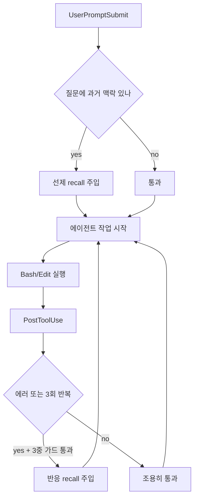

## 박제는 되는데, 막히면 왜 안 꺼내쓰는가

하네스에 지식을 축적하는 파이프라인은 점점 정교해진다. 솔루션 문서가 카테고리별로 쌓이고, 회고가 날짜별로 정리되고, 메모리에 유저 선호가 박제된다. 한 RIBs/ReactorKit iOS 개발 하네스에서 수십 건의 솔루션과 회고가 git으로 추적되고 있었다. 그런데 정작 에이전트가 같은 에러에 막히면, 어제 그 옆에 박제해둔 해결책을 펴보지도 않고 추측과 재시도로 직행했다.

이것이 **박제-활용 갭(capture-recall gap)**이다. 핵심은 박제와 활용이 *서로 다른 메커니즘*이라는 데 있다.

- **박제**는 작업이 끝난 뒤, 여유 있는 시점에, 의식적으로 일어난다. `/compound` 같은 정리 루틴이 트리거한다.
- **활용**은 작업이 막힌 한가운데, 컨텍스트 윈도우가 가장 좁고 LLM이 가장 조급한 순간에 필요하다.

활용을 LLM 자율 판단에 맡기면 실패한다. "혹시 전에 본 적 있나 검색해볼까?"는 막히지 않은 한가한 순간엔 떠오르지만, 정작 에러 스택을 노려보며 재시도 충동에 휩싸인 순간엔 떠오르지 않는다. 에이전트는 빨리 빠져나가려고 검색을 *건너뛰는* 쪽으로 편향된다. 결과는 명백하다. 30분 전 자기가 쓴 솔루션을 무시하고 같은 함정을 다시 밟는다.

해법은 활용을 자율 판단에서 떼어내 **결정적 트리거에 묶는** 것이다. 에러가 발생했거나 같은 작업을 3번 반복했다 — 이건 LLM이 "검색할까 말까" 고민할 자리가 아니라, 훅이 과거 솔루션을 system-reminder로 *강제 주입*해야 하는 자리다. recall 훅은 이 갭을 닫는 장치다.

## 트리거 설계: 에러 패턴 OR 3회 반복

recall 훅의 핵심은 "언제 발동할 것인가"다. 두 신호를 OR로 결합한다.

**1) 에러 패턴 매칭.** PostToolUse 훅은 직전 도구 호출의 결과(stdout/stderr/exit code)를 받는다. 여기서 에러 신호를 잡는다.

```bash
# PostToolUse: Bash 결과에서 에러 신호 추출
RESULT="$1"   # 훅 입력(JSON)에서 tool_response를 파싱한 텍스트
if echo "$RESULT" | grep -qiE 'error|exception|fail|cannot|undefined|no such|crash'; then
  TRIGGER="error"
fi
```

**2) 동일 command 3회 반복.** 같은 명령을 짧은 간격으로 반복한다는 건 막혀서 헛돈다는 신호다. command를 정규화(인자/타임스탬프 제거)해 카운트 파일에 누적한다.

```bash
NORM=$(echo "$CMD" | tr -s ' ' | sed 's/[0-9]\{4,\}//g')   # 변동값 제거
KEY=$(echo "$NORM" | shasum | cut -c1-12)
COUNT_FILE="/tmp/recall-count-$KEY"
N=$(( $(cat "$COUNT_FILE" 2>/dev/null || echo 0) + 1 ))
echo "$N" > "$COUNT_FILE"
[ "$N" -ge 3 ] && TRIGGER="repeat"
```

왜 OR인가? 두 신호가 서로 다른 막힘 양태를 잡기 때문이다. 에러 패턴은 *명시적 실패*(빨간 글씨)를, 3회 반복은 *조용한 헛돎*(에러 없이 같은 짓 반복 — 빌드가 계속 통과하는데 원하는 결과가 안 나오는 류)을 잡는다. AND로 묶으면 둘 다 만족하는 좁은 케이스만 잡혀 대부분의 막힘을 놓친다. (반복 카운트 자체가 또 다른 escalation 축으로 자라는 경로는 [stall 재주입 + fix 재발 escalation](/wiki/harness-engineering/harness-journal-035-stall-reinject-and-fix-recurrence-escalation) 참고.)

## 노이즈 억제 3중 가드

트리거를 느슨하게 잡으면 recall이 매 호출마다 끼어들어 컨텍스트를 오염시킨다. system-reminder 폭격은 에이전트를 돕기는커녕 진짜 신호를 묻어버린다. 그래서 3중 가드로 발동을 좁힌다.

**가드 1 — cooldown 파일.** 한 번 주입했으면 일정 시간(예: 90초) 동안 같은 트리거로 다시 주입하지 않는다. 연속된 실패 재시도마다 같은 솔루션을 도배하면 의미가 없다.

```bash
COOLDOWN="/tmp/recall-cooldown"
if [ -f "$COOLDOWN" ] && [ $(( $(date +%s) - $(stat -f %m "$COOLDOWN") )) -lt 90 ]; then
  exit 0   # 쿨다운 중 — 조용히 통과
fi
```

**가드 2 — score 임계값.** JIT 검색이 돌려준 상위 청크의 유사도가 임계값(예: 코사인 0.45) 미만이면 주입하지 않는다. 약한 매치를 억지로 들이밀면 "관련 없는 옛날 솔루션"이 끼어들어 오히려 잘못된 방향으로 유도한다. *근거 없는 회상은 환각의 연료*다.

**가드 3 — 키워드 추출 실패 early-exit.** 에러 텍스트에서 검색 가능한 키워드(심볼명, 에러 클래스, 파일 경로)를 못 뽑으면 검색 자체를 건너뛴다. "Segmentation fault" 한 줄처럼 추출할 토큰이 없으면 검색 품질이 보장 안 된다. 빈손으로 검색해 노이즈를 만드느니 조용히 빠진다.

이 셋의 공통 철학은 **"애매하면 침묵한다(OpenAI Codex의 success is silent 원칙)"**이다. recall은 확신이 있을 때만 입을 연다.

## 비차단 주입 계약

recall 훅이 지켜야 할 가장 중요한 계약: **메인 흐름을 절대 막지 않는다.**

PostToolUse 훅은 결과를 `additionalContext`로 주입하고 `exit 0`으로 끝낸다. 차단(exit 2)은 쓰지 않는다.

```bash
# 성공: 솔루션을 system-reminder로 주입하고 정상 종료
cat <<JSON
{
  "hookSpecificOutput": {
    "hookEventName": "PostToolUse",
    "additionalContext": "[recall] 유사 솔루션 발견:\n${HITS}\n위 기록을 먼저 검토 후 재시도하라."
  }
}
JSON
exit 0
```

핵심은 *recall이 실패해도 흐름이 보존*되어야 한다는 것이다. 검색 인덱스가 없거나, 임베딩 모델 로딩이 실패하거나, 키워드 추출이 비었거나 — 어떤 경우에도 훅은 `exit 0`으로 끝나고 에이전트는 원래 하던 일을 계속한다. recall은 *보조 장치*다. 보조 장치가 깨졌다고 메인 작업을 인질로 잡으면 안 된다. 이 비차단 계약이 깨지면 — 예컨대 검색 타임아웃이 훅을 멈춰 세우면 — recall은 도움이 아니라 새로운 장애 지점이 된다.

차단이 정당한 게이트(빌드 실패 시 커밋 차단 등)와의 구분은 [차단 vs 비차단 pre-commit 게이트](/wiki/harness-engineering/harness-journal-031-mcp-memory-auto-pr-pipeline) 계열의 판단 기준과 같다: *되돌릴 수 없는 손상을 막는 게이트만 차단하고, 정보 제공형 보조는 비차단으로.*

## 쌍 패턴: UserPromptSubmit recall + PostToolUse recall

recall은 두 지점에 배치할 때 가장 강하다.



- **UserPromptSubmit recall (선제)**: 사용자가 질문을 던지는 순간, 그 의도에 관련된 과거 솔루션을 *미리* 깐다. "이거 전에 했던 작업과 비슷한데?"를 작업 시작 전에 surface한다.
- **PostToolUse recall (반응)**: 작업 도중 막힌 순간, 트리거에 반응해 주입한다.

선제만 있으면 "시작은 알았는데 중간에 막히면 못 빠져나오고", 반응만 있으면 "막혀봐야 비로소 도움이 오는" 늦은 대응이 된다. 둘을 쌍으로 두면 *입구(의도 기반)와 막힘 지점(실패 기반)* 양쪽을 커버한다. 동일한 JIT 검색 엔진을 두 훅이 공유하되, 입력만 다르다 — 선제는 프롬프트 텍스트를, 반응은 에러/명령 텍스트를 쿼리로 쓴다.

## split-brain 함정: 쓰는 곳 ≠ 읽는 곳

이 패턴을 구축하며 가장 비싸게 배운 함정. recall이 분명히 박제한 솔루션을 *못 찾는* 일이 반복됐다. 원인은 **쓰는 경로와 읽는 경로의 루트 불일치**였다.

- `/compound`는 솔루션을 레포 루트 기준 `docs/solutions/`에 *쓴다*.
- recall 훅은 임베딩 인덱서가 만든 인덱스를 *읽는데*, 그 인덱서는 워킹 디렉토리 기준 상대 경로로 디렉토리를 스캔했다.

훅은 매 도구 호출 사이에 cwd가 리셋될 수 있어서, 인덱서가 엉뚱한 루트를 스캔하면 갓 박제한 솔루션이 인덱스에 안 들어간다. 결과: 박제는 됐는데 recall은 빈손. 이게 split-brain — 한쪽 뇌는 기억하는데 다른 쪽 뇌는 그 기억에 접근 못 하는 상태다.

해법은 **단일 source 고정**이다. 쓰기·읽기·인덱싱이 모두 *절대 경로* 단일 source를 바라보게 한다. 인덱서 스크립트에서 레포 루트를 `git rev-parse --show-toplevel`로 한 번 해석하고, 그걸 모든 경로의 기준으로 강제한다. 상대 경로는 cwd 의존성 때문에 절대 금지. (인덱스 적시성 보장 — 박제 직후 인덱스 갱신 — 은 [무한 누적 vs JIT discovery 맵](/wiki/context-engineering/memory-unbounded-accumulation-jit-discovery-map)에서 다루는 인덱스 freshness 문제와 직결된다.)

## 이식: `npm run search --inject`를 트리거 훅으로 승격

이 위키는 이미 JIT 검색 CLI(`npm run search -- "<질문>" 3 --inject`)를 갖고 있다. 관련 청크만 마크다운으로 뽑아 컨텍스트에 주입하는 명령이다. 지금까지 이건 *수동 호출* — 에이전트가 "검색해야지" 판단해야 돌았다. 바로 그 자율 판단 의존이 박제-활용 갭의 원인이었다.

recall 패턴의 이식 핵심은 이 수동 CLI를 **트리거 훅으로 승격**하는 것이다.

1. PostToolUse 훅이 도구 결과를 받는다.
2. 에러/3회 반복 트리거 + 3중 가드를 통과하면,
3. 에러 텍스트에서 키워드를 뽑아 `npm run search -- "<키워드>" 3 --inject`를 호출하고,
4. 결과를 `additionalContext`로 비차단 주입한다.

같은 검색 엔진, 같은 `--inject` 출력 포맷. 바뀐 건 **호출 주체**뿐 — LLM의 자율 판단에서 결정적 트리거의 자동 발동으로. "도구는 이미 있었고, 빠진 건 *언제 쓸지를 LLM에서 떼어내는 것*"이라는 게 이 저널의 한 줄 요약이다.

트레이드오프도 명확히 적는다. 자동 발동은 (가드를 둬도) 가끔 헛주입한다. 무관한 솔루션이 끼어들면 에이전트가 잠깐 곁길로 샐 수 있다. 하지만 *막힌 순간 과거 해결책을 영영 안 보는 것*의 비용이 훨씬 크다. 헛주입은 다음 토큰에서 무시하면 그만이지만, 놓친 솔루션은 같은 30분을 다시 태운다. score 임계값을 보수적으로 잡아 헛주입을 줄이되, 트리거 자체는 끄지 않는 게 옳은 균형이다. (훅 일반의 구조·디버깅은 [Claude Code 프로덕션 훅](/wiki/harness-engineering/claude-code-production-hooks) 참고.)

## 자기 점검

1. 우리 하네스에서 박제는 잘 되는데 막힌 순간 *자동으로* 꺼내쓰는 메커니즘이 있나, 아니면 "검색해볼까"를 LLM 자율 판단에 맡기고 있나?
2. recall 트리거가 발동했을 때, 검색·주입이 실패해도 메인 작업 흐름이 `exit 0`으로 보존되는가? 보조 장치가 메인을 인질로 잡는 차단 경로가 숨어 있지 않나?
3. 솔루션을 *쓰는 경로*와 검색 인덱서가 *읽는 경로*가 동일한 절대 경로 단일 source인가? 박제 직후 검색이 그 솔루션을 즉시 찾는지 실측해봤나?
4. noise 억제 3중 가드(cooldown / score 임계값 / 키워드 추출 실패 early-exit) 중 빠진 게 있어 recall이 과잉 주입으로 컨텍스트를 오염시키고 있지 않나?
