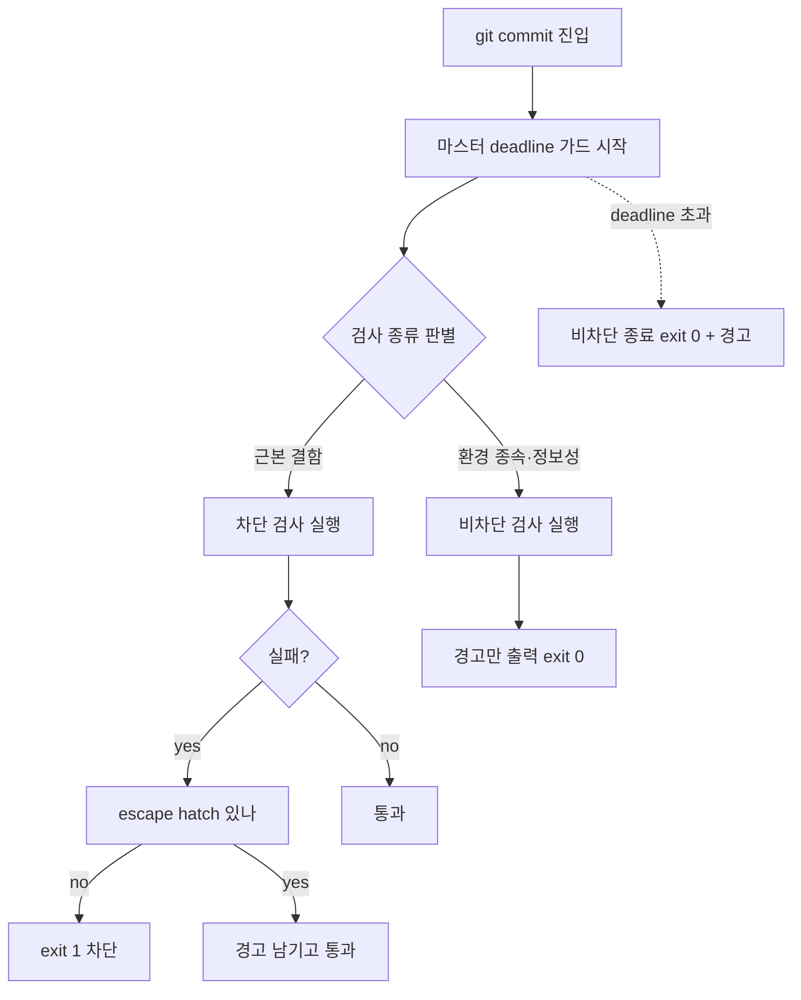

pre-commit/pre-push 훅은 하네스의 가장 값싼 품질 게이트다. 사람이 신경 쓰지 않아도 매 커밋마다 일관되게 작동한다. 하지만 "검사를 추가했다 = 안전해졌다"는 착각은 빠르게 무너진다. 게이트 설계의 진짜 질문은 *무엇을 검사하는가*가 아니라 **실패했을 때 막을 것인가, 경고만 할 것인가**이다. 이 한 줄의 결정을 잘못하면 게이트가 신뢰를 잃고, 신뢰를 잃은 게이트는 통째로 우회당한다.

이 저널은 한 RIBs/ReactorKit iOS 개발 하네스에서 pre-commit/pre-push 훅을 운영하며 박제한 패턴이다. 예시 앱은 moneyflow, 검사 훅은 team-harness plugin이 배포한다고 가정하고 일반화했다.

## 문제 — 전부 차단으로 만들면 환경 종속 검사가 spurious reject를 만든다

처음 게이트를 설계할 때 본능적인 선택은 "검사 실패 = exit 1 = 커밋 차단"이다. 직관적이고 강해 보인다. 그런데 게이트에 들어가는 검사는 성질이 균일하지 않다.

- **테스트 누락**(새 UseCase에 테스트가 없음) — 이건 코드 결함이다. 머신이 바뀌어도 결함이다.
- **보호 브랜치 직접 커밋**(main에 직접 push) — 이것도 환경과 무관한 정책 위반이다.
- **환경 의존 테스트**(특정 시뮬레이터 런타임·로컬 seed fixture·네트워크 STG 의존) — 내 머신에선 통과하지만 CI나 동료 머신에선 환경이 없어 실패한다.
- **포맷 churn**(SwiftFormat이 import 순서·공백을 재정렬) — 결함이 아니라 스타일이다. 버전이 다르면 결과가 다르다.
- **lint 경고**(force unwrap 의심·TODO 잔존) — 정보일 뿐 즉시 막을 사안이 아닐 수 있다.

전부 exit 1로 묶으면 가장 먼저 터지는 건 환경 의존 검사다. 한 사례에서 pre-push 단계에 "로컬 전용 fixture가 있는지" 검사를 차단으로 걸었더니, 그 fixture가 없는 CI 러너와 막 클론한 동료 머신에서 **push가 즉사**했다. 코드는 멀쩡했다. 게이트가 환경 차이를 결함으로 오인한 것이다.

여기서 핵심 인식: spurious reject 한 번이면 개발자는 그 게이트를 신뢰하지 않게 되고, 두 번이면 `--no-verify`를 손가락이 먼저 친다. 그 순간 게이트 *전체*가 — 차단해야 할 진짜 결함 검사까지 — 무력화된다.

## 분류 기준 — 근본 결함은 차단, 환경 종속·정보성은 비차단

게이트의 모든 검사를 두 축으로 분류한다.

| 축 | 차단(exit 1) | 비차단(경고, exit 0) |
| --- | --- | --- |
| 성질 | 근본 결함·정책 위반 | 환경 종속·정보성 |
| 재현성 | 어느 머신에서도 동일하게 실패 | 머신/CI/버전에 따라 다름 |
| 예시 | 테스트 누락, 보호 브랜치 직접 커밋, 시크릿 하드코딩, force unwrap 머지 | 환경 의존 테스트, style churn, lint 경고, fixture 부재 |
| 실패 시 | 커밋/푸시를 막는다 | stderr로 경고만 출력하고 통과 |

규칙은 한 문장으로 요약된다: **"이 검사가 실패하는 이유가 머신마다 다를 수 있으면 차단하지 마라."** 재현성이 없는 검사를 차단으로 걸면, 그건 코드 품질 게이트가 아니라 환경 일치 게이트가 된다. 환경 일치는 게이트가 아니라 셋업 문서/Docker/CI 매트릭스가 책임질 문제다.

반대로 테스트 누락이나 시크릿 하드코딩은 어떤 머신에서도 결함이다. 이건 비차단으로 풀면 안 된다 — 경고는 무시되기 때문이다. 경고만으로는 "새 UseCase에 테스트 없음"을 막지 못한다. 정보성이 아니라 근본 결함이므로 차단이 맞다.

## 차단 게이트 + escape hatch는 짝으로 — 우회 없는 차단은 --no-verify 남용을 부른다

차단 게이트를 정당화하려면 **좁고 기록되는 우회구**를 함께 줘야 한다. 이유는 단순하다. 진짜 결함 검사라도 가끔은 정당한 예외가 있다(예: 의도적으로 테스트가 미뤄진 spike 커밋, hotfix 긴급 머지). 우회구가 없으면 개발자는 검사별 우회 대신 `git commit --no-verify`로 *게이트 전체*를 끈다. 한 검사를 피하려다 모든 검사를 끄는 것이다.

설계 원칙:

- escape hatch는 **검사 단위로 좁게**. 예: `ALLOW_MISSING_TEST=1 git commit ...` 같은 환경 변수 1개가 "테스트 누락" 검사만 통과시키고 나머지 차단은 유지.
- 우회는 **흔적을 남긴다**. 우회 시 stderr에 경고를 찍고, 가능하면 커밋 메시지/로그에 사유를 남기도록 유도.
- `--no-verify`는 최후 수단으로만. 좁은 escape hatch가 있으면 `--no-verify` 빈도가 급감한다 — 측정 가능한 신뢰 지표다.

좁은 escape hatch는 역설적으로 차단을 *더 강하게* 만든다. 정당한 예외를 흡수하므로 게이트를 통째로 끌 동기가 사라지고, 평상시엔 차단이 항상 살아있다.

## 비차단 게이트의 가치 — 정보는 주되 흐름은 보존한다

비차단 게이트(exit 0 + stderr 경고)를 "약한 게이트"로 폄하하기 쉽지만, 환경 종속·정보성 검사에는 이게 정답이다.

- **style churn 경고**: SwiftFormat이 재정렬할 게 있으면 알리되 막지 않는다. 포맷 버전 차이로 커밋이 막히는 최악을 피하면서, 개발자가 "아 포맷 돌려야겠네"를 인지한다.
- **환경 의존 테스트 결과**: 로컬 시뮬레이터에서 돌린 결과는 참고용으로 출력하되, 부재 시 push를 막지 않는다. 진짜 검증은 CI의 통제된 환경에 위임한다.
- **lint 경고 카운트**: force unwrap 의심 N건 같은 신호를 보여주되, 추세를 관리할 책임은 사람에게 둔다.

비차단의 핵심 가치는 **흐름 보존(flow preservation)**이다. 개발자가 작업 리듬을 잃지 않으면서도 정보를 받는다. 정보를 차단으로 강제하면 개발자는 정보를 *읽는* 대신 게이트를 *피하는* 데 에너지를 쓴다. 이건 [Claude Code production hooks](/wiki/harness-engineering/claude-code-production-hooks)에서 다룬 "성공은 silent, 실패만 표면화" 원칙의 게이트 버전이다 — 정보성 신호는 표면화하되 흐름을 멈추지 않는다.

## hang 방지 — 마스터 deadline 가드

게이트가 *틀리게 차단*하는 것만큼 나쁜 게 *영원히 멈추는* 것이다. 환경 의존 검사 중에는 네트워크 호출·시뮬레이터 부팅·외부 프로세스 spawn이 끼는데, 이게 응답하지 않으면 훅이 hang되고 커밋 전체가 인질이 된다. spurious reject보다 더 나쁜 UX다 — 개발자는 무한 대기 중인 git을 ctrl-C로 죽이고 결국 `--no-verify`로 도망친다.

방어책은 **마스터 deadline 가드**다. 훅 진입부에서 전체 훅에 단일 timeout(예: 백그라운드 워치독 또는 `timeout` 래핑)을 걸어, deadline을 넘기면 훅을 *비차단으로 종료*(exit 0)시키고 stderr에 "게이트 시간 초과 — skip됨"을 남긴다.



원칙: **deadline 초과는 차단이 아니라 skip**. 시간 초과를 차단으로 처리하면 느린 머신·느린 네트워크에서 또 다른 spurious reject가 생긴다. deadline은 hang을 막는 안전판이지 새 차단 사유가 아니다. 훅 자체의 실행 시간 예산은 짧게(수 초) 잡는 게 좋다.

## repo-aware skip 가드 — 같은 훅이 여러 repo에 깔릴 때

team-harness plugin처럼 공유 하네스가 훅을 여러 repo에 동일하게 배포하면, 한 repo에만 의미 있는 검사가 다른 repo에선 *항상* 실패하는 함정이 생긴다. 예를 들어 "moneyflow의 manifest에 X 키가 있는지" 검사를 모든 repo에 깔면, manifest가 없는 다른 repo에서는 매 커밋마다 spurious reject가 난다.

해법은 **repo-aware skip 가드**다. 검사 진입부에서 해당 repo가 이 검사의 대상인지 manifest/마커 파일 유무로 판별하고, 무관하면 *조용히 skip*(exit 0)한다.

```bash
# 이 검사가 의미 있는 repo인지 확인 — 무관하면 조용히 skip
if [ ! -f "Package.swift" ]; then
  exit 0   # iOS SPM repo가 아님 → 이 검사 무관, skip
fi
```

가드의 디테일:

- 판별 기준은 **존재 여부**(manifest·마커 파일)로 단순하게. repo 이름 하드코딩은 [plugin cutover 경로 참조 함정](/wiki/harness-engineering/plugin-cutover-four-traps-path-reference-integrity)에서 보듯 깨지기 쉽다 — 이름이 바뀌면 skip이 오작동한다.
- skip은 **silent**. 무관한 repo에서 매번 "이 검사는 너랑 상관없어" 경고를 찍으면 노이즈가 된다.
- 단, skip을 **차단의 디폴트로 악용 금지**. "파일 없으면 skip"이 너무 느슨하면 진짜로 검사가 필요한데 마커가 누락된 케이스까지 빠져나간다. 마커 선택은 보수적으로.

이 가드는 fix recurrence 관점에서도 중요하다 — 한 repo에서 spurious reject를 패치해도 같은 훅이 다른 repo에 깔려 있으면 동일 패턴이 재발한다([stall reinject & fix recurrence escalation](/wiki/harness-engineering/harness-journal-035-stall-reinject-and-fix-recurrence-escalation) 참조). 공유 훅의 버그는 한 곳을 고치는 게 아니라 *배포 단위에서* 고쳐야 한다.

## 정리

게이트 설계의 4가지 레버를 한 번에 적용하면 신뢰받는 pre-commit이 된다.

1. **분류**: 근본 결함·정책 위반은 차단, 환경 종속·정보성은 비차단.
2. **escape hatch**: 차단마다 좁고 기록되는 우회구를 짝지어 `--no-verify` 남용을 막는다.
3. **deadline 가드**: hang을 막되 초과는 차단이 아니라 skip.
4. **repo-aware skip**: 공유 훅은 manifest 유무로 무관 repo를 조용히 건너뛴다.

이 모든 결정의 단일 북극성은 **신뢰**다. 게이트가 한 번이라도 부당하게 막거나 멈추면 개발자는 게이트 전체를 우회하기 시작하고, 그 순간 차단해야 할 진짜 결함까지 통과한다. spurious reject 0건이 차단 게이트의 효과를 보존한다.

## 자기 점검

1. 우리 pre-commit의 각 검사를 차단/비차단으로 분류해 보면, 환경에 따라 결과가 달라질 수 있는데 차단으로 걸려 있는 검사가 있는가?
2. 차단 검사마다 좁은 escape hatch가 있는가, 아니면 개발자가 `--no-verify`로 게이트 전체를 끄고 있는가? 최근 N커밋에서 `--no-verify` 빈도는?
3. 훅이 네트워크·시뮬레이터·외부 프로세스를 건드린다면, 응답하지 않을 때 hang되지 않고 deadline으로 비차단 종료하는가?
4. 같은 훅이 여러 repo에 배포된다면, 무관한 repo에서 spurious reject가 나지 않도록 manifest/마커 기반 skip 가드가 있는가?
