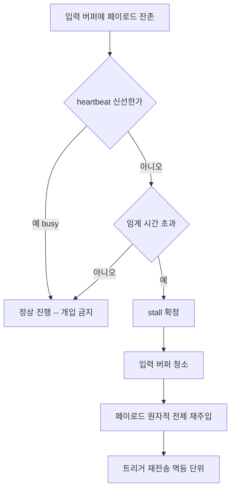

## 들어가며

이 저널은 한 RIBs/ReactorKit 기반 iOS 개발 하네스에서 허브가 여러 워커 에이전트를 비동기 메시지 큐로 조율하던 중 마주친 두 가지 실패를 익명화한 기록이다. 둘 다 처음엔 별개의 운영 사고처럼 보였지만, 회고하니 같은 뿌리에서 갈라진 두 가지였다. 하나는 **멱등하지 않은 액션을 멱등하지 않은 방식으로 재시도**한 것이고, 다른 하나는 **fix를 커밋한 항목의 재발을 횟수 사다리가 너무 늦게 잡은** 것이다.

두 사고 모두 "에이전트가 멈췄다", "이미 고쳤는데 또 터졌다"라는 흔한 상황이다. 전이 가능한 교훈은 자동화 시스템이 사람의 직관(재시도하면 되겠지, 한 번 고쳤으니 됐겠지)을 그대로 코드로 옮기면 무한 루프와 늦은 격상을 동시에 만들어낸다는 점이다. 예시 앱은 moneyflow로, 워커 묶음은 team-harness 플러그인이 제공하는 team-harness: 네임스페이스 에이전트로 일반화한다.

## 1. Worker stall 진단 — 트리거만 반복하는 재시도가 왜 무한 실패하나

허브-워커 구조에서 작업은 이렇게 흐른다. 허브가 워커의 입력 버퍼(파일 기반 메시지 큐의 한 슬롯)에 페이로드를 쓰고, "처리해라"라는 트리거 신호를 보낸다. 워커가 페이로드를 읽어 소비하면 입력 버퍼가 비워지고 결과가 출력으로 돌아온다.

stall은 워커가 트리거를 받았는데도 입력 버퍼가 비워지지 않고 진행이 멈춘 상태다. 원인은 다양하다. 워커가 페이로드를 읽기 전에 죽었거나, 페이로드 파싱에 실패해 조용히 빠져나갔거나, 트리거는 도착했는데 페이로드 쓰기가 부분적으로만 끝났거나.

여기서 첫 번째 함정이 나온다. 운영자(또는 자동 감시 루프)의 본능적 복구는 "트리거를 다시 쏜다"이다. 사람의 머릿속 모델은 "벨을 한 번 더 누르면 워커가 깨어나겠지"다. 그러나 메시지 전달은 **멱등하지 않은 액션**이다. stall의 진짜 원인이 "소비되지 못한 채 남은 입력 상태"라면, 트리거만 다시 보내는 건 *같은 잔존 상태 위에서 같은 실패 조건을 그대로 재현*하는 것이다. 워커는 다시 같은 깨진 페이로드를 만나거나, 빈 버퍼를 보고 다시 빠져나간다. 무한 실패다.

구체적으로 우리가 본 모드는 이랬다. 페이로드 쓰기가 절반만 끝난 상태(JSON이 닫히지 않음)에서 트리거가 먼저 도착했다. 워커는 파싱 실패로 조용히 종료. 감시 루프는 "응답 없음"을 보고 트리거를 재전송. 하지만 깨진 페이로드는 그대로라 워커는 또 파싱 실패. 재시도 카운터만 올라가고 상태는 한 발짝도 움직이지 않았다. 로그에는 "retry 1, retry 2, retry 3..."만 쌓이고, 정작 깨진 페이로드는 누구도 들여다보지 않았다 — 재시도 자체가 "뭔가 하고 있다"는 착시를 줬기 때문이다.

## 2. 복구 규율 — 입력 버퍼 청소 + 페이로드 전체 재주입 + 트리거를 멱등하게

해법은 재시도를 **멱등하게** 재정의하는 것이다. 멱등성은 "같은 동작을 여러 번 해도 결과가 한 번 한 것과 같다"인데, 메시지 전달은 본질적으로 멱등하지 않으므로 *재시도 단위 전체*를 멱등하게 감싸야 한다. 우리가 정착한 복구 시퀀스는 세 단계다.

1. **입력 버퍼 청소**: 재시도 전에 워커의 입력 슬롯을 명시적으로 비운다. 부분 쓰기·깨진 페이로드·소비되지 못한 잔존이 모두 사라진다. 이게 "실패의 원인이 된 상태"를 제거하는 단계다.
2. **페이로드 전체 재주입**: 트리거만이 아니라 페이로드 전체를 다시, 원자적으로 쓴다. 원자적 쓰기는 임시 파일에 다 쓴 뒤 `rename`으로 갈아끼우는 식으로 보장한다(부분 쓰기 재발 방지).
3. **트리거 재전송**: 비워진 버퍼 위에 온전한 페이로드가 올라간 *다음에만* 트리거를 보낸다.

이 셋을 하나의 단위로 묶으면 재시도 N번이 재시도 1번과 같은 의미를 갖는다. 매 재시도가 깨끗한 상태에서 출발하므로, 실패가 반복되면 그것은 "재시도 메커니즘의 문제"가 아니라 "페이로드 자체 또는 워커 로직의 문제"라는 더 정확한 신호가 된다. 트레이드오프는 재시도 비용이 오른다는 점이다. 청소+재주입은 트리거 재전송보다 무겁다. 하지만 멱등하지 않은 가벼운 재시도가 만드는 무한 루프 비용에 비하면 압도적으로 싸다.

또 하나의 미묘한 함정: 재주입할 페이로드를 "마지막으로 보낸 페이로드"의 메모리 캐시에서 가져오면, 그 캐시 자체가 부분 쓰기를 만든 원본일 수 있다. 재주입 소스는 허브가 보관한 *검증된 원본*(스키마 통과를 확인한 직렬화 결과)이어야 한다. 깨진 것을 다시 깨끗하게 쓰는 게 아니라 처음부터 온전한 것을 쓰는 것이다.

## 3. False negative 함정 — 워커 busy 시 입력 잔존을 stall로 오판

stall 감지를 강화하다 보면 반대 방향 함정에 빠진다. "입력 버퍼에 데이터가 남아 있다"를 stall 신호로 삼으면, **워커가 정상적으로 처리 중(busy)인 순간**도 stall로 잡힌다. 워커가 큰 페이로드를 읽어 작업하는 동안에는 당연히 입력이 잠시 남아 있을 수 있다. 이걸 stall로 오판해 §2의 복구 시퀀스를 실행하면, *진행 중인 작업의 입력을 청소해버리고 중복 재주입*을 일으킨다. 멀쩡한 워커를 죽이는 false negative다.

핵심은 "입력 잔존"과 "진행 없음"이 다른 개념이라는 것이다. stall은 후자다. 이를 분별하려면 잔존 여부 단일 신호로는 부족하고, *시간 축의 진행 신호*가 필요하다.

- **입력 슬롯 타임스탬프**: 같은 페이로드가 임계 시간(예: 워커 평균 처리시간의 3배)을 넘겨 그대로 있으면 stall 후보.
- **워커 heartbeat**: 워커가 살아서 작업 중이면 주기적으로 갱신하는 신호. heartbeat가 신선하면 busy이지 stall이 아니다.
- **출력 진행**: 부분 출력이라도 갱신되고 있으면 진행 중.

즉 stall 판정은 "잔존 AND heartbeat 없음 AND 임계 시간 초과"의 합으로 내려야 한다. 단일 신호의 유혹을 이긴다. 임계 시간은 워커의 작업 분포에 맞춰야 한다 — 너무 짧으면 긴 작업을 stall로 오판하고, 너무 길면 진짜 stall 복구가 늦어진다. 이것은 [agent-supervision-surfaces](harness-engineering/agent-supervision-surfaces)에서 다루는 "감시 표면을 어디에 둘 것인가" 문제의 한 인스턴스다.

## 4. 격상 사다리의 한계 — 횟수 기준은 fix 후 재발을 늦게 잡는다

두 번째 사고로 넘어간다. 많은 하네스가 격상(escalation)을 **횟수 사다리**로 설계한다. "같은 증상이 3번 누적되면 솔루션 박제, 5번이면 코드 게이트로 승격"같은 식이다. 이 위키의 promote-solution 게이트도 N=3+ 누적을 트리거로 삼는다. 횟수 사다리는 *처음 보는* 반복 문제에는 잘 맞는다. 노이즈를 걸러내고, 진짜 패턴만 비용을 들여 박제하게 해주기 때문이다.

그런데 횟수 사다리에는 사각이 있다. **이미 fix를 커밋한 항목이 재발하는 경우**다. 횟수 사다리는 모든 발생을 동등하게 센다. fix 이전의 발생 3번과 fix 이후의 재발 1번을 같은 무게로 누적한다. 그래서 fix 후 재발이 다시 임계값에 도달할 때까지 또 기다린다.

이게 왜 위험한가. fix 후 재발은 fix 이전 발생과 *질적으로 다른 정보*를 담는다. fix 이전 발생은 "문제가 있다"는 신호지만, fix 후 재발은 "당신이 짚은 근본원인이 틀렸다"는 신호다. 후자가 훨씬 비싸다 — 잘못된 가정 위에 또 패치를 쌓을 위험을 안고 있기 때문이다. 횟수만 세는 사다리는 이 질적 차이를 무시하고, 잘못된 가정이 정정될 기회를 매번 늦춘다.

우리 사례에서는 페이로드 파싱 실패를 "JSON escape 처리 버그"로 진단하고 fix를 커밋했다(가령 커밋 d92bebe34). 며칠 뒤 같은 증상이 재발했다. 횟수 사다리대로라면 "재발 1회, 아직 임계값 미달"로 분류되어 또 한 번의 escape 패치 후보로 큐에 들어갔을 것이다. 하지만 진짜 원인은 escape가 아니라 §1의 부분 쓰기였다 — 파싱이 실패한 건 escape 때문이 아니라 애초에 JSON이 잘리지 않은 채 도착했기 때문이다. escape를 또 만졌다면 같은 layer에 의미 없는 패치만 하나 더 쌓였을 것이다.

## 5. 조기 게이트 규칙 — 이전 fix 이력 + 재발 = 가정 오류 → 즉시 ADR 검토

그래서 우리는 횟수 사다리와 **직교하는** 조기 게이트를 하나 추가했다. 규칙은 단순하다.

> **이전에 fix 커밋이 있었던 증상이 재발하면, 재시도 횟수와 무관하게 즉시 격상한다. 격상 목적지는 "또 다른 패치"가 아니라 "근본원인 가정 재검토(ADR)"다.**

구현은 가볍다. 솔루션/사고 기록에 "이 증상에 대해 fix 커밋이 있었는가"를 표시하는 플래그 하나면 된다. 새 발생이 들어올 때 그 증상에 fix 이력 플래그가 켜져 있으면, 횟수 누적 경로를 건너뛰고 곧장 ADR 검토 큐로 보낸다. 이는 이 위키의 부분 fix 재발 반사("'A+B 수정' 커밋이 실제론 A만 고치면 B 패턴은 다른 파일에서 재발")를 격상 레벨로 일반화한 것이다.

이 게이트의 트레이드오프는 false alarm이다. 정말로 우연히 재발한 무관한 케이스도 ADR 검토를 트리거할 수 있다. 하지만 ADR "검토"는 ADR "작성"이 아니다 — 10분짜리 "이게 같은 근본원인인가?" 판단이다. 검토 결과 "다른 원인"이면 일반 경로로 되돌리면 된다. 잘못된 가정 위에 패치를 쌓는 비용보다 10분 검토가 훨씬 싸다. 이것은 [harness-journal-034](harness-engineering/harness-journal-034-blocking-vs-nonblocking-precommit-gates)에서 다룬 blocking vs non-blocking 게이트 선택과 같은 결: 비싼 실패를 막는 게이트는 약간의 false alarm을 감수하고 blocking으로 둘 가치가 있다.

## 6. ADR을 격상의 종착지로 — 같은 layer를 패치하기 전에 "왜 이전 fix가 못 잡았나"를 박제

조기 게이트의 종착지가 왜 *코드 패치*가 아니라 *ADR*인지가 이 저널의 마지막이자 핵심 주장이다.

fix 후 재발 상황에서 사람의 반사는 "그럼 이번엔 제대로 고치자"며 같은 layer를 다시 만지는 것이다. 그러나 첫 fix가 틀린 이유를 명시적으로 적지 않으면, 두 번째 fix도 같은 잘못된 멘탈 모델 위에서 나온다. escape 버그라고 믿는 사람은 escape를 더 정교하게 고칠 뿐, 부분 쓰기를 의심하지 않는다.

ADR(Architecture Decision Record)을 격상 종착지로 두면 강제되는 질문이 하나 있다. **"왜 이전 fix가 이걸 못 잡았나?"** 이 질문에 답하려면 첫 fix가 짚은 layer와 실제 원인이 있는 layer가 다르다는 걸 직시해야 한다. 우리 사례에서 ADR을 쓰는 순간 "escape fix는 파싱 layer를 건드렸지만, 진짜 원인은 전송 layer의 부분 쓰기였다"가 명확해졌고, 그제서야 §2의 원자적 쓰기 해법이 나왔다. ADR이 없었다면 escape를 세 번째로 만졌을 것이다.

ADR의 또 다른 가치는 *결정의 가역성*을 기록한다는 점이다. 하네스를 소프트웨어로 다루는 관점([harness-as-software-adr-for-agent-harness](harness-engineering/harness-as-software-adr-for-agent-harness))에서, 에이전트 조율 로직의 변경도 코드 변경과 똑같이 "왜 이 결정을 내렸고, 무엇을 기각했나"를 남겨야 한다. fix 후 재발의 ADR은 "이전 가정 X를 기각하고 가정 Y를 채택, 근거는 재발 증거"를 박제한다. 다음에 또 재발하면 ADR 체인을 따라가며 "이미 X도 Y도 시도했다"를 즉시 알 수 있다 — 같은 자리를 빙빙 도는 것을 막는 institutional memory다.

정리하면, 격상 사다리는 두 축을 가져야 한다. 횟수 축(처음 보는 반복 문제 필터)과 fix-이력 축(가정 오류 조기 감지). 후자의 종착지는 패치가 아니라 ADR이고, ADR은 "왜 이전 fix가 못 잡았나"를 강제로 박제해 잘못된 layer를 또 만지는 것을 차단한다.

## 자기 점검

1. 우리 하네스의 재시도 로직은 멱등한가? 재시도가 실패의 원인이 된 상태(잔존 입력/부분 쓰기)를 청소하고 페이로드를 전체 재주입하는가, 아니면 트리거만 다시 쏘는가?
2. stall 판정이 "입력 잔존" 단일 신호에 의존하지는 않는가? busy 워커를 stall로 오판하는 false negative를 막을 heartbeat/타임스탬프 합산 조건이 있는가?
3. 우리 격상 사다리는 fix 이후의 재발을 fix 이전의 발생과 같은 무게로 세고 있지 않은가? fix 이력 플래그가 켜진 증상의 재발을 횟수와 무관하게 즉시 격상하는가?
4. fix 후 재발 시 우리는 같은 layer를 또 패치하는가, 아니면 "왜 이전 fix가 못 잡았나"를 ADR로 먼저 박제하는가?
