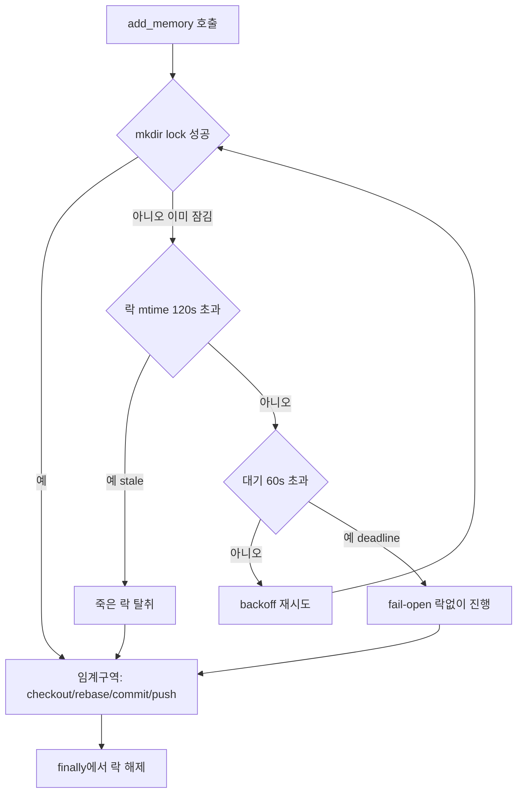

## 들어가며

이 저널은 여러 에이전트가 하나의 공유 지식 저장소(git repo)에 동시에 쓰기를 하다 대량 실패한 사고를 익명화한 기록이다. 예시 앱은 moneyflow, 하네스는 team-harness 플러그인으로 일반화한다. team-harness는 에이전트가 학습·실수·해법을 공유 메모리 풀에 박제(persist)하는 `add_memory` 도구를 제공하는데, 이 도구는 내부적으로 메모리 파일을 harness repo에 커밋하고 원격에 자동 PR을 올린다.

문제는 단순했다. 감사(audit) 스프린트에서 18개 에이전트를 병렬로 띄워 각자 발견을 박제하게 했더니, **18건 중 14건이 실패**했다(2026 실측 기준). 실패 로그는 전부 git rebase 충돌이었다. 전이 가능한 교훈은 이 위키가 반복해서 부딪힌 원칙 하나로 수렴한다 — **공유 상태 쓰기는 병렬화하면 안 된다.** 병렬화해도 되는 건 read와 analysis뿐이다.

## 1. 무엇이 병렬화됐나 — read는 안전했고 write가 문제였다

감사 워크플로 자체는 병렬화가 옳았다. 코드베이스를 기능 클러스터로 쪼개 에이전트마다 다른 영역을 read-only로 탐색하게 했고, 이 부분은 아무 충돌 없이 잘 돌았다. 읽기는 공유 상태를 건드리지 않으니 N개가 동시에 돌아도 서로 간섭하지 않는다.

사고는 각 에이전트가 발견을 **박제하는 순간** 터졌다. `add_memory` 한 호출은 대략 이런 git 시퀀스를 harness repo의 **단일 working tree**에서 수행한다.

```
checkout main → pull --rebase → checkout -b bot/finding-x
  → write memory file → commit → push → (원격 auto-PR)
```

18개 에이전트가 거의 동시에 이 시퀀스에 진입하면, 여러 프로세스가 같은 working tree의 인덱스와 HEAD, 같은 로컬 `main` ref를 동시에 밀고 당긴다. 에이전트 A가 rebase로 base를 옮기는 사이 에이전트 B가 옛 base 위에서 커밋을 만들고, B의 push는 이미 움직인 원격을 만나 거부되거나, 로컬 rebase가 half-applied 상태에서 다음 에이전트를 만나 깨진다. race의 교과서적 형태다.

핵심 인식은 "에이전트가 별도 컨텍스트"라는 사실이 자동으로 "쓰기가 격리됐다"를 뜻하지 않는다는 것이다. 컨텍스트는 격리됐지만 **쓰기 대상(working tree + 원격 브랜치)은 공유**였다. 격리의 경계와 공유 상태의 경계가 어긋난 것이 사고의 뿌리다.

## 2. 왜 "프로세스 룰"로는 못 막았나 — 사람/오케스트레이터 규율 의존의 한계

사실 이 문제는 처음 겪는 게 아니었다. 그전까지 우리의 방어는 **프로세스 룰**이었다. "`add_memory`는 한 번에 한 건씩 호출하라. 병렬 에이전트는 body만 반환하고 오케스트레이터가 순차 upsert하라"는 운영 지침을 문서와 프롬프트에 박아뒀다.

이 방어의 문제는 *사람 또는 오케스트레이터의 규율에 의존*한다는 점이다. 규율 기반 방어는 두 가지 방식으로 새어나간다. 하나는 오케스트레이터가 편의상 에이전트에게 박제 권한을 직접 준 경우(순차 upsert 경로를 우회), 다른 하나는 "이번엔 몇 개 안 되니까 괜찮겠지"라는 판단이 틀린 경우다. 18개 병렬 감사는 정확히 첫 번째였다 — 각 에이전트가 자기 발견을 스스로 박제하는 게 자연스러웠고, 그 자연스러움이 프로세스 룰을 밟고 지나갔다.

이 위키의 격상 사다리([harness-journal-035](harness-engineering/harness-journal-035-stall-reinject-and-fix-recurrence-escalation))에는 조기 게이트 규칙이 있다. **재발성 결함은 횟수 사다리를 기다리지 말고 구조 fix로 직행한다.** 프로세스 룰로 우회하던 이 충돌은 병렬 spawn을 할 때마다 재발할 잠재력을 가졌으므로, 규율이 아니라 코드로 막아야 하는 조기 게이트 대상이었다.

## 3. 직렬화 장치의 범위는 공유 상태의 범위와 같아야 한다

해법을 고를 때 가장 중요한 판단은 "직렬화를 어디에 걸 것인가"였다. 후보는 네 가지였다.

| 방식 | 범위 | 기각/채택 |
| --- | --- | --- |
| 현행 프로세스 룰 | 사람 규율 | 재발 — 구조 fix 필요 |
| in-process async mutex | 한 프로세스 안 | 에이전트가 별도 프로세스면 무력 |
| 에이전트는 body만, 오케스트레이터 순차 upsert | API 계약 변경 | 호출부 전면 수정 — 침습적 |
| **cross-process 파일락** | 파일시스템 전역 | **채택** |

결정적 논리는 이렇다. **직렬화 장치의 범위가 공유 상태의 범위보다 좁으면 안 된다.** 공유 상태(harness working tree)는 여러 프로세스에 걸쳐 있다. 병렬 에이전트가 같은 MCP 서버 프로세스를 공유하는지(in-process), 각자 별도 프로세스를 띄우는지는 실행 환경에 따라 다르다. 후자일 수 있는 이상, in-process mutex는 범위가 부족하다. 파일시스템은 모든 프로세스가 공유하므로, 파일 기반 락이 공유 상태의 범위와 정확히 일치한다.

그래서 `add_memory`의 **git-touching 섹션 전체**를 cross-process 파일락으로 감쌌다. 락의 단위가 중요하다 — commit 한 줄이 아니라 `checkout → rebase → commit → push` 시퀀스 전체를 한 임계 구역(critical section)으로 묶어야 race가 사라진다. 이는 [harness-journal-035](harness-engineering/harness-journal-035-stall-reinject-and-fix-recurrence-escalation)의 "재시도 단위 전체를 멱등하게 감싸라"와 같은 결이다. 원자성을 보장할 단위를 개별 연산이 아니라 *의미 있는 트랜잭션 전체*로 잡는 것.

## 4. 파일락 구현 — 원자적 획득, stale steal, deadline fail-open

파일락은 개념은 단순하지만 세 가지 안전장치가 없으면 그 자체가 새로운 실패원이 된다.

**원자적 획득.** 락은 `mkdir`의 원자성을 이용한다. 디렉토리 생성은 "이미 있으면 실패"가 원자적으로 보장되므로, 락 파일 대신 락 *디렉토리*를 만든다. 성공하면 락을 잡은 것, 실패(이미 존재)하면 대기. 락 위치는 `.git` 내부(`.git/addmemory.lock`)로 둬서 커밋 대상에서 자동 제외한다.

**stale steal.** 락을 잡은 프로세스가 크래시하면 락이 영구히 남는다(락 누수). 이를 막기 위해 락 디렉토리의 mtime을 검사해 임계 시간(예: 120초)을 넘긴 락은 죽은 프로세스의 것으로 간주하고 탈취한다. 임계 시간은 정상 add_memory의 최대 소요보다 넉넉히 길어야 한다 — 너무 짧으면 느린 정상 작업의 락을 뺏어 [harness-journal-035](harness-engineering/harness-journal-035-stall-reinject-and-fix-recurrence-escalation)에서 본 것과 같은 false-positive(살아있는 작업을 죽었다고 오판)를 일으킨다.

**deadline fail-open.** 아무리 stale steal이 있어도 병목이 심하면 대기가 길어진다. 일정 deadline(예: 60초)을 넘겨도 락을 못 잡으면 **락 없이 진행**한다. 이것이 반직관적인 핵심이다. 락의 목적은 "충돌을 줄이는 것"이지 "add_memory를 영구히 차단하는 것"이 아니다. fail-closed(못 잡으면 실패)로 두면 락 버그 하나가 박제 기능 전체를 죽이는 단일 장애점이 된다. 드물게 발생하는 fail-open의 충돌 위험보다, 락이 도구를 인질로 잡는 위험이 더 크다.

그리고 해제는 성공·실패·throw **모든 경로**에서 `finally`로 보장한다. 이 중 하나라도 빠지면 stale steal에 의존하게 되어 매번 120초를 낭비한다.



## 5. 트레이드오프 — 직렬화는 느려지는 게 정상이다

파일락 도입 후 병렬 add_memory는 큐잉되어 순차 실행된다. 18건이 동시에 들어와도 한 번에 하나씩 git 시퀀스를 통과한다. wall-clock은 늘어난다. 이것을 "성능 저하"로 읽으면 안 된다 — **쓰기는 원래 직렬이어야 했다.** 이전의 "빠른 병렬"은 14건을 버리는 대가로 얻은 가짜 속도였다. 4건만 성공하는 병렬보다 18건 전부 성공하는 순차가 압도적으로 빠르다(실패한 14건을 다시 돌리는 비용을 포함하면).

여기서 일반 원칙 하나가 나온다. **멀티에이전트 하네스에서 "무엇을 병렬화할지"는 "무엇이 공유 상태를 쓰는지"로 결정된다.** read-only 탐색·분석은 마음껏 fan-out한다. 공유 저장소·인덱스·파일에 쓰는 액션은 직렬화하거나(락), 애초에 겹치지 않는 격리된 대상에 쓰게 한다(에이전트별 worktree — 이건 다른 저널의 주제다). 이 구분을 프롬프트나 문서의 지침으로만 두면 §2처럼 새어나간다. 구조(락 또는 격리)로 강제해야 한다.

이 감사 스프린트의 또 다른 교훈은 §1과 무관해 보이지만 같은 사고에서 나왔다. 예산이 제한된 검증 에이전트를 병렬로 돌리면 false-positive 판정을 양산하는 경향이 있어, 박제 전에 코드 재확인(re-grounding)이 필요했다. 즉 "병렬 감사 → 즉시 박제"는 두 겹으로 위험했다 — 쓰기 충돌(§1)과 검증 노이즈(재확인 없이 박제하면 틀린 결론이 공유 풀에 박힘). 두 위험 모두 "병렬로 얻은 결과를 직렬 게이트를 통과시켜 반영한다"는 같은 처방으로 풀린다. 이는 [multi-agent-quality-sprint-pattern](harness-engineering/multi-agent-quality-sprint-pattern)에서 다루는 fan-out/fan-in 구조의 fan-in 쪽 규율에 해당한다.

## 자기 점검

1. 우리 하네스에서 병렬로 돌리는 것 중 공유 상태(저장소·인덱스·파일·원격 브랜치)에 *쓰는* 것이 섞여 있지 않은가? read와 write를 같은 병렬 묶음에 넣고 있지 않은가?
2. 쓰기 직렬화가 "프로세스 룰"(사람/오케스트레이터 규율)로만 되어 있진 않은가? 병렬 spawn 시 그 규율이 자연스럽게 우회될 여지는 없는가?
3. 직렬화 장치를 쓴다면 그 범위가 공유 상태의 범위와 일치하는가? in-process 락으로 cross-process 공유 상태를 지키려 하고 있지 않은가?
4. 파일락에 stale steal과 deadline fail-open이 둘 다 있는가? 락 버그 하나가 도구 전체를 인질로 잡는 단일 장애점이 되지 않는가?
