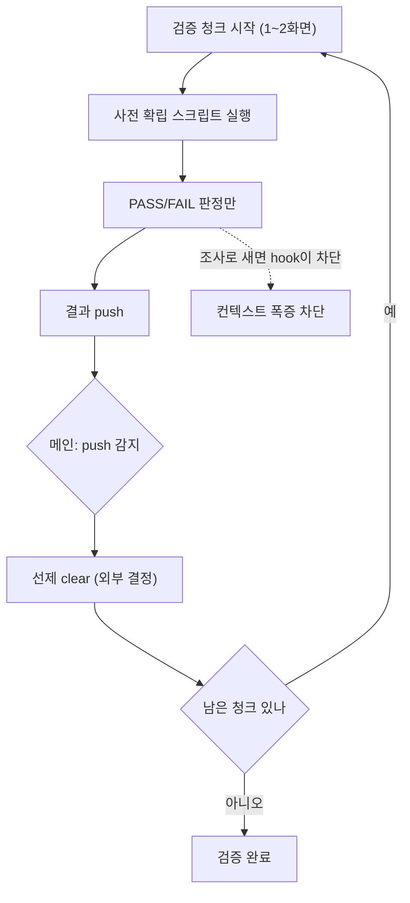

## 들어가며

이 저널은 UI 검증을 담당하던 에이전트가 컨텍스트 한도(약 200k 토큰)를 반복해서 넘겨 붕괴한 사고를 익명화한 기록이다. 예시 앱은 moneyflow, 워커 묶음은 team-harness 플러그인의 구현/검증 에이전트로 일반화한다. 사고의 표면은 "에이전트가 자꾸 죽는다"였지만, 회고하니 [harness-journal-036](harness-engineering/harness-journal-036-shared-state-write-serialization-file-lock)과 같은 뿌리를 공유한다 — **어떤 작업을 어느 단위에 담을지를 구조가 아니라 프롬프트 지침으로 통제하려다 새어나간 것.**

전이 가능한 교훈은 세 가지다. (1) context 붕괴에 대한 `/clear`는 증상 치료이며 구조를 안 바꾸면 순진행이 0이다. (2) 붕괴는 역할 경계가 흐릿할 때 온다 — 검증 에이전트가 조사까지 하면 컨텍스트가 폭증한다. (3) 붕괴 감지를 에이전트 self-monitor에 맡기면 안 된다. 감지 능력이 붕괴로 손상되기 때문이다.

## 1. 증상 — 왜 검증이 200k를 넘겼나

검증 에이전트가 한 세션에서 쌓은 것을 나열하면 붕괴가 필연이었음이 보인다.

- **풀빌드 로그**: 시뮬레이터 빌드 한 번의 stdout이 수천~수만 토큰.
- **스크린샷/UI 스냅샷**: 화면 하나의 접근성 트리 덤프가 크고, 여러 장이면 누적이 급하다.
- **300줄+ 파일 Read**: "이 화면 코드가 왜 이렇지?"를 확인하려 소스를 통째로 읽음.
- **다화면 순회**: 한 검증 세션에서 여러 화면을 연달아 도달·확인.
- **진입 reverse-engineering**: 그 화면에 어떻게 도달하는지 딥링크/토글을 역추적.

이 다섯이 한 컨텍스트에 직렬로 쌓이면 190~200k에 도달한다. 문제는 이것이 *한 번의 사고*가 아니라 **fix 후 재발**이었다는 점이다. 이전에 "컨텍스트 규율 가드"(빌드/스냅샷 출력을 하드 차단하는 hook)를 넣어 한 번 고쳤는데, 며칠 뒤 다른 세션에서 178~200k 붕괴가 다시 두 번 났다. 수동 interrupt와 `/clear`를 여러 차례 반복했고, 중복 검증에만 19분을 태웠다.

[harness-journal-035](harness-engineering/harness-journal-035-stall-reinject-and-fix-recurrence-escalation)의 조기 게이트가 여기서 발동한다. **fix 이력이 있는 증상이 재발하면 횟수 사다리를 건너뛰고 구조 ADR로 직행.** 첫 fix(출력 차단 hook)가 못 잡은 이유를 직시해야 했다.

## 2. /clear가 왜 순진행 0인가 — 증상과 원인의 분리

붕괴 때마다의 반사 대응은 `/clear`였다. `/clear`는 컨텍스트를 비워 토큰을 리셋한다. 문제는 이것이 **붕괴를 부른 작업 구조를 전혀 건드리지 않는다**는 점이다.

clear 후 에이전트는 다시 프라임(작업 맥락 재로딩)돼야 한다 — 이게 공짜가 아니다. 그리고 재프라임된 에이전트는 *같은 작업 설계*(풀빌드+스냅샷+대량 Read+다화면 순회)를 다시 수행하므로 같은 궤적으로 다시 폭증한다. 결과적으로 clear 한 번이 "재프라임 비용 + 또 한 번의 폭증"을 낳고, 순진행(net progress)은 0에 수렴한다. 심하면 음수다 — clear와 재프라임에 쓴 시간만큼 뒤로 간다.

첫 fix(출력 차단 hook)가 왜 부족했는지도 여기서 드러난다. hook은 "빌드/스냅샷 출력을 차단"해 *한 종류의 축적*만 막았다. 하지만 붕괴는 다섯 축의 합이다. 300줄 Read와 다화면 순회와 reverse-engineering은 여전히 쌓였다. 한 축을 막으니 나머지 축으로 폭증 궤적이 옮겨간 것뿐이다. 증상의 한 표현을 눌렀지 원인(작업 단위가 너무 큼)을 못 눌렀다.

## 3. 역할 경계 하드닝 — 검증은 "판정"이지 "조사"가 아니다

구조 fix의 첫 축은 **역할 경계**다. 붕괴의 큰 몫은 검증 에이전트가 검증 도중 조사로 빠진 데서 왔다. "화면이 이상한데... 왜지?" → 소스 Read → 딥링크 역추적 → 인접 화면 확인. 이 확장이 컨텍스트를 무제한으로 키운다.

그래서 impl과 verify의 계약을 이렇게 좁혔다.

- **구현(impl) 에이전트**: 진입 recipe를 *먼저* 확립하고, 스크린샷은 최대 1장. 전체 grounded sweep 금지. 즉 조사와 진입 확립은 impl 쪽에서 끝낸다.
- **검증(verify) 에이전트**: 사전 확립된 스크립트를 실행하고 PASS/FAIL 판정만. 조사·reverse-engineering 금지. 세션당 1~2화면으로 제한.

핵심은 "조사"와 "판정"을 다른 역할에 배치한 것이다. 조사는 본질적으로 컨텍스트를 확장하는 활동(모르는 걸 알아내려 자료를 모음)이고, 판정은 좁은 활동(주어진 기준으로 예/아니오)이다. 이 둘을 한 에이전트에 두면 판정하다 조사로 흐르는 걸 막을 수 없다. 역할을 나누면 verify 에이전트의 컨텍스트 상한이 구조적으로 낮아진다.

이 경계는 프롬프트 지침만으로는 또 새어나가므로([harness-journal-036](harness-engineering/harness-journal-036-shared-state-write-serialization-file-lock) §2의 교훈), hook으로 강제한다. 빌드/스냅샷 대량 출력은 이미 Bash PreToolUse hook이 하드 차단했는데, 사각이 하나 있었다 — **MCP 도구를 통한 빌드/스냅샷**(`build_run_sim`/`snapshot_ui` 같은)은 Bash가 아니라 별도 도구 경로라 Bash PreToolUse가 못 본다. 그래서 MCP 도구 이름에 매칭하는 PreToolUse 가이드를 추가하고, 근본적으로는 검증을 무거운 rebuild가 필요 없는 경로(이미 설치된 앱을 직접 실행 + 경량 스냅샷)로 라우팅했다.

## 4. 선제 clear를 오케스트레이션 레벨로 — self-monitor의 순환 함정

두 번째 축은 **누가 clear를 결정하는가**다. 처음엔 에이전트가 스스로 토큰을 보고 임계값에서 clear하는 self-monitor를 기대했다. 이게 실패한 이유가 이 저널에서 가장 미묘한 지점이다.

context rot이 진행되면 에이전트의 추론 품질이 떨어진다. 그런데 self-monitor는 바로 그 저하된 추론으로 "내가 지금 위험한가"를 판단하게 한다. **붕괴를 감지할 능력이 붕괴 자체로 손상되는 순환**이다. 붕괴 직전의 에이전트는 이미 "괜찮아, 조금만 더"라고 오판하기 쉬운 상태다. 감지자를 피감시자와 같은 컨텍스트에 두면 안 된다는 것 — 이는 [agent-supervision-surfaces](harness-engineering/agent-supervision-surfaces)의 "감시 표면은 감시 대상 밖에 둬야 한다"의 한 사례다.

그래서 clear 결정을 **외부(오케스트레이터/메인)의 결정론적 트리거**로 올렸다. 규칙은 단순하다 — 검증 에이전트가 결과를 push(반환)할 때마다 메인이 선제적으로 다음 청크 전에 clear를 건다. 에이전트의 자기 판단에 의존하지 않고, "push 단위"라는 외부에서 관측 가능한 이벤트에 clear를 묶는다.

트레이드오프는 재프라임 비용이다. push마다 clear하면 매 청크가 프라임 비용을 새로 낸다. 그래서 이것은 clear 빈도와 폭증 위험 사이의 튜닝 문제가 된다 — 너무 자주 clear하면 프라임 낭비, 너무 드물면 폭증. 여기서 §3의 역할 경계가 재프라임 비용을 낮춰준다. verify 에이전트의 프라임 맥락이 "판정 스크립트 + 기준"으로 좁으면, clear 후 재프라임도 가볍다. 조사까지 하는 에이전트를 자주 clear하면 무거운 재프라임을 반복하지만, 판정만 하는 에이전트는 clear-프라임 사이클이 싸다. 두 축이 맞물린다.

## 5. FR 청크 디스패치 — 큰 작업을 애초에 큰 단위로 주지 않는다

세 번째 축은 애초에 에이전트에게 주는 **작업 단위 자체를 쪼개는 것**이다. 리드가 여러 기능 요구사항(FR)을 한 에이전트에 통째로 dispatch하면, 그 에이전트는 첫 화면부터 마지막 화면까지 한 컨텍스트에 순회하며 §1의 다섯 축을 다 쌓는다. 디스패치 단위가 크면 아무리 §3·§4를 잘해도 상한이 높다.

그래서 dispatch를 1~2 FR 청크로 강제한다. 이건 §4의 "push마다 clear"와 상보적이다 — 작업을 작게 주고(청크), 각 청크가 끝날 때 외부가 clear한다(선제 clear). 작업 설계(입력 크기)와 실행 규율(중간 clear)을 동시에 낮춰야 상한이 실제로 내려간다.

이 세 축을 합치면 첫 fix가 왜 부족했는지가 완전히 설명된다. 첫 fix는 "출력 차단"이라는 **한 축의 한 표현**만 눌렀다. 붕괴는 (a) 큰 작업 단위 (b) 흐릿한 역할 경계 (c) self-monitor 순환의 합이었고, 셋을 각각 (a) FR 청크 dispatch (b) 역할 경계 hook (c) 외부 선제 clear로 눌러야 상한이 구조적으로 낮아진다. 하나만 누르면 궤적이 다른 축으로 옮겨간다.

## 6. 미결 — 튜닝과 근본 원인

이 fix에도 열린 질문이 남는다. 정직하게 적어둔다.

- **선제 clear의 구체 트리거.** "push 단위"는 관측 가능하지만 거칠다. 토큰 임계(예: 120k 넘으면)로 할지, push 단위로 할지, 둘의 합으로 할지는 작업 분포에 따라 튜닝이 필요하다.
- **가드 프롬프트가 왜 무시됐나.** 첫 fix에는 "컨텍스트를 아껴라"는 프롬프트 지침도 있었는데 무시됐다. 왜 무시됐는지(§4의 순환 때문인지, 지침이 구체적이지 않아서인지)를 더 파야 hook을 어디까지 강제할지 정해진다.
- **MCP 출력 truncate의 외부 의존.** MCP 도구 출력의 크기는 그 도구(외부 제공)에 달려 있어 우리가 완전히 통제하지 못한다. 무거운 rebuild가 필요 없는 경로로 우회하는 게 현실적 대응이다.

정리하면, context 붕괴는 "토큰이 많아서"가 아니라 "큰 작업을 흐릿한 역할로 한 컨텍스트에 담아서" 온다. 처방은 clear(증상)가 아니라 (a) 작업 단위 축소 (b) 역할 경계 강제 (c) 감지·결정을 컨텍스트 밖으로 빼기다.

## 자기 점검

1. 우리의 컨텍스트 붕괴 대응이 `/clear`에서 멈추고 있진 않은가? clear가 지우는 것이 증상인지 원인인지 구분하는가 — 재프라임 후 같은 궤적으로 다시 폭증하는가?
2. 검증(판정) 역할과 조사(탐색) 역할이 한 에이전트에 섞여 있진 않은가? 검증 에이전트가 "왜 이렇지?"로 조사에 빠질 여지를 구조가 막고 있는가?
3. 붕괴 감지를 에이전트 self-monitor에 맡기고 있진 않은가? 감지 능력이 붕괴로 손상되는 순환을 외부(오케스트레이터)의 결정론적 트리거로 끊었는가?
4. 첫 fix가 붕괴의 한 축(한 표현)만 누르고 다른 축으로 궤적이 옮겨가게 두진 않았는가? 작업 단위·역할 경계·감지 위치를 동시에 낮췄는가?
