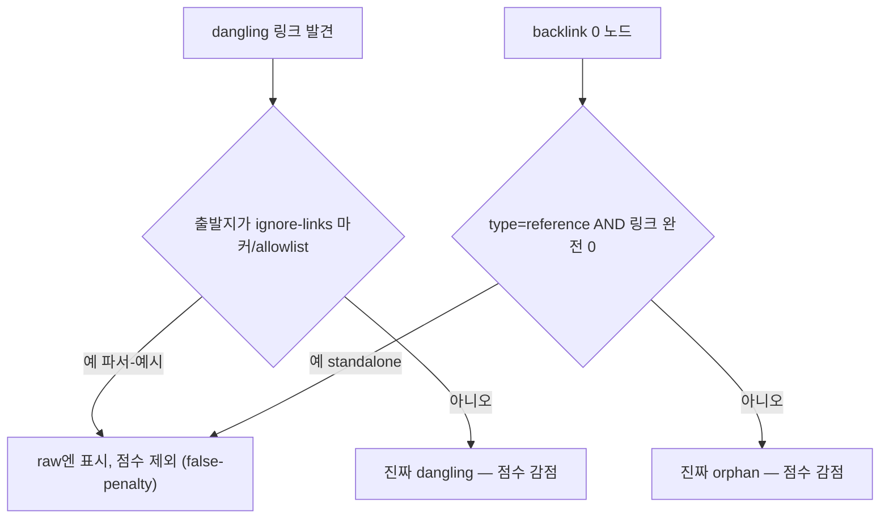

## 들어가며

이 저널은 지식그래프(에이전트가 참조하는 위키/메모리 그래프)의 건강도를 재는 두 측정 도구가 서로 다른 점수를 낸 사고를 익명화한 기록이다. 예시 하네스는 team-harness 플러그인으로, 두 도구는 MCP 서버가 노출하는 `health` 조회와 셸 스크립트 `wiki-doctor`로 일반화한다.

사용자가 지적한 것은 단순했다 — 같은 그래프를 하나는 **65/C**, 다른 하나는 **35/D**로 매겼다. **30점 차이**. 어느 쪽을 믿어야 하나? 이 질문이 이 저널의 출발점이다. 전이 가능한 교훈은 세 가지다. (1) 같은 대상을 두 자로 쟀는데 값이 크게 다르면 대상보다 자를 먼저 의심하라. (2) 의도적·정상 상태를 결함으로 세는 false-penalty는 역인센티브를 만든다. (3) 낮은 점수를 마주했을 때 첫 행동은 "점수 올리기"가 아니라 "공식 분해 → 측정 버그와 false-penalty 제거"다.

## 1. 30점 차이의 두 원인 — 점수항 불일치와 그래프 빌드 버그

두 도구를 나란히 놓고 grounded로 분해하니 차이는 두 갈래에서 나왔다.

**(a) 점수항 불일치.** 두 도구가 감점하는 항목의 집합이 달랐다. MCP `health`는 dangling(끊긴 링크)·orphan(고립 노드)·budget(인덱스 크기 초과)만 감점했다. `wiki-doctor`는 여기에 frontmatter 누락(43건)과 AI 에이전트용 directive 누락(34건)을 추가로 감점했다. 게다가 orphan을 세는 나눗셈 계수(divisor)도 달랐다(한쪽 5, 다른쪽 10). 같은 결함이라도 두 자가 다른 무게로 깎으니 값이 벌어질 수밖에 없었다.

**(b) 그래프 빌드 버그.** 더 미묘한 건 이쪽이다. `wiki-doctor`가 쓰는 그래프 인덱서(`wiki-index`)의 frontmatter 파싱 정규식이 `^(\w+):` 형태라, **들여쓴** 필드(`metadata:` 하위 2칸의 `related:`)를 못 잡았다. 그 결과 nested-related 엣지(메모리 간 연결)를 silent drop했다. 157개 메모리가 영향받아, backlink가 있는 노드를 없다고 세고 orphan을 10개 부풀렸다. 즉 `wiki-doctor` 쪽 그래프가 실제보다 더 고립돼 보였고, 그래서 점수가 더 낮았다.

흥미로운 대칭이 있다. MCP 쪽 그래프 인덱서는 같은 정규식을 이미 `^\s*(\w+):`로 고친 상태였다(들여쓰기 허용). 즉 **두 도구가 같은 버그의 fix 전/후 버전을 각자 들고 있었다.** 한쪽은 정확하고 한쪽은 옛 버그를 가진 채, 둘 다 "health"라는 같은 이름을 달고 서로 다른 진실을 주장했다. 이것이 30점 차이의 절반이었다.

## 2. 자를 먼저 의심하라 — 측정 신뢰성이 개선보다 앞선다

여기서 일반 원칙이 나온다. **같은 대상을 두 개의 자로 쟀는데 값이 크게 다르면, 대상의 품질보다 자의 신뢰성을 먼저 의심해야 한다.** 만약 이 30점 차이를 무시하고 곧장 "점수를 올리자"로 갔다면, 어느 자를 기준으로 개선하는지도 모른 채 삽질했을 것이다. 65 기준으로 올리면 35 도구는 여전히 낮다고 할 테고, 35 기준으로 올리면 실제로는 이미 괜찮은 것을 과잉 수정한다.

측정 신뢰성이 확보되기 전의 개선은 방향이 없다. 그래서 첫 행동은 두 자를 하나로 통일하는 것이었다. 통일의 방향은 "풍부한 쪽"으로 잡았다 — frontmatter/directive 누락은 실제 문서 건강 신호이므로 버리면 안 된다. 그래서 `wiki-doctor`가 세던 항목을 canonical로 채택하되, MCP만 갖고 있던 정당한 항(인덱스 budget 초과)도 추가해 완전히 합쳤다. 그리고 두 도구가 **같은 공식(single source of truth)**을 공유하는 함수를 호출하도록 바꿔서, 앞으로 lockstep으로 움직이게 했다.

```
score = 100
  − min(30, frontmatter_issues × 5)     # 강한 신호
  − min(20, directive_missing × 1)       # 약한 신호
  − min(15, ⌊dangling_real / 5⌋)         # placeholder 제외
  − min(10, ⌊orphans_real / 10⌋)         # standalone reference 제외
  − (over_budget ? 10 : 0)               # 인덱스 크기 budget
```

핵심은 두 도구가 이제 *다른 코드로 같은 값*을 내는 게 아니라 *같은 코드로 같은 값*을 낸다는 것이다. 측정 도구가 두 개면 언젠가 다시 갈라진다. 하나의 공식을 공유해야 갈라질 수 없다.

## 3. false-penalty — 의도적 상태를 결함으로 세면 역인센티브가 생긴다

통일된 공식으로 다시 재도, 여전히 부당하게 깎이는 두 종류가 있었다. 이게 이 저널의 핵심 개념인 **false-penalty**다 — 의도적이고 정상인 상태를 결함으로 세는 것.

**(B) 파서-예시 placeholder dangling.** wiki-link 파서의 동작을 *설명하는* 문서가 있다. 그 문서 안에는 `[[domain-x]]`, `[[name]]`, `[[feedback-x-y]]` 같은 예시 토큰이 들어간다. 이건 실제 링크가 아니라 "파서는 이런 형태를 이렇게 처리한다"를 보여주는 자기참조 예시다. 대상 노드가 없는 게 당연하다. 그런데 dangling 카운터는 이걸 "참조 대상 없는 끊긴 링크"로 세어 감점했다.

이게 왜 위험한가. **메커니즘을 문서화할수록 점수가 떨어지는 역인센티브**를 만든다. 파서를 잘 설명한 문서가 많을수록 예시 토큰이 늘고, health가 나빠진다. 좋은 문서화가 벌을 받는 구조다. 이건 [harness-journal-037](harness-engineering/harness-journal-037-verify-context-domino-role-boundary-preemptive-clear)의 "메트릭이 안전·정상 상태를 페널티하면 설계 결함"과 같은 결이다.

**(C) standalone reference orphan.** 설계상 검색으로만 발견되는 leaf 노드가 있다 — recipe, playbook, 외부 경로 포인터. 이들은 다른 노드가 굳이 링크하지 않아도 되는 "혼자 서 있는 참조 자료"다. backlink가 0이라는 이유로 orphan 페널티를 받으면, 정당한 leaf 자료를 억지로 아무 데나 링크하게 만드는 역인센티브가 된다.

## 4. 제외는 blanket이 아니라 auditable 메커니즘으로

false-penalty를 제거할 때 가장 큰 함정은 "그럼 그냥 dangling/orphan을 안 세면 되잖아"다. 이게 §5에서 말할 gaming이다. 진짜 dangling과 예시 placeholder를 구분하지 않고 통째로 빼면, 진짜 끊긴 링크도 감춰진다.

그래서 제외를 **감사 가능한(auditable) 명시적 메커니즘**으로만 허용했다. blanket 제외는 금지.

- **파서-예시 placeholder**: 손으로 편집하는 문서는 파일 상단에 명시적 마커(`ignore-links`)를 달고, *그 파일이 출발지인* dangling만 제외한다. 마커가 없으면 그대로 센다.
- **자동 생성되는 메모리 파일**: 여긴 마커가 안 통한다 — upsert 때 frontmatter가 통째로 재생성돼 인라인 마커가 휘발되기 때문이다. 그래서 코드 안에 슬러그를 명시한 allowlist로 처리한다. 마커와 동등하게 "어느 노드를 왜 제외하는지"가 코드에 남아 감사된다.
- **standalone reference orphan**: `type: reference`이면서 링크가 *완전히 0*인 노드만 orphan 페널티에서 뺀다. backlink가 하나라도 달리면 더 유용하므로 penalty를 유지한다 — 보수적으로.

그리고 원시(raw) dangling/orphan 수치는 진단용으로 **그대로 노출**하고, 점수 계산에만 Real 카운트(제외 반영)를 쓴다. 즉 "감춘 게 아니라 분리해서 보여준다." 감사자는 raw를 보고 "제외가 정당한가"를 언제든 재검토할 수 있다.



## 5. gaming vs recalibrate — 점수 올리기 전에 공식을 분해하라

이 저널을 관통하는 가장 큰 교훈이 이것이다. 낮은 점수를 마주하면 반사적으로 "점수를 올리자"가 나온다. 하지만 그 첫 행동이 무엇이냐가 gaming과 recalibrate를 가른다.

- **gaming**: 실제 품질과 무관하게 숫자만 올린다. dangling을 통째로 무시하거나, 임계값을 조작하거나, 페널티 항을 몰래 뺀다. 점수는 오르지만 그래프는 그대로 나쁘다. 최악은 메트릭이 *위험한 작업을 유도*하는 경우다 — 점수를 올리려고 멀쩡한 leaf를 억지로 링크하다 그래프를 더 엉키게 만든다.
- **recalibrate**: 공식을 분해해 "무위험 고ROI 레버"부터 제거한다. 측정 버그(§1의 그래프 빌드 버그)와 false-penalty(§3)가 그것이다. 이걸 제거하면 점수가 오르지만, 그건 조작이 아니라 *실제 품질을 정확히 반영하게 된 결과*다. 진짜 결함은 그대로 남아 여전히 감점된다.

이 사건에서 점수가 오른 몫의 대부분은 recalibrate였다 — 두 도구의 자를 통일하고, silent drop 버그를 고치고, 파서-예시와 standalone reference를 감사 가능하게 제외했다. 진짜 dangling과 진짜 frontmatter 누락은 여전히 목록에 남아 별도로 처리해야 했다. 점수를 올리기 전에 공식을 분해했기 때문에, 무엇이 "고칠 가치 있는 진짜 결함"이고 무엇이 "자의 오류"인지가 분리됐다.

정리하면, 메트릭은 그 자체가 검증 대상이다. 두 자가 다른 값을 내면 자를 먼저 고치고, 자가 정상 상태를 페널티하면 역인센티브를 걷어내고, 점수를 올리라는 요구엔 gaming 대신 recalibrate로 답한다. 진짜 결함을 감추면 안 되지만, 가짜 결함을 세는 것도 똑같이 측정을 망친다.

## 자기 점검

1. 같은 대상을 재는 도구가 둘 이상이라면 서로 같은 값을 내는가? 다르다면 대상보다 자(측정 공식·그래프 빌드 로직)를 먼저 의심했는가?
2. 우리 메트릭이 의도적·정상 상태(예시·설계상 leaf·안전한 무동작)를 결함으로 세고 있진 않은가? 그로 인해 "좋은 행동이 점수를 깎는" 역인센티브가 생기진 않았는가?
3. false-penalty를 제거할 때 blanket(통째 무시)이 아니라 감사 가능한 명시적 메커니즘(마커/allowlist)을 썼는가? 진짜 결함은 여전히 세고 있는가? raw 수치를 진단용으로 노출하는가?
4. 낮은 점수를 마주했을 때 첫 행동이 "점수 올리기(gaming)"였는가, "공식 분해 → 측정 버그·false-penalty 제거(recalibrate)"였는가?
