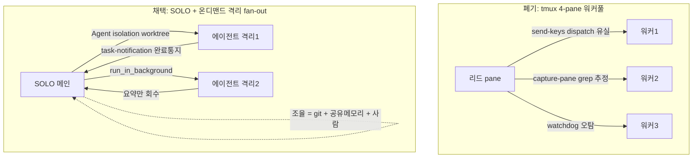

## 들어가며

이 저널은 멀티에이전트 iOS 개발 하네스에서 두 달 넘게 운영하던 **tmux 4-pane 워커풀**을 폐기하고 **SOLO 메인 + 온디맨드 격리 fan-out**으로 전환한 결정을 익명화한 기록이다. 예시 하네스는 team-harness 플러그인, 예시 앱은 moneyflow로 일반화한다. 이 위키의 여러 저널([harness-journal-035](harness-engineering/harness-journal-035-stall-reinject-and-fix-recurrence-escalation)/[036](harness-engineering/harness-journal-036-shared-state-write-serialization-file-lock)/[037](harness-engineering/harness-journal-037-verify-context-domino-role-boundary-preemptive-clear))이 다룬 사고들이 사실 이 워커풀 위에서 일어났다. 그 사고들을 하나씩 fix하며 버텨왔지만, 결국 "고쳐 쓰는 것"이 아니라 "메커니즘을 버리는 것"이 이득이라는 결론에 도달했다.

전이 가능한 교훈은 두 층위다. 미시적으로는 **터미널 pane을 IPC 채널이자 상태 관측 표면으로 쓰면 안 된다**는 것. 거시적으로는 **아키텍처 전환의 accept 근거를 PoC 한 번이 아니라 3-소스 수렴으로 삼을 수 있다**는 것. 그리고 폐기하면서 무엇을 폐기하지 *않았는지*를 명확히 하는 것 — 폐기한 건 특정 구현이지 병렬성 자체가 아니다.

## 1. 무엇을 운영했나 — tmux 4-pane 워커풀

전환 전의 구조는 이랬다. tmux 세션의 4개 pane에 각각 Claude Code 세션을 띄운다. pane 1이 리드(오케스트레이터), pane 2~4가 워커. 리드는 작업을 워커에게 **dispatch**하고, 워커의 상태를 **모니터**하고, 완료를 **notify** 받는다. 이 세 동작(dispatch/monitor/notify)을 tmux 프리미티브로 구현했다.

- **dispatch**: `send-keys`로 워커 pane에 프롬프트를 "타이핑"해 넣는다.
- **monitor**: `capture-pane`으로 워커 pane의 화면 텍스트를 긁어와 상태(진행 중/완료/hang)를 grep으로 추정한다.
- **notify**: 완료 신호도 결국 pane 텍스트에 특정 마커가 뜨는 걸 grep으로 잡는다.

여기에 워커 stall을 감지하는 watchdog, 컨텍스트 폭증을 감시하는 monitor, 워커에게 역할을 주입하는 priming 커맨드가 딸려 있었다. 겉보기엔 그럴듯한 팀 구조다. 문제는 이 모든 것이 **터미널 pane이라는 단 하나의 취약한 표면 위에** 얹혀 있었다는 점이다.

## 2. 근본 결함 — pane은 IPC 채널도 상태 표면도 아니다

tmux pane은 사람이 보라고 만든 것이다. 프로그램 간 통신 채널이 아니고, 프로그램이 읽으라고 만든 상태 저장소도 아니다. 이걸 IPC와 관측에 전용하면서 세 종류의 실패 클래스가 끊임없이 나왔다.

**전송 신뢰성.** `send-keys`는 키 입력 시뮬레이션이다. Enter가 안 눌린 채 남거나(미landing), paste가 유실되거나, 존재하지 않는 슬래시 커맨드가 조용히 no-op되거나. 재시도하려면 [harness-journal-035](harness-engineering/harness-journal-035-stall-reinject-and-fix-recurrence-escalation)에서 본 것처럼 페이로드 전체를 재주입해야 하는데, 그 재주입도 같은 send-keys라 또 유실될 수 있다. 채널 자체가 손실성(lossy)이다.

**상태 관측.** `capture-pane`은 화면의 현재 텍스트를 긁는다. 그런데 화면은 stale할 수 있고(갱신 전 프레임), 자동완성 고스트 텍스트가 섞이고, 진행 표시 spinner를 hang으로 오판하고, footer의 토큰 카운터를 작업 출력으로 착각한다. "화면 텍스트를 grep해서 상태를 판정한다"는 접근 자체가 추정이다. 추정에 기반한 watchdog은 false-positive(멀쩡한 워커를 죽었다고 판정)를 다발로 냈다.

**기동/hang과 컨텍스트.** 워커 세션을 새로 띄우는 것 자체가 hang을 만들었고(startup turn hang, MCP priming hang), 워커가 컨텍스트 200k FATAL로 조용히 멈춰도 watchdog은 못 잡았다([harness-journal-037](harness-engineering/harness-journal-037-verify-context-domino-role-boundary-preemptive-clear)). 별도 monitor 스크립트로 보완했지만 그것도 pane 스크래핑에 의존했다.

이 실패들을 하나씩 고쳐왔다 — 재주입 로직, watchdog 튜닝, turn-free 기동, inbox 파일 채널로 send-keys 일부 대체. 하지만 [harness-journal-035](harness-engineering/harness-journal-035-stall-reinject-and-fix-recurrence-escalation)의 조기 게이트 정신으로 보면 이건 명백히 "fix 후 재발이 반복되는" 상태였다. 메시지 채널은 inbox로 개선했지만 **세션 기동·상태 관측·컨텍스트 관리가 여전히 pane 스크래핑에 의존**하는 게 잔여 근본 결함이었다. 개별 fix로는 이 결함이 안 없어진다.

## 3. accept 근거 — PoC 대신 3-소스 수렴

여기서 이 결정의 방법론적 핵심이 나온다. 아키텍처 전환을 결정할 때 흔한 게이트는 "PoC를 만들어 새 방식이 낫다는 실측을 보이자"다. 우리는 PoC 실측 없이 accept했다. 대신 **세 개의 독립 출처가 한 점으로 수렴**하는 것을 더 강한 신호로 삼았다.

**출처 1 — 우리 실패 taxonomy.** send-keys/pane-grep 계열 실패가 압도적이었다. IPC 관련 25건+에 watchdog 오탐, 기동 hang, 컨텍스트 도미노가 더해졌다. 이건 "가끔 삐끗"이 아니라 메커니즘의 구조적 취약이었다.

**출처 2 — 외부 문헌.** 2025~26년의 멀티에이전트 연구가 같은 방향을 가리켰다. MAST(멀티에이전트 실패 분류)는 orchestrator-worker(온디맨드) 패턴이 이기고 peer-to-peer(상주) 패턴이 프로덕션에서 밀린다고 정리했다. Cognition의 "Don't Build Multi-Agents"는 촘촘히 결합된 에이전트의 취약성을 지적했다. Anthropic의 subagent 모델은 격리가 컨텍스트 누적을 해소한다고 봤다. Addy Osmani는 "인지 대역폭은 병렬화 안 됨, 실용 상한 3~4 스레드, 편한 것보다 하나 적게"라고 정리했다.

**출처 3 — 네이티브 프리미티브 성숙.** 같은 기간 도구가 성숙했다. `Agent({isolation:'worktree', run_in_background})`로 격리 spawn과 수명 관리가 가능해졌고, worktree별 환경 복사(`.worktreeinclude`), 완료 통지 notification hook, 진행 중 에이전트와의 대화(`SendMessage`)가 갖춰졌다. tmux로 힘겹게 흉내 내던 것들이 네이티브로 제공됐다.

세 출처가 독립적인데 같은 결론("상주 IPC 워커풀을 버리고 온디맨드 격리 fan-out으로")을 가리켰다. 이 수렴이 PoC 한 번보다 강하다고 판단했다. PoC는 한 조건에서의 한 표본이지만, 3-소스 수렴은 서로 다른 각도의 증거가 교차 검증된 것이다. 이는 [harness-as-software-adr-for-agent-harness](harness-engineering/harness-as-software-adr-for-agent-harness)의 "하네스 결정도 코드 결정처럼 근거를 남긴다"의 한 실천이다 — 근거가 실측이 아니라 수렴일 때 그 수렴을 명시적으로 기록한다.

## 4. 전환 후 토폴로지 — SOLO 메인 + 서브 2, 무공유 독립 세션

새 구조는 3-세션 레이아웃이다. 겉보기엔 여전히 tmux를 쓰지만, **tmux의 역할이 IPC에서 레이아웃+persistence로 축소**됐다는 게 결정적이다.

- **메인 1 (좌측 반)**: SOLO 오케스트레이터 겸 실행자. 코드를 직접 grep/Read/Edit하고, 무겁거나 병렬인 작업만 `Agent({isolation:'worktree'})`로 온디맨드 fan-out(2~3개). 사용자 대화 창구.
- **서브 2 (우측 상/하)**: 결정·왕복이 많은 *독립* 작업 스트림용 별도 세션. burst일 때만 사용, 끝나면 유휴/종료.
- **세 pane은 각각 무공유 독립 세션.** pane 간 send-keys IPC도, 역할 priming도, dispatch도 없다.

세션 간 조율은 세 가지로만 한다 — **git(worktree/branch), 공유 메모리(MCP add_memory), 그리고 사람.** 에이전트끼리 자동으로 메시지를 주고받는 A2A는 도입하지 않았다(1인 규모엔 오버). 이 "느슨함"이 의도된 설계다. [harness-journal-037](harness-engineering/harness-journal-037-verify-context-domino-role-boundary-preemptive-clear)의 컨텍스트 도미노, [harness-journal-035](harness-engineering/harness-journal-035-stall-reinject-and-fix-recurrence-escalation)의 stall 전파 같은 실패는 에이전트를 촘촘히 엮는 데서 온다. 엮지 않으면 그 실패 클래스 자체가 발생할 자리가 없다.

## 5. 안전 가드 — 격리는 프롬프트로 강제해야 완성된다

전환에는 함정이 하나 있었다. `Agent({isolation:'worktree'})`를 호출한다고 해서 격리가 저절로 보장되지 않는다. 에이전트에게 주는 **프롬프트가 main 경로를 참조하거나 worktree 경로를 강제하지 않으면**, 에이전트가 격리 worktree가 아니라 main tree에서 작업해버린다. 이 실패는 두 번 재발해서 조기 게이트에 걸렸다.

그래서 spawn 프롬프트에 세 문구를 의무화했다 — (a) `pwd`로 worktree를 확인하고 (b) 그 절대 경로에서만 작업하며 (c) main을 참조하지 말 것. 그리고 이걸 사람 규율에 맡기지 않고([harness-journal-036](harness-engineering/harness-journal-036-shared-state-write-serialization-file-lock) §2의 교훈), `Agent(isolation:'worktree')` spawn 시 프롬프트에 이 문구가 없으면 경고하는 PreToolUse hook을 배송했다. 격리는 도구 옵션 하나로 끝나는 게 아니라 "옵션 + 프롬프트 강제 + spawn 후 검증(main tree가 clean한지)"의 셋으로 완성된다.

## 6. 무엇을 폐기하지 않았나 — 병렬성이 아니라 결합 방식

이 저널에서 가장 오해받기 쉬운 지점을 못박아 둔다. **"멀티에이전트를 폐기했다"가 아니다.** 폐기한 것은 "tmux send-keys/pane-grep 기반 상주 워커풀"이라는 특정 구현이다. 전환의 이름 그대로 방향은 *네이티브 agent teams로*이며, 실제로 온디맨드 worktree fan-out(2~3개)을 표준으로 계속 쓴다. 병렬성은 유지된다. 바뀐 것은 결합 방식이다 — 상주·촘촘히 엮인 워커풀에서, 온디맨드·느슨하게 격리된 fan-out으로.

이 구분이 중요한 이유는 다음 결정으로 이어지기 때문이다. 나중에 "구조화된 오케스트레이션 도구가 제공되는데 왜 안 쓰냐"는 반문이 나왔을 때(→ ADR-010, 별도 문서), 이 구분이 답의 토대가 됐다. transport(전송 메커니즘)는 개선할 수 있지만, context 도미노나 coordinator hang은 에이전트를 메시징으로 촘촘히 엮는 *결합도*에서 오므로 transport를 바꿔도 사라지지 않는다. 우리가 지킨 것은 "느슨함"이지 "단일 에이전트"가 아니다.

전환의 대가도 정직하게 남긴다. 기존 스크립트 자산(dispatch/notify/watchdog/monitor, 리드/워커 커맨드)은 상각된다. 그리고 새 경로에도 자체 함정이 있다(§5의 격리 프롬프트 강제, spawn 운영 함정들). 하지만 이 함정들은 "고칠 수 있는 국소 함정"이지 pane 스크래핑처럼 "메커니즘에 내재한 구조적 취약"이 아니다. 그 차이가 폐기와 유지를 가른다.

## 자기 점검

1. 우리 멀티에이전트 조율이 "사람이 보라고 만든 표면"(터미널 pane, 로그 파일 tail)을 IPC 채널이나 상태 관측에 전용하고 있진 않은가? 전송이 손실성이고 상태가 추정인 채로 운영 중이진 않은가?
2. 반복되는 실패를 개별 fix로 버티고 있진 않은가? "고쳐 쓰기"와 "메커니즘 버리기" 중 어느 쪽이 이득인지, 조기 게이트(fix 후 재발)로 판단했는가?
3. 아키텍처 전환의 accept 근거가 무엇인가? PoC 한 번인가, 아니면 내부 경험·외부 문헌·도구 성숙 같은 독립 출처의 수렴인가? 수렴이라면 그것을 명시적으로 기록했는가?
4. "멀티에이전트를 버렸다"와 "특정 결합 방식을 버렸다"를 혼동하고 있진 않은가? 우리가 지키려는 것이 병렬성인지, 느슨한 결합인지, 단일성인지 구분되는가?
