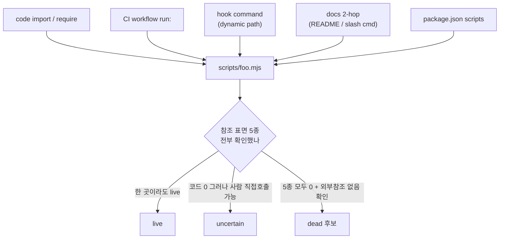

하네스를 오래 운영하면 코드베이스와 똑같은 일이 벌어진다. `scripts/` 디렉토리에 헬퍼가 하나둘 쌓이고, 어느 날 세어 보면 수십 개다. 그중 절반은 매일 돌지만, 나머지 절반은 마지막으로 호출된 게 언제인지 아무도 모른다. "정리하자"는 충동이 든다. `grep`을 돌려서 참조가 0건이면 지운다 — 이게 가장 흔한 정리 방식이고, 가장 흔한 사고 원인이다.

이 글은 한 RIBs/ReactorKit iOS 개발 하네스에서 스크립트 dead-code audit을 정기 작업으로 돌리면서 박제한 패턴이다. 핵심은 단순하다. **"참조 0 = dead"는 거짓이다.** 이진 dead/live 대신 `live / uncertain / dead` 3분류를 쓰고, "외부 참조를 추측하지 않는다"는 가드를 audit 절차에 못 박는다. audit 자체는 분석만 하고, 실제 삭제는 사람의 confirm 게이트 뒤에서만 일어난다.

## 하네스도 코드처럼 dead-code가 쌓인다

하네스 스크립트의 수명은 코드보다 더 불투명하다. 애플리케이션 코드는 import 그래프가 비교적 명시적이다. 하지만 하네스 스크립트는 호출 경로가 산만하다. CI 워크플로 YAML, PreToolUse/PostToolUse 훅, 슬래시 커맨드 마크다운, README의 안내문, 그리고 개발자가 그냥 터미널에 손으로 친 `node scripts/foo.mjs`. 이 다섯 종류가 전부 "live"를 만들지만, 코드 grep은 그중 하나(직접 require/import)만 잡는다.

방치하면 두 가지 비용이 생긴다. 첫째, **신규 합류자/에이전트의 인지 부하**. 새 세션이 `scripts/`를 훑을 때 죽은 스크립트와 산 스크립트를 구별 못 하면, 죽은 스크립트의 패턴을 복붙해서 새 스크립트를 만든다. 둘째, **잘못된 신뢰**. 6개월 전에 폐기됐지만 파일은 남아 있는 스크립트를 누가 "이게 표준인가 보다" 하고 다시 호출하면, 폐기된 동작이 부활한다.

그래서 정기 audit이 필요하다. 다만 audit의 목표는 "삭제 목록을 뽑는 것"이 아니라 "현재 스크립트 인벤토리를 live/uncertain/dead로 *정확하게 분류*하는 것"이다. 삭제는 그 다음 문제다.

## 방법론: broaden grep + 2-hop 추적

순진한 audit은 한 군데만 본다. 스크립트가 다른 스크립트에서 `import`/`require`되는지. 이건 표면의 1/5만 보는 것이다. 제대로 된 audit은 grep 범위를 넓히고(broaden) 참조를 2-hop까지 따라간다.

확장해야 할 참조 표면은 최소 다섯 곳이다.

1. **코드 참조** — `import`, `require`, `exec`, `spawn`. 가장 잡기 쉬운 곳.
2. **CI 워크플로** — `.github/workflows/*.yml`에서 `run:` 줄. 매일/매주 cron으로만 돌고 코드에선 안 불리는 스크립트가 여기 산다.
3. **훅 스크립트** — `settings.json`의 hook command, 그리고 hook 셸 스크립트 내부에서 조립하는 경로. 여기가 가장 위험하다(아래 함정 참고).
4. **문서 2-hop** — README/CLAUDE.md/슬래시 커맨드 `.md`가 스크립트를 "이걸 실행하세요"라고 안내. 코드는 안 부르지만 사람이 그 문서를 보고 부른다. 1-hop은 "문서가 스크립트를 언급", 2-hop은 "그 문서가 다른 문서/커맨드에서 라우팅됨"까지.
5. **package.json scripts** — `npm run xxx`로 래핑된 엔트리. 사용자가 직접 치는 표준 진입점.



2-hop이 중요한 이유는 라우팅 때문이다. 슬래시 커맨드 `team-harness:` 네임스페이스의 한 커맨드가 내부에서 다른 마크다운을 읽고, 그 마크다운이 스크립트를 안내하는 식이다. 1-hop만 보면 "이 스크립트를 부르는 커맨드가 없네"라고 오판한다. 2-hop을 따라가면 라우팅 체인의 끝에 스크립트가 매달려 있는 게 보인다.

## 3분류: live / uncertain / dead — 무참조 ≠ dead

audit의 산출물은 삭제 목록이 아니라 분류표다.

- **live** — 다섯 표면 중 한 곳 이상에서 명확히 호출된다. 끝. 손대지 않는다.
- **uncertain** — 코드 참조는 0이지만 사람이 직접 호출할 법한 성격이다. 운영 CLI(`node scripts/graph-query.mjs`처럼 사람이 ad-hoc로 치는 도구), 대시보드 생성기, 1회성 마이그레이션 도구, 디버깅 보조. 이들은 "자동으로 안 불린다"가 "안 쓰인다"를 의미하지 않는다.
- **dead** — 다섯 표면 전부 0이고, 게다가 외부 참조 가능성도 검토해서 없다고 확인된 것. 이건 후보일 뿐 자동 삭제 대상이 아니다.

핵심 명제 하나만 기억하면 된다. **무참조 ≠ dead.** moneyflow 같은 예시 앱 하네스에서 실제로 자주 걸리는 건 다음 두 부류다.

첫째, 사용자가 손으로 치는 CLI. 예를 들어 그래프 쿼리 도구는 어떤 코드도 import하지 않는다. 사람이 "고아 노드 찾아줘" 할 때 직접 친다. grep 참조 0건. 하지만 dead가 아니라 가장 자주 쓰는 도구일 수 있다.

둘째, 정기 리포트/대시보드 생성기. 코드에서 안 불리고, CI에서도 안 돌고, 분기에 한 번 사람이 손으로 돌려서 결과를 본다. 참조 0, live 100%.

이 둘을 dead로 묶어 지우면, 다음에 누군가 그 도구를 찾을 때 사라져 있다. 그래서 uncertain 버킷이 존재 이유를 갖는다. uncertain은 "모르겠다"의 정직한 표현이고, 사람에게 "이거 아직 쓰세요?"라고 물어볼 큐다.

## 함정: plugin-only grep이면 false-positive가 다수 → "외부 참조 추측 금지" 가드

가장 비싼 실수는 grep 범위를 plugin/레포 *내부*로만 한정하는 것이다. 하네스가 배포된 plugin 형태(`team-harness` plugin)라면, 스크립트가 plugin 디렉토리 안에서만 참조 검색되곤 한다. 그런데 실제 호출자는 plugin 밖에 산다.

- 훅이 `${CLAUDE_PLUGIN_ROOT}/scripts/foo.mjs`처럼 **변수로 경로를 조립**해서 exec한다. grep `scripts/foo.mjs`로는 안 잡힌다. 문자열이 쪼개져 있으니까.
- 사용자의 글로벌 `settings.json`이나 개인 셸 alias가 스크립트를 부른다. 이건 레포 밖이라 grep 사정권 자체가 아니다.
- 다른 워커 레포가 이 스크립트를 복사해 쓰거나 경로로 참조한다.

plugin 내부만 grep하면 이런 외부 호출자가 전부 누락되어 **false-positive(살아있는데 dead로 판정)가 다수** 발생한다. 그리고 false-positive 한 건의 비용은 false-negative(죽었는데 못 지움)보다 훨씬 크다. 안 지운 죽은 스크립트는 그냥 잡음이지만, 잘못 지운 산 스크립트는 훅을 깨뜨리고 워크플로를 멈춘다.

그래서 가드를 절차에 박는다.

> **외부 참조 추측 금지.** audit 범위(grep한 디렉토리) *밖*에서의 호출 가능성을 "없을 것이다"라고 추측해서 dead로 올리지 않는다. 동적으로 조립된 경로, 사용자 글로벌 설정, 타 레포 참조처럼 audit이 관측하지 못한 표면이 있으면, 그 스크립트는 자동으로 **uncertain**이다. dead로 내리려면 그 표면을 실제로 관측하거나 사람이 확인해야 한다.

이 가드의 본질은 "내가 안 본 곳을 안 본다고 인정하는 것"이다. 정적 분석 도구의 한계를 도구가 스스로 선언하게 만든다. 추측으로 메운 빈칸이 곧 false-positive의 입구다.

## dead 확정은 confirm 게이트 뒤에 — audit은 분석 only

설계 원칙으로 못 박을 것: **audit 스크립트는 절대 파일을 삭제하지 않는다.** audit은 read-only 분석이고, 산출물은 3분류표 + 각 항목의 근거(어느 표면을 봤고 무엇이 0이었는지)다.

이유는 두 가지다. 첫째, audit 도구 자체에 버그가 있을 수 있다. grep 패턴이 틀렸거나 표면 하나를 빼먹었으면, 자동 삭제는 그 버그를 즉시 파괴적 행동으로 증폭시킨다(자기 검증 없는 자동 수정 도구의 전형적 사고). 둘째, dead 판정은 본질적으로 *맥락 판단*이라 사람이 마지막 키를 쥐어야 한다.

흐름은 이렇게 둔다.

```
audit (read-only) → 3분류표 출력
        ↓
dead 후보만 추려 사람에게 제시 ("이거 지워도 될까?")
        ↓ 사람 confirm
별도 삭제 커맨드 실행 (git으로 되돌릴 수 있는 단일 커밋)
```

confirm 게이트는 단순한 안전장치가 아니라 **uncertain → live/dead로 정보를 흘려보내는 채널**이다. 사람이 "아 그거 분기마다 손으로 돌려요"라고 답하면 그 스크립트는 live로 확정되고, 다음 audit에선 더 이상 uncertain에 안 뜨도록 주석/매니페스트에 표시해 둘 수 있다. audit이 거듭될수록 uncertain 버킷이 줄어드는 게 건강한 신호다.

## 역방향 dead: 스크립트는 없는데 훅이 부르는 댕글링 참조

정방향 dead가 "참조 없는 스크립트"라면, 역방향 dead(reverse dead)는 그 거울상이다. **"스크립트 없는 참조"** — 훅이나 CI나 설정이 *존재하지 않는* 스크립트 경로를 호출하고 있는 상태다.

이건 정방향 dead보다 더 위험하다. 정방향은 잡음에 그치지만, 역방향은 런타임 실패다. PreToolUse 훅이 삭제된 `scripts/guard.mjs`를 exec하려다 "file not found"로 죽으면, 훅 exit code에 따라 도구 호출 전체가 차단되거나, 더 나쁘게는 조용히 통과되어 가드가 사라진 줄도 모른다. 특히 mid-session cutover(로컬 `.claude`에서 배포 plugin으로 갈아타거나 경로를 옮길 때) 직후에 잘 생긴다. 경로를 옮겼는데 훅 명령은 옛 경로를 가리키는 식이다.

그래서 audit은 양방향을 본다.

1. **정방향** — 각 스크립트에 대해 호출자가 있나? (없으면 dead 후보 → uncertain 검토)
2. **역방향** — 각 훅/CI/설정의 스크립트 경로에 대해 그 파일이 실제로 존재하나? (없으면 즉시 BLOCKER, 추측의 여지 없음)

역방향 dead는 uncertain이 없다. 경로가 가리키는 파일이 디스크에 있냐 없냐는 관측 가능한 사실이지 판단이 아니다. 없으면 깨진 거고, 고쳐야 한다(경로 수정 또는 훅 제거). audit 산출물에서 역방향 dead는 항상 최우선 항목으로 올린다.

---

정리하면, 하네스 스크립트 정리는 "참조 세서 0이면 삭제"가 아니다. grep 범위를 다섯 표면으로 넓히고, 2-hop 문서까지 따라가고, 결과를 live/uncertain/dead로 나누되 무참조를 dead와 동일시하지 않고, audit이 못 본 표면은 추측하지 말고 uncertain으로 정직하게 남기고, 실제 삭제는 사람 confirm 게이트 뒤로 미루고, 역방향 댕글링 참조까지 양방향으로 본다. 이렇게 하면 audit이 자산이 되고, "참조 0=dead"는 부채가 된다.

## 자기 점검

- 우리 하네스의 dead-code audit은 코드 import 말고 CI·훅·문서 2-hop·package.json까지 다섯 표면을 모두 grep하는가, 아니면 한 곳만 보고 있는가?
- 참조 0인 스크립트를 곧장 삭제 목록에 넣는가, 아니면 "사람이 직접 호출하는 CLI일 수 있다"는 가능성 때문에 uncertain 버킷에 먼저 넣는가?
- audit 도구가 관측하지 못한 외부 호출자(동적 경로, 글로벌 설정, 타 레포)에 대해 "없을 것이다"라고 추측하고 있지는 않은가?
- 훅/CI 설정이 가리키는 스크립트 경로가 실제로 디스크에 존재하는지(역방향 dead) 검사하는 단계가 audit에 들어 있는가?
