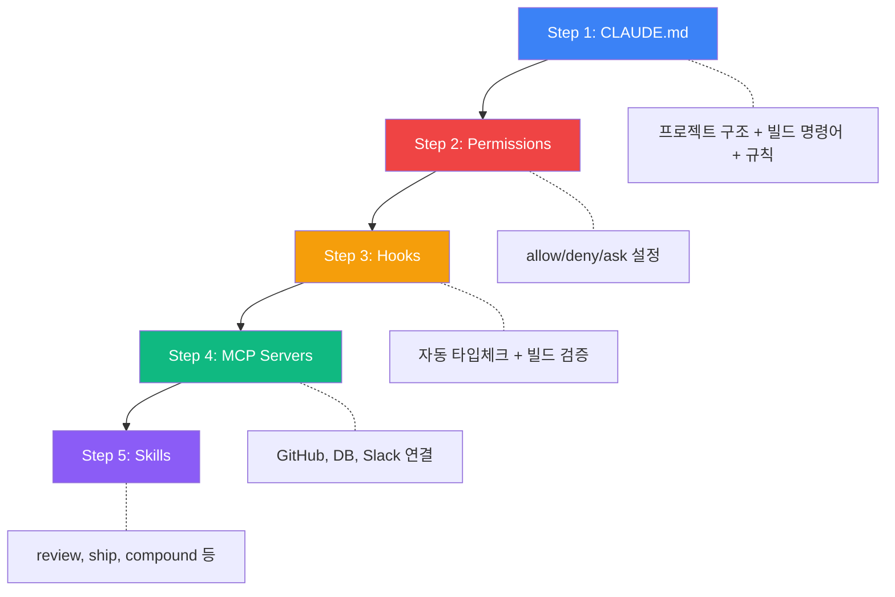

## 왜 지금 이 주제인가

AI 코딩 에이전트를 쓰면서 "CLAUDE.md는 만들었는데, 그 다음은 뭘 해야 하지?"라는 질문에 부딪힌다. 실밸개발자 채널의 이 영상은 **빈 프로젝트에서 하네스를 처음부터 세팅하는 전 과정**을 보여준다. 단순히 "이런 게 있다"가 아니라 "이 순서로 이렇게 만들어라"는 실전 가이드.

내 ai-study 프로젝트는 이미 CLAUDE.md + Hooks + Skills가 동작 중이지만, 처음 세팅할 때의 체계적 접근법은 부족했다. 새 프로젝트(moneyflow, tarosaju)에 하네스를 이식할 때 이 가이드가 체크리스트 역할을 할 수 있다.

> **투명성 고백**: 이 영상을 직접 시청하지 않은 상태에서 정리한다. 영상 제목·메타데이터 + 동일 주제를 다루는 독립 소스 2개(HumanLayer 블로그, ClaudeCodeLab 가이드)를 교차 확인하여 공통 개념만 추출했다.

---

## 핵심 개념: 하네스의 5대 기둥

하네스 엔지니어링의 산출물은 전부 **코드 리포지토리에 커밋되는 파일**이다. 팀원이 바뀌어도, 모델이 바뀌어도, 하네스는 남는다.

```
빈 프로젝트에서 하네스 세팅 순서:

Step 1: CLAUDE.md          ← 프로젝트 컨텍스트 (기초)
Step 2: Permissions         ← 안전 경계 설정
Step 3: Hooks              ← 자동 검증 루프
Step 4: MCP Servers        ← 외부 도구 연결
Step 5: Skills / Commands  ← 반복 워크플로우 캡슐화
```

---

## Step 1: CLAUDE.md — 하네스의 기초

프로젝트 루트에 두는 마크다운 파일. AI가 매 세션 시작 시 자동으로 읽는다.

### 핵심 원칙: "Less is More"

ETH Zurich 연구에서 확인된 사실 — **과도한 지시는 오히려 성능을 떨어뜨린다.** 토큰을 소비하면서 결과는 개선되지 않음. HumanLayer의 CLAUDE.md는 60줄 이하.

### 최소 구조 (Day 1)

```markdown
# 프로젝트명

## Tech Stack
- Framework: Next.js 15 (App Router, TypeScript)
- Styling: Tailwind CSS 4

## Key Commands
- `npm run dev` — 개발 서버
- `npm run build` — 프로덕션 빌드
- `npm test` — 테스트 실행

## Conventions
- 커밋 메시지: 한글
- 파일명: kebab-case
- 컴포넌트: PascalCase

## Rules (절대 금지)
- .pbxproj 직접 수정 금지
- 회사명/시크릿 코드에 포함 금지
```

### 성장 구조 (Week 2+)

```
./CLAUDE.md                  ← 핵심 규칙 (200줄 이하)
./.claude/rules/*.md         ← 파일 패턴별 규칙 (필요할 때만 로딩)
./.claude/commands/*.md      ← 워크플로우 (필요할 때만 로딩)
```

**핵심**: 상세 내용은 rules/commands로 분리하여 CLAUDE.md 자체는 200줄 이하 유지. 컨텍스트 윈도우를 아끼는 것이 곧 비용 절약이자 품질 향상.

---

## Step 2: Permissions — 안전 경계

`.claude/settings.json`에서 AI가 할 수 있는 것과 없는 것을 명시.

```json
{
  "permissions": {
    "allow": [
      "Read",
      "Glob",
      "Grep",
      "Bash(npm run *)",
      "Bash(npx tsc --noEmit)",
      "Bash(git status)",
      "Bash(git diff *)",
      "Bash(git add *)",
      "Bash(git commit *)"
    ],
    "deny": [
      "Bash(rm -rf *)",
      "Bash(git push *)",
      "Bash(DROP TABLE *)"
    ]
  }
}
```

**원칙**: "Default to ask for writes, deny for deletes." 읽기는 허용, 쓰기는 물어봄, 삭제는 차단.

---

## Step 3: Hooks — 자동 검증 루프

**결정론적으로 처리해야 할 것은 LLM에게 맡기지 말고 Hook으로.**

### 대표 패턴: 편집 후 자동 타입체크

```json
{
  "hooks": {
    "PostToolUse": [
      {
        "matcher": "Edit|Write",
        "hooks": [
          {
            "type": "command",
            "command": "npx tsc --noEmit 2>&1 | head -20"
          }
        ]
      }
    ]
  }
}
```

성공 시 출력을 삼키고(silent success), 실패 시만 에러를 표면화. 이것이 핵심 — **4,000줄의 성공 테스트 결과가 컨텍스트를 오염시키면 에이전트가 본래 작업을 잃어버린다.**

### Hook exit code 규칙

| Exit Code | 의미 | 에이전트 행동 |
|-----------|------|--------------|
| 0 | 성공 | 계속 진행 |
| 1 | 실패 | 작업 중단 |
| 2 | 재시도 | 에러를 보고 에이전트가 수정 후 다시 시도 |

exit code 2가 핵심 — **자동 수정 루프**를 만든다. 빌드 실패 → 에이전트가 에러 읽고 수정 → 다시 Hook 실행 → 성공할 때까지 반복.

---

## Step 4: MCP Servers — 외부 도구 연결

AI 모델이 파일 I/O와 Bash 너머의 도구를 사용하게 해주는 표준 프로토콜.

### 설정 예시 (`.mcp.json`)

```json
{
  "mcpServers": {
    "github": {
      "command": "npx",
      "args": ["-y", "@modelcontextprotocol/server-github"],
      "env": { "GITHUB_TOKEN": "..." }
    },
    "postgres": {
      "command": "npx",
      "args": ["-y", "@modelcontextprotocol/server-postgres", "postgresql://..."]
    }
  }
}
```

### 보안 경고

MCP 서버의 **tool description이 AI의 시스템 프롬프트에 삽입**된다. 즉:
- 악의적 MCP 서버 → 프롬프트 인젝션 가능 (Tool Poisoning)
- STDIO 서버(`npx`, `uvx`)는 로컬에서 **임의 코드 실행** 가능

**원칙**: MCP 서버 설치는 **npm 패키지 설치만큼 신중하게**. 신뢰할 수 있는 공식 서버만 사용. 도구 수는 5~15개가 적정 — 50개를 넘기면 모델이 메뉴를 기억하지 못한다.

---

## Step 5: Skills / Commands — 반복 워크플로우 캡슐화

**Progressive Disclosure**: 필요할 때만 컨텍스트에 로딩되어 토큰을 아끼는 구조.

### 예시: `/review` 커맨드

```markdown
<!-- .claude/commands/review.md -->
PR을 리뷰합니다.
1. `git diff main...HEAD`로 변경 사항 확인
2. 보안 취약점 체크 (SQL injection, XSS, 하드코딩 시크릿)
3. 테스트 커버리지 확인
4. 코드 컨벤션 위반 체크
5. 결과를 구조화하여 보고
```

### Skill 디렉토리 구조

```
.claude/commands/
  ├── review.md       ← /review로 호출
  ├── ship.md         ← /ship으로 호출
  └── compound.md     ← /compound로 호출
```

**Skills의 장점**: CLAUDE.md에 모든 워크플로우를 넣으면 200줄을 넘기고 컨텍스트를 낭비한다. Skills는 호출할 때만 로딩 → 평소에는 토큰 0.

---

## 구조: 5단계 세팅 플로우



---

## 실전 팁 / 안티패턴

### Do

- **Day 1은 CLAUDE.md만** — 5개를 한꺼번에 세팅하지 마. 에이전트가 실제로 실패하는 지점을 관찰한 후 Hook/Skill 추가
- **성공은 조용히, 실패만 표면화** — 테스트 전체 출력을 컨텍스트에 넣으면 에이전트가 본 작업을 잃어버림
- **커밋 가능한 파일만** — 하네스의 모든 것은 git에 들어가야. 팀원이 clone하면 같은 하네스가 동작

### Don't

- **CLAUDE.md 500줄** — 모델 성능 하락. 200줄 넘으면 Skills로 분리
- **MCP 서버 무분별 설치** — 도구 50개 > 도구 15개 (모델이 메뉴를 기억 못 함)
- **Hook에서 전체 테스트 스위트 실행** — 4,000줄 출력이 컨텍스트 오염 → 실패 케이스만 파이프
- **자동 생성된 CLAUDE.md** — 자동 생성 도구가 뱉는 장황한 CLAUDE.md는 역효과. 직접 짧게 작성

---

## 내 프로젝트에 적용하기

- [ ] **moneyflow/tarosaju 하네스 이식**: ai-study의 CLAUDE.md 구조를 최소화하여 이식. 각 프로젝트 특성에 맞는 규칙만 추가
- [ ] **Hook exit code 2 활용**: 현재 ai-study의 빌드 실패 Hook은 단순 차단(exit 1). exit 2로 변경하면 자동 수정 루프 가능
- [ ] **MCP 서버 감사**: 현재 설치된 MCP 서버의 tool description 확인. 불필요한 서버 제거하여 도구 수 15개 이하 유지
- [ ] **Skills 분리 점검**: CLAUDE.md가 200줄을 넘으면 상세 내용을 `.claude/commands/`로 분리
- [ ] **새 프로젝트 세팅 체크리스트**: 이 5단계를 `/wt-branch` 시 자동 체크하는 워크플로우 고려

---

## 자기 점검

1. 빈 프로젝트에 CLAUDE.md를 만들 때 최소한으로 넣어야 할 4가지 섹션은?
2. Hook의 exit code 0, 1, 2의 차이를 설명할 수 있는가?
3. MCP 서버 설치 시 보안 위험(Tool Poisoning)이 발생하는 메커니즘은?
4. "성공은 조용히, 실패만 표면화"가 중요한 이유를 컨텍스트 윈도우 관점에서 설명할 수 있는가?
5. (열린 질문) 하네스는 "모델이 바뀌어도 남는 자산"이라고 한다. 그렇다면 Claude Code에서 만든 하네스를 Cursor나 Codex로 이식할 때 어떤 부분이 호환되고 어떤 부분이 안 될까?

### 실습 과제

현재 진행 중인 사이드 프로젝트 하나를 골라 위 5단계를 따라 하네스를 세팅해보라. 단, **Day 1은 CLAUDE.md만 만들고 1주일 사용** 후 실제로 에이전트가 실패하는 패턴을 기록한 뒤, 그 패턴에 맞는 Hook이나 Skill을 하나씩 추가.

---

## 출처

- 원본: [메타 시니어 엔지니어가 알려주는 하네스 세팅 | 빈 프로젝트에서 하네스 직접 만들기](https://youtu.be/AQOvNx87Urs) — 실밸개발자(@sv.developer) 유튜브 영상
- 보강 자료:
  - [Skill Issue: Harness Engineering for Coding Agents](https://www.humanlayer.dev/blog/skill-issue-harness-engineering-for-coding-agents) — HumanLayer 블로그 (5대 기둥 + 프로덕션 교훈)
  - [The Complete Guide to Harness Engineering](https://claudecode-lab.com/en/blog/claude-code-harness-engineering/) — ClaudeCodeLab (코드 예제 + 안티패턴)
