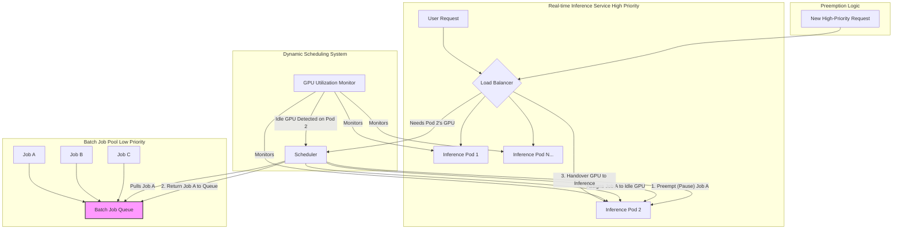

SLUG: idle-gpu-recycling-scheduling-strategy

LLM 기반 AI 서비스를 운영할 때 가장 큰 비용은 GPU 인프라에서 발생합니다. 특히 실시간 채팅이나 코드 자동완성 같은 추론(Inference) 서비스는 피크 타임의 요청량을 감당하기 위해 GPU 자원을 넉넉하게 할당하지만, 이는 곧 트래픽이 적은 시간에는 값비싼 GPU가 대부분 유휴 상태(idle)로 방치된다는 의미입니다. 업계 보고와 연구들은 데이터센터/온라인 추론 환경의 평균 GPU 활용률이 대체로 **15~35% 수준**에 그친다고 지적합니다 — 작은 배치 크기, SLO를 맞추기 위한 과다 프로비저닝, 요청 사이의 idle gap 등이 겹친 결과입니다. 단순한 산수로도 시간당 \$3짜리 GPU를 20% 활용률로 돌리면 비용의 80%가 노는 하드웨어에 지불됩니다. 단순히 GPU를 더 추가하는 방식은 지속 가능하지 않으며, 근본적인 해결책은 유휴 상태의 GPU를 한 순간도 낭비하지 않고 다른 작업에 재활용하는 지능적인 스케줄링에 있습니다.

> 활용률 수치는 환경마다 편차가 크다. 연속 배칭(continuous batching) 같은 기법은 같은 추론 워크로드의 활용률을 22% → 68% 수준까지 끌어올린 사례가 보고되며, 이 문서가 다루는 "유휴 회수" 스케줄링은 그 위에 얹는 또 다른 레버다. (참고: arXiv 2205.11913 "Deep Learning Workload Scheduling in GPU Datacenters", arXiv 2306.03622 "Torpor")

## 문제의 핵심: 실시간 추론과 배치 작업의 불일치

AI 서비스의 GPU 워크로드는 크게 두 가지로 나뉩니다.

1.  **실시간 추론 (Real-time Inference)**: 사용자의 요청에 즉시 응답해야 하므로 **낮은 지연 시간(Low Latency)**이 절대적으로 중요합니다. 이를 위해 요청을 받으면 즉시 처리할 수 있도록 GPU가 항상 대기해야 하며, 이는 낮은 평균 활용률의 주된 원인이 됩니다.
2.  **배치 작업 (Batch Jobs)**: 대규모 데이터셋 학습, 모델 파인튜닝, 로그 분석 등 즉각적인 응답이 필요 없는 작업들입니다. 이들은 **높은 처리량(High Throughput)**이 중요하며, 시작 시간이 조금 지연되거나 중간에 잠시 중단되어도 괜찮습니다.

기존의 방식은 이 두 워크로드를 별도의 GPU 클러스터에서 격리하여 운영했습니다. 이로 인해 추론 클러스터는 대부분 유휴 상태이고, 배치 클러스터는 작업이 몰릴 때 자원이 부족해지는 비효율이 발생합니다.

## 해결책: 선점형 동적 스케줄링

이 문제의 해결책은 두 워크로드를 하나의 통합된 GPU 풀에서 실행하고, 우선순위에 따라 자원을 동적으로 할당하는 것입니다. 핵심 아이디어는 **"실시간 추론 서비스가 사용하지 않는 유휴 GPU 자원을 회수하여 우선순위가 낮은 배치 작업을 처리하는 데 사용한다"**는 것입니다. 이 시스템의 워크플로우는 다음과 같습니다.

### 시스템의 주요 구성 요소

1.  **GPU 사용률 모니터 (GPU Utilization Monitor)**: NVIDIA DCGM(Data Center GPU Manager) 같은 도구로 각 GPU의 SM 점유율, 메모리 사용량, 전력 소모량을 지속적으로 추적합니다. 주의할 함정 하나: `nvidia-smi`의 "GPU-Util"은 *지난 샘플 구간에 커널이 한 번이라도 돌았는지*만 나타내는 거친 지표라서, 실제로 SM이 얼마나 일하는지를 과대평가하기 쉽습니다. 그래서 회수 판단은 `nvidia-smi` 단일 수치가 아니라 DCGM의 `DCGM_FI_PROF_SM_ACTIVE`(SM이 실제로 활성인 비율)와 메모리 여유를 함께 보고, 짧은 스파이크에 휘둘리지 않도록 수 초~수십 초 윈도우의 이동 평균으로 "유휴"를 정의합니다.
2.  **작업 큐 (Job Queue)**: 우선순위가 낮은 배치 작업들을 대기시키는 큐입니다. 단순 FIFO 외에도, 선점 비용을 줄이려면 (a) 체크포인트가 싼/잦은 작업과 비싼 작업을 분리하거나 (b) 예상 잔여 시간이 짧은 작업을 우선 배치(SRTF 유사)해 idle 윈도우 안에 통째로 끝내는 식의 큐 정책이 유효합니다.
3.  **동적 스케줄러 (Dynamic Scheduler)**: 시스템의 두뇌입니다. 유휴 GPU가 감지되면 작업 큐에서 가장 적절한 배치 작업을 가져와 해당 GPU에 할당합니다. Kubernetes 환경이라면 배치 작업에 낮은 `PriorityClass`를 부여하고, 추론 Pod에 높은 우선순위를 줘서 스케줄러의 **preemption** 기본 동작으로 회수를 구현하는 것이 흔한 출발점입니다(다만 K8s 기본 선점은 Pod *축출*이라 in-flight 상태 보존은 애플리케이션 레벨 체크포인팅이 별도로 책임져야 합니다).
4.  **선점 및 상태 저장 (Preemption & Checkpointing)**: 가장 중요하고 기술적으로 어려운 부분입니다. 배치 작업이 실행되던 GPU에 높은 우선순위의 추론 요청이 들어오면, 스케줄러는 즉시 배치 작업을 **선점(preempt)**합니다. 이때 진행 중이던 작업 상태(모델 가중치, 옵티마이저 상태, 학습 step 카운터 등)를 GCS나 S3 같은 영구 스토리지에 **체크포인트(checkpoint)**로 저장하고, GPU를 추론 작업에 즉시 양보합니다. 선점되었던 작업은 다시 큐로 돌아가 다른 유휴 GPU를 기다리거나, 추론 작업이 끝난 뒤 원래 GPU에서 체크포인트부터 재개됩니다. 실패 모드 주의: 체크포인트 쓰기 자체가 수십 초~수 분 걸릴 수 있어서, "선점 신호 → 양보 완료"까지의 지연이 추론 SLO를 깨면 본말전도입니다. 그래서 (a) 체크포인트 주기를 미리 자주 찍어두고 선점 시엔 "마지막 step만" 저장하거나, (b) 추론에 즉시 양보할 수 있는 여분 GPU 한 장을 hot-standby로 남겨 양보 지연을 흡수하는 식의 완충 설계가 필요합니다.

### Swift/iOS 개발자 관점에서의 연관성

이러한 백엔드 최적화는 iOS 앱 개발에 직접적인 영향을 주지는 않지만, 시니어 개발자로서 시스템 전체를 이해하는 데 중요합니다. 예를 들어, `aidy-ios` 프로젝트에서 사용자가 작성한 대규모 코드베이스 전체의 기술 부채를 분석하는 기능을 추가한다고 가정해 봅시다. 이 작업은 실시간으로 결과를 보여줄 필요가 없으므로 완벽한 배치 작업 후보입니다.

사용자가 앱에서 "백그라운드 분석 시작" 버튼을 누르면, 백엔드는 이 요청을 우선순위가 낮은 배치 작업으로 큐에 넣습니다. 그러면 이 작업은 낮 동안 실시간 코드 생성 요청을 처리하던 GPU가 밤이 되어 유휴 상태가 되었을 때 실행됩니다. 이를 통해 별도의 분석용 GPU 서버를 두지 않고도 비용 효율적으로 기능을 제공할 수 있습니다.

## 스케줄링 전략 비교

| 전략 | 장점 | 단점 | 적합한 환경 |
| :--- | :--- | :--- | :--- |
| **정적 파티셔닝** | 구현이 간단하고 성능 예측이 쉬움. 워크로드 간 간섭이 없음. | 자원 활용률이 매우 낮고 낭비가 심함. | 부하 변동이 거의 없고 예측 가능한 고정된 워크로드를 처리할 때 |
| **서버리스 GPU** | 사용한 만큼만 지불. 유휴 비용 없음. | 콜드 스타트 지연 시간이 길 수 있음. 특정 클라우드 플랫폼에 종속될 수 있음. | 간헐적이고 예측 불가능한 스파이크성 워크로드에 적합 |
| **선점형 동적 스케줄링** | 통합된 자원 풀로 유휴 시간을 배치 작업으로 메워 **활용률을 크게 끌어올림**. 비용 효율성 높음. | 구현이 복잡함. 선점/복구 오버헤드 발생. 양보 지연이 SLO를 위협할 수 있음. | 실시간 추론과 배치 작업이 혼재된 대부분의 현대적인 AI 서비스 |

## 트레이드오프와 한계

이 접근법이 만능은 아닙니다. 가장 큰 한계는 **선점 오버헤드**입니다. 작업의 상태를 저장하고 복원하는 데는 시간과 컴퓨팅 자원이 소모됩니다. 만약 배치 작업이 너무 자주 선점되면, 실제 작업 진행보다 상태 저장/복원에 더 많은 시간을 소모하여 오히려 효율이 떨어질 수 있습니다. 따라서 이 전략은 수 분에서 수 시간 단위로 실행되는, 어느 정도 긴 배치 작업에 더 적합합니다.

또한, 시스템 구현의 복잡도가 매우 높습니다. 안정적인 모니터링, 정교한 스케줄링 로직, 그리고 어떠한 상황에서도 데이터 유실 없이 작업을 일시 중지하고 재개할 수 있는 견고한 체크포인팅 메커니즘이 반드시 필요합니다.

## 자기 점검

-   실시간 추론 서비스에서 GPU가 유휴 상태로 남는 근본적인 이유는 무엇인가?
-   '선점(Preemption)' 메커니즘이 동적 스케줄링 시스템에서 왜 필수적이며, 이로 인해 발생하는 트레이드오프는 무엇인가?
-   정적 파티셔닝과 동적 스케줄링 중 어떤 상황에서 전자를 선택하는 것이 더 합리적일 수 있는가?
-   당신이 만들고 있는 iOS 앱(또는 가상의 앱)에서, 실시간 처리가 필요 없는 AI 기능을 백엔드의 유휴 GPU 배치 잡으로 보낼 수 있는 사례를 한 가지 이상 구상해보라.