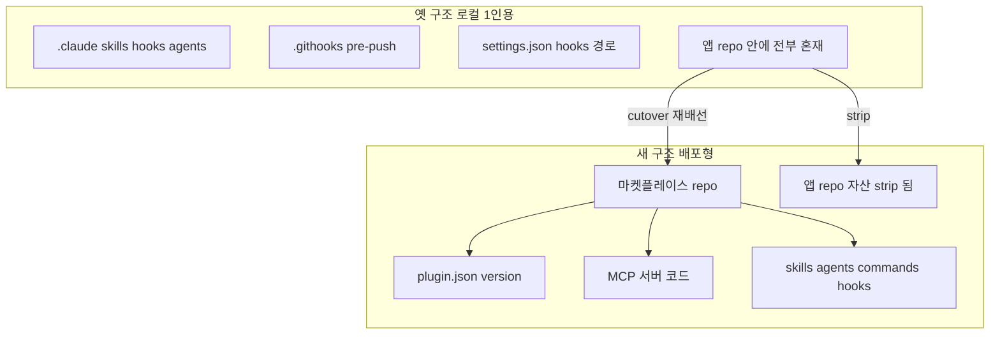

로컬 `.claude/` 디렉토리에 쌓아 올린 하네스는 1인 도그푸딩에는 거의 완벽하다. 빠르게 hook을 추가하고, agent 정의를 고치고, `settings.json`을 손보고, 즉시 다음 세션에서 효과를 본다. 피드백 루프가 초 단위라 하네스 자체를 빠르게 진화시킬 수 있다. 문제는 이 모든 게 **한 머신의 스냅샷**이라는 점이다. 동료가 같은 RIBs/ReactorKit iOS 개발 하네스를 쓰고 싶어 하는 순간, 로컬 `.claude/`는 무너진다. 누가 어떤 버전을 쓰는지 알 수 없고, 한 사람이 hook을 고쳐도 다른 사람 머신엔 전파되지 않으며, "내 머신에선 되는데"가 하네스 레이어에서까지 발생한다.

이 글은 1인용 로컬 `.claude/` 하네스를 팀이 설치·업데이트할 수 있는 **버전 관리되는 배포 아티팩트**로 외부화하는 full cutover의 구조와, 그 과정에서 실제로 밟은 함정들을 정리한다. 예시 앱은 `moneyflow`, 플러그인 이름은 `team-harness`, agent 네임스페이스는 `team-harness:`로 일반화한다.

## 왜 로컬 .claude가 한계인가

로컬 `.claude/`의 본질적 한계는 세 가지다.

1. **버전 일관성 부재.** A의 머신에는 `git-guardrails` hook의 v3가, B의 머신에는 v1이 있을 수 있고 누구도 이 차이를 모른다. 하네스가 행동을 강제하는 레이어인데, 그 행동 정의가 머신마다 다르면 "팀 표준"이라는 말 자체가 거짓이 된다.
2. **배포 메커니즘 부재.** 새 skill을 만들어도 동료에게 전파할 방법이 `이 파일 복사해서 너 .claude에 넣어`뿐이다. 이건 배포가 아니라 수작업 전염이다. 롤백도, 업데이트 알림도, 설치 검증도 없다.
3. **소유권·출처 혼탁.** 앱 repo 안에 `.claude/`가 섞여 있으면, 하네스 변경과 제품 변경이 같은 커밋 히스토리에 뒤엉킨다. 하네스의 ADR과 제품의 ADR이 구분되지 않고, "이 hook 왜 생겼지"를 추적하려면 앱 커밋 로그를 헤집어야 한다.

핵심 통찰은 이것이다: **하네스를 소프트웨어처럼 다루려면, 하네스는 버전 번호를 가진 배포 아티팩트여야 한다.** 로컬 `.claude/`는 아티팩트가 아니라 작업 디렉토리의 부산물이다.

## 플러그인 아키텍처

Claude Code 플러그인 모델은 이 외부화를 위한 표준 그릇을 제공한다. 구조는 다음과 같다.

- **마켓플레이스 repo** — 플러그인을 호스팅하는 별도 git repo. 앱 repo와 완전히 분리된다. 이 repo가 하네스의 single source of truth가 된다.
- **`plugin.json`** — 플러그인 매니페스트. 이름, **version**, 포함하는 skills/agents/commands/hooks, 그리고 MCP 서버 정의를 선언한다. 여기 적힌 version이 곧 하네스 버전이다.
- **MCP 서버** — 메모리 검색, 하네스 상태 조회, harness pull 같은 *동적 기능*을 제공하는 서버. 정적 자산(skill 마크다운)으로 표현 불가능한 stateful·계산형 기능을 담당한다. 이 서버 코드는 마켓플레이스 repo 안에 산다.
- **자산(assets)** — skills/`*.md`, agents/`*.md`, commands/`*.md`, hook 스크립트. 전부 마켓플레이스 repo로 이주한다.

agent는 `team-harness:` 네임스페이스로 prefix되어, 로컬 ad-hoc agent와 충돌하지 않고 출처가 명확해진다. 동료는 `/plugin install team-harness`로 한 번에 전체 하네스를 받고, version으로 무엇을 받았는지 정확히 안다.

## Cutover 4단계

cutover의 본질은 파일을 새 repo로 복사하는 게 아니다. **자산을 가리키던 모든 경로 참조를 재배선하는 것**이다. 다음 순서를 지킨다. 순서가 중요한 이유는 각 단계가 다음 단계의 전제를 깨지 않게 하기 위해서다.

1. **`.githooks` 제거.** 앱 repo의 `core.hooksPath`로 걸려 있던 로컬 git hook을 먼저 떼어낸다. 이걸 안 떼면 plugin이 제공하는 hook과 로컬 githook이 이중으로 발화하거나, 옛 hook이 새 hook을 가린다. push가 거부되는 함정이 여기서 자주 난다.
2. **`.claude` strip + symlink.** 앱 repo의 `.claude/` 안 하네스 자산을 제거하고, 필요하면 플러그인 설치 위치로의 symlink만 남긴다. 자산 자체는 마켓플레이스 repo로 이주했으므로 앱 repo에는 *참조*만 남아야 한다. 이 단계에서 "동작은 하는데 옛 파일도 남아 있는" 어중간한 상태를 만들지 않는 게 핵심이다.
3. **dotfiles 이관.** 머신 전역 설정(개인 dotfiles)에 있던 하네스 흔적을 plugin 설치가 관리하는 위치로 옮긴다. 개인 머신마다 다르게 손댄 부분이 cutover 후에도 살아남아 stale source가 되는 걸 막는다.
4. **`settings.json` hooks 제거.** 마지막으로 `settings.json`에 박혀 있던 hook 경로 참조를 제거한다. plugin이 자체 hook을 SessionStart 등으로 와이어링하므로, `settings.json`에 옛 경로가 남으면 "파일 없음" 에러나 이중 발화가 난다. 이걸 가장 마지막에 하는 이유는, 앞 단계가 끝나기 전에 settings hook을 떼면 검증 중 하네스가 비무장 상태가 되기 때문이다.

각 단계가 "파일을 옮긴다"가 아니라 "이 자산을 누가 가리키고 있었는지 찾아서 그 참조를 끊거나 새 위치로 다시 잇는다"임에 주목하라. cutover는 grep으로 옛 경로를 전수 수색하는 작업에 가깝다.

## additive PASS여도 strip 검증은 별개

cutover에서 가장 흔하게 침묵 실패하는 지점이 여기다. **"새 위치에서 동작한다"(additive PASS)와 "옛 위치가 깨끗이 제거됐다"(strip PASS)는 독립된 두 명제**다. 둘 다 따로 검증해야 한다.

전형적 실패 모드: plugin을 설치하고 `/plugin install team-harness` 후 새 skill이 잘 뜬다. additive 검증 통과. 그런데 앱 repo `.claude/`에 옛 skill 마크다운이 그대로 남아 있다. 두 소스가 공존하면 **어느 쪽이 실제 로드되는지 비결정적**이 된다. 로컬 자산이 우선 로드되면, 마켓플레이스에서 아무리 skill을 고쳐도 변경이 반영 안 되는 "유령 회귀"가 난다. 더 나쁜 건 이게 에러를 내지 않는다는 점이다. 그냥 옛 버전이 조용히 이긴다.

그래서 검증은 두 축으로 나눈다.

- **additive 검증** — 새 plugin이 설치된 상태에서 skill/agent/hook/MCP가 전부 기대대로 발화하는가.
- **strip 검증** — 앱 repo와 dotfiles에서 옛 자산·옛 경로 참조가 *0건*인가. `grep`으로 옛 경로 패턴, 옛 hook 스크립트 이름, `.githooks` 잔재를 전수 확인한다.

이 strip/additive 분리는 cutover 함정의 핵심 주제이며, [경로 참조 정합성의 네 가지 함정](/wiki/harness-engineering/plugin-cutover-four-traps-path-reference-integrity)에서 더 세분화해 다룬다.

## 버전 bump 규율

플러그인이 배포 아티팩트가 된 순간, **자산을 한 글자라도 고쳤으면 `plugin.json`의 version을 bump해야 한다**는 규율이 강제된다. 이걸 빼먹으면 가장 음험한 stale cache 버그가 난다.

메커니즘은 이렇다. Claude Code는 설치된 plugin을 version 기준으로 캐싱한다. version이 그대로면 "이미 최신"으로 간주해 자산을 다시 읽지 않는다. 그래서 hook 스크립트를 고쳐 놓고 version을 안 올리면, 동료의 머신은 물론 내 머신조차 `/plugin update`를 해도 **옛 자산을 계속 들고 있는다**. 코드는 바뀌었는데 행동은 안 바뀌는, 디버깅하기 최악의 상태다.

실무 규율로 박제할 것:

- 자산(skill/agent/command/hook/MCP/plugin.json 자체) 변경 = **반드시** version bump. 예외 없음.
- 변경과 bump를 **같은 커밋**에 묶는다. "고친 다음 나중에 bump"는 그 사이 누군가 설치하면 stale을 박는다.
- bump를 잊는 걸 사람 기억에 맡기지 말고, 자산 디렉토리 변경 시 version 변경 여부를 검사하는 pre-push 게이트로 escalate한다(메모리 룰이 한 번이라도 깨지면 행동 레벨 가드로 올린다는 원칙과 동일).

## 팀 롤아웃

cutover가 끝나면 동료에게 전파하는 단계가 남는다. 두 메커니즘으로 마찰을 0에 가깝게 만든다.

- **`/plugin update` 배너.** 새 version을 push하면 동료가 다음 세션에서 업데이트 가능 배너를 본다. 강제는 아니지만, version 차이가 가시화돼 "나만 옛 버전" 상태가 오래 가지 않는다. 이게 로컬 `.claude/` 시대엔 불가능했던, 버전 일관성의 가시성이다.
- **SessionStart 자동 와이어링.** plugin의 hook이 SessionStart에서 자동으로 환경을 세팅하므로, 동료는 별도 수작업 설정 없이 설치만 하면 하네스가 완전체로 켜진다. 옛 시대처럼 `settings.json`을 손으로 편집하라고 안내할 필요가 없다.

이 두 가지가 합쳐지면 "하네스 업그레이드"가 제품 dependency 업그레이드와 같은 1급 시민 작업이 된다. 누가 무엇을 쓰는지 추적되고, 업데이트 경로가 표준화되며, 롤백도 version으로 가능하다. 로컬 vs 관리형 하네스의 트레이드오프 전반은 [Managed vs Local Agent Harnesses](/wiki/harness-engineering/managed-vs-local-agent-harnesses)에서 다룬다. cutover를 세션 도중에 하면 발생하는 stale registry 문제는 [Mid-Session Cutover와 Stale Agent Registry](/wiki/harness-engineering/mid-session-cutover-stale-agent-registry)를 참조하라.

## 전이 체크리스트

다른 팀·다른 프로젝트에 이 패턴을 옮길 때 점검할 항목:

- [ ] 하네스 자산을 호스팅할 **별도 마켓플레이스 repo**가 있는가 (앱 repo와 분리).
- [ ] `plugin.json`에 version이 있고, 자산 변경 시 bump하는 규율이 **자동 게이트**로 강제되는가.
- [ ] 정적 자산으로 표현 못 하는 stateful 기능을 **MCP 서버**로 분리했는가.
- [ ] cutover 4단계를 **순서대로** 밟았는가 (.githooks → .claude strip+symlink → dotfiles → settings.json hooks).
- [ ] **additive 검증**과 **strip 검증**을 *따로* 통과시켰는가. strip은 grep 0건으로 확인했는가.
- [ ] agent에 **네임스페이스 prefix**가 있어 로컬 agent와 충돌하지 않는가.
- [ ] 팀 롤아웃에 `/plugin update` 가시성과 SessionStart 자동 와이어링이 있는가.

## 자기 점검

- 지금 내 `.claude/` 자산 중, 동료에게 전파할 방법이 "파일 복사해 줘"뿐인 것은 무엇인가? 그것들이 버전 일관성을 보장하지 못해 생길 수 있는 가장 나쁜 시나리오는?
- 내가 마지막으로 hook이나 skill을 고쳤을 때 version을 bump했는가? 안 했다면, 지금 캐시에 옛 버전이 살아 있을 가능성은?
- 내 cutover 검증은 "새 위치에서 된다"만 확인했는가, 아니면 "옛 위치가 0건"임도 grep으로 확인했는가?
- 하네스 자산을 정적 마크다운으로 둘 것과 MCP 서버로 외부화할 것을, 나는 어떤 기준으로 가르고 있는가?
