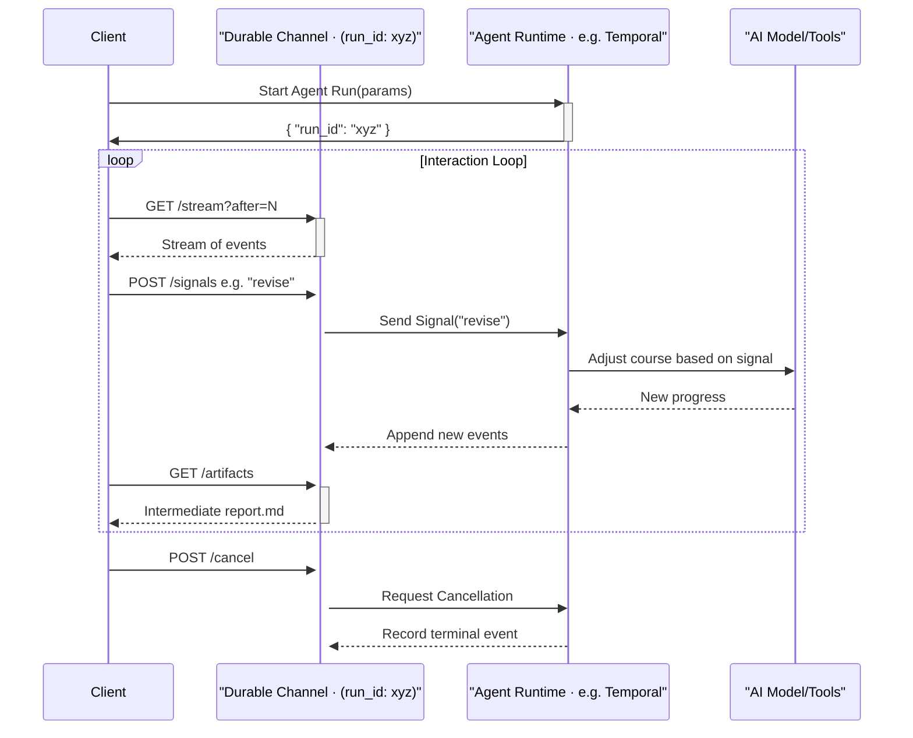

> 이 엔트리는 Blake Crosley의 [Long-Running AI Agents Need Durable Channels](https://blakecrosley.com/blog/long-running-ai-agents-durable-channels)을 정독하고 핵심을 추출한 것이다.

이 엔트리는 Blake Crosley의 [Long-Running AI Agents Need Durable Channels](https://blakewrites.com/blog/long-running-ai-agents-need-durable-channels)를 정독하고 핵심을 추출한 것이다.

### 왜 중요한가: Request-Response 모델의 한계

기존 웹의 Request-Response 모델은 AI 에이전트와 같은 장기 실행(long-running) 작업에 부적합하다. 일반적인 요청은 엔드포인트, 응답, 타임아웃으로 구성되지만, 진지한 에이전트 작업은 수 분에서 수 시간에 걸친 실행 시간, 이벤트 히스토리, 중간 결과물, 사용자 개입, 모델/툴 상태, 취소 규칙 등 훨씬 복잡한 상호작용을 요구한다.

Blake Crosley는 이러한 한계를 3가지로 요약한다:

1.  **긴 실행 시간**: 작업이 수 분에서 수 시간까지 이어져 일반적인 HTTP 타임아웃을 초과한다.
2.  **복잡한 상태**: 단일 데이터베이스 레코드로 환원하기 어려운 프로세스 상태를 가진다.
3.  **양방향 제어**: 작업 완료 전 사용자가 진행 상황을 보고, 중단하고, 승인하고, 방향을 바꾸고, 취소하고, 재개하는 등의 '조종(steering)'이 필요하다.

단순히 "완료됐나?"를 묻는 폴링(polling) 방식은 타임아웃 문제를 해결할 뿐, 위와 같은 복잡한 상호작용 계약을 제공하지 못한다. OpenAI의 백그라운드 모드 문서가 폴링과 함께 취소, 스트림 재개 기능을 제공하는 것은 이미 기본적인 폴링을 넘어선 더 풍부한 실행 계약이 필요함을 시사한다.

### 핵심 패턴: Durable Channel

이 문제의 해법은 **Durable Channel (영속성 채널)** 이라는 새로운 추상화 객체다. 이는 "실행 중인 작업에 대한 안정적인 주소(stable address)"이자, 사용자와 제품이 살아있는 작업과 소통할 수 있게 해주는 통신 계약이다.

구현 기술은 워크플로우 엔진, 큐, 이벤트 테이블, WebSocket, Pub/Sub 등 다양할 수 있지만, 중요한 것은 제품 레벨의 '계약'이다. 최소한의 계약은 다음 9가지 요소를 포함해야 한다.

| 필드 또는 엔드포인트             | 목적                                                              |
| -------------------------------- | ----------------------------------------------------------------- |
| `run_id` 또는 `workflow_id`      | 작업에 대한 안정적인 주소                                         |
| `GET /runs/{id}`                 | 현재 상태, 소유자, 타임스탬프, 최종 상태, 요약 정보               |
| `GET /runs/{id}/events?after=N`  | 재연결 및 감사를 위한 순서가 있는 이벤트 히스토리                 |
| `GET /runs/{id}/stream?after=N`  | 알려진 커서로부터 실시간 업데이트를 재개                            |
| `POST /runs/{id}/signals`        | `approve`, `revise`, `pause` 등 타입이 지정된 조종(steering) 명령 |
| `POST /runs/{id}/cancel`         | 기록된 종료 이벤트와 함께 멱등성을 가진 취소 명령                 |
| `GET /runs/{id}/artifacts`       | Diff, 파일, 보고서, 스크린샷 등 작업의 증거                       |
| `checkpoint events`              | 사람이 읽을 수 있는 상태 (핸드오프 및 재개를 위함)                |
| `authorization checks`           | 실행 및 명령어 별 읽기, 스트림, 신호, 취소 등에 대한 권한 확인    |

이러한 구조는 Temporal의 워크플로우 실행 모델과 유사하다. Temporal은 이벤트 히스토리, 리플레이, 결정론적 워크플로우 코드, 외부 세계와의 상호작용(API, DB, LLM 호출)을 위한 Activity 개념을 제공하며, 이는 에이전트 작업에 자연스럽게 매핑된다.



이 다이어그램은 클라이언트가 `run_id`를 통해 Durable Channel과 어떻게 상호작용하는지 보여준다. 클라이언트는 더 이상 특정 워커 프로세스나 소켓에 종속되지 않고, 안정적인 주소를 통해 작업을 관찰하고 조종할 수 있다.

### 실전 적용: ai-study 프로젝트

`ai-study` 프로젝트의 "GitHub 레포지토리 분석 에이전트" 기능에 Durable Channel 패턴을 적용할 수 있다. 이 작업은 코드 클로닝, AST 파싱, LLM 분석 등 수 분 이상 소요될 수 있어 전형적인 장기 실행 작업이다.

1.  **작업 시작**: 사용자가 분석할 GitHub 레포지토리 URL을 제출하면, 백엔드는 Temporal 워크플로우를 시작하고 `run_id`를 포함하는 Durable Channel 주소를 즉시 반환한다.
2.  **진행 상황 스트리밍**: 프론트엔드는 `GET /runs/{run_id}/stream` 엔드포인트를 통해 "레포지토리 클로닝 중...", "파일 5/57 분석 중: `auth.py`", "주요 로직 패턴 발견" 과 같은 구조화된 이벤트를 실시간으로 스트리밍하여 사용자에게 보여준다.
3.  **중간 산출물 및 사용자 개입**: 에이전트가 "전체 클래스 다이어그램 초안"을 중간 산출물(`artifact`)로 생성하면 UI에 표시된다. 사용자는 이를 보고 "데이터베이스 모델 관련 클래스에 더 집중해줘"라는 피드백을 입력할 수 있다. 이 피드백은 `POST /runs/{run_id}/signals`를 통해 `focus_on_db_models`와 같은 타입 지정 신호로 전달된다.
4.  **안전한 재연결**: 사용자가 브라우저 탭을 닫았다가 나중에 다시 방문해도, `run_id`를 통해 동일한 작업에 재연결하여 마지막으로 본 이벤트 커서(`?after=N`) 이후의 진행 상황을 이어볼 수 있다.
5.  **최종 결과물 검토**: 작업이 완료되면 최종 분석 보고서가 `artifact`로 저장되고, `GET /runs/{id}` 상태가 `succeeded`로 변경된다. 사용자는 전체 이벤트 히스토리와 최종 보고서를 언제든지 검토할 수 있다.

아래는 클라이언트 측에서 TypeScript로 이 상호작용을 구현하는 가상 코드다.

```typescript
// Durable Channel 클라이언트 인터페이스
interface AgentRunChannel {
  runId: string;
  getState(): Promise<RunState>;
  getEvents(after?: number): Promise<RunEvent[]>;
  streamEvents(from: number, onEvent: (event: RunEvent) => void): () => void; // returns unsubscribe function
  sendSignal(type: 'revise' | 'approve' | 'pause', payload: any): Promise<void>;
  cancel(): Promise<void>;
}

// 사용 예시
async function interactWithRepoAnalyzer(runId: string) {
  const channel: AgentRunChannel = getChannelClient(runId);

  // 진행 상황 실시간 스트리밍
  const unsubscribe = channel.streamEvents(0, (event) => {
    console.log(`[${event.type}] ${event.timestamp}:`, event.payload);
    updateUI(event);
  });

  // 10초 후 사용자가 수정 신호를 보냄
  setTimeout(async () => {
    console.log("사용자 개입: 데이터 모델에 집중하도록 신호 전송");
    await channel.sendSignal('revise', {
      instruction: "Focus more on classes that interact with SQLAlchemy.",
    });
  }, 10000);
}

// Durable Channel 패턴은 Temporal(실행), Cloudflare Durable Objects(주소 지정),
// Anthropic의 아티팩트 기반 협업 아이디어를 통합하여
// 장기 실행 AI 에이전트를 위한 견고한 제품 인터페이스를 구축하는 핵심 열쇠다.
```