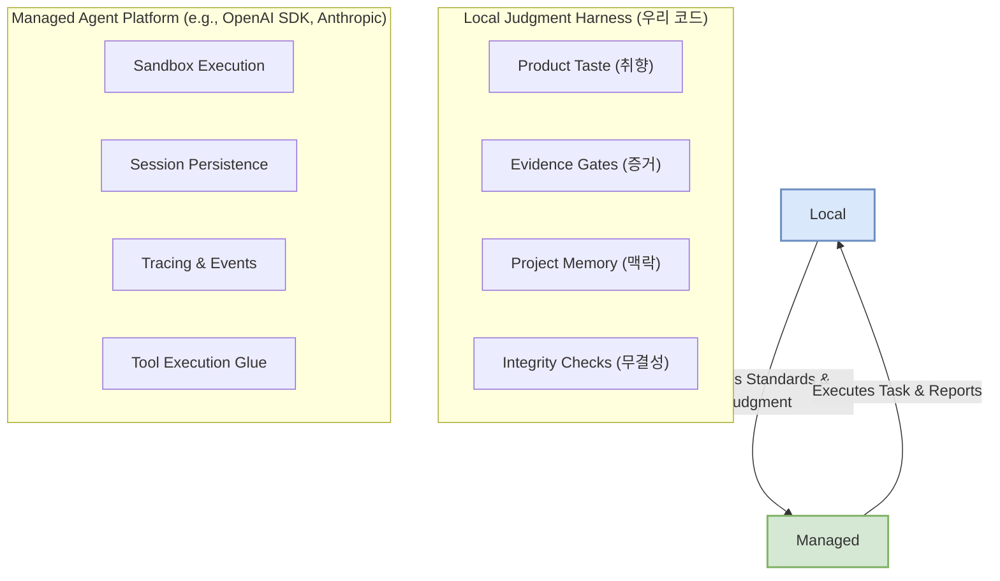

> 이 엔트리는 Blake Crosley의 [Managed Agents vs Local Agent Harnesses: What to Keep](https://blakecrosley.com/blog/managed-agents-vs-local-ai-agent-harnesses)을 정독하고 핵심을 추출한 것이다.

이 엔트리는 Blake Crosley의 [Managed Agents vs Local Agent Harnesses: What to Keep](https://blakecrosley.com/blog/managed-agents-vs-local-agent-harnesses/)을 정독하고 핵심을 추출한 것이다.

### 왜 중요한가

Anthropic의 Managed Agents와 OpenAI의 Agents SDK가 등장하면서, 에이전트 개발의 패러다임이 바뀌고 있다. 과거에는 개발팀의 `private script folder`에 존재하던 세션, 샌드박스, 트레이싱, 메모리 등 런타임 인프라를 이제 모델 제공사가 직접 제품화하여 제공한다.

이 변화는 개발자가 "바퀴를 재발명"하는 데 쓰던 시간을 줄여주지만, 동시에 중대한 아키텍처 결정의 필요성을 제기한다. 잘못된 마이그레이션은 두 가지다.
1.  **섣부른 폐기**: Managed 인프라가 나왔다는 이유만으로 기존의 모든 로컬 하네스를 삭제하는 것.
2.  **맹목적 보존**: 과거에 유용했다는 이유로 모든 로컬 커맨드, 훅, 프롬프트를 그대로 유지하는 것.

핵심은 우리 제품만의 **기준(standards)**과 **취향(taste)**을 담은 코드는 로컬에 남기고, 범용적인 **기계 운영(operate the machine)** 코드는 Managed 인프라로 이전하는 것이다. 이 분리 원칙을 이해하는 것이 미래의 에이전트 아키텍처를 결정하는 열쇠다.

### 핵심 패턴: 런타임(Runtime)과 판단(Judgment)의 분리

대부분의 로컬 에이전트 하네스는 '기계 운영'과 '품질 판단'이라는 두 가지 역할을 혼합하고 있다. 성공적인 마이그레이션은 이 둘을 명확히 분리하는 데서 시작한다.



#### 1. Managed 플랫폼으로 이전할 대상: 런타임(Runtime)

런타임은 에이전트를 '어떻게' 실행할지에 대한 표준화된 작업이다. 이는 우리 제품의 고유한 가치를 담고 있지 않으므로, 보안과 안정성이 검증된 플랫폼에 위임하는 것이 효율적이다.

-   **샌드박스 설정**: 격리, 네트워크 규칙, 프로바이더 어댑터 등.
-   **세션 지속성**: 컨텍스트 윈도우나 워커 실패를 넘어 상태를 유지. (OpenAI SDK `SessionStore`)
-   **이벤트 스트림 및 웹훅**: 비동기 작업 상태를 폴링 없이 관찰.
-   **트레이싱**: 모델 호출, 툴 사용, 가드레일, 핸드오프에 대한 구조화된 스팬. (OpenAI Tracing)
-   **툴 실행 접착제(Glue)**: 깨지기 쉬운 프롬프트 규칙 대신 안정적인 인터페이스(MCP, SDK Tool Adapters) 사용.
-   **다중 에이전트 팬아웃**: 가시성, 입력 필터, 명확한 핸드오프 계약. (OpenAI SDK Handoffs)

Anthropic의 `Outcomes` 기능은 이 트렌드의 미래를 보여준다. 개발자가 평가 기준(rubric)을 정의하면, Managed 하네스가 별도의 평가자(grader)를 프로비저닝하여 에이전트가 그 피드백을 바탕으로 반복 작업을 수행한다. 이는 로컬의 '기준'을 런타임의 '슬롯'에 주입하는 패턴이다.

#### 2. 로컬 하네스에 남겨야 할 대상: 판단(Judgment)

판단은 '좋은 결과물이란 무엇인가'에 대한 정의다. 이는 제품, 팀, 사용자에 따라 달라지므로 반드시 로컬에 남아있어야 한다. 플랫폼은 루프를 더 잘 돌릴 수 있지만, 우리의 취향이 무엇인지 결정할 수는 없다.

-   **제품 취향 (Product Taste)**: 무의미하고, 일반적이며, 품위 없는 결과물을 거부하는 규칙.
-   **증거 게이트 (Evidence Gates)**: 현재 세션의 증거, 사용자 경로 검증, 근본 원인 분석 등을 요구하는 규칙.
-   **공개 저작물 무결성**: 인용 규칙, 출처 등급, 개인정보 경계, SEO/AIO 검사 등 게시 직전의 최종 관문.
-   **프로젝트 메모리**: 팀의 핵심 원칙, 스타일 결정, 알려진 위험 요소 등 팀이 직접 검토하고 관리해야 하는 자산.
-   **소스 인텔리전스**: 14개의 좋은 소스를 찾았더라도, 지금 할 일이 게시물 작성이 아니라 모니터링, 가이드 유지보수, 비공개 메모 작성임을 판단하는 편집 라우팅 계층.
-   **프로모션 정책**: 특정 기능(skill)을 명시적 호출로만 시작하게 하거나, 훅(hook)을 섀도우 모드로 운영하는 등 점진적 배포 전략.

### 실전 적용: ai-study 위키 엔트리 생성 에이전트

`ai-study` 프로젝트에서 외부 기술 블로그를 요약해 위키 엔트리 초안을 만드는 에이전트를 개발한다고 가정해보자.

**이전 대상 (OpenAI Agents SDK 활용):**
-   **샌드박스 실행**: `requests` 라이브러리로 블로그 HTML을 가져오고 파싱하는 코드 실행.
-   **세션 관리**: 긴 글을 요약하기 위해 여러 번의 LLM 호출이 필요할 때, 중간 요약본과 진행 상태를 세션에 저장.
-   **트레이싱**: "블로그 Fetch → 섹션별 요약 → 전체 초안 생성 → 최종 검토" 각 단계의 LLM 입출력과 툴 호출을 기록하여 디버깅.

**로컬에 남길 대상 (ai-study 자체 Judgment Harness):**
-   **증거 게이트**: "모든 주장은 원문이 인용한 외부 권위 자료(예: 논문, 공식 문서)를 명시해야 한다."는 규칙을 강제.
-   **제품 취향**: "결과물은 반드시 '왜 중요한가 → 핵심 패턴 → 실전 적용' 구조를 따라야 한다."는 `ai-study`만의 스타일 가이드 적용.
-   **무결성 검사**: "원문의 코드 예제가 있다면, TypeScript 또는 Swift로 변환하거나 최소한 타입을 명시해야 한다."는 내부 정책 시행.

이 분리 원칙은 TypeScript 코드로 다음과 같이 표현할 수 있다.

```typescript
import { managedAgentSDK } from "./openai-agents-sdk-mock";
import { type AiStudyEntry } from "./types";

// --- Local Judgment Harness ---
// 이것이 우리가 유지하고 발전시켜야 할 '판단' 코드입니다.
class AiStudyJudgmentHarness {
  // 1. 제품 취향(Taste) 검사
  static hasRequiredStructure(text: string): boolean {
    return text.includes("### 왜 중요한가") &&
           text.includes("### 핵심 패턴") &&
           text.includes("### 실전 적용");
  }

  // 2. 증거 게이트(Evidence) 검사
  static citesPrimarySources(text: string, originalSources: string[]): boolean {
    if (originalSources.length === 0) return true;
    return originalSources.every(source => text.includes(source));
  }
  
  // 3. 무결성(Integrity) 검사
  static meetsCodeQualityStandard(text: string): boolean {
    // TypeScript 또는 Swift 코드 블록이 있는지 간단히 확인
    return text.includes("```typescript") || text.includes("```swift");
  }
}

// --- Application Logic ---
async function createWikiEntryFromUrl(url: string) {
  console.log(`[Runtime] Managed 에이전트 실행 시작: ${url}`);

  // Managed 플랫폼이 런타임 작업을 처리합니다.
  // 샌드박스, 세션, 트레이싱은 SDK 내부에서 일어납니다.
  const draft = await managedAgentSDK.run({
    task: "주어진 URL의 블로그 글을 분석하고 ai-study 위키 초안을 생성해줘.",
    instructions: [
        "구조: '왜 중요한가', '핵심 패턴', '실전 적용'",
        "원문이 인용한 외부 링크를 본문에 포함시켜줘."
    ],
    files: [url],
  });

  console.log("[Judgment] 로컬 하네스에서 결과물 검증 시작...");

  // 우리만의 '판단' 기준을 통과해야만 최종 결과로 인정됩니다.
  const hasValidStructure = AiStudyJudgmentHarness.hasRequiredStructure(draft.content);
  // 이론적으로, 에이전트가 원문에서 인용한 소스 목록을 반환할 수 있습니다.
  const citesSources = AiStudyJudgmentHarness.citesPrimarySources(draft.content, draft.metadata.citedSources || []);

  if (hasValidStructure && citesSources) {
    console.log("[Judgment] 성공: 모든 기준을 통과했습니다. 게시 준비 완료.");
    return draft.content;
  } else {
    console.error(`[Judgment] 실패: 품질 기준 미달. Structure: ${hasValidStructure}, Cites: ${citesSources}`);
    // 재시도 요청 또는 수동 검토 플래그 지정
    throw new Error("Generated content did not meet quality standards.");
  }
}
```

이처럼, 에이전트 아키텍처를 설계할 때마다 각 컴포넌트에 대해 질문해야 한다. **"이것은 나의 기준을 담고 있는가, 아니면 단순히 기계를 작동시키는가?"** 이 질문에 대한 답이 당신의 코드가 머물러야 할 위치를 알려줄 것이다.