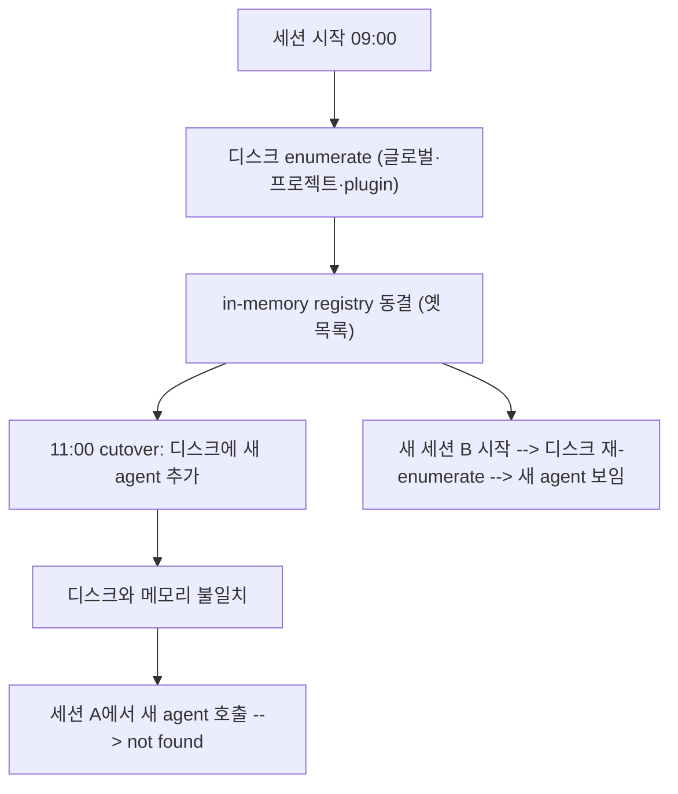

한 RIBs/ReactorKit iOS 개발 하네스를 로컬 `.claude/`에서 배포된 plugin(`team-harness`)으로 cutover하던 중, 같은 세션 안에서 `team-harness:` 네임스페이스의 custom agent를 호출하자 전부 "agent not found"가 떴다. 디스크에는 분명히 파일이 있었고, plugin.json도 올바랐다. 그런데도 런타임은 그 agent들을 모른다고 했다. 이건 디스크 문제가 아니라 **세션 수명주기(lifecycle) 문제**다. agent·skill registry는 세션 시작 시 1회 로드되며, 세션 중간의 하네스 변경은 현 세션 프로세스에 반영되지 않는다. 이 엔트리는 그 메커니즘과, 거기서 파생되는 위험한 안티패턴, 그리고 이를 배포 설계로 흡수하는 법을 박제한다.

## 증상: 세션 중 cutover → custom agent 전부 not found

전형적인 시퀀스는 이렇다. 세션 A를 09:00에 시작한다. 그 시점에 하네스는 로컬 `.claude/agents/*.md`, `.claude/commands/*.md`를 enumerate해서 사용 가능한 agent·skill 목록을 만든다. 11:00, 같은 세션 A 안에서 plugin cutover를 한다 — `/plugin update`를 돌리거나, 새 agent를 추가한 PR을 머지하거나, 로컬 `.claude/`를 배포된 plugin으로 교체한다. 디스크는 이제 새 구성이다.

그리고 같은 세션에서 `team-harness:ios-review` 같은 새 agent를 호출한다. 결과는:

```
Error: agent "team-harness:ios-review" not found.
Available agents: (cutover 이전의 옛 목록)
```

증상이 까다로운 이유는 **모든 1차 증거가 "정상"을 가리킨다**는 점이다.

- 파일이 디스크에 있다 (`ls`로 확인됨)
- plugin.json·frontmatter 문법이 맞다
- 다른 터미널에서 새 세션을 띄우면 같은 agent가 멀쩡히 보인다

마지막 항목이 결정적 단서다. 디스크가 같은데 세션 A에서만 안 보인다면, 문제는 파일이 아니라 **세션 A가 들고 있는 메모리상의 목록**이다.

## 메커니즘: registry는 세션 시작 시 1회 로드된다

agent·skill registry는 세션이 시작될 때 디스크(글로벌 `~/.claude/`, 프로젝트 `.claude/`, 설치된 plugin들)를 한 번 enumerate해서 in-memory 목록으로 굳힌다. 이 목록은 그 세션 동안 사실상 동결된 스냅샷이다. 매 tool 호출마다 디스크를 다시 스캔하지 않는다 — 그렇게 했다면 호출당 수십 개 파일을 다시 읽는 오버헤드가 생기고, 작업 도중 구성이 바뀌어 비결정적 동작이 나올 것이다. 동결은 성능과 일관성을 위한 의도적 설계다.



핵심은 **로드 시점이 세션 시작 단 한 번**이라는 것이다. 그래서:

- cutover 직전에 시작한 세션은 cutover 결과를 못 본다.
- 같은 cutover라도 그 뒤에 시작한 세션은 정상으로 본다.
- "디스크에 있는데 왜 안 보이냐"는 질문 자체가 잘못된 모델이다 — 런타임이 보는 건 디스크가 아니라 시작 시점의 스냅샷이다.

이 모델을 한 문장으로: **현 세션은 자신이 태어난 순간의 하네스를 산다.** 세션이 살아 있는 동안 하네스를 고쳐도, 그 세션의 현실은 바뀌지 않는다.

## 해결: resume/재시작으로 registry를 재로드한다

해법은 단순하고, 단순한 게 핵심이다. registry를 새로 읽게 하려면 세션을 재로드해야 한다.

1. **세션 재시작 (가장 확실)** — 세션을 종료하고 새로 시작한다. 시작 시점에 디스크를 다시 enumerate하므로 새 구성이 자동으로 반영된다. cutover 작업물·열린 파일이 없다면 이게 가장 깨끗하다.
2. **resume** — 작업 맥락을 유지한 채 세션을 재개해야 한다면 resume으로 registry를 다시 로드시킨다. 진행 중이던 컨텍스트를 잃지 않으면서 목록만 새로 읽을 수 있다.

판단 기준은 명확하다. cutover 도중 새 agent/skill을 *지금 당장* 써야 한다면 재로드가 유일한 정답이다. 그게 아니라 cutover만 마치고 다음 작업으로 넘어갈 거라면, 굳이 현 세션에서 재로드할 필요 없이 다음 세션이 자연히 새 구성을 본다.

여기서 흔한 착각 하나를 명시한다: **agent 파일을 한 번 더 저장(touch)하거나, plugin을 다시 설치하거나, CLAUDE.md를 건드린다고 현 세션의 registry가 갱신되지 않는다.** 그 어떤 디스크 조작도 시작 시점에 굳어진 in-memory 목록을 바꾸지 못한다. 재로드를 트리거하는 건 오직 세션 lifecycle 이벤트(시작·resume)뿐이다.

## 안티패턴: not found를 보고 추측·우회 → 옛 구성으로 오염

가장 비싼 실수는 "not found"를 진짜 부재로 오해하고 **우회 구현으로 도망가는 것**이다. 전형적인 잘못된 추론 체인:

1. `team-harness:ios-review` agent가 not found다.
2. (잘못된 결론) "agent가 아직 없구나 / 등록이 안 됐구나."
3. agent가 하려던 일을 인라인으로 직접 구현한다 — 옛 프롬프트·옛 규칙을 손으로 베껴서.
4. 작업은 *돌아가는 것처럼 보이지만*, 사실은 cutover로 폐기하려던 옛 구성을 현 세션에 다시 심은 셈이 된다.

이게 왜 치명적이냐면, **cutover의 목적 자체가 옛 구성에서 벗어나는 것**인데, 우회 구현이 바로 그 옛 구성을 부활시키기 때문이다. 새 plugin이 가진 개선된 규칙(예: 보안 체크 추가, 레이어 위반 룰 강화)을 의도와 정반대로 우회해버린다. 더 나쁜 건 이 오염이 **silent**라는 점이다 — 에러 없이 작동하므로, 다음 세션에서 새 agent를 정상적으로 쓰기 전까지 누구도 옛 구성이 끼어들었다는 걸 모른다.

올바른 반사 행동: **"custom agent가 갑자기 전부 not found" = registry stale 의심**. 단 하나만 not found면 오타·미존재일 수 있지만, 방금 cutover한 직후 **여러 개가 한꺼번에** not found라면 거의 확실히 stale registry다. 이때는 추측을 멈추고 재로드부터 한다. 우회 구현은 "지금 이 작업을 끝내야만 한다"는 압박이 만드는 함정이며, 그 압박이 클수록 30초짜리 재시작을 건너뛰고 더 비싼 오염을 택하게 된다.

## Frozen Snapshot 원칙과의 연결: 자가수정 하네스의 일관성 경계

이 함정은 우연이 아니라 **Frozen Snapshot 원칙의 직접적 따름정리**다. 그 원칙은 "활성 세션 중 CLAUDE.md를 수정하지 말라"고 말한다 — 세션 중 수정은 prompt 캐시를 무효화하고 오버헤드를 만들기 때문이다. agent/skill registry도 정확히 같은 종류의 동결된 스냅샷이며, 같은 이유로 같은 규칙이 적용된다.

자가수정 하네스(self-modifying harness) — 자기 자신의 agent·skill·룰을 작업 중에 고치는 하네스 — 에는 본질적인 **일관성 경계(consistency boundary)**가 있다: *세션 단위*다. 한 세션 안에서 하네스는 단일하고 동결된 정체성을 가진다. 그 정체성을 바꾸는 변경은 다음 세션이라는 경계 너머에서만 효력을 가진다. 이 경계가 없다면 작업 도중 자기 규칙이 바뀌어 같은 입력에 다른 행동을 하는 비결정적 시스템이 되고, 디버깅이 불가능해진다.

따라서 cutover·룰 변경·agent 추가 같은 **하네스 메타 작업**은 명시적으로 "이번 세션이 아니라 다음 세션부터"라는 멘탈 모델로 다뤄야 한다. 변경을 디스크에 commit하되, 그 효과를 현 세션에서 기대하지 않는다. 정 현 세션에서 써야 하면 세션 경계를 한 번 넘는다(재시작). 이건 제약이 아니라 일관성을 사는 대가다.

## 배포 설계: SessionStart 자동 와이어링으로 다음 세션부터 자동 적용

registry가 세션 시작 시 1회 로드된다는 사실은 함정이지만, **역이용하면 깨끗한 배포 메커니즘**이 된다. cutover한 새 구성을 "다음 세션부터 사람 개입 없이 자동 적용"되게 하려면, 와이어링을 SessionStart hook에 둔다.

설계 패턴:

- cutover 시 디스크만 바꾸고 끝내지 말고, **SessionStart hook에 신규 구성의 와이어링을 넣는다** (예: plugin 활성화 확인, 필요한 심볼릭 링크·환경 변수 셋업, install-sha drift 검사).
- 이렇게 하면 다음 세션이 시작될 때 hook이 1회 실행되어 새 구성이 자동으로 반영된다. 사용자가 "재설치" "재설정"을 기억할 필요가 없다.
- hook은 멱등(idempotent)이어야 한다 — 이미 와이어링됐으면 no-op. 그래야 매 세션 시작마다 안전하게 재실행된다.
- hook은 5초 이내로 끝나고, 성공은 silent·실패만 표면화해야 한다 (세션 시작 블로킹·컨텍스트 오염 방지).

이 설계의 묘미는 registry 로드 시점과 hook 실행 시점이 **둘 다 세션 시작**이라는 데 있다. 같은 lifecycle 이벤트에 묶이므로, hook이 와이어링한 구성을 그 세션의 registry가 곧바로 본다. 타이밍이 자연히 맞는다. cutover를 1회성 수동 작업으로 두지 말고, "디스크 변경 + SessionStart 와이어링"의 한 쌍으로 박제하면, 그 하네스를 쓰는 모든 사람·모든 세션이 다음 시작부터 자동으로 새 구성 위에서 동작한다.

## 자기 점검

1. 방금 cutover한 직후 custom agent 3개가 한꺼번에 "not found"로 뜬다. 디스크엔 파일이 다 있다. 무엇이 stale이고, 가장 먼저 할 행동은?
2. 같은 세션에서 새 agent가 안 보인다고 그 agent의 일을 인라인으로 베껴 구현하는 것이 왜 "silent o, 옛 구성 오염" 안티패턴인가? cutover의 원래 목적과 어떻게 충돌하는가?
3. "활성 세션 중 CLAUDE.md 수정 금지" 원칙과 "agent registry는 세션 시작 1회 로드" 사실은 같은 일관성 경계의 두 표현이다. 그 경계의 단위는 무엇이며, 그래서 하네스 메타 변경은 언제부터 효력을 갖는가?
4. cutover한 구성을 "다음 세션부터 자동 적용"되게 하려면 어디에 와이어링을 두어야 하며, 그 hook이 반드시 만족해야 할 두 가지 속성(멱등성·실행 시간/출력 규약)은 무엇인가?
