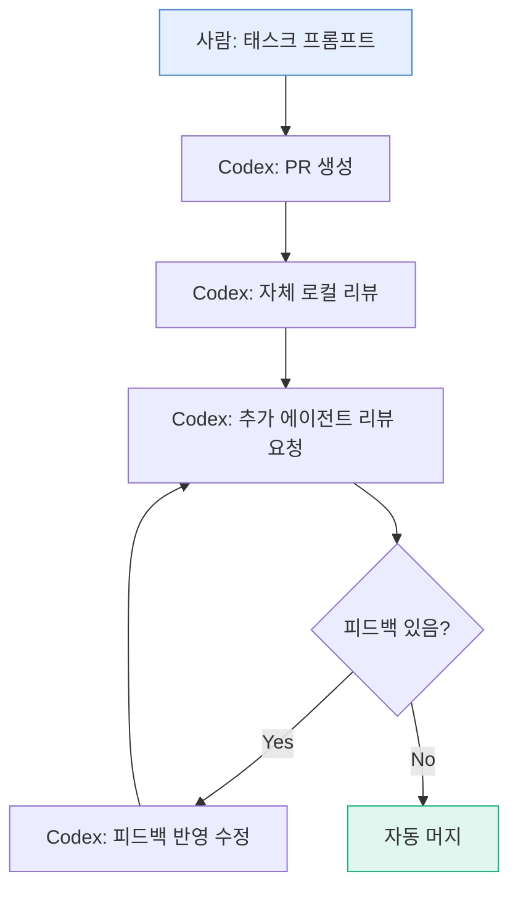

## 왜 이 글이 중요한가

Anthropic이 Claude Code를 만드는 방법을 공개했다면, OpenAI는 **Codex로 실제 프로덕션을 만든 경험**을 공개했다. 2025.08~2026.02, 5개월간:

- 엔지니어 3명 → 7명
- 손코딩 **0줄**
- PR **1,500개** 머지
- 코드 **100만 줄** (앱 로직 + 인프라 + 도구 + 문서)
- 수동 개발 대비 **~10배 속도**

핵심 교훈: 초기에는 느렸다. 환경이 부실해서. 하네스가 개선될수록 속도가 올랐다.

> **"무언가 실패하면 '더 열심히' 하는 것이 아니라 '어떤 능력이 빠졌고, 에이전트가 읽고 따를 수 있게 어떻게 만들 수 있나?'를 물었다."**

---

## 6가지 핵심 원칙

### 1. 환경을 설계하라, 코드를 쓰지 마라

팀의 주 업무가 "코드 작성"에서 **"에이전트가 일할 수 있는 환경 구축"**으로 전환됐다.

```
Before: 큰 목표 → 사람이 코드 작성
After:  큰 목표 → 작은 블록으로 분해 → 에이전트가 설계/코드/리뷰/테스트
        사람 역할: 우선순위 결정, 수용 기준 번역, 결과 검증
```

실패 시 접근법: "try harder"가 아니라 **"what capability is missing?"**

### 2. 지도를 줘라, 매뉴얼을 주지 마라

> **"하나의 큰 AGENTS.md" 방식은 3가지 이유로 실패한다:**

| 문제 | 설명 |
|------|------|
| **컨텍스트 잠식** | 거대 지시 파일이 작업·코드·문서의 공간을 잠식. 핵심 제약을 놓치거나 잘못된 것을 최적화 |
| **우선순위 상실** | 모든 것이 "중요"하면 아무것도 중요하지 않음. 에이전트가 의도적 탐색 대신 로컬 패턴 매칭 |
| **즉시 부패** | 단일 매뉴얼은 유지보수 안 되면 규칙의 무덤. 무엇이 아직 유효한지 에이전트가 판단 불가 |

이것이 CLAUDE.md를 200줄 이하로 유지하고 Skills로 분리하는 원리와 정확히 같다.

### 3. 아키텍처를 기계적으로 강제하라

의존성 방향을 **구조 테스트 + 린터**로 컴파일 타임에 강제:

```
Types → Config → Repo → Service → Runtime → UI

(역방향 의존 = 테스트 실패 = 머지 차단)
```

aidy-ios의 Module.swift가 Feature→Feature를 Interface 경유로 강제하는 것과 같은 원리. **에이전트에게 "이 규칙 지켜줘"라고 부탁하는 대신 구조가 위반을 불가능하게 만든다.**

### 4. 구조화된 문서가 유일한 진실 원천

```
docs/
├── maps/          ← 전체 구조 맵
├── plans/         ← 실행 계획
└── designs/       ← 설계 스펙
```

문서 간 교차 참조를 **린터 + CI**로 기계적 검증. 죽은 링크나 모순된 스펙은 빌드 실패.

### 5. 에이전트가 스스로 검증 (Observability)

사람 QA가 병목이 되자 에이전트에게 자기 검증 능력을 부여:

```
Git worktree별 독립 앱 인스턴스 부팅
  └─ Chrome DevTools Protocol 연결
      └─ DOM 스냅샷 + 스크린샷 + 네비게이션
          └─ 버그 재현 → 수정 → UI 검증

Ephemeral 관측 스택 (worktree별)
  └─ LogQL, PromQL, TraceQL로 직접 쿼리
      └─ "서비스 시작 800ms 이내 확인" 같은 프롬프트가 실행 가능
```

### 6. Garbage Collection — 지속적 소액 결제

코드 드리프트(원칙에서 벗어남) 해결법:

```
핵심 원칙을 레포에 인코딩
  → 백그라운드 Codex 태스크가 스케줄 실행
    → 위반 스캔
      → 리팩토링 PR 자동 제출
        → 대부분 1분 내 자동 머지
```

> **"주기적 대청소가 아닌 지속적 소액 결제"**

이것이 Fowler가 경고한 **"하네스 드리프트"** 안티패턴에 대한 OpenAI의 실전 해법.

---

## Agent-to-Agent PR 리뷰 루프



**사람은 리뷰해도 되지만 필수가 아님.** 시간이 지나면서 리뷰의 거의 전부가 agent-to-agent로 전환됨.

핵심 통찰: **에이전트 처리량 >> 사람 주의력**. 수정은 저렴(에이전트가 즉시 고침)하지만 대기는 비쌈(사람 리뷰 기다리는 시간). 따라서 merge gate를 최소화하고 후속 수정으로 보완.

---

## 수치 요약

| 지표 | 값 |
|------|-----|
| 기간 | 5개월 (2025.08 ~ 2026.02) |
| 팀 크기 | 3명 → 7명 |
| 총 코드 | ~1,000,000줄 |
| PR 머지 | ~1,500개 |
| 엔지니어당 PR/일 | ~3.5개 |
| 손코딩 | 0줄 |
| 속도 배수 | ~10x (수동 대비) |
| 사용자 | 수백 명 내부 사용 |

---

## 3사 하네스 비교: OpenAI vs Anthropic vs Fowler

| 요소 | OpenAI (Codex) | Anthropic (Claude Code) | Fowler |
|------|----------------|------------------------|--------|
| **핵심 개념** | 환경 설계 | 오케스트레이션 레이어 | Guide/Sensor 매트릭스 |
| **리뷰** | Agent-to-Agent | Auto mode classifier | Inferential Sensor |
| **드리프트 방지** | Garbage Collection 스케줄 | autoDream 메모리 정리 | 정기 감사 권장 |
| **문서 전략** | 지도 > 매뉴얼, docs/ 구조화 | CLAUDE.md 200줄 + Skills | Feedforward Guide |
| **아키텍처 강제** | 구조 테스트 + 린터 | Deny-First permissions | Computational Sensor |
| **자기 검증** | Chrome DevTools + 관측 스택 | Playwright (3-Agent) | Feedback Sensor |
| **핵심 교훈** | 하네스가 개선될수록 속도 상승 | 모델은 부품, 하네스가 제품 | Computational 우선, Inferential 선택적 |

**공통점**: 세 곳 모두 "더 좋은 모델보다 더 좋은 하네스가 더 큰 성능 향상을 가져온다"에 동의.

---

## 내 프로젝트에 적용하기

- [ ] **"지도 > 매뉴얼" 원칙 점검**: ai-study CLAUDE.md가 200줄 이하인지 확인. 초과하면 Skills로 분리
- [ ] **Garbage Collection 패턴 도입**: `fix-one-way-connections.mjs`처럼 주기적으로 코드 위생을 스캔하는 스크립트를 CI에 추가
- [ ] **Agent-to-Agent 리뷰 실험**: `/review` Skill의 결과를 바로 수정하는 자동 루프 시도 (현재는 사람이 판단 후 수정)
- [ ] **에이전트 자기 검증**: dev server를 띄워서 에이전트가 직접 페이지를 확인하는 패턴 (browse 도구 활용)

---

## 자기 점검

1. "환경을 설계하라, 코드를 쓰지 마라"에서 "환경"이란 구체적으로 무엇을 포함하는가?
2. 하나의 큰 AGENTS.md가 실패하는 3가지 이유를 설명할 수 있는가?
3. Garbage Collection 패턴이 하네스 드리프트를 해결하는 메커니즘은?
4. Agent-to-Agent 리뷰에서 "수정이 저렴하고 대기가 비싸다"는 무슨 의미인가?
5. (열린 질문) 사람 리뷰를 완전히 제거할 수 있을까? 어떤 영역에서 사람이 반드시 개입해야 하나?

### 실습 과제

본인 프로젝트에서 반복적으로 발생하는 코드 위생 문제(데드코드, 컨벤션 위반 등)를 하나 골라, 이를 스캔하는 스크립트를 만들고 CI 또는 Hook에 등록해보라. OpenAI의 "Garbage Collection" 패턴의 미니 버전.

---

## 출처

- [Harness Engineering: Leveraging Codex in an Agent-First World](https://openai.com/index/harness-engineering/) — OpenAI (2026.02)
- [OpenAI Introduces Harness Engineering](https://www.infoq.com/news/2026/02/openai-harness-engineering-codex/) — InfoQ (2026.02)
- [Best Practices — Codex](https://developers.openai.com/codex/learn/best-practices) — OpenAI Developers
