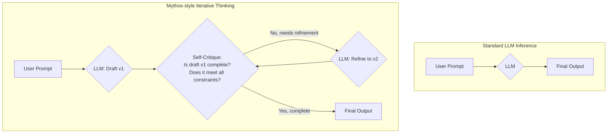

## 왜 '반복적 사고'가 중요한가?

프론트엔드 개발에서 복잡한 UI 컴포넌트를 한 번에 완벽하게 작성하는 개발자는 거의 없습니다. 보통 초안을 만들고, 화면에 렌더링해 본 뒤, 어색한 부분을 수정하고, 상태 관리 로직을 추가하며, 접근성 표준을 검토하는 과정을 반복합니다. 이처럼 인간의 문제 해결 과정은 본질적으로 '반복적'입니다.

하지만 지금까지의 LLM(거대 언어 모델)은 대부분 '단일 패스(single-pass)' 방식으로 작동했습니다. 프롬프트를 받으면, 학습된 통계에 따라 가장 그럴듯한 다음 토큰을 순차적으로 생성하여 한 번에 결과물을 내놓습니다. 이는 간단한 질문에 답하거나 짧은 코드를 생성하는 데는 효과적이지만, 여러 제약 조건과 맥락을 동시에 고려해야 하는 복잡한 작업에서는 종종 실패합니다. 결과물이 논리적 비약을 보이거나, 중요한 요구사항을 누락하거나, 스스로 모순에 빠지는 '환각' 현상이 발생하는 이유입니다.

Claude Mythos 모델과 이를 역설계한 오픈소스 구현체 OpenMythos가 제시하는 '반복적 사고(Repetitive Thinking)' 트랜스포머 아키텍처는 바로 이 한계를 정면으로 돌파하려는 시도입니다. LLM이 최종 답변을 내놓기 전에, 내부적으로 '생각의 공간(scratchpad)'을 갖고 여러 번 초안을 작성하고(draft), 스스로 비평하며(self-critique), 수정하는(refine) 과정을 거치게 하는 것입니다. 이는 마치 개발자가 코드를 리팩토링하듯, 모델 스스로 결과물의 품질을 점진적으로 향상시키는 메커니즘을 내장한 것과 같습니다.

## Mythos 아키텍처의 핵심: 내부 루프

Mythos 아키텍처의 핵심은 외부 사용자에게는 보이지 않는 내부적인 '사고 루프'입니다. 이 과정을 다이어그램으로 표현하면 기존 방식과의 차이가 명확해집니다.



이 내부 루프는 Chain-of-Thought (CoT) 프롬프팅의 발전된 형태로 볼 수 있습니다. CoT가 모델에게 "단계별로 생각하라"고 지시하여 그 과정을 출력에 포함시키는 것이라면, Mythos는 아예 모델 구조 자체에 이런 사고 과정을 내재화하고 최종 결과물만 깔끔하게 정제해서 보여준다는 차이가 있습니다.

### OpenMythos의 구현 들여다보기

OpenMythos는 이 개념을 실제 코드로 구현한 사례입니다. 핵심은 '스크래치패드(Scratchpad)'의 활용입니다. 모델은 각 반복 단계에서 이전 단계의 결과물과 비평 내용을 스크래치패드에 누적하며, 이를 다음 단계의 입력으로 사용합니다.

이 패턴을 TypeScript로 간단하게 시뮬레이션해 보면 다음과 같습니다. 이는 실제 모델 아키텍처는 아니지만, Harness Engineering 관점에서 우리가 이 패턴을 어떻게 활용할 수 있는지 보여줍니다.

```typescript
// Conceptual simulation of the Mythos pattern
async function invokeMythosPattern(
  initialPrompt: string,
  maxIterations: number = 3
): Promise<string> {
  let scratchpad = `Initial Prompt: ${initialPrompt}\n\n`;
  let currentResult = "";

  console.log("Starting iterative thinking process...");

  for (let i = 1; i <= maxIterations; i++) {
    console.log(`\nIteration ${i}:`);

    const draftPrompt = `
      ${scratchpad}
      Based on the above, generate the next version of the solution.
      Think step-by-step and create a draft.
      ---
      DRAFT ${i}:
    `;
    // 1. 초안 생성 (Draft)
    const draft = await llm.generate(draftPrompt);
    scratchpad += `DRAFT ${i}:\n${draft}\n\n`;
    console.log(`- Draft generated.`);

    const critiquePrompt = `
      ${scratchpad}
      Critique the latest DRAFT ${i}.
      - Does it fully address the initial prompt?
      - Are there any logical errors, missing pieces, or potential improvements?
      - Provide a concise critique.
      ---
      CRITIQUE ${i}:
    `;
    // 2. 자가 비평 (Self-Critique)
    const critique = await llm.generate(critiquePrompt);
    scratchpad += `CRITIQUE ${i}:\n${critique}\n\n`;
    console.log(`- Critique generated: ${critique.substring(0, 80)}...`);
    
    currentResult = draft; // 마지막 초안을 현재 결과로 유지
  }

  console.log("\nFinalizing output...");
  const finalizationPrompt = `
    ${scratchpad}
    Based on the entire thought process above, including all drafts and critiques,
    provide the final, clean, and complete answer to the initial prompt.
    Do not include any of the scratchpad contents like "DRAFT" or "CRITIQUE".
  `;
  // 3. 최종 결과물 정제 (Finalize)
  const finalOutput = await llm.generate(finalizationPrompt);

  return finalOutput;
}

// 예제 사용
// const llm = new LLMProvider();
// const complexRequest = "Create a TypeScript interface 'UserProfile' with id, name, email, and an optional 'lastLogin' date. Also, create a validation function using Zod for this interface.";
// const finalCode = await invokeMythosPattern(complexRequest);
// console.log("\n--- FINAL OUTPUT ---\n", finalCode);
```

이 코드에서 볼 수 있듯, 여러 번의 LLM 호출을 조합하여 하나의 고품질 결과물을 만들어냅니다. 이것이 바로 Mythos 아키텍처를 외부에서 모방하는 Harness Engineering의 핵심입니다.

## iOS/프론트엔드 개발자의 실무 적용 시나리오

| 시나리오 | 기존 단일 패스 접근 방식 | Mythos 아키텍처 접근 방식 |
| :--- | :--- | :--- |
| **SwiftUI 컴포넌트 생성** | `// TODO: Add accessibility labels` 주석만 남기거나, 로딩/에러 상태를 누락하는 경우가 많음. | **초안:** 기본 `View` 구조 생성 <br /> **비평:** "접근성(Accessibility)과 상태(State) 처리가 빠져있음" <br /> **수정:** `@State` 변수와 `ProgressView`, 에러 메시지 뷰, `accessibilityIdentifier` 추가. |
| **복잡한 API 요청 로직** | 사용자의 모호한 요청("다음 주 도쿄행 비행기 예약")에 대해 필요한 정보를 되묻지 않고 바로 함수 호출을 시도하여 실패. | **초안:** `bookFlight(destination: "Tokyo", date: ?)` 함수 호출 계획 <br /> **비평:** "날짜가 명확하지 않음. 사용자에게 되물어야 함" <br /> **수정:** 사용자에게 날짜를 물어보는 질문을 생성하고, 응답을 기다리는 다음 액션 계획 수립. |
| **기획서 기반 코드 스캐폴딩** | 기획서의 특정 항목(예: "데이터는 실시간으로 갱신되어야 함")을 놓치고 일반적인 `fetch` 코드만 생성. | **초안:** `useEffect` / `onAppear`에서 `fetch`하는 코드 생성 <br /> **비평:** "기획서에 '실시간' 요구사항이 있었음. WebSocket 또는 SSE가 적합" <br /> **수정:** `URLSessionWebSocketTask` 또는 `AsyncStream`을 사용하는 코드로 리팩토링. |

이처럼 Mythos 아키텍처는 단순히 더 나은 코드를 생성하는 것을 넘어, 에이전트가 스스로의 결과물을 검증하고 개선하게 함으로써 훨씬 더 신뢰할 수 있고 견고한(robust) 자동화 시스템을 구축할 수 있게 해줍니다.

## Harness Engineering 관점의 시사점

1.  **관찰 가능성(Observability)의 재정의**: 최종 결과물만 보는 것은 더 이상 충분하지 않습니다. 모델의 '생각 과정' 즉, 스크래치패드의 내용을 모두 로깅하고 분석해야 합니다. 왜 특정 방향으로 리팩토링했는지, 어떤 요구사항을 놓쳤다가 다시 바로잡았는지 추적할 수 있어야 에이전트의 성능을 개선할 수 있습니다.
2.  **비용과 지연 시간(Cost & Latency)의 트레이드오프**: 내부적으로 여러 번 LLM을 호출하므로 비용과 응답 시간이 증가합니다. 따라서 `maxIterations`를 적절히 제한하거나, 초안 생성은 강력한 모델(e.g., GPT-4o, Claude 3.5 Sonnet)로, 비평 및 수정은 더 작고 빠른 모델로 수행하는 '하이브리드' 전략을 고려해야 합니다.
3.  **메타-프롬프팅(Meta-Prompting)의 중요성**: `invokeMythosPattern` 예제 코드의 `critiquePrompt`처럼, '어떻게 비평할 것인가'를 정의하는 메타 프롬프트의 품질이 전체 결과물의 품질을 좌우합니다. 이는 단순한 프롬프트 엔지니어링을 넘어, 에이전트의 행동 철학을 설계하는 '거버넌스'의 영역에 해당합니다.

## 자기 점검

1.  Mythos 아키텍처가 기존의 단일 LLM 호출 방식과 다른 가장 큰 차이점은 무엇인가요?
2.  '반복적 사고' 과정에서 '스크래치패드(Scratchpad)'는 어떤 역할을 하며, 이를 로깅하는 것이 왜 중요한가요?
3.  Mythos와 같은 아키텍처를 프로덕션에 도입할 때 고려해야 할 주요 트레이드오프(trade-off) 두 가지는 무엇인가요?
4.  이 Mythos 아키텍처의 개념을 Chain-of-Thought (CoT)와 비교하여 동료 개발자에게 설명한다면, 어떤 점을 강조하시겠습니까?
5.  **실습 과제**: 현재 진행 중인 프로젝트에서 LLM을 사용하는 기능 하나를 선택하세요. (예: 커밋 메시지 생성, 코드 리뷰 요약 등). 이 기능에 위 TypeScript 예제와 같이 '초안 생성 → 자가 비평 → 수정' 사이클을 수동으로 적용하는 프롬프트 체인을 만들어 보세요. LLM 채팅 UI에서 3단계에 걸쳐 직접 프롬프트를 입력하며 역할을 부여하고, 단일 프롬프트로 요청했을 때와 결과물의 품질이 어떻게 달라지는지 비교해 보세요.