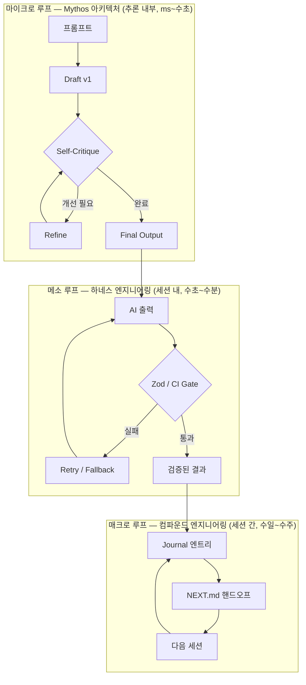
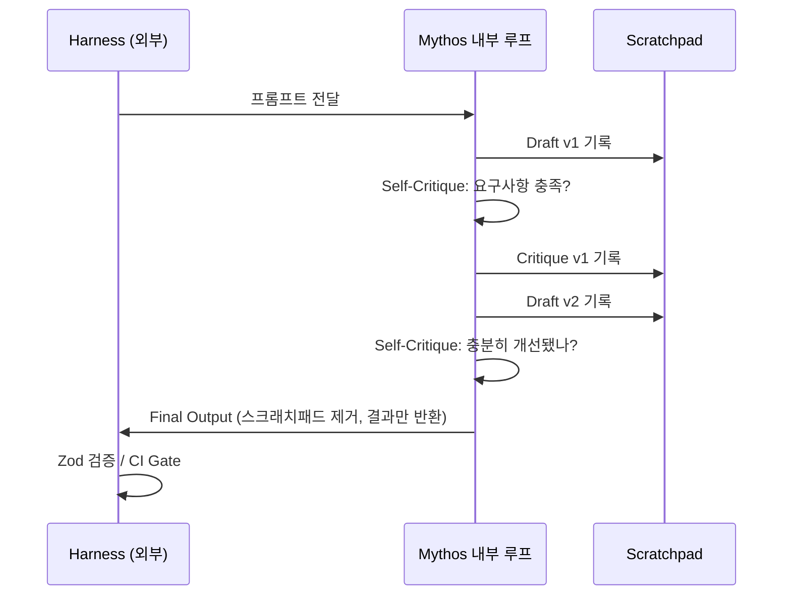

## 왜 지금 이 주제인가

우리 방법론에는 이미 두 개의 강력한 피드백 루프가 있다.

**하네스 엔지니어링**은 AI가 출력을 내놓으면 외부에서 검증한다. Zod로 스키마를 깨고, CI gate로 빌드를 막고, circuit breaker로 재시도를 제어한다. AI는 '블랙박스 제조기'이고 하네스는 그 출구에 설치된 검문소다.

**컴파운드 엔지니어링**은 세션과 세션 사이를 연결한다. NEXT.md가 다음 세션에 컨텍스트를 넘기고, Journal이 의사결정을 박제하며, 각 스프린트의 산물이 다음 스프린트의 지식이 된다.

그런데 두 루프 모두 AI가 **출력을 내놓은 이후**에 작동한다. AI가 그 출력을 **만들어내는 과정 내부**에는 손을 대지 않는다.

OpenMythos가 역설계한 Mythos 아키텍처는 바로 그 내부 — 단일 추론 사이클 안에서 모델이 스스로 초안을 쓰고, 비평하고, 수정하는 루프 — 를 다룬다. 이 세 번째 루프를 우리 방법론과 어떻게 연결할 수 있는지가 이 엔트리의 주제다.

## 세 개의 피드백 루프



세 루프는 **시간 스케일**이 다르고 **교정 주체**가 다르다.

| 루프 | 스케일 | 교정 주체 | 피드백 신호 | 우리 구현 |
|---|---|---|---|---|
| 마이크로 (Mythos) | ms ~ 수초 | 모델 내부 | 자가 비평 프롬프트 | 미구축 → 이식 대상 |
| 메소 (하네스) | 수초 ~ 수분 | 외부 게이트 | schema 오류, exit code | Zod, circuit breaker, CI |
| 매크로 (컴파운드) | 수일 ~ 수주 | 저장된 지식 | journal 패턴 비교 | NEXT.md, Journal, 솔루션 DB |

세 루프가 쌓이면 피드백이 세 겹으로 중첩된다. **출력 품질**은 하네스가 보장하고, **학습 복리**는 컴파운드가 담당하며, **추론 품질**은 Mythos가 끌어올린다.

## Mythos 아키텍처 핵심 구조

Mythos의 내부 루프는 세 단계로 구성된다.



단일 LLM 호출처럼 보이지만 내부에서는 여러 번의 draft-critique-refine 사이클이 돈다. 하네스 입장에서는 출구에 정제된 결과물이 도착한다는 점에서 기존과 동일하지만, 그 결과물의 **시작 품질**이 이미 한 단계 높아진 상태다.

## 우리 방법론과의 구조적 비교

### 자기 교정의 위치

| 방법론 | 교정 발생 위치 | 교정을 아는 주체 |
|---|---|---|
| Mythos | AI 추론 **내부** | 모델 자신 |
| 하네스 엔지니어링 | AI 출력 **이후** | 하네스 (Zod, CI, 서킷브레이커) |
| 컴파운드 엔지니어링 | 세션 **이후** | 다음 세션의 나 / AI |

하네스는 "출력이 틀렸다"를 감지하지만 **왜 틀렸는지** 모른다. Mythos는 "내 초안이 왜 부족한지"를 스스로 진단하고 고친다. 컴파운드는 "지난번 패턴에서 뭘 놓쳤는지"를 기록으로 추적한다.

세 가지가 서로 다른 질문에 답하고 있다.

### Scratchpad vs Journal

Mythos의 **scratchpad**는 AI가 최종 결과를 내놓기까지의 중간 사고 과정을 누적한다. 우리의 **Journal 엔트리와 NEXT.md**도 같은 역할을 — 단지 세션 스케일에서 — 한다.

```
Mythos scratchpad:   [Draft v1] → [Critique v1] → [Draft v2] → Final
우리 컴파운드:       [Journal 019] → [NEXT.md] → [Journal 020] → Sprint 결과
```

구조가 동형(isomorphic)이다. 차이는 시간 해상도뿐이다. Mythos는 수초 안에 이 사이클을 완료하고, 우리는 수일에 걸쳐 수동으로 한다.

이 관찰에서 나오는 실용적 결론이 있다: **Mythos의 scratchpad를 Journal에 박제하면 마이크로 루프의 산물이 매크로 루프의 컨텍스트가 된다.** AI가 "왜 이 설계를 선택했는가"를 스크래치패드로 남기고, 그걸 Journal에 포함시키면 다음 세션은 그 추론 과정 위에서 출발한다.

### Self-Critique Prompt vs 하네스 게이트 설계

하네스에서 게이트의 품질은 "무엇을 검사하는가"에 달려 있다. Mythos에서 루프의 품질은 "어떻게 비평하는가"에 달려 있다. 둘 다 **기준 설계**가 핵심이다.

| 하네스 게이트 | Mythos Self-Critique 등가 |
|---|---|
| Zod schema (출력 구조 검사) | "요구사항을 모두 충족하는가?" |
| CI test gate (행동 검사) | "엣지케이스를 놓쳤는가?" |
| ai-review.yml (의미 검사) | "논리적 비약이 있는가?" |

우리 `ai-review.yml`이 하는 일이 사실상 외부에서 돌리는 Mythos self-critique다. 차이는 타이밍뿐이다. ai-review는 PR이 올라온 후에 돌고, Mythos critique는 AI가 초안을 완성하는 즉시 돈다.

## 우리 방법론에 이식하는 경로

### 1. aidy Architect 에이전트에 Mythos 루프 이식

현재 aidy의 Architect 에이전트는 단일 패스로 설계안을 생성하고 Worker에게 넘긴다. 여기에 Mythos 루프를 심으면 Worker가 받는 설계안의 품질이 달라진다.

```typescript
async function architectWithSelfCritique(task: string): Promise<ArchitectureDoc> {
  const scratchpad: string[] = [];

  // Draft: 초안 설계
  const draft = await architect.generate(`Task: ${task}\nGenerate an initial architecture proposal.`);
  scratchpad.push(`DRAFT:\n${draft}`);

  // Self-Critique: 우리 하네스 기준으로 비평
  const critique = await architect.generate(`
${scratchpad.join('\n')}

Critique the draft using these harness engineering criteria:
1. 모든 AI 출력에 Zod 스키마가 있는가?
2. 실패 경로(retry, fallback)가 명시됐는가?
3. 비용/레이턴시 트레이드오프가 고려됐는가?
4. 관찰 가능성 레이어(로깅, 오류 추적)가 있는가?

List what's missing or weak.`);
  scratchpad.push(`CRITIQUE:\n${critique}`);

  // Refine: 비평 반영 수정
  const refined = await architect.generate(`
${scratchpad.join('\n')}

Now produce the final architecture document addressing all critique points.`);

  // 스크래치패드를 Journal에 박제 (매크로 루프 연결)
  await journal.append({ task, scratchpad, result: refined });

  return parseArchitectureDoc(refined);
}
```

여기서 `critique` 프롬프트의 4개 기준이 우리 **하네스 엔지니어링 5대 레버**에서 나온다는 점이 핵심이다. Mythos 루프를 채우는 내용이 우리 방법론 자체다.

### 2. Gemini 일일 레슨 파이프라인에 Mythos 루프 추가

현재 `generate-on-pick.yml`은 Gemini가 단일 패스로 MDX를 생성하고 PR을 올린다. 생성 → 자가 비평 → 수정 사이클을 추가하면 ai-review에서 걸리는 빈도가 줄어든다.

```
현재: Gemini 생성 → PR → ai-review(외부 비평) → 수정 요청 → 재작성
개선: Gemini 초안 → Gemini self-critique("Zod 스키마 있나? connections 실제 존재하나?") → 수정 → PR → ai-review
```

ai-review가 잡아야 할 문제를 Gemini가 먼저 걸러내면 외부 리뷰 루프의 부하가 줄고, PR 사이클이 짧아진다.

### 3. Scratchpad 관찰 가능성 레이어

현재 우리 AI 호출 로깅은 최종 입출력만 기록한다. Mythos 패턴을 적용하면 중간 draft와 critique도 로그에 남길 수 있다.

```typescript
interface AiCallLog {
  sessionId: string;
  finalPrompt: string;
  finalOutput: string;
  // Mythos 확장
  scratchpad?: Array<{
    iteration: number;
    type: 'draft' | 'critique' | 'refine';
    content: string;
    tokenCount: number;
  }>;
}
```

이 로그가 쌓이면 "어떤 작업에서 AI가 몇 번의 자기 교정을 거쳐야 하는가"를 측정할 수 있다. 교정 횟수가 많은 작업 유형 = 초기 프롬프트 설계를 개선해야 하는 신호다.

## 안티패턴과 한계

**Mythos 루프를 쓰면 안 되는 경우:**

- **단순 구조화 작업**: JSON 추출, slug 생성처럼 출력이 명확히 정의된 경우 → Zod 하드 게이트만으로 충분, Mythos 루프는 비용 낭비
- **이미 외부 게이트가 충분한 경우**: CI test suite가 촘촘하면 내부 루프 없이도 품질이 보장됨
- **비용 민감 파이프라인**: 내부 루프는 LLM 호출 횟수를 2~4배 증가시킨다. haiku로 critique, sonnet으로 draft하는 **하이브리드 모델** 전략이 필요

**우리 하네스가 Mythos보다 나은 경우:**

- 실패 기준이 **코드로 명시 가능**할 때 (Zod schema, exit code 0/1)
- AI의 주관적 판단보다 **객관적 검증**이 필요할 때
- 여러 AI 호출에 걸쳐 **일관된 기준**을 유지해야 할 때

두 패러다임은 경쟁하지 않는다. Mythos는 "AI가 더 좋은 초안을 만들게" 하고, 하네스는 "그 초안이 시스템 기준에 맞는지" 확인한다.

## 내 프로젝트에 적용하기

- [ ] aidy Architect 프롬프트에 "하네스 기준 4가지로 설계안을 자가 비평하라" 섹션 추가 (위 코드 참조)
- [ ] `generate-on-pick.yml`에 Gemini self-critique 단계 삽입 — connections dangling 체크 + Zod frontmatter 검사
- [ ] AI 호출 로그에 `scratchpad` 필드 추가하고 `ai-cost-tracking` 대시보드에 시각화
- [ ] Journal 엔트리 템플릿에 "AI가 처음 제안한 것 vs 자가 비평 후 바뀐 것" 섹션 추가

## AI Agent Directive

**Trigger**: Architect 에이전트의 단일 패스 설계안 품질이 낮을 때 / Gemini 자동 생성 엔트리가 ai-review에서 반복 거절될 때 / AI 출력의 누락 항목이 예측 가능한 패턴으로 반복될 때

**Prerequisites**:
- [하네스 엔지니어링 5대 레버](/wiki/harness-engineering/five-levers-of-harness-engineering) — 비평 기준 파악
- 적용 대상 에이전트의 기존 프롬프트

### Actionable Steps

*aidy Architect에 적용 시*:
1. Architect 프롬프트 끝에 self-critique 섹션 추가
   ```
   After drafting, critique using these 4 harness criteria:
   1. 모든 AI 출력에 Zod 스키마 있는가?
   2. 실패 경로(retry/fallback) 명시됐는가?
   3. 비용/레이턴시 트레이드오프 고려됐는가?
   4. 관찰 가능성 레이어(로깅) 있는가?
   List gaps, then produce refined final output.
   ```
2. scratchpad(draft + critique)를 Journal에 기록해 다음 세션 컨텍스트로 활용

*Gemini 파이프라인에 적용 시*:
1. `generate-on-pick.yml`에서 생성 후 self-critique 단계 삽입
   ```
   Review the generated entry:
   - connections 슬러그가 실제 존재하는가? (dangling 체크)
   - frontmatter Zod 스키마 통과하는가?
   - AI Agent Directive 섹션 있는가?
   Fix any issues before PR.
   ```

### Anti-patterns

- ❌ 비평 기준 없는 "검토해라" — 모든 것을 동시에 비평하면 아무것도 고치지 않음
- ❌ 단순 구조화 작업(slug 생성, JSON 추출)에 Mythos 루프 적용 — Zod 게이트로 충분
- ❌ 비평 없이 draft 그대로 최종 출력 — 루프를 돌지 않은 것과 동일

**적용 범위**: any (비평 기준을 프로젝트 하네스 기준으로 교체하면 범용 적용 가능)

---

## 자기 점검

1. 세 개의 피드백 루프(마이크로/메소/매크로)가 각각 무엇에 답하는가?
2. Mythos scratchpad와 우리 Journal이 구조적으로 동형인 이유는 무엇인가?
3. ai-review.yml이 "외부에서 돌리는 Mythos self-critique"라고 할 수 있는 근거는?
4. Mythos 루프를 적용하면 안 되는 작업 유형은 무엇이고, 그 이유는?
5. **열린 질문**: aidy의 Worker 에이전트에도 Mythos 루프를 심어야 할까, 아니면 Architect만으로 충분할까?

### 실습 과제

aidy의 현재 Architect 프롬프트를 꺼내서, "하네스 엔지니어링 4가지 기준(Zod, retry, cost, observability)으로 네 설계안의 취약점을 스스로 나열하라"는 self-critique 섹션을 추가한다. 그 다음 동일한 태스크를 기존 Architect와 Mythos-Architect에게 각각 던지고, 최종 출력의 차이를 비교해서 Journal에 기록한다.

## 출처

- 원본: [OpenMythos — AI Study Wiki (기존 자동 생성 엔트리)](https://ai-study-wheat.vercel.app/wiki/harness-engineering/openmythos-architecture-iterative-agent-performance)
- 보강 자료:
  - [하네스 엔지니어링 5대 레버](/wiki/harness-engineering/five-levers-of-harness-engineering)
  - [컴파운드 엔지니어링 철학](/wiki/harness-engineering/compound-engineering-philosophy)
  - [Circuit Breaker & Fallback 패턴](/wiki/harness-engineering/ai-call-patterns-circuit-breaker-fallback)
