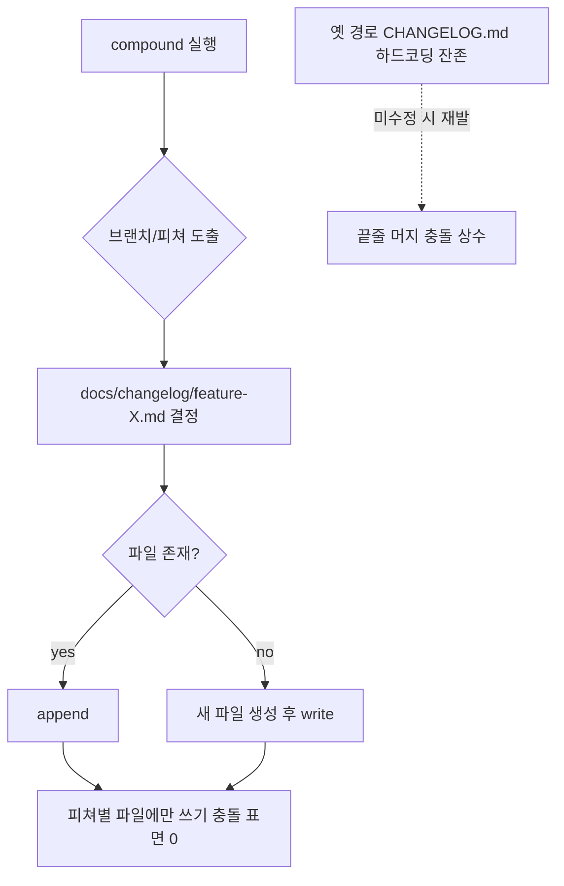

스프린트가 끝나면 compound가 돈다. CHANGELOG에 한 줄을 더하고, 회고를 쓰고, 솔루션을 박제한다. 혼자 쓸 때는 완벽한 워크플로다. 그런데 팀원이 둘, 셋으로 늘고 각자 자기 피쳐 브랜치에서 compound를 돌리기 시작하면, 머지할 때마다 같은 자리에서 충돌이 난다. 그것도 *매번*, *예외 없이*.

이건 우연이 아니라 구조다. append-only 공유 산출물에 멀티 라이터가 붙으면 나는 충돌이고, 단일 CHANGELOG.md는 그 교과서적 사례다. 이 글은 한 RIBs/ReactorKit iOS 개발 하네스에서 실제로 이 문제를 만나 피쳐별 파일 샤딩으로 해결한 과정을 익명화해 박제한다.

## 문제: 단일 CHANGELOG + 멀티 compound = 끝줄 머지 충돌 상수

CHANGELOG.md는 보통 이런 모양이다.

```markdown
# CHANGELOG

## 2026-06-02
- moneyflow: 거래 내역 필터 추가 (a1b2c3d)

## 2026-05-30
- moneyflow: 푸시 알림 권한 플로우 (d92bebe)
```

compound는 새 엔트리를 최상단(또는 끝)에 append한다. 팀원 A가 feature/filter 브랜치에서 compound를 돌리면 최상단에 두 줄을 넣는다. 같은 시각 팀원 B가 feature/push 브랜치에서 compound를 돌리면 *역시 같은 최상단*에 다른 두 줄을 넣는다.

둘 다 main에서 분기했으므로 두 변경의 base는 동일하다. git이 머지할 때 보는 것은 "내용이 무엇인가"가 아니라 "어느 라인을 건드렸는가"다. A와 B는 둘 다 1~2행을 수정했다. 내용은 완전히 다르지만 git에게는 같은 hunk를 동시에 고친 것이고, 결과는 conflict marker다.

```
<<<<<<< HEAD
## 2026-06-02
- moneyflow: 거래 내역 필터 추가 (a1b2c3d)
=======
## 2026-06-02
- moneyflow: 푸시 알림 권한 플로우 (d92bebe)
>>>>>>> feature/push
```

핵심은 이 충돌이 *세맨틱하게 무의미*하다는 점이다. 두 엔트리는 서로 독립적이고 둘 다 살아남아야 한다. 사람이 해야 할 일은 marker를 지우고 두 블록을 그냥 위아래로 붙이는 것뿐이다. 즉, 매번 발생하는 데다 매번 해결이 기계적인, 순수 노이즈 충돌이다.

노이즈 충돌의 비용은 시간만이 아니다. "어차피 둘 다 살리면 되니까"라는 습관이 들면, 진짜 충돌(같은 줄을 서로 다르게 고친 의미 있는 충돌)이 섞여 들어왔을 때도 무심코 둘 다 붙여버린다. 충돌 해결의 경각심이 마모된다. 그리고 팀원이 늘수록 충돌 확률은 선형이 아니라 동시 작업하는 브랜치 쌍의 수, 즉 대략 제곱으로 늘어난다.

## 해법: 피쳐별 파일 샤딩 `docs/changelog/<feature>.md`

해법은 단순하다. 충돌이 "같은 라인을 동시에 건드려서" 나는 것이라면, 각 라이터가 *서로 다른 파일*에 쓰게 하면 충돌 표면이 사라진다.

```
docs/
  changelog/
    _history.md          # 과거 모놀리식 보존 (blame 유지)
    feature-filter.md    # 팀원 A가 여기에만 append
    feature-push.md      # 팀원 B가 여기에만 append
    feature-onboarding.md
```

피쳐(또는 티켓) 하나당 파일 하나. compound가 돌 때 "지금 작업 중인 피쳐"의 파일에만 append한다. A와 B는 이제 물리적으로 다른 파일을 만지므로 git이 두 변경을 충돌 없이 자동 머지한다. 새 파일을 만드는 경우조차 — `feature-filter.md`는 A에만, `feature-push.md`는 B에만 존재 — git은 두 add를 독립적으로 합친다.

읽을 때 통합 뷰가 필요하면 빌드 단계나 간단한 스크립트로 모든 `docs/changelog/*.md`를 날짜순으로 concat하면 된다. 즉 *쓰기는 분산, 읽기는 집계*다. 이건 로그 파일을 프로세스별로 쪼개고 나중에 머지해서 보는 것과 정확히 같은 패턴이다.

트레이드오프도 있다. 디렉토리에 파일이 많아진다. 피쳐 경계가 모호한 변경(여러 피쳐를 가로지르는 리팩토링)은 어느 파일에 넣을지 애매하다. 이때는 "이 작업을 대표하는 단위 = 브랜치/티켓"을 키로 삼아 한 곳에 몰아넣고, 통합 뷰에서 어차피 합쳐지니 분류 완벽주의를 버리는 게 실용적이다. 파일이 너무 잘게 쪼개지는 게 걱정되면 "활성 스프린트 단위"로 묶는 것도 방법이지만, 그러면 같은 스프린트의 두 팀원이 다시 충돌하므로 — 샤딩의 *granularity는 동시에 쓰는 라이터보다 더 잘게* 잡아야 의미가 있다. 동시 라이터 = 피쳐 단위라면 파일도 피쳐 단위여야 한다.

## 과거 모놀리식 → `_history.md` 보존 (git mv로 blame 유지)

기존 CHANGELOG.md에는 수개월치 결정이 쌓여 있다. 이걸 그냥 지우고 피쳐별 파일로 새 출발하면 과거 히스토리의 `git blame`이 끊긴다. "이 항목을 왜 이렇게 적었지?"를 추적하려면 blame이 살아 있어야 한다.

그래서 삭제가 아니라 이동이다.

```bash
git mv CHANGELOG.md docs/changelog/_history.md
git commit -m "chore: shard changelog — preserve monolith as _history"
```

git mv는 내부적으로 rename으로 기록되고, git은 rename을 통해 blame/log를 추적한다. `git log --follow docs/changelog/_history.md`로 이전 CHANGELOG.md 시절의 커밋까지 이어서 볼 수 있다. 새 append는 전부 피쳐별 파일로 가므로, 과거는 동결된 아카이브로 보존되고 신규 충돌 표면은 0이 된다.

`_`로 시작하는 파일명은 통합 뷰 스크립트에서 "맨 위 또는 맨 아래에 한 번 붙이는 과거 블록"으로 특별 취급하기 좋다. 정렬상 다른 피쳐 파일과 자연스럽게 구분된다.

## 함정: 생성기(compound 스킬)도 같이 고쳐야 분리가 실효

가장 빠지기 쉬운 함정이다. 디렉토리를 만들고 git mv까지 끝내고 "샤딩 완료"라고 선언했는데, 다음 스프린트에서 compound를 돌리니 *여전히 옛 경로에 append*하고 충돌이 재발한다.

이유는 명확하다. 우리가 바꾼 것은 *데이터의 레이아웃*이고, 그 데이터를 쓰는 *코드(compound 스킬/스크립트)*는 아직 `CHANGELOG.md`를 하드코딩하고 있기 때문이다. 데이터 구조와 그것을 조작하는 코드는 한 쌍이고, 한쪽만 고치면 작업은 끝난 게 아니다.

그래서 샤딩 작업의 정의에는 반드시 생성기 수정이 포함된다.

- compound 스킬이 현재 브랜치/피쳐 이름을 도출한다 (예: 브랜치명 → `feature-<name>.md`).
- 해당 파일이 없으면 생성하고, 있으면 append한다.
- 더 이상 루트 `CHANGELOG.md`를 참조하지 않는다.

이 수정을 빠뜨리면 "샤딩했는데 왜 또 터져?"가 반복된다. 일반 교훈은 이렇다 — **데이터 구조를 바꾸는 마이그레이션은 그 구조를 읽고 쓰는 모든 코드 경로를 grep해 동시에 갱신해야 완료다.** 산출물 레이아웃 변경은 부분 fix가 가장 위험한 종류의 작업이다.



## 산출물 일관성: CHANGELOG를 하네스 repo로 이관해 solutions/retros와 묶음

샤딩을 계기로 한 발 더 나아간 정리가 있다. compound는 CHANGELOG 외에도 회고(`docs/retros/`)와 솔루션(`docs/solutions/`)을 만든다. 그런데 CHANGELOG만 앱 repo 루트에, 나머지는 하네스/지식 repo에 흩어져 있으면 compound가 한 번에 여러 repo를 건드려야 하고, 산출물의 "집"이 일관되지 않는다.

피쳐별 샤딩으로 어차피 `docs/changelog/` 디렉토리를 새로 만드는 김에, 세 산출물을 같은 곳에 모은다.

```
docs/
  changelog/   ← compound가 만드는 변경 로그
  retros/      ← compound가 만드는 회고
  solutions/   ← compound가 만드는 솔루션
```

효과는 두 가지다. 첫째, compound가 단일 트리 안에서만 쓰므로 트랜잭션 경계가 깔끔해진다(한 커밋에 세 산출물이 함께 들어간다). 둘째, "스프린트가 끝나면 어디를 보면 되는지"가 명확해진다 — 지식 산출물의 단일 출처다. 이는 하네스 자체를 소프트웨어로 다루는 ADR 관점과 맞닿아 있다: 산출물 레이아웃도 설계 결정이고 기록할 가치가 있다.

주의할 점은 이관이 자동으로 위 함정을 또 부른다는 것이다 — retros/solutions를 옮겼다면 그것들을 쓰는 스킬 경로도 함께 갱신해야 한다. 마이그레이션은 한 종류만 고치면 나머지가 silent하게 옛 경로에 쌓이는 부분 fix 함정을 다시 깐다.

## 일반화: append-only 공유 산출물의 멀티 라이터 충돌과 샤딩

이 패턴은 CHANGELOG에 국한되지 않는다. 일반 형태는 이렇다.

> **여러 라이터가 하나의 append-only 공유 파일에 동시에 쓰면, 내용이 독립적이어도 같은 앵커 라인을 건드려 구조적 머지 충돌이 난다. 해결은 라이터 단위(또는 그보다 잘게)로 파일을 샤딩하고, 읽을 때 집계하는 것이다.**

같은 함정이 나타나는 곳들:

- **단일 `TODO.md` / `NEXT.md`**: 여러 세션이 끝에 항목을 추가 → 끝줄 충돌. 세션/주제별 파일로 분리.
- **공유 manifest/registry 파일**: 여러 피쳐가 같은 배열 끝에 엔트리 추가. 디렉토리 기반 자동 수집(글롭)으로 전환.
- **i18n 단일 번역 파일**: 여러 기능이 같은 JSON 끝에 키 추가. 네임스페이스별 파일로 분리.
- **CI에서 누적되는 결과 로그**: 잡별 파일로 쪼개고 아티팩트 단계에서 머지.

판단 기준: 산출물이 (1) append-only이고 (2) 여러 라이터/세션이 동시에 건드릴 수 있다면, 그것은 충돌의 시한폭탄이다. 미리 샤딩 granularity를 "동시 라이터 단위 이하"로 잡아라.

반대로 샤딩이 *과한* 경우도 있다. 라이터가 항상 한 명이거나(개인 위키), 동시 작업이 직렬화돼 있거나, 충돌이 실제로 의미 있는 검토를 요구하는 경우(같은 설정값을 두 곳에서 다르게 바꾸는 것은 *사람이 봐야 하는* 충돌이다)에는 단일 파일이 오히려 낫다. 샤딩은 "노이즈 충돌"을 죽이는 도구지 모든 충돌을 죽이는 도구가 아니다. 의미 있는 충돌까지 자동 머지로 숨기면 사고가 난다.

## 자기 점검

- 우리 하네스의 compound(또는 동등한 자동 산출물 생성기)가 쓰는 파일 중, 여러 세션/팀원이 동시에 append할 수 있는 단일 파일이 있는가? 그 파일의 머지 충돌 빈도를 실제로 측정해봤는가?
- 산출물 레이아웃을 바꾸는 마이그레이션을 할 때, 그 레이아웃을 읽고 쓰는 *모든* 코드 경로를 grep으로 수색했는가? 생성기 한 곳만 고치고 끝냈다가 옛 경로에 silent하게 쌓이고 있지는 않은가?
- 과거 히스토리를 보존해야 하는 파일을 옮길 때 git mv(rename)를 썼는가, 아니면 삭제+신규로 blame을 끊었는가?
- 지금 샤딩하려는 충돌이 "둘 다 살리면 되는 노이즈 충돌"인가, 아니면 "사람이 봐야 하는 의미 있는 충돌"인가? 후자라면 샤딩으로 숨기는 것이 오히려 위험하지 않은가?
