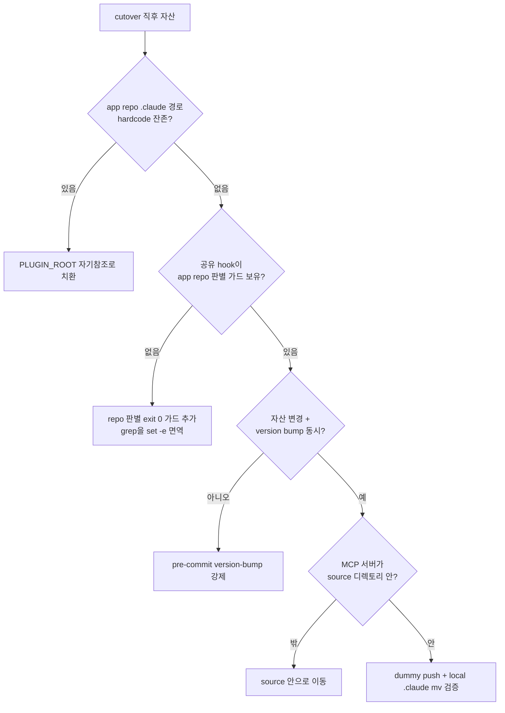

로컬 `.claude/` 자산(skills, hooks, agents, commands)을 배포형 plugin으로 옮기는 cutover는 "파일을 plugin 디렉토리로 옮기면 끝"처럼 보인다. 실제로는 그 직관이 4개의 서로 다른 함정으로 갈라진다. 한 RIBs/ReactorKit iOS 개발 하네스를 `team-harness` plugin으로 cutover하면서, 예시 앱(여기선 moneyflow로 일반화)에 cutover를 적용하는 과정에서 이 4개가 차례로 터졌다. 흥미로운 건 네 함정이 표면 증상은 전혀 다른데(붕괴 / push 거부 / 동작 정지 / 연결 실패) **근원은 모두 경로 참조 정합성** 하나라는 점이다. 즉, "이 자산이 어디를 가리키고 있는가, 그리고 그 어디가 cutover 후에도 유효한가"가 무너지면 형태만 다른 실패로 표출된다.

cutover를 자산 이동(move)이 아니라 **참조 그래프 재배선(rewiring)** 으로 보면 네 함정이 한 화면에 들어온다. 이 글은 각 함정의 메커니즘·오진 패턴·구체 회피책을 박제하고, 마지막에 정합성 게이트 체크리스트로 묶는다.

## 함정 1 — self-contained 착시

가장 먼저 그리고 가장 음흉하게 터지는 함정. plugin 디렉토리 안에 skill `.md`, hook `.sh`, agent 정의가 **전부 들어 있다**. `ls`로 확인하면 완비돼 있고, 설치도 성공한다. 그래서 "이건 self-contained 됐다"고 단정한다.

그런데 자산 *본문*이 app repo의 `.claude/scripts/recall.sh`나 `.claude/lib/codegraph.json` 같은 경로를 hardcode로 참조하고 있으면 이야기가 달라진다. cutover를 끝내고 app repo에서 그 로컬 `.claude/scripts`를 strip(삭제)하는 순간, plugin은 존재하지 않는 경로를 부른다. 파일이 plugin 안에 "있는 것"과 plugin이 "자기 자신만으로 동작하는 것"은 완전히 다른 명제다.

```bash
# 착시를 일으키는 hardcode (cutover 후 붕괴)
SCRIPT="$REPO_ROOT/.claude/scripts/recall.sh"   # app repo가 사라지면 NULL

# 자기참조로 교정 (plugin 내부에서 닫힘)
SCRIPT="${PLUGIN_ROOT}/scripts/recall.sh"
```

회피책은 단순하다. cutover 후 자산 전체를 `grep -rn '\.claude/' <plugin_dir>`로 훑어 app repo 경로 잔존을 찾고, 전부 `${PLUGIN_ROOT}` 같은 plugin 자기참조 변수로 치환한다. 검증은 "파일 존재 확인"이 아니라 **"app repo의 `.claude`를 임시로 mv 한 뒤 plugin이 동작하는가"** 로 해야 진짜다. 존재 확인은 착시를 강화할 뿐이다.

## 함정 2 — 공유 hooksPath의 부수효과

두 번째 함정은 hook 격리가 안 됐을 때 터진다. 여러 repo가 같은 `core.hooksPath`(또는 plugin이 등록한 공유 hook 디렉토리)를 가리키면, harness용으로 만든 pre-push 훅이 **그 hooksPath를 공유하는 모든 repo에서 실행**된다. 의도는 harness repo만 보호하는 것이었는데, app repo(moneyflow)에서도 같은 훅이 돈다.

문제는 그 훅이 harness 전용 가정을 깔고 있다는 점이다. 예를 들어 훅이 "변경된 파일 중 금지 패턴을 grep"하는데, 그 grep이 app repo에서는 0건 매치한다. `set -e`가 켜진 스크립트에서 grep이 매치 0건이면 exit 1을 반환하고, 스크립트는 그 줄에서 즉사한다.

```bash
#!/usr/bin/env bash
set -e
# app repo에서는 이 grep이 0건 → exit 1 → set -e가 스크립트를 즉사
git diff --cached --name-only | grep 'harness/'
echo "이 줄은 영원히 실행되지 않는다"   # 의도된 에러 메시지도 못 찍음
```

결과는 **무출력 push reject**다. 스크립트가 의도한 에러 메시지(예: "harness 자산 변경 감지")를 출력하기도 전에 grep의 종료 코드로 죽기 때문에, 사용자는 *아무 메시지 없이* push만 막히는 상황을 본다. set -e + grep의 조합은 "조건 검사"가 아니라 "조건 불일치 시 즉사 트랩"으로 둔갑한다.

회피책은 두 갈래다. (1) 훅 최상단에 **repo 판별 가드**를 둔다 — 현재 repo가 harness가 아니면 즉시 `exit 0`으로 빠진다. (2) grep을 조건 검사로 쓸 땐 `set -e`에서 면역시킨다(`if grep ...; then` 또는 `grep ... || true`). 둘 다 하는 게 안전하다.

```bash
# repo 판별 가드 — app repo면 즉시 통과
git rev-parse --show-toplevel | grep -q 'team-harness$' || exit 0

# grep을 set -e에서 면역
if git diff --cached --name-only | grep -q 'harness/'; then
  echo "harness 자산 변경 감지" >&2
fi
```

## 오진 사례 — "push 막힘 = 보호 브랜치"라는 단정

함정 2가 실전에서 위험한 이유는 증상이 흔한 다른 원인으로 위장되기 때문이다. push가 무출력으로 거부되면 반사적으로 "원격 보호 브랜치 정책이겠지"라고 단정하기 쉽다. 원격을 뒤지고, 권한을 확인하고, credential을 갱신하고 — 전부 헛다리다. 범인은 **로컬 pre-push 훅**이다.

범인을 규명한 방법은 **stdin 시뮬레이션**이었다. pre-push 훅은 git이 stdin으로 `<local ref> <local sha> <remote ref> <remote sha>` 라인을 넘긴다. 이걸 손으로 흉내 내 훅을 직접 호출하면, 네트워크/원격을 전혀 건드리지 않고 로컬 훅만 단독 재현할 수 있다.

```bash
# 가짜 ref 라인을 stdin으로 흘려 로컬 pre-push 훅만 단독 재현
echo "refs/heads/main $(git rev-parse HEAD) refs/heads/main 0000000000000000000000000000000000000000" \
  | bash .git/hooks/pre-push origin git@example.invalid:repo.git
echo "exit: $?"
```

이 한 줄로 "원격을 안 거쳤는데도 비-제로 종료가 난다"가 드러나면 로컬 훅이 범인임이 확정된다. 교훈: **무출력 push reject는 원격을 의심하기 전에 로컬 훅을 stdin 시뮬로 격리 재현하라.** 가설(보호 브랜치)을 검증 없이 사실로 승격하면 엉뚱한 곳에서 시간을 태운다.

## 함정 3 — version bump 누락

세 번째 함정은 cutover가 성공한 *다음*에 온다. plugin 자산을 수정해서 배포했는데 클라이언트가 옛 동작 그대로다. 코드도 맞고 배포 로그도 깨끗하다. 원인은 `plugin.json`의 `version`을 그대로 둔 것.

버전이 곧 캐시 무효화 키다. 캐시는 "설치된 version == 배포된 version"이면 "이미 최신"으로 판단하고 다운로드를 **skip**한다. 자산 내용이 바뀌었어도 version이 같으면 캐시는 그 변경을 영영 못 본다. 결과는 **stale 정지** — 자산은 바뀌었는데 동작은 옛것에 멈춰 있다.

이건 "고장"이 아니라 "설계상 캐시가 의도대로 동작한 것"이라 더 헷갈린다. 회피책은 규율: **자산 변경과 version bump를 같은 커밋에 묶는다.** pre-commit 훅으로 "plugin 자산 디렉토리에 변경이 있는데 `plugin.json`의 version이 안 바뀌었으면 커밋 차단"을 강제하면 사람의 기억에 의존하지 않는다.

```bash
# pre-commit: 자산 변경 시 version bump 강제
if git diff --cached --name-only | grep -qE '^plugin/(skills|hooks|agents|commands)/'; then
  git diff --cached -- plugin/plugin.json | grep -q '"version"' \
    || { echo "자산 변경 감지 — plugin.json version bump 필요" >&2; exit 1; }
fi
```

## 함정 4 — MCP 서버 위치

마지막 함정은 부분 생존이라 진단이 까다롭다. cutover 후 skill·hook·agent는 멀쩡히 동작하는데 MCP 도구만 연결에 실패한다. "절반은 되니까 cutover는 대체로 성공했다"는 착각을 부른다.

원인은 MCP 서버 실행 파일이 **marketplace source 디렉토리 밖**에 있었던 것. plugin을 패키징/캐싱할 때 캐시에 포함되는 범위는 선언된 source 디렉토리 안쪽으로 한정된다. skills 등은 source 안에 있어 캐시에 같이 실려 살아남지만, MCP 서버 바이너리(또는 엔트리 스크립트)가 source 밖 경로에 있으면 캐시에 안 들어가고, 클라이언트는 존재하지 않는 경로의 서버를 띄우려다 연결에 실패한다.

회피책: MCP 서버를 marketplace source 디렉토리 **안쪽**으로 옮기고, `plugin.json`의 MCP server 경로도 `${PLUGIN_ROOT}` 자기참조로 맞춘다. 검증은 함정 1과 같은 원리 — app repo의 로컬 `.claude`를 임시로 치운 상태에서 MCP 도구가 실제로 핸드셰이크에 성공하는지까지 확인한다. skill이 산다고 MCP가 산다는 보장은 없다.

## 정합성 게이트 체크리스트

네 함정이 한 뿌리(경로 참조 정합성)에서 나오므로, 방어도 단일 게이트로 묶을 수 있다. cutover 직전·직후에 다음을 통과시킨다.



- **`${PLUGIN_ROOT}` 자기참조 / 절대경로 금지**: `grep -rn '\.claude/' <plugin>`로 app repo 경로 잔존 0건 확인. 모든 참조는 plugin 자기참조.
- **repo 판별 가드**: 공유 hook 최상단에서 비-harness repo면 `exit 0`. grep은 `if ...; then` 또는 `|| true`로 set -e 면역.
- **version bump 강제**: 자산 디렉토리 변경 시 `plugin.json` version 미변경이면 pre-commit 차단.
- **dummy push 검증**: stdin 시뮬로 로컬 pre-push 훅을 격리 재현 + app repo `.claude`를 임시로 치운 상태에서 skill·MCP 둘 다 동작 확인. "파일 존재"가 아니라 "참조 끊긴 환경에서 동작"이 합격 기준.

핵심은 검증을 "파일이 있나"에서 "참조가 끊긴 상태에서도 닫혀 동작하나"로 옮기는 것이다. cutover는 이동이 아니라 재배선이다.

## 자기 점검

- 내 plugin 자산은 app repo의 `.claude`를 임시로 옮긴 상태에서도 동작하는가, 아니면 단지 파일이 plugin 안에 "있을" 뿐인가?
- 공유 hooksPath의 pre-push 훅이 harness가 아닌 repo에서 돌 때, repo 판별 가드 없이 `set -e` + grep으로 무출력 즉사할 여지가 있는가?
- 무출력 push reject를 만났을 때, 원격 보호 브랜치를 의심하기 전에 stdin 시뮬로 로컬 훅을 격리 재현하는 반사가 있는가?
- 자산을 바꿀 때 version bump를 사람의 기억이 아니라 pre-commit 게이트로 강제하고 있는가? MCP 서버는 marketplace source 디렉토리 안쪽에 있는가?
