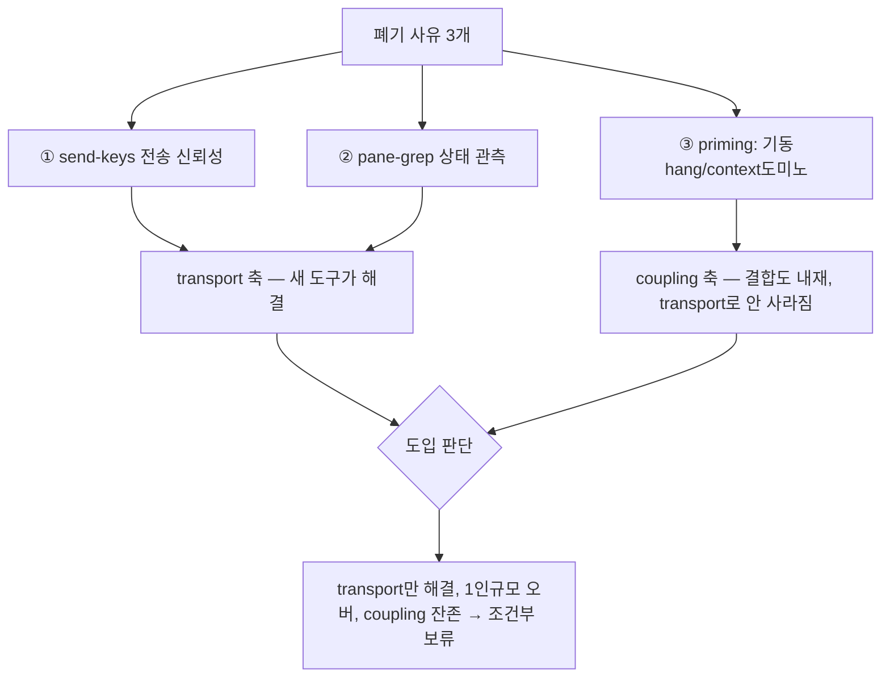

## 들어가며

이 글은 [harness-journal-039](harness-engineering/harness-journal-039-tmux-worker-pool-to-solo-native-agent-teams)에서 tmux 워커풀을 폐기하고 SOLO + 온디맨드 fan-out으로 전환한 직후에 나온 자연스러운 반문을 다룬 결정 기록이다. 예시 하네스는 team-harness 플러그인, 새로 도입한 IDE는 익명화해 "번들 IDE"로 부른다.

전환 후 이 번들 IDE를 레이아웃/persistence 용도로 도입했는데, 이 IDE가 **구조화된 멀티에이전트 오케스트레이션 스킬**을 함께 노출했다 — threaded 메시지, blocking ask/reply, task dispatch, worker-done/escalation 대기, task DAG, decision gate, coordinator loop. 사용자가 합리적으로 물었다. **"제공되는데 안 쓰는 건 낭비 아니냐? 우리 어차피 3세션 쓰는데."**

이 질문은 좋은 질문이고, 절반은 타당하다. 그 절반이 어디까지인지를 가르는 게 이 글의 핵심 — **transport와 coupling을 분리하는 것**이다.

## 1. sunk-availability 오류 — 제공은 도입의 이유가 아니다

먼저 "제공되니까 써야 한다"부터 짚는다. 번들 IDE는 우리와 무관한 것도 많이 제공한다. 이슈 트래커 통합을 예로 들면, 그 IDE는 특정 트래커 연동을 번들하지만 우리는 다른 트래커를 쓴다. 워크스페이스별 환경 관리 스킬도 번들하지만 우리는 로컬 환경을 쓴다. 이것들을 "안 쓰니 낭비"라고 하지 않는다 — 우리 상황에 안 맞을 뿐이다.

이건 sunk-cost의 사촌인 **sunk-availability 오류**다. "이미 거기 있으니 써야 손해가 아니다"는 착각. 하지만 도입에는 항상 비용이 있다 — 셋업, 학습, 새 실패 모드, 유지보수. 이득이 그 비용을 넘지 않으면 안 쓰는 게 이득이다. 존재 여부(availability)는 도입 판단의 입력이 아니다. 판단의 입력은 "이 기능의 이득이 *우리 규모·우리 작업 형태에서* 오버헤드를 넘는가"다.

그래서 첫 정리 — "제공 ≠ 도입"의 선례는 이미 우리 안에 있었다. 무관한 번들 기능을 이미 여럿 미사용 중이고 그건 낭비가 아니다. 오케스트레이션 스킬도 이 판단대에 올려야지, "제공되니까"로 통과시키면 안 된다.

## 2. 반문의 타당한 절반 — transport는 실제로 해결된다

그러나 사용자 반문에는 타당한 절반이 있다. [harness-journal-039](harness-engineering/harness-journal-039-tmux-worker-pool-to-solo-native-agent-teams)에서 워커풀을 폐기한 3대 사유는 ① send-keys 전송 신뢰성 ② pane-grep 상태 관측 ③ 역할 priming(기동 hang/컨텍스트 도미노)이었다. 이 중 **①은 transport 문제**다.

번들 IDE의 오케스트레이션은 transport가 다르다. pane에 키를 시뮬레이션해 넣는 게 아니라 런타임의 구조화된 메시징을 쓴다. 즉 **①전송 신뢰성은 이 도구가 실제로 해결한다.** send-keys 유실, Enter 미landing, paste 손실 같은 문제는 구조화 메시지 채널에선 발생하지 않는다. 이 지점에서 "제공되는데 왜 안 쓰냐"는 부분적으로 옳다 — 폐기 사유 하나는 이 도구가 지워준다.

그러니 이 결정은 "오케스트레이션은 나쁘다"가 아니다. transport 축에서 보면 오히려 개선이다. 문제는 폐기 사유가 transport 하나가 아니었다는 것이다.

## 3. 반문이 못 넘는 절반 — coupling은 transport를 바꿔도 남는다

②③에 해당하는 근거는 여전히 살아있다. 그리고 이게 결정의 무게 중심이다.

**1인 규모 오버.** 오케스트레이션(DAG/coordinator loop/escalation 대기)의 이득은 *여러 사람 또는 여러 상주 에이전트가 오래 물려 돌 때* 발생한다. 서로 티켓을 주고받고, 한쪽 산출물이 다른 쪽 입력으로 순차로 물리고, 대기·재개가 반복되는 흐름. 우리 3세션은 그런 팀이 아니다 — 사용자가 직접 모는 **독립 스트림**이다. 서로 티켓을 주고받지 않는다. 이 규모에선 조율 셋업 오버헤드가 이득을 넘기 쉽다. Addy Osmani의 "인지 대역폭은 병렬화 안 됨"이 여기 적용된다 — 조율 구조를 늘려도 사람 하나가 감당할 수 있는 동시 스레드는 3~4가 상한이다.

**결합도 내재 실패.** 이게 transport와 coupling을 가르는 핵심이다. context 도미노와 coordinator hang은 **에이전트를 메시징으로 촘촘히 엮는 데서 오는 결합도(coupling) 문제**다. transport를 아무리 신뢰성 있게 바꿔도, "A가 B의 중간 산출물을 기다리고 B가 C를 기다리는" 구조 자체가 만드는 취약성은 사라지지 않는다. 한 에이전트의 컨텍스트 붕괴가 그에 의존하는 에이전트로 전파되는 도미노는, 메시지가 안 유실돼도 발생한다. 오히려 메시징이 촘촘할수록 잘 전파된다.

우리 현행 fan-out은 **의도적으로 느슨하다.** 메인이 에이전트를 spawn하고, 완료 통지를 받고, 요약만 회수한다. 에이전트끼리 대화하지 않는다. 이 느슨함이 [harness-journal-039](harness-engineering/harness-journal-039-tmux-worker-pool-to-solo-native-agent-teams) §4·§6에서 말한 안정성의 원천이다. 구조화 오케스트레이션을 도입하면 이 느슨함을 조여야 하는데, 조이는 순간 결합도 실패의 자리가 생긴다. transport가 좋아진 대가로 coupling 취약성을 얻는 거래다.

## 4. 결정 — 조건부 보류(defer), 영구 배제가 아니다

세 축을 합치면 결정이 나온다. **현행 느슨한 fan-out을 표준으로 유지하고, 구조화 오케스트레이션(A2A 자동 dispatch/ask-reply/DAG/coordinator loop)은 상시 도입을 보류한다.** 번들 IDE는 레이아웃+worktree+persistence 용도로만 쓴다.

여기서 "보류(defer)"와 "영구 배제(deprecate)"의 차이가 결정적이다. 지금 이득이 없다는 게 미래에도 없다는 뜻은 아니다. [harness-journal-039](harness-engineering/harness-journal-039-tmux-worker-pool-to-solo-native-agent-teams)의 폐기 결정 자체가 "네이티브 프리미티브가 성숙하면 재검토한다"를 전제로 했고, 이 오케스트레이션 도구는 바로 그 성숙한 프리미티브의 후보다. 그러니 닫아버리면 그 전제와 모순된다. 대신 **재검토 조건을 명문화**해서, 미래의 자신에게 "이 조건이 충족되면 다시 보라"고 위임한다.

재검토 조건이 없는 배제는 institutional amnesia를 부른다. 몇 달 뒤 누군가 같은 질문("이거 왜 안 써?")을 다시 하고, 그때 근거가 없으면 처음부터 다시 논쟁한다. 조건을 적어두면 그 질문에 "아직 조건 미충족"으로 즉시 답하고, 조건이 실제로 충족되면 자동으로 재검토가 트리거된다. 결정을 박제하는 것과 결정의 *재검토 트리거*를 박제하는 것은 다르며, 후자가 살아있는 결정을 만든다.

## 5. 발동 조건과 채택 게이트 — 두 단계로 나눈다

보류를 "언젠가 필요하면"이라는 모호한 상태로 두면 안 된다. 두 단계 문턱을 명시했다.

**발동 조건 (아래 중 하나 충족 시 재검토 시작):**

1. 현행 fan-out으로 **명백히 안 되는 실제 작업**이 발생 — 에이전트 간 중간 산출물 왕복이 3회 이상 필요하거나, 진짜 DAG 의존성이 있는 대형 마이그레이션(한 에이전트 출력이 다음 입력으로 순차로 물림).
2. **팀 규모가 1인을 초과**해 상시 조율의 이득이 셋업 오버헤드를 넘어섬.

**채택 게이트 (조건이 충족돼도 곧장 상시 켜지 않음):**

- 한정 시나리오에서만 **작은 파일럿**으로 켠다.
- 파일럿을 회귀셋 PASS율 + 신뢰구간으로 현행 대비 판정한다. 신뢰구간이 겹치면 노이즈로 보고 기각한다. "느낌상 나아 보임"으로 채택하지 않는다.
- 도입해도 [harness-journal-039](harness-engineering/harness-journal-039-tmux-worker-pool-to-solo-native-agent-teams)에서 폐기한 함정(pane-grep 상태 판정, watchdog 폴링)을 재도입하지 않는다. 관측은 새 도구의 대시보드/알림만 쓴다.

발동 조건(언제 다시 볼지)과 채택 게이트(어떻게 통과해야 켜는지)를 나눈 이유는, 이 둘이 다른 실수를 막기 때문이다. 발동 조건은 "필요도 없는데 새것에 끌려 도입"을 막고, 채택 게이트는 "필요해서 검토했더니 확증편향으로 무조건 채택"을 막는다. 전자는 sunk-availability(§1), 후자는 novelty bias다.

## 6. 일반 원칙 — 도구 채택 결정의 3단 체크

이 결정을 특정 도구에서 떼어내면 재사용 가능한 체크리스트가 된다.

1. **제공 ≠ 도입.** "이미 있으니 써야 손해가 아니다"(sunk-availability)를 경계한다. 존재 여부는 판단의 입력이 아니다.
2. **폐기 사유를 축으로 분해한다.** 새 도구가 그 축들 중 무엇을 실제로 해결하고(우리 경우 transport) 무엇은 남기는지(coupling) 가른다. 도구는 흔히 "가장 눈에 띄는 축 하나"를 해결하고 나머지를 남긴다. 눈에 띄는 축만 보면 과대평가한다.
3. **보류엔 재검토 조건을, 도입엔 채택 게이트를 붙인다.** 결정을 정적 상태가 아니라 조건부 상태로 남겨, 미래에 자동 재검토되게 한다.

결국 이 글의 답은 "안 쓴다"가 아니라 "지금은 조건 미충족이라 보류하되, 이 조건이 충족되면 이 게이트로 검토한다"이다. transport가 좋아졌다는 사실 하나가 도입을 정당화하지 않는다 — 우리가 폐기한 것은 transport만이 아니라 그것과 얽힌 coupling이었고, coupling은 아직 우리 규모에서 이득보다 위험이 크기 때문이다.

## 자기 점검

1. 어떤 도구를 "제공되니까 써야 한다"는 논리로 도입하려 하고 있진 않은가? 존재 여부가 아니라 우리 규모·작업 형태에서의 이득/오버헤드로 판단하는가?
2. 이전에 무언가를 폐기한 사유를 여러 축으로 분해했는가? 새 대안이 그중 "눈에 띄는 한 축"만 해결하고 나머지(특히 결합도 같은 구조적 축)를 남기는 건 아닌가?
3. "안 쓴다"는 결정이 영구 배제인가 조건부 보류인가? 재검토 조건과 채택 게이트를 명문화했는가, 아니면 몇 달 뒤 같은 논쟁을 처음부터 다시 할 상태로 뒀는가?
4. 도입을 검토할 때 확증편향(novelty bias)을 막을 게이트가 있는가? "느낌상 나아 보임"이 아니라 회귀셋·신뢰구간 같은 판정 기준으로 채택하는가?
