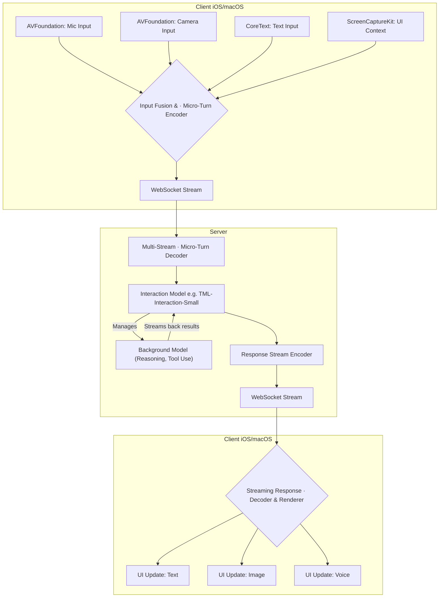

> **출처 검증 노트:** 긱뉴스 자동 큐레이션 (#134, 2026-05-13) 초안 기반. 원본 URL 미캡처. 스트리밍·전이중(full-duplex) 통신 패턴은 검증된 실제 기술이나, "200ms 마이크로 턴" 등 세부 수치는 원본 소스 미확인. 개념적 프레임워크로 활용 권장.

> **본인 메모:** 현재 우선순위는 배치 하네스 안정화. 실시간 협업 패턴은 ai-study 인터랙티브 피처 추가 시 참고. [[ai-agent-architecture-overview]], [[addy-osmani-agent-harness-engineering]], [[agents-md-orchestration-patterns]]

현재의 AI 상호작용은 대부분 탁구 게임과 같습니다. 사용자가 프롬프트를 입력하고 전송 버튼을 누르면, AI가 응답을 생성하는 동안 하염없이 기다려야 합니다. 이 턴 기반(turn-based) 모델은 단순한 질의응답에는 충분할지 몰라도, 복잡한 코드 작성이나 디자인 프로토타이핑 같은 창의적이고 역동적인 협업에는 심각한 병목 현상을 유발합니다. 사용자와 AI의 지식이 실시간으로 융합되지 못하고, 한쪽이 말하는 동안 다른 한쪽은 귀를 막고 기다리는 비효율적인 상황이 반복됩니다. 진정한 협업 파트너로서 AI를 활용하려면, 이 어색한 침묵과 지연을 극복하는 새로운 상호작용 모델이 필수적입니다.

## 턴 기반 모델의 근본적 한계

전통적인 AI 상호작용은 클라이언트가 API 요청을 보내고, 서버의 모델이 추론을 완료한 후 전체 응답을 반환하는 단방향 통신에 기반합니다. 이 구조는 다음과 같은 명백한 한계를 가집니다.

*   **높은 인지 부하 (High Cognitive Load):** 사용자는 응답을 기다리는 동안 작업 흐름이 끊기고, AI가 생성한 긴 응답을 한 번에 검토하고 수정해야 하는 부담을 집니다.
*   **대역폭 병목 (Bandwidth Bottleneck):** 사용자의 의도, 중간 생각, 시각적 맥락 등 풍부한 정보가 "전송" 버튼을 누르기 전까지는 AI에 전달되지 않습니다. 이는 인간과 AI 간의 협업 대역폭을 심각하게 제한합니다.
*   **수동적 상호작용 (Passive Interaction):** AI는 사용자의 입력이 끝날 때까지 수동적으로 기다릴 뿐, 사용자가 타이핑하는 동안 실시간으로 제안하거나 수정하는 능동적인 개입이 불가능합니다.

이러한 한계는 AI를 단순한 "도구"에 머무르게 합니다. 진정한 "협업 파트너"로 발전하기 위해서는, 대화가 끝나기 전에 서로 끼어들고, 함께 보며, 동시에 작업할 수 있는 실시간 상호작용 모델이 필요합니다.

## 실시간 협업을 위한 아키텍처 패턴

턴 기반의 한계를 넘어서기 위해, 클라이언트-서버 통신 방식부터 근본적으로 재설계해야 합니다. 핵심은 지속적인 연결(persistent connection) 위에서 데이터를 스트리밍하고, AI의 응답을 예측적으로 처리하는 것입니다.

### 1. 전이중(Full-Duplex) 통신과 마이크로 턴

Mira Murati가 설립한 Thinking Machines Lab에서 제시한 '인터랙션 모델'은 이 문제에 대한 중요한 접근법을 제시합니다. 이 모델은 대화를 긴 턴으로 나누는 대신, 약 200ms 단위의 '마이크로 턴'으로 쪼개어 처리합니다. 이를 통해 사용자의 음성, 영상, 텍스트 입력을 지속적으로 감지하고 AI가 자신의 응답을 생성하는 동시에 새로운 입력에 반응할 수 있습니다.

iOS 앱에서 이를 구현하려면 기존의 `URLSession.dataTask` 기반의 단발성 HTTP 요청에서 벗어나 `URLSessionWebSocketTask`를 사용한 양방향 통신 채널을 구축해야 합니다.

```swift
// 개념 증명을 위한 Swift WebSocket 클라이언트 예제
import Foundation

class RealtimeAICollaborator {
    private var webSocketTask: URLSessionWebSocketTask?

    func connect(url: URL) {
        let session = URLSession(configuration: .default)
        webSocketTask = session.webSocketTask(with: url)
        webSocketTask?.resume()
        listenForMessages()
    }

    // 사용자 입력을 (음성, 텍스트 등) 마이크로 턴으로 분할하여 전송
    func send(userInputChunk: Data) {
        webSocketTask?.send(.data(userInputChunk)) { error in
            if let error = error {
                print("WebSocket sending error: \(error)")
            }
        }
    }

    private func listenForMessages() {
        webSocketTask?.receive { [weak self] result in
            switch result {
            case .failure(let error):
                print("WebSocket receiving error: \(error)")
            case .success(let message):
                switch message {
                case .string(let text):
                    // AI가 생성 중인 텍스트 스트림 수신
                    self?.handleStreamingResponse(text)
                case .data(let data):
                    // AI가 생성 중인 이미지나 다른 바이너리 데이터 수신
                    self?.handleStreamingResponse(data)
                @unknown default:
                    fatalError()
                }
                // 다음 메시지를 계속 수신
                self?.listenForMessages()
            }
        }
    }

    func disconnect() {
        webSocketTask?.cancel(with: .goingAway, reason: nil)
    }

    private func handleStreamingResponse(_ text: String) { /* UI 업데이트 */ }
    private func handleStreamingResponse(_ data: Data) { /* UI 업데이트 */ }
}
```

이 접근 방식은 서버와 클라이언트가 거의 동시에 말하고 들을 수 있는 전이중 통신을 가능하게 하여, 대화의 자연스러움을 극대화합니다.

### 2. 멀티모달 입력 퓨전 (Multimodal Input Fusion)

실시간 협업은 텍스트에만 국한되지 않습니다. 구글의 'Project Astra'에서 보여주듯, AI는 사용자의 카메라 피드, 음성, 화면에 표시된 코드 등을 동시에 이해하고 상호작용해야 합니다. 이는 여러 입력 스트림을 의미 있는 단일 컨텍스트로 결합하는 '퓨전' 과정이 필요함을 의미합니다.

iOS 환경에서는 `AVFoundation`으로 카메라/마이크 입력을 받고, `ScreenCaptureKit` (macOS) 또는 `ReplayKit` (iOS)으로 화면 컨텍스트를 얻어, 이를 사용자의 텍스트 입력과 함께 WebSocket을 통해 서버로 스트리밍하는 아키텍처를 구상할 수 있습니다.



이 다이어그램은 다양한 소스(마이크, 카메라, 텍스트, 화면)의 입력이 클라이언트에서 융합되어 WebSocket을 통해 서버로 전송되는 흐름을 보여줍니다. 서버의 Interaction Model은 이 스트림을 실시간으로 처리하며, 필요시 더 복잡한 추론을 위해 Background Model과 비동기적으로 협력합니다.

### 3. 예측적 UI (Speculative UI)

네트워크 지연 시간은 피할 수 없습니다. 완전한 실시간 경험을 제공하기 위해서는, AI의 최종 응답이 도착하기 전에 클라이언트가 먼저 UI를 표시하는 '예측적 실행(Speculative Execution)' 기법을 도입할 수 있습니다. Apple은 'Speculative Streaming'이라는 연구를 통해 보조 모델 없이도 빠른 LLM 추론을 가능하게 하는 방법을 모색하고 있습니다.

예를 들어, 사용자가 코드를 작성하면 AI가 완성할 부분을 클라이언트가 예측하여 회색 텍스트로 즉시 보여주고, 실제 AI의 스트리밍 응답이 도착하면 해당 부분을 점진적으로 확정된 텍스트로 대체하는 방식입니다. 이는 사용자가 느끼는 지연 시간을 거의 0에 가깝게 만들 수 있습니다.

| 상호작용 모델 | 주요 기술 | 사용자 경험 (Latency) | 구현 복잡도 | 최적 사용 사례 |
| :--- | :--- | :--- | :--- | :--- |
| **턴 기반 (Turn-Based)** | HTTP Request/Response | 높음 (수 초) | 낮음 | 간단한 Q&A, 배치 작업 |
| **스트리밍 (Streaming)** | WebSocket, SSE | 중간 (수백 ms) | 중간 | 코드 생성, 긴 텍스트 초안 작성 |
| **예측적 (Speculative)** | Client-side Prediction + Streaming | 매우 낮음 (수십 ms) | 높음 | 실시간 코드 자동 완성, 페어 프로그래밍 |

## 트레이드오프: 언제 이 모델을 사용하지 말아야 하는가?

실시간 멀티모달 협업 모델은 강력하지만 만병통치약은 아닙니다.

*   **비용 및 인프라 복잡성:** 지속적인 WebSocket 연결과 스트리밍 데이터 처리는 단순한 API 호출보다 서버 부하가 크고 비용이 많이 듭니다. 상태를 유지해야 하므로 서버 아키텍처도 복잡해집니다.
*   **결정론적 작업의 부적합성:** 재무 보고서 생성이나 CI/CD 파이프라인 트리거와 같이 모든 단계에서 명시적인 확인과 감사가 필요한 작업에는 부적합합니다. 이런 경우, 사용자의 명확한 승인 단계가 있는 턴 기반 모델이 훨씬 안전하고 신뢰할 수 있습니다.
*   **사용자 피로도:** 지속적으로 반응하고 제안하는 AI는 경우에 따라 사용자에게 피로감을 주거나 방해가 될 수 있습니다. 사용자가 AI의 개입 수준을 조절할 수 있는 제어권을 제공하는 것이 중요합니다.

예를 들어, `aidy-ios` 프로젝트에 이 모델을 적용한다면, 사용자가 코드를 작성하는 IDE 화면에서는 예측적 스트리밍 모델을 적용하여 실시간 페어 프로그래밍 경험을 제공할 수 있습니다. 하지만, 작성된 코드를 기반으로 `/test-and-deploy`와 같은 슬래시 커맨드를 실행할 때는, 각 단계의 결과를 명확히 보고하고 다음 단계를 진행할지 묻는 전통적인 턴 기반 상호작용이 더 적합할 것입니다.

## 자기 점검

*   기존의 턴 기반 AI 상호작용 모델이 창의적인 협업을 방해하는 가장 큰 이유는 무엇인가요?
*   '마이크로 턴' 아키텍처가 기존의 스트리밍(예: SSE) 방식과 근본적으로 다른 점은 무엇이며, 이것이 사용자 경험에 어떤 영향을 미칠까요?
*   예측적 UI를 구현할 때, 클라이언트의 예측과 서버의 실제 응답이 다를 경우 발생할 수 있는 문제를 어떻게 해결할 수 있을까요?
*   현재 참여하고 있는 iOS 프로젝트에서 사용자의 입력을 기다리는 시간이 가장 길게 발생하는 지점을 찾아보고, 그 부분을 실시간 스트리밍 상호작용으로 개선할 수 있을지 아이디어를 구상해보세요.