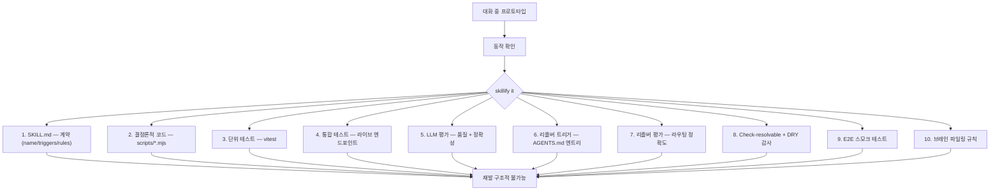

## 왜 지금 이 주제인가

나는 이 위키 자체가 "실패를 박제한다"는 원칙으로 굴러간다. `docs/solutions/` N=3+ 누적 → `/promote-solution`으로 코드 게이트 승격. 파편적으로는 이미 하고 있었다. 하지만 **언제 어느 단계까지 가야 '끝'인가**에 대한 고정된 10단 체크리스트는 없었고, *skill 자체의 평가(resolver eval, DRY audit)* 는 구멍이 크게 나 있다.

Garry Tan의 "skillify" 글이 그 공백을 정확히 찌른다. 글의 표면은 캘린더 recall / 타임존 계산 두 실패담이지만 속은 **thin harness / fat skills 아키텍처의 운영 메뉴얼**이다. 내 `promote-solution` 슬래시 커맨드와 의미가 완전히 겹친다 — 다만 10단계 중 몇 개가 아직 구현 안 되어 있다.

## 핵심 개념

### 1. LangChain의 진짜 갭 — 조각(pieces) vs 관례(practice)

LangChain은 $160M 펀딩, $1.25B 밸류에이션을 받았고 [LangSmith](https://blog.langchain.com/series-b/) 테스트 플랫폼은 trajectory eval / trace-to-dataset / LLM-as-judge / regression suite / unit test framework까지 *진짜 정교*하다 ([WebSearch로 교차 검증](https://pitchbook.com/profiles/company/522935-92)).

Garry Tan의 지적: **조각은 있다. 관례가 없다.**

> LangChain gives you testing tools. It never tells you what to test, in what order, or when you're done.
> — Garry Tan

"이 실패가 일어났다 → skill 작성 → 결정론적 코드 → 단위 테스트 → LLM 평가 → 리졸버 등록 → 리졸버 평가 → 중복 감사 → 스모크 → 브레인 파일링" 이 *고정된 순서*가 프레임워크에 박혀 있지 않다. 사용자가 매번 재발명해야 한다.

### 2. Latent vs Deterministic — 두 실패담의 진짜 교훈

두 버그 모두 **틀린 답이 아니라 틀린 쪽(wrong side)** 에서 처리된 것이 원인.

| 실패 | 표면 증상 | 진짜 원인 |
|---|---|---|
| "Singapore 출장이 언제였지?" | 에이전트가 live API → email search → API 재시도 5분 → 마지막에 로컬 grep | 결정론적 grep 작업을 latent space에서 추론으로 풀었다 |
| "다음 미팅 28분 뒤" | 실제로는 88분 뒤 (UTC→PT 환산 실수) | `context-now.mjs` 스크립트가 이미 있었는데 에이전트가 머릿속으로 계산 |

두 경우 모두 **에이전트가 스크립트를 만들고(latent) → 그 스크립트가 에이전트를 제약한다(deterministic)** 는 loop가 작동했다면 막혔다. 모델의 지능이 모델의 어리석음을 막는 제약을 생성한다.

이 아이디어는 이미 [AI Native 시스템 — 결정론적 제어](/wiki/harness-engineering/ai-native-system-deterministic-control)에서 다룬 "CLAUDE.md의 자연어 규칙은 부탁이지 강제가 아니다"와 완전히 같은 축에 있다.

### 3. "Skillify"는 동사다

프로토타입 → 동작 확인 → 한 단어: **"skillify it."**

글에서 직접 인용된 Garry Tan의 실제 지시 예시:

> "hot damn it worked. can you remember this as a webhook skill and skillify it, next time we need to do some webhooks? ... DRY it up too"

한 문장. 에이전트가 10단계를 돌려 **임시 세션을 영구 인프라로 박제**한다. 내가 쓰는 `/promote-solution`과 의미가 같지만 *트리거가 훨씬 가볍다*. N=3이 아니라 N=1에서도 "이건 영원히 박아야 돼" 판단이 서면 즉시.

## 구조 / 10단계 체크리스트

### 각 단계의 '이 단계가 없으면 생기는 구체적 버그'

| # | 단계 | 이 단계가 없을 때 |
|---|---|---|
| 1 | SKILL.md | 에이전트가 skill을 "찾아낼" 시그널이 없음 |
| 2 | 결정론적 코드 | latent에서 매번 다시 풀어냄, 느리고 재현 불가 |
| 3 | 단위 테스트 | Unicode location 드롭, 윤년 null, 단일 attendee 누락 |
| 4 | 통합 테스트 | fixture는 깨끗해서 못 잡는 real-data 엣지 케이스 (CRLF, 자정 걸친 이벤트) |
| 5 | LLM eval | 답이 맞았어도 **과정이 틀린 것** (머릿속 계산)을 감지 못함 — 다음엔 틀릴 답 |
| 6 | 리졸버 트리거 | skill은 존재하나 도달 불가 — "외과의사 있는데 병원 디렉토리에 없음" |
| 7 | 리졸버 eval | false negative(안 뜸) + false positive(엉뚱한 게 뜸) — 특히 `calendar-check` vs `calendar-recall` vs `google-calendar` 같은 3-way 모호함 |
| 8 | DRY 감사 | Garry Tan의 실측: skill 40개 중 **6개가 unreachable** (15% dark) + deploy-k8s와 kubernetes-deploy가 공존하는 drift |
| 9 | E2E 스모크 | 각 조각은 옳은데 에이전트가 전부 무시하고 즉흥으로 답하는 실패 |
| 10 | 파일링 규칙 | brain-writing skill 13개 중 **10개가 잘못된 디렉토리에 쓰고 있었다** — 사람 vs 회사 혼동 등 |

## 실전 팁 / 안티패턴

### 팁 1 — "fucking shit" 검색으로 평가 케이스 찾기

Garry Tan의 정직한 휴리스틱:

> The most honest eval heuristic I've found: search your conversation history for when you said "fucking shit" or "wtf." Those are the test cases you're missing.

내 conversation log에서 욕하거나 당황한 지점 = 진짜 실패 케이스 = 당장 eval로 박아야 할 것. 나는 여태 회고(`docs/retros/`)만 뒤졌는데, raw session transcript가 더 높은 signal일 수 있다.

### 팁 2 — 리졸버 eval은 **두 층** 다 필요

- **구조 테스트**: AGENTS.md 테이블에 매핑이 있는가 (markdown parse)
- **LLM 라우팅 테스트**: intent 텍스트가 들어왔을 때 모델이 **실제로** 맞는 skill을 고르는가

테이블이 맞아도 trigger 설명이 애매하면 모델은 엉뚱한 걸 고른다. 둘 중 하나만 있으면 갭이 생긴다.

### 안티패턴 — Hermes Agent만 믿고 끝

[Hermes Agent 분석](/wiki/agents/hermes-agent-analysis)에서 다뤘듯 Hermes의 `skill_manage`는 **생성은 아름답게** 한다. 문제는 **검증이 없다**:

- 단위 테스트 없음
- 리졸버 eval 없음
- check-resolvable 없음
- DRY 감사 없음

→ 월요일에 `deploy-k8s` 만들고 목요일에 `kubernetes-deploy` 만들면 둘 다 살아남아 ambiguous routing. 공식 Hermes 문서에도 [skill_manage가 create/update/delete를 맡는다](https://hermes-agent.nousresearch.com/docs/user-guide/features/skills)고만 적혀 있지 상호 검증 장치는 빠져 있다. "생성 책임은 Hermes, 검증 책임은 GBrain" 분업이 글의 핵심 포지셔닝.

## 내 프로젝트에 적용하기

ai-study는 **10단계 중 1, 2, 3은 이미 있고 5, 7, 8은 구멍이 크다**. 갭 지도:

| # | 단계 | ai-study 현황 | 갭 |
|---|---|---|---|
| 1 | SKILL.md | `.claude/commands/*.md` (promote-solution, compound, consult...) | ✅ |
| 2 | 결정론적 코드 | `scripts/*.mjs` 다수 (scan-promotions, mermaid-fix, embed-content...) | ✅ |
| 3 | 단위 테스트 | `scripts/__tests__/validate-content.test.mjs` (vitest 34 케이스) | 커버리지 좁음 |
| 4 | 통합 테스트 | 빌드 단계 + manifest 검증 | 라이브 엔드포인트 테스트 약함 |
| 5 | **LLM eval** | **거의 없음** — `benchmark-models.mjs`는 품질 비교지 daily 재발 방지 아님 | 🔴 |
| 6 | 리졸버 트리거 | `CLAUDE.md` "Skill routing" 섹션 | ✅ (부분) |
| 7 | **리졸버 eval** | **없음** | 🔴 |
| 8 | **DRY 감사** | `scan-promotions.mjs`가 solution 중복만 감지, skill 중복은 안 봄 | 🟡 |
| 9 | E2E 스모크 | `npm run build` 통과만 확인 | 에이전트 경로 E2E 없음 |
| 10 | 파일링 규칙 | `CLAUDE.md`의 Project Structure 섹션 | ✅ (부분) |

### 후속 작업 (우선순위 순)

- **🔴 [우선] check-resolvable 스크립트**: `.claude/commands/*.md` 전수 → CLAUDE.md "Skill routing"에 등록 여부 대조 → unreachable 리스트. `scripts/check-skills-reachable.mjs` 신규, weekly CI로.
- **🔴 [우선] 리졸버 eval 스위트**: 대표 intent 20~30개 → expectedSkill 매핑 → Claude에게 라우팅 시켜 정확도 측정. 기존 `benchmark-models.mjs` 구조 재사용 가능.
- **🟡 [차순위] skill DRY 감사**: 두 slash command가 의미 overlap 하는지 (예: `curate-inbound` vs `ingest` vs `promote-solution`) matrix로 박고 skill 파일에 "lane" 선언 강제.
- **🟡 [차순위] "fucking shit" 로그 추출기**: `~/.claude/projects/-Users-jominho-Develop-ai-study/` 세션 transcript 그렙 → 실패 케이스 후보 리스트. eval 씨드 공급원.
- **⚪ [나중] LLM eval cron**: 위 리졸버 eval을 daily GitHub Action으로. 통과율 떨어지면 Issue 생성.

### 기존 엔트리와의 관계

- `/promote-solution`의 N=3+ 코드 게이트 승격([Compound Engineering 철학](/wiki/harness-engineering/compound-engineering-philosophy) 계열)은 skillify의 **보수적 버전** — Garry Tan은 N=1에서도 `"skillify it"` 한 마디로 즉시 박제. 내 워크플로에 "즉시 박제" 트리거도 추가할지 고민.
- [Skill 시스템 도입](/wiki/harness-engineering/skill-system-introduction)에서 정리한 "슬래시 커맨드 vs Skill"은 1단계 계약의 *형태* 얘기였고, skillify는 그 형태 **밖의 9단계**를 채운다.
- [GBrain + OpenClaw + Hermes 스택](/wiki/agents/gbrain-openclaw-hermes-stack)이 전체 시스템 그림이라면, skillify는 그 시스템을 **건강하게 유지**하는 운영 프로토콜이다.

## 자기 점검

1. 내 `.claude/commands/` 중 CLAUDE.md "Skill routing"에 **등록 안 된 unreachable** skill이 몇 개 있을지 지금 추측해 보고, 실제로 돌려서 확인하라. 차이가 나면 그 차이만큼 내 시스템이 "dark"다.
2. 최근 3개 `docs/retros/*.md`를 열어 "같은 실수를 2번째 한 건"이 있는가? 있다면 왜 skillify가 안 됐나 (단계 1~10 중 어디가 빠졌나)?
3. `/promote-solution`은 N=3에서 발동한다. Garry Tan은 N=1에서도 발동한다. **어느 쪽이 내 프로젝트에 맞는가**, 그리고 그 판단 기준은 무엇인가?
4. Hermes의 `skill_manage`처럼 "에이전트가 스스로 skill을 만드는" 기능을 내 시스템에 도입한다면, 검증 책임은 어디가 맡아야 하나 (CI? pre-commit hook? weekly cron?)?
5. (열린 질문) "LLM eval이 skill 하나마다 있어야 한다"와 "CLAUDE.md는 자연어 부탁이라 약하다"를 함께 성립시키면, **최종 'skill'의 참된 형태는 코드 + 테스트 + 문서 3-튜플**이라고 말할 수 있는가? 그럼 `.md` 파일만 있는 기존 slash command는 **불완전한 skill**인가?

### 실습 과제

`scripts/check-skills-reachable.mjs` MVP를 오늘 중 작성한다. 요구사항:

1. `.claude/commands/*.md` 파일 이름 목록 (글로벌 `~/.claude/commands/` 포함 여부는 결정 후)
2. `CLAUDE.md`의 "## Skill routing" 섹션 파싱 → 언급된 skill 이름 추출
3. 1과 2의 차집합 출력 — "존재하는데 라우팅 안 됨" + "라우팅되는데 존재 안 함"
4. 결과가 empty가 아니면 exit code 1 (CI 실패용)
5. `npm test`에 vitest 케이스로 엮기 — 합성 fixture로 양방향 감지 확인

완성하면 `/compound`로 회고에 박고, 결과가 skill drift 발견하면 그 자체를 `/promote-solution` 시드로.

## 출처

- **원본**: [Garry Tan — "The surefire way to make sure your agents never repeat the same mistake" (X/Twitter, 2026-04)](https://x.com/garrytan/status/2046876981711769720) — 본문은 사용자 수동 paste로 확보 (x.com WebFetch 402 차단)
- **보강 / 교차 검증**:
  - [GitHub — garrytan/gbrain](https://github.com/garrytan/gbrain) — "Garry's Opinionated OpenClaw/Hermes Agent Brain"로 스택 구조 확인
  - [garrytan/gbrain README + GBRAIN_SKILLPACK.md](https://github.com/garrytan/gbrain/blob/master/docs/GBRAIN_SKILLPACK.md) — RESOLVER.md / 26 skills 구조 확인
  - [Hermes Agent — Skills System 문서](https://hermes-agent.nousresearch.com/docs/user-guide/features/skills) — `skill_manage` 도구의 create/update/delete 역할 확인
  - [Hermes Agent — Persistent Memory 문서](https://hermes-agent.nousresearch.com/docs/user-guide/features/memory) — MEMORY.md 바운디드 character limit 확인
  - [LangChain Series B blog](https://blog.langchain.com/series-b/) + [PitchBook 프로파일](https://pitchbook.com/profiles/company/522935-92) — $160M 펀딩, $1.25B 밸류에이션 교차 확인
  - [TechCrunch — gstack 논쟁 기사](https://techcrunch.com/2026/03/17/why-garry-tans-claude-code-setup-has-gotten-so-much-love-and-hate/) — gstack/GBrain 생태계 배경

**확인하지 못한 부분**: 본문 안의 구체 수치(skill 40개, unreachable 6개, brain-writing 13개 중 10개 오파일링, LLM eval 35개 daily, 리졸버 eval 50+ 케이스)는 Garry Tan 본인이 본인 시스템에 대해 말한 값이라 *외부 교차 검증 불가*. 원문 claim 그대로 인용했으며, 내 시스템의 실제 수치는 `check-skills-reachable.mjs` 구현 후 측정.
