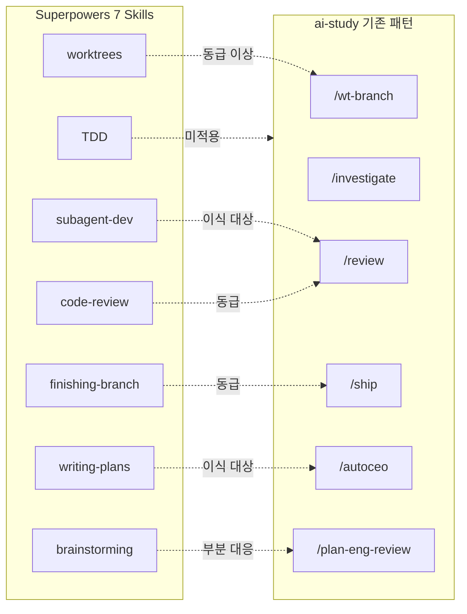

## 왜 지금 이 주제인가

obra/superpowers는 2025년 10월 공개 후 GitHub 15만+ 스타를 모은 에이전틱 스킬 프레임워크다. "코딩 에이전트가 즉시 코드부터 쓰는 대신, clarify → design → plan → code → verify 5단 규율을 강제한다"는 철학.

나는 이미 `/wt-branch`, `/investigate`, `/review`, `/ship`, `/autoceo` 등 유사한 커맨드 체계를 구축했다. Superpowers를 통째로 설치하면 기존 skill routing과 충돌하므로, **개별 패턴 단위로 비교하고 이식할 것만 골라내는 것**이 목적이다.

## 핵심 개념

### Superpowers 7대 스킬 요약

| 스킬 | 핵심 메커니즘 |
|------|-------------|
| **brainstorming** | 소크라테스식 질문으로 설계 정제. 설계 승인 전 구현 코드 작성 금지 (Hard-Gate) |
| **using-git-worktrees** | 격리된 작업 공간 생성. 패키지 매니저 자동 감지 + 베이스라인 테스트 |
| **writing-plans** | 2~5분 단위 태스크 분해. placeholder 표현 = 계획 실패 |
| **subagent-driven-development** | 태스크당 fresh subagent + 2-stage review (spec → quality) |
| **test-driven-development** | RED → verify RED → GREEN → verify GREEN → REFACTOR. 예외 없음 |
| **requesting-code-review** | 계획 준수 체크리스트 기반 리뷰 요청 |
| **finishing-a-development-branch** | 병합 vs PR 결정 + worktree 정리 |

### 관통하는 설계 원칙

Superpowers의 모든 스킬에 공통으로 나타나는 메타 패턴 3가지:

1. **Iron Law (절대 규칙)**: 각 스킬마다 "예외 없음" 수준의 불가침 규칙이 있다. TDD의 "테스트 실패를 직접 보지 않았으면 올바른 테스트인지 모른다", Debugging의 "근본 원인 없이 수정 금지".
2. **Anti-Rationalization Guard**: "이번만 괜찮겠지"를 구조적으로 차단. 스킬 문서에 "만약 자신이 X라고 생각하고 있다면, 멈춰라" 형태의 명시적 경고가 포함됨.
3. **Staged Completeness**: 단계별 승인 없이 다음 단계로 진행 불가. Brainstorming → Plan → Implement가 단방향 게이트.

## 구조 / 프레임워크 / 다이어그램

### ai-study 기존 패턴 vs Superpowers 대조



### 갭 분석 결과

| Superpowers 스킬 | ai-study 대응 | 판정 | 근거 |
|---|---|---|---|
| using-git-worktrees | `/wt-branch` + squash merge 함정 해결 | **우리가 우위** | Journal 003에서 squash merge 함정까지 해결. Superpowers는 worktree 생성 + 베이스라인 테스트까지만 |
| systematic-debugging | `/investigate` (4-phase 동일 구조) | **동급** | Iron Law "근본 원인 없이 수정 금지" 동일 |
| finishing-a-development-branch | `/ship` + `/land-and-deploy` | **동급** | 병합/PR 결정 + 정리 워크플로우 동일 |
| requesting-code-review | `/review` | **동급** | diff 분석 기반 리뷰 |
| brainstorming | `/plan-eng-review` (선택적) | **갭 있음** | Hard-Gate 강제 메커니즘 부재 |
| subagent-driven-development | `/review` (1-stage) | **갭 있음** | Spec compliance 단계 누락 |
| writing-plans | Plan mode (placeholder 검출 없음) | **갭 있음** | No-placeholder 자기 검증 부재 |
| test-driven-development | 미적용 | **의도적 미적용** | 위키 프로젝트에 TDD 강제는 과도 |

## 실전 팁 / 안티패턴

### 이식 대상 3개 패턴 상세

#### 패턴 1: SDD 2-Stage Review

**현재 문제**: `/review`가 diff만 보고 코드 품질을 판단. "계획대로 구현했는가?"를 검증하지 않음.

**Superpowers 방식**:
- Stage 1 — **Spec Compliance**: Plan 문서와 실제 구현을 1:1 대조. 빠진 항목, 추가된 항목, 변경된 항목 식별
- Stage 2 — **Code Quality**: 코드 자체의 품질 (네이밍, 구조, 보안, 성능)
- 순서 고정: Stage 1 통과 후에만 Stage 2 진행
- 둘 다 통과해야 완료

**안티패턴**: Stage 2부터 시작하면 "코드는 깔끔한데 스펙과 다른" 결과물이 통과됨.

#### 패턴 2: No-Placeholder Plan Validation

**현재 문제**: Plan mode에서 "validation 추가", "에러 처리", "TBD" 같은 placeholder가 들어가도 검출 메커니즘이 없음.

**Superpowers 방식**:
- 각 단계 = 2~5분 분량
- 실제 파일 경로, 함수명, 커맨드가 명시되어야 유효
- Self-review 체크리스트: spec coverage → **placeholder scan** → type consistency
- 금지 표현: "TBD", "add validation", "similar to Task N", "etc.", "as needed"

**검출 가능한 placeholder 패턴** (정규식):
```
/\b(TBD|TODO|FIXME|as needed|etc\.?|similar to|add \w+ later)\b/i
```

#### 패턴 3: Brainstorming Hard-Gate

**현재 문제**: 사용자가 "이거 만들어줘"라고 하면 바로 구현에 진입. `/plan-eng-review`는 존재하지만 선택적.

**Superpowers 방식**:
- "구현 코드/스캐폴딩 작성 금지" — 설계가 제시되고 승인될 때까지
- "너무 단순해서 설계가 필요 없다" = 안티패턴 (모든 작업에 설계 필요, 짧더라도)
- 프로세스: 탐색 → 1문제씩 질문 → 2~3 접근법 제시 → 설계 제시 → 승인 → Plan 전환

**ai-study 적용 시 조정**: 위키 엔트리 추가 같은 단순 작업에는 과도. **새 기능 개발**(컴포넌트, API, 스크립트)에만 게이트 적용.

## 내 프로젝트에 적용하기

> 아래는 **이식 계획**이다. 즉시 실행이 아니라 향후 세션에서 하나씩 진행.

- **SDD 2-Stage Review 이식**: `/review` 스킬 수정 — Plan 문서가 존재하면 Stage 1 (Spec compliance)을 자동 추가. 없으면 기존 1-stage 유지. `/autoceo` 자동 스프린트에서 특히 효과적
- **No-Placeholder Scan 이식**: Plan mode 종료 전 self-review에 placeholder 정규식 검출 추가. 검출 시 해당 단계를 구체화하도록 프롬프트
- **Brainstorming Hard-Gate 선택적 적용**: CLAUDE.md의 skill routing에 "새 기능 요청 시 brainstorming → plan → implement 게이트" 규칙 추가. 단, 엔트리 추가/수정 같은 콘텐츠 작업은 제외
- **Anti-Rationalization Guard 도입**: 기존 스킬에 "이런 생각이 들면 멈춰라" 형태의 명시적 경고 추가 — Superpowers의 가장 범용적인 메타 패턴
- **TDD는 보류**: 위키 프로젝트에서 전면 TDD 강제는 ROI 낮음. 단, `scripts/` 유틸리티 함수에는 점진적 테스트 추가 가능 (이미 `scripts/__tests__/validate-content.test.mjs` 선례 있음)

## AI Agent Directive

**Trigger**: 새 스킬/커맨드를 설계하거나 기존 스킬의 리뷰 파이프라인을 강화할 때. 특히 `/review`, `/autoceo`, Plan mode 관련 작업 시.

**Prerequisites**:
- `harness-engineering/skill-system-introduction`
- `harness-engineering/compound-automation-slash-commands`

**Actionable Steps**:
1. 이식 대상 3개 패턴(SDD 2-stage, no-placeholder, brainstorming hard-gate) 중 현재 작업과 관련된 것 확인
2. Plan 문서가 존재하는 PR 리뷰 시 → Stage 1 (Spec compliance) + Stage 2 (Code quality) 2단 리뷰 적용
3. Plan mode 종료 전 `TODO`, `TBD`, `will be implemented` 등 placeholder 정규식 검출
4. Anti-rationalization guard — "이 정도면 충분하다"는 판단이 들면 한 번 더 점검

**Anti-patterns**:
- 전면 TDD 강제 (위키 프로젝트 ROI 낮음)
- Superpowers 구조를 그대로 복사 (우리 스킬 체계에 맞게 이식)
- Plan 문서 없는 작업에 2-stage 리뷰 강제 (1-stage 유지)

## 자기 점검

1. Superpowers의 2-stage review에서 Stage 1과 Stage 2의 차이를 설명할 수 있는가?
2. "No-placeholder" 규칙에서 금지되는 표현 3개를 즉시 떠올릴 수 있는가?
3. 우리 `/wt-branch`가 Superpowers의 worktree보다 우위인 이유를 한 문장으로 설명할 수 있는가?
4. Brainstorming hard-gate를 ai-study에 적용할 때 제외해야 하는 작업 유형은?
5. (열린 질문) Superpowers의 "anti-rationalization guard" 패턴을 우리 기존 스킬 중 어디에 먼저 적용하면 가장 효과적일까?

### 실습 과제

향후 세션에서 `/review` 스킬을 열고, Plan 문서가 존재하는 PR에 대해 수동으로 Stage 1 (Spec compliance) 리뷰를 한 번 수행해본다. 자동화 전에 수동 체험으로 감을 잡는 것이 목적.

## 출처

- 원본: [obra/superpowers](https://github.com/obra/superpowers) — Jesse Vincent, MIT License, 157k+ stars
- 보강 자료:
  - [Superpowers Framework: New Methodology for Coding Agents (AIToolly)](https://aitoolly.com/ai-news/article/2026-04-16-superpowers-a-new-agentic-skills-framework-and-software-development-methodology-for-coding-agents)
  - [I Tested Superpowers for Claude Code - Here is the Truth (Mejba Ahmed)](https://www.mejba.me/blog/superpowers-plugin-claude-code-review)
  - [Superpowers: How I am using coding agents in October 2025 (Jesse Vincent blog)](https://blog.fsck.com/2025/10/09/superpowers/)
