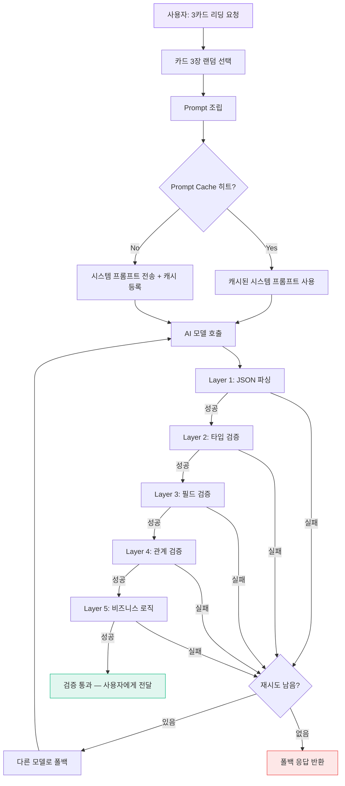

## 왜 이 Flow Map인가

타로 AI 서비스는 **"사용자의 인생 고민에 AI가 답하는"** 특수한 도메인이다. 환각이 일반 코드 생성보다 훨씬 위험 — "연애 문제로 고민하는 사용자에게 AI가 완전히 엉뚱한 카드 해석을 주면 서비스 신뢰 붕괴."

Tarosaju는 이 문제를 **3단계 방어선**으로 해결한다:
1. **Zod 5-Layer 구조 검증** — 출력 형식 + 내용 일관성 보장
2. **Prompt Caching** — 78장 카드 컨텍스트를 캐시하여 비용 90% 절감
3. **Bounded Retry + Circuit Breaker** — 실패 시 모델 전환 + 장애 전파 차단

이 Flow Map은 "타로 리딩 요청 한 건"이 이 3단계를 어떻게 통과하는지 관통한다.

---

## 타로 리딩 요청의 여정



---

## Layer별 검증 상세

### Zod 5-Layer 구조

```
Layer 1: JSON 파싱
  └─ AI 응답이 유효한 JSON인가?
     (마크다운 코드블록 래핑, trailing comma 등 자동 정리)

Layer 2: 타입 검증 (Zod Schema)
  └─ 필수 필드 존재? 타입 일치?
     { cards: Card[], interpretation: string, advice: string }

Layer 3: 필드 검증
  └─ cards 배열이 정확히 3장인가?
     각 카드의 name이 78장 중 하나인가?
     interpretation이 50자 이상인가?

Layer 4: 관계 검증
  └─ 3장의 카드가 서로 중복되지 않는가?
     과거-현재-미래 위치가 올바르게 배정됐는가?

Layer 5: 비즈니스 로직 (가장 중요)
  └─ 해석이 선택된 카드의 의미와 일치하는가?
     "The Tower" 카드인데 "안정적인 시기입니다" 같은 모순 탐지
     조언이 질문 유형(연애/직장/건강)과 관련 있는가?
```

Layer 5가 **환각 방어의 핵심** — 형식은 완벽하지만 내용이 엉뚱한 경우를 잡는다. MoneyFlow의 "강력 매수인데 신뢰도 30%" 모순 탐지와 같은 원리.

### Prompt Caching 구조

```
시스템 프롬프트 (캐시 대상):
┌──────────────────────────────┐
│ 타로 78장 카드 의미 사전      │ ← 모든 리딩에서 동일
│ 해석 가이드라인               │ ← 모든 리딩에서 동일
│ 출력 JSON 스키마              │ ← 모든 리딩에서 동일
│ 존별 톤 가이드 (6개 존)       │ ← 존 선택 시 변경
└──────────────────────────────┘

사용자 메시지 (매번 다름):
┌──────────────────────────────┐
│ 선택된 카드 3장               │
│ 질문 유형 (연애/직장/건강)     │
│ 사용자 질문 텍스트             │
└──────────────────────────────┘
```

시스템 프롬프트가 전체 토큰의 80%+ → **캐시 적중률 극대화**. Anthropic Prompt Caching으로 캐시 히트 시 입력 토큰 비용 90% 절감.

---

## 수익화 직전 보안 Hardening (#27-#32)

Tarosaju는 수익화(페이월) 도입 직전에 집중적인 보안 강화를 진행했다. 결제 연동 = 보안 표면 확대이기 때문.

| PR | 내용 | 방어 대상 |
|----|------|-----------|
| #27 | Zod 5-Layer + Prompt Caching | AI 환각 + 비용 |
| #30 | OG 이미지 26개 + 접근성 + Naver SEO | 검색 노출 + 접근성 |
| #31 | MyPage + 알림 UX 다듬기 | 사용자 경험 |
| #32 | CSP + 이메일 보호 + CRON 검증 | XSS + 스팸 + 무단 트리거 |
| #33 | 페이월 리디자인 + React Compiler + 보안 | 결제 보안 |

**핵심 교훈**: 보안은 수익화 전에 완료. 수익화 후에 보안 구멍이 발견되면 "돈 받고 있는데 안전하지 않은" 최악의 상황.

---

## Tarosaju vs MoneyFlow 방어선 비교

| 요소 | MoneyFlow | Tarosaju |
|------|-----------|----------|
| 에이전트 수 | 13개 (분석 차원별) | 1개 (리딩 생성) |
| 검증 | 모순 탐지 에이전트(별도) | Zod 5-Layer(코드) |
| 폴백 | 모델 폴백 체인 | 모델 폴백 + 캐시 응답 |
| 비용 전략 | 풀스로틀 + Prompt Caching | Prompt Caching (캐시율 80%+) |
| 도메인 리스크 | 투자 손실 | 사용자 신뢰 붕괴 |

공통점: **Bounded Retry + 구조적 출력 검증 + Prompt Caching**. 도메인이 달라도 Harness 패턴은 동일.

---

## 내 프로젝트에 적용하기

- [ ] Zod 5-Layer 패턴을 ai-study의 Gemini 과외 파이프라인에도 적용 (현재 MDX 출력 검증이 빌드 시점에만 동작)
- [ ] Prompt Caching을 MoneyFlow에도 측정 — 13개 에이전트의 시스템 프롬프트 캐시 적중률 확인
- [ ] 수익화 전 보안 Hardening 체크리스트를 범용화하여 다른 프로젝트에도 적용

---

## 자기 점검

1. Zod 5-Layer에서 Layer 5(비즈니스 로직)가 왜 가장 중요한가?
2. Prompt Caching이 타로 서비스에서 특히 효과적인 구조적 이유는?
3. 수익화 직전에 보안 Hardening을 하는 이유를 "보안 표면" 관점에서 설명할 수 있는가?
4. MoneyFlow의 모순 탐지 에이전트와 Tarosaju의 Zod Layer 5는 같은 문제를 다른 방식으로 풀고 있다. 각각의 장단점은?
5. (열린 질문) Zod 검증을 코드로 하는 것과 별도 LLM-as-a-Judge로 하는 것, 어떤 상황에서 어떤 방식이 나을까?

### 실습 과제

본인의 사이드 프로젝트에서 AI API를 호출하는 곳을 하나 골라, Zod 스키마로 출력 검증을 추가해보라. Layer 1-3(JSON 파싱 + 타입 + 필드)만으로도 환각 방어 효과를 체감할 수 있다.

---

## 출처

- Tarosaju PR #27: AI Response Hardening — Zod 5-Layer + Prompt Caching
- Tarosaju PR #32: 수익화 직전 보안 강화 — CSP + 이메일 보호 + CRON 검증
- Tarosaju PR #47: AI API 3단계 방어선 스프린트 문서화
- Tarosaju CLAUDE.md: 6개 존 테마 시스템 + AI 파이프라인 구조
