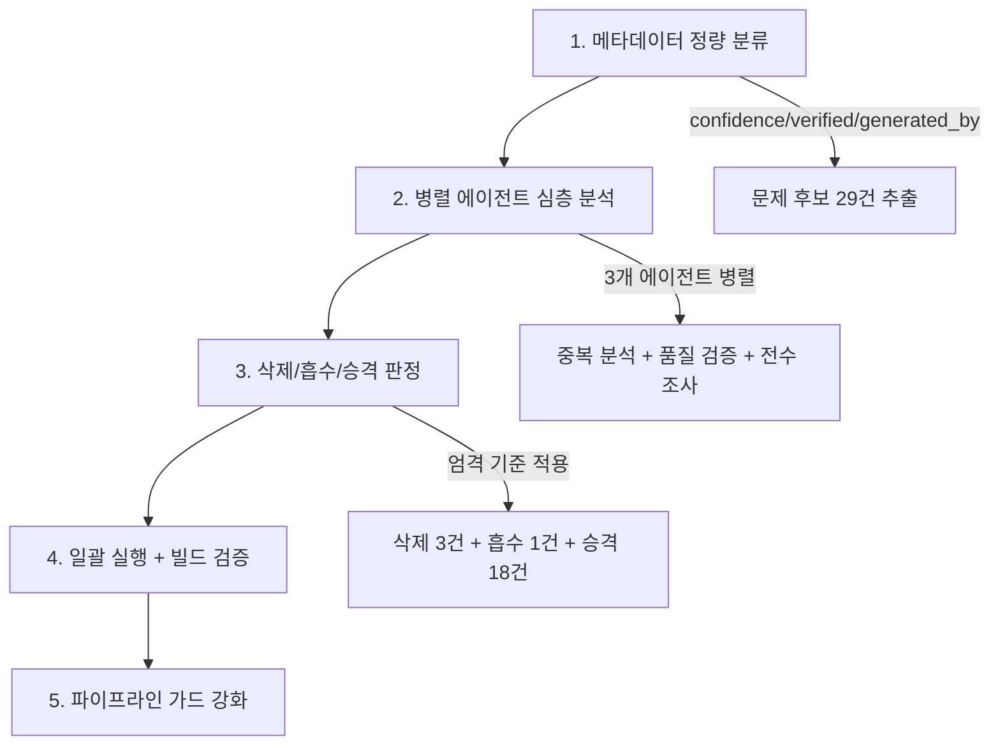

이 엔트리는 2026-05-03 세션에서 194개 위키 엔트리를 전수 조사한 실전 프로세스를 방법론으로 박제한 것이다.

## 왜 필요한가

위키가 190개를 넘어가면서 품질 관리가 필수가 됐다. 특히:

- **자동 생성 콘텐츠(25건)**가 검증 없이 쌓이고 있었음
- **confidence 1이 18건** — "들어봤다" 수준이 위키에 남아있으면 신뢰도 하락
- **verified:none이 11건** — 한 번도 검증 안 된 엔트리
- **초기 엔트리(15건)**가 한 달간 업데이트 없이 방치

## 5단계 품질 감사 프로세스



### 1단계: 메타데이터 정량 분류

content-manifest.json에서 3가지 축으로 분류:

```typescript
// 문제 후보 추출 쿼리
const problems = entries.filter(e =>
  e.confidence === 1 ||              // 18건
  !e.last_verified ||                // 11건 (중복 있음)
  e.generated_by === 'gemini'        // 25건 (중복 있음)
);
// → 합집합 29건이 심층 분석 대상
```

전체 194개를 읽지 않고 29건으로 즉시 범위를 좁혔다.

### 2단계: 병렬 에이전트 심층 분석

3개 에이전트를 동시에 띄워서 각각 다른 관점으로 분석:

| 에이전트 | 역할 | 분석 대상 |
|---------|------|----------|
| 중복 분석 | 유사 엔트리 그룹 4개 비교 | 14건 |
| 품질 검증 | verified:none 전수 검토 | 11건 |
| 전수 조사 | confidence 1 전량 평가 | 18건 |

**병렬 실행 이점**: 순차 실행 대비 3배 속도. 각 에이전트가 독립적으로 파일을 읽고 판정하므로 충돌 없음.

### 3단계: 삭제/흡수/승격 판정

5가지 삭제 기준을 적용:

1. **실측 없는 이론** — "~할 수 있다" 수준의 추측
2. **80%+ 내용 중복** — 더 좋은 엔트리가 이미 있음
3. **프로젝트 무관 일반론** — 교과서 요약 수준
4. **SEO 스팸 제목** — 과장된 수치, 미검증 주장
5. **적용 대상 불명확** — "iOS를 위한"이면서 iOS에 적용 불가

결과:

| 판정 | 건수 | 세부 |
|------|------|------|
| 삭제 | 3건 | sandbox-diff(실측 0), persona-engineering(미검증), tenet-harness(의사코드만) |
| 흡수 | 1건 | ai-environment-design → overview에 통합 |
| confidence 승격 | 18건 | 1→2 (내용 충분 확인 후) |
| 미완성 보강 | 7건 | 코드 예시 + quiz 추가 |

### 4단계: 일괄 실행 + 빌드 검증

모든 수정 후 반드시:
- `npm run build` — Mermaid/MDX 에러 체크
- `npm test` — 71개 테스트 통과 확인
- dangling connections 확인 — 삭제한 엔트리를 참조하는 곳 정리

### 5단계: 파이프라인 가드 강화

삭제가 필요했다는 것은 생성 단계에서 품질 관리가 부족했다는 뜻. Gemini 프롬프트에 6중 가드를 추가하여 재발 방지:

→ 상세: [AI 생성 콘텐츠 품질 게이트](/wiki/evaluation/ai-generated-content-quality-gate)

## 실측 결과

| 지표 | Before | After |
|------|--------|-------|
| confidence 1 | 18개 | **0개** |
| verified:none | 11개 | **0개** |
| 퀴즈 없는 비저널 엔트리 | ~22개 | **0개** |
| 오래된 verified (≤04/09) | 15개 | **0개** |
| 자동생성 삭제 대상 | 3개 | 삭제 완료 + 가드 추가 |

## 재사용 가능한 원칙

1. **전체를 읽지 말고 메타데이터로 분류** — 정량 지표가 있으면 범위를 90% 줄일 수 있다
2. **병렬 에이전트로 관점 분리** — 중복/품질/완성도를 한 에이전트가 다 보면 편향됨
3. **삭제 기준은 사전에 명문화** — 감정이 아닌 체크리스트로 판정
4. **삭제보다 가드가 중요** — 사후 삭제 3건보다 사전 차단 가드 6종이 장기적 ROI가 높다
5. **감사 자체를 엔트리로 박제** — Compound Engineering: 이 사이클이 다음 감사의 입력이 된다
