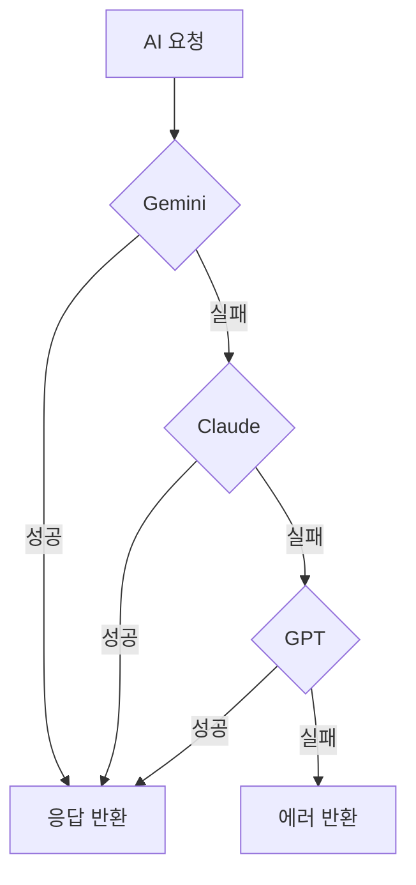

## 핵심 개념

프로덕션에서 LLM API는 반드시 실패한다. 레이트 리밋, 서버 에러, 타임아웃. 단일 프로바이더에 의존하면 서비스 전체가 중단된다. 멀티 프로바이더 fallback은 **한 프로바이더가 실패하면 자동으로 다른 프로바이더로 전환**하는 아키텍처.

## 실전 사례: 3-프로바이더 fallback 체인

mino-moneyflow에서 구현한 패턴:



### Circuit Breaker 패턴

3회 연속 실패 시 해당 프로바이더를 2분간 차단:

```typescript
const CIRCUIT_BREAKER = {
  maxFailures: 3,      // 3번 실패하면
  cooldownMs: 120_000, // 2분간 차단
};

function isCircuitOpen(provider: string): boolean {
  const state = circuitState[provider];
  if (state.failures >= CIRCUIT_BREAKER.maxFailures) {
    const elapsed = Date.now() - state.lastFailure;
    return elapsed < CIRCUIT_BREAKER.cooldownMs;
  }
  return false;
}
```

### 지수 백오프 재시도

레이트 리밋(429)이나 서버 에러(503)에는 바로 다른 프로바이더로 넘기지 않고 재시도:

```typescript
async function callWithRetry(fn, maxRetries = 2) {
  for (let i = 0; i <= maxRetries; i++) {
    try {
      return await fn();
    } catch (err) {
      if (i === maxRetries) throw err;
      const delay = Math.pow(2, i) * 1000; // 1초, 2초, 4초
      await sleep(delay);
    }
  }
}
```

### Fallback 체인 구성

에이전트 역할에 따라 fallback 순서가 다를 수 있다:

```typescript
function buildFallbackChain(preferredProvider: string) {
  const all = ['gemini', 'claude', 'openai'];
  // 선호 프로바이더를 맨 앞으로, 나머지 순서대로
  return [
    preferredProvider,
    ...all.filter(p => p !== preferredProvider)
  ].filter(p => !isCircuitOpen(p));
}
```

## Structured Output 호환성

프로바이더마다 구조화된 출력 방식이 다르다:

| 프로바이더 | 방식 | 신뢰도 |
|-----------|------|--------|
| Gemini | `responseMimeType: 'application/json'` + Schema | 높음 |
| OpenAI | `response_format: { type: 'json_schema' }` | 높음 |
| Claude | 프롬프트로 JSON 강제 + 파싱 | 중간 |

3단계 JSON 파싱 fallback:
1. `JSON.parse()` 직접 시도
2. ` ```json ... ``` ` 코드 블록에서 추출
3. 정규식으로 첫 번째 `{...}` 추출

## 실전 Code Recipe: TypeScript 3-프로바이더 Fallback 구현

```typescript
import Anthropic from '@anthropic-ai/sdk';
import OpenAI from 'openai';
import { GoogleGenerativeAI } from '@google/generative-ai';

type Provider = 'gemini' | 'claude' | 'openai';

interface ProviderState {
  failures: number;
  lastFailure: number;
}

const CIRCUIT_BREAKER = {
  maxFailures: 3,
  cooldownMs: 120_000, // 2분
};

class MultiProviderLLM {
  private circuitState: Map<Provider, ProviderState> = new Map([
    ['gemini', { failures: 0, lastFailure: 0 }],
    ['claude', { failures: 0, lastFailure: 0 }],
    ['openai', { failures: 0, lastFailure: 0 }],
  ]);

  private anthropic = new Anthropic();
  private openai = new OpenAI();
  private gemini = new GoogleGenerativeAI(process.env.GEMINI_API_KEY || '');

  private isCircuitOpen(provider: Provider): boolean {
    const state = this.circuitState.get(provider)!;
    if (state.failures >= CIRCUIT_BREAKER.maxFailures) {
      const elapsed = Date.now() - state.lastFailure;
      return elapsed < CIRCUIT_BREAKER.cooldownMs;
    }
    return false;
  }

  private recordFailure(provider: Provider) {
    const state = this.circuitState.get(provider)!;
    state.failures += 1;
    state.lastFailure = Date.now();
    console.log(`[${provider}] Failure recorded (${state.failures}/${CIRCUIT_BREAKER.maxFailures})`);
  }

  private recordSuccess(provider: Provider) {
    const state = this.circuitState.get(provider)!;
    state.failures = 0;
    console.log(`[${provider}] Success - circuit reset`);
  }

  private buildFallbackChain(preferred?: Provider): Provider[] {
    const allProviders: Provider[] = ['gemini', 'claude', 'openai'];
    const available = allProviders.filter((p) => !this.isCircuitOpen(p));

    if (preferred && available.includes(preferred)) {
      return [preferred, ...available.filter((p) => p !== preferred)];
    }
    return available;
  }

  async callWithFallback(
    prompt: string,
    options?: { preferred?: Provider; maxTokens?: number }
  ): Promise<string> {
    const fallbackChain = this.buildFallbackChain(options?.preferred);

    if (fallbackChain.length === 0) {
      throw new Error('All providers are in circuit breaker state');
    }

    for (const provider of fallbackChain) {
      try {
        const result = await this.callProvider(provider, prompt, options?.maxTokens);
        this.recordSuccess(provider);
        console.log(`[${provider}] Success`);
        return result;
      } catch (error) {
        this.recordFailure(provider);
        console.log(`[${provider}] Error: ${(error as Error).message}`);

        if (provider === fallbackChain[fallbackChain.length - 1]) {
          // 마지막 프로바이더도 실패
          throw new Error(`All providers failed. Last error: ${(error as Error).message}`);
        }
      }
    }

    throw new Error('Unexpected error in fallback chain');
  }

  private async callProvider(
    provider: Provider,
    prompt: string,
    maxTokens: number = 1024
  ): Promise<string> {
    switch (provider) {
      case 'gemini':
        return this.callGemini(prompt, maxTokens);
      case 'claude':
        return this.callClaude(prompt, maxTokens);
      case 'openai':
        return this.callOpenAI(prompt, maxTokens);
    }
  }

  private async callClaude(prompt: string, maxTokens: number): Promise<string> {
    const response = await this.anthropic.messages.create({
      model: 'claude-3-5-sonnet-20241022',
      max_tokens: maxTokens,
      messages: [{ role: 'user', content: prompt }],
    });

    if (response.content[0].type === 'text') {
      return response.content[0].text;
    }
    throw new Error('Unexpected response format from Claude');
  }

  private async callOpenAI(prompt: string, maxTokens: number): Promise<string> {
    const response = await this.openai.chat.completions.create({
      model: 'gpt-4-turbo',
      max_tokens: maxTokens,
      messages: [{ role: 'user', content: prompt }],
    });

    return response.choices[0].message.content || '';
  }

  private async callGemini(prompt: string, maxTokens: number): Promise<string> {
    const model = this.gemini.getGenerativeModel({ model: 'gemini-2.0-flash' });
    const response = await model.generateContent({
      contents: [{ role: 'user', parts: [{ text: prompt }] }],
      generationConfig: {
        maxOutputTokens: maxTokens,
      },
    });

    return response.response.text();
  }
}

// 사용 예
const llm = new MultiProviderLLM();
const result = await llm.callWithFallback(
  '한글로 짧은 시를 써줘: 봄',
  { preferred: 'gemini' } // 비용이 저렴하므로 먼저 시도
);
console.log(result);
```

**핵심:**
- `buildFallbackChain()`: 현재 열린 circuit 제외하고 available 프로바이더만 사용
- `recordFailure()` / `recordSuccess()`: 상태 추적으로 건강한 프로바이더 우선
- `callWithFallback()`: 체인을 순회하며 첫 성공할 때까지 시도
- 로깅: 모든 실패 이유를 추적하여 프로덕션 모니터링 가능

## 설계 원칙

1. **실패는 기본 상태** — "성공하면 좋고" 가 아니라 "실패할 때 어떻게" 먼저
2. **빠른 실패, 빠른 전환** — 타임아웃은 짧게 (10-15초), fallback은 즉시
3. **프로바이더 상태 추적** — 성공/실패를 기록하여 건강한 프로바이더 우선
4. **비용 인식** — fallback 순서를 비용 순으로 (저렴한 것 → 비싼 것)
5. **로깅 필수** — 어떤 프로바이더가, 왜, 언제 실패했는지 반드시 기록

---

## AI Agent Directive

**Trigger**: 단일 LLM 프로바이더에 의존 중이거나 / API 레이트 리밋 · 타임아웃으로 요청이 실패할 때 / "한 프로바이더가 안 되면 전체 서비스 중단" 상황
**Prerequisites**: [Multi-Agent Pipeline](/wiki/agents/multi-agent-pipeline) — 멀티 에이전트 오케스트레이션의 일부 / [Tool Use](/wiki/agents/tool-use) — fallback이 tool selection에 영향

### Actionable Steps
1. **프로바이더 chain 정의** — 3개 이상의 LLM API 선택 후 선호 순서 명시
2. **Circuit breaker 구현** — 각 프로바이더별 실패 카운트 + cooldown 타이머 설정 (보통 3회 실패 → 2분 차단)
3. **지수 백오프 재시도** — 레이트 리밋(429) · 서버 에러(503)는 다른 프로바이더로 즉시 전환하지 말고 1초, 2초, 4초 대기 후 같은 프로바이더 재시도
4. **Structured output 호환성 검증** — Gemini/OpenAI/Claude의 JSON 출력 방식이 다름 · 3단 fallback parser 구현 (직접 parse → 코드 블록 추출 → 정규식)
5. **프로바이더별 비용 추적** — fallback 순서를 비용 순으로 정렬 (저렴 → 비싼 순)
6. **상세 로깅** — 각 프로바이더 호출 시 요청/응답/latency/비용을 기록

### Anti-patterns
- **단일 프로바이더 의존** — "Anthropic만 쓰면 되지" 마음. Rate limit · outage 발생 시 서비스 전체 중단
- **프로바이더 순환 없이 retry** — 같은 실패를 반복. 첫 실패는 다른 프로바이더 즉시 시도
- **Circuit breaker 없음** — 장애 프로바이더에 계속 요청 → 리소스 낭비 · 응답 지연
- **Structured output 검증 부족** — 프로바이더마다 JSON 형식이 약간씩 다름. 파서가 한 형식만 지원하면 실패
- **비용 무시한 fallback 순서** — 저렴한 프로바이더를 나중에 시도 → 예산 초과
