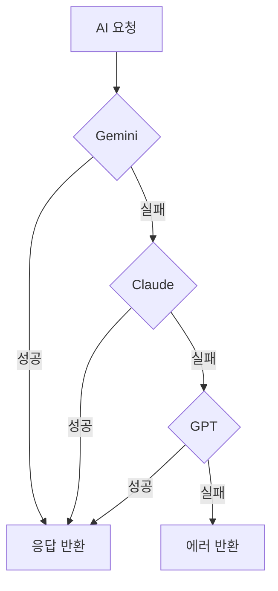

## 핵심 개념

프로덕션에서 LLM API는 반드시 실패한다. 레이트 리밋, 서버 에러, 타임아웃. 단일 프로바이더에 의존하면 서비스 전체가 중단된다. 멀티 프로바이더 fallback은 **한 프로바이더가 실패하면 자동으로 다른 프로바이더로 전환**하는 아키텍처.

## 실전 사례: 3-프로바이더 fallback 체인

mino-moneyflow에서 구현한 패턴:



### Circuit Breaker 패턴

3회 연속 실패 시 해당 프로바이더를 2분간 차단:

```typescript
const CIRCUIT_BREAKER = {
  maxFailures: 3,      // 3번 실패하면
  cooldownMs: 120_000, // 2분간 차단
};

function isCircuitOpen(provider: string): boolean {
  const state = circuitState[provider];
  if (state.failures >= CIRCUIT_BREAKER.maxFailures) {
    const elapsed = Date.now() - state.lastFailure;
    return elapsed < CIRCUIT_BREAKER.cooldownMs;
  }
  return false;
}
```

### 지수 백오프 재시도

레이트 리밋(429)이나 서버 에러(503)에는 바로 다른 프로바이더로 넘기지 않고 재시도:

```typescript
async function callWithRetry(fn, maxRetries = 2) {
  for (let i = 0; i <= maxRetries; i++) {
    try {
      return await fn();
    } catch (err) {
      if (i === maxRetries) throw err;
      const delay = Math.pow(2, i) * 1000; // 1초, 2초, 4초
      await sleep(delay);
    }
  }
}
```

### Fallback 체인 구성

에이전트 역할에 따라 fallback 순서가 다를 수 있다:

```typescript
function buildFallbackChain(preferredProvider: string) {
  const all = ['gemini', 'claude', 'openai'];
  // 선호 프로바이더를 맨 앞으로, 나머지 순서대로
  return [
    preferredProvider,
    ...all.filter(p => p !== preferredProvider)
  ].filter(p => !isCircuitOpen(p));
}
```

## Structured Output 호환성

프로바이더마다 구조화된 출력 방식이 다르다:

| 프로바이더 | 방식 | 신뢰도 |
|-----------|------|--------|
| Gemini | `responseMimeType: 'application/json'` + Schema | 높음 |
| OpenAI | `response_format: { type: 'json_schema' }` | 높음 |
| Claude | 프롬프트로 JSON 강제 + 파싱 | 중간 |

3단계 JSON 파싱 fallback:
1. `JSON.parse()` 직접 시도
2. ` ```json ... ``` ` 코드 블록에서 추출
3. 정규식으로 첫 번째 `{...}` 추출

## 설계 원칙

1. **실패는 기본 상태** — "성공하면 좋고" 가 아니라 "실패할 때 어떻게" 먼저
2. **빠른 실패, 빠른 전환** — 타임아웃은 짧게 (10-15초), fallback은 즉시
3. **프로바이더 상태 추적** — 성공/실패를 기록하여 건강한 프로바이더 우선
4. **비용 인식** — fallback 순서를 비용 순으로 (저렴한 것 → 비싼 것)
5. **로깅 필수** — 어떤 프로바이더가, 왜, 언제 실패했는지 반드시 기록
