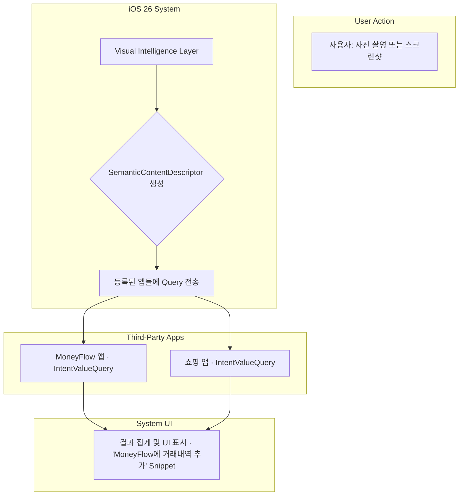

> 이 엔트리는 Blake Crosley의 [App Intents 2.0 In iOS 26: Visual Intelligence, Interactive Snippets, And Deferred Properties](https://blakecrosley.com/blog/app-intents-2-ios-26-additions)을 정독하고 핵심을 추출한 것이다.

이 엔트리는 Blake Crosley의 [App Intents 2.0 In iOS 26: Visual Intelligence, Interactive Snippets, And Deferred Properties](https://blake.crosley.com/blog/app-intents-2-0-in-ios-26-visual-intelligence-interactive-snippets-and-deferred-properties/)를 정독하고 핵심을 추출한 것이다. 원문은 가상의 iOS 26을 배경으로 App Intents의 진화 방향을 제시하며, Apple의 (가상) 공식 문서를 참조(¹, ², ³, ⁴)하여 분석한다.

### 왜 중요한가: 앱의 역할을 '도구'에서 '능동적 참여자'로 전환

기존의 App Intents는 사용자가 명시적으로 앱의 기능을 호출(Siri, 단축어)하는 '요청-응답' 모델에 가까웠다. Blake Crosley가 제시하는 iOS 26의 App Intents 2.0은 여기서 한 단계 나아가, 시스템이 사용자의 **시각적, 상황적 맥락을 먼저 이해**하고 앱에게 "이 맥락에 대해 제공할 정보가 있는가?"라고 묻는 **'맥락-참여' 모델**로의 전환을 의미한다.

이는 앱이 단순히 실행되기를 기다리는 수동적 존재가 아니라, OS의 지능적인 경험(Visual Intelligence, Spotlight 등)에 직접 컨텐츠와 인터랙션을 제공하는 능동적 참여자가 됨을 뜻한다. 이 모델의 세 가지 핵심 축은 다음과 같다.

1.  **Visual Intelligence**: 이미지를 보고 앱이 관련 정보를 제시한다.
2.  **Deferred Properties**: 비싼 연산은 실제 필요할 때까지 지연시켜 UI 반응성을 높인다.
3.  **Interactive Snippets**: 시스템 UI 내부에 앱의 미니 UI를 삽입하여 즉각적인 상호작용을 제공한다.

### 핵심 패턴

#### 1. 시각적 맥락을 쿼리로 변환: `IntentValueQuery`

Visual Intelligence의 핵심은 시스템이 이미지에서 추출한 의미론적 정보를 앱에 전달하고, 앱이 그에 맞는 `AppEntity`를 반환하는 것이다.

-   **패턴**: `IntentValueQuery` 프로토콜을 구현하여 시스템의 시각적 컨텍스트 쿼리에 응답한다. 시스템은 `SemanticContentDescriptor`를 제공하며, 앱은 이를 분석하여 관련 데이터를 반환한다.
-   **`SemanticContentDescriptor`**: 두 가지 핵심 정보를 담는다.
    -   `labels`: 이미지에서 인식된 카테고리 및 컨텐츠 태그 배열 (예: "와인병", "피노 누아")
    -   `pixelBuffer`: 원본 이미지 데이터. 앱이 자체 Vision 모델을 실행할 때 사용한다.

```swift
// Blake Crosley가 제시한 예시 코드
import AppIntents

// 사용자의 시각적 컨텍스트(이미지)를 받아 관련 Product 엔티티를 반환
struct ProductLookupQuery: IntentValueQuery {
    func values(for descriptor: SemanticContentDescriptor) async throws -> [Product] {
        // 시스템이 제공한 label을 기반으로 자체 카탈로그 검색
        let candidates = try await catalog.search(labels: descriptor.labels)
        return candidates.map(Product.init)
    }
}
```

이 패턴은 앱의 데이터베이스를 사용자의 시각적 세계와 직접 연결하는 강력한 다리 역할을 한다.



#### 2. 비동기식 지연 로딩: `@DeferredProperty`

`AppEntity`를 표시할 때, 제목이나 썸네일처럼 빠르게 가져올 수 있는 정보와 서버에서 상세 설명을 가져오는 것처럼 오래 걸리는 정보가 섞여 있으면 성능 저하의 원인이 된다.

-   **패턴**: `@DeferredProperty` 어트리뷰트를 사용하여 비용이 큰 프로퍼티를 비동기적으로 계산하도록 선언한다. 이 프로퍼티의 `get` 접근자는 `async throws`로 정의된다.
-   **동작 원리**: 시스템은 목록 UI 등에서는 이 프로퍼티를 호출하지 않는다. 사용자가 해당 엔티티를 선택하여 상세 정보가 실제로 필요한 시점에만 `get` 접근자를 실행한다.

```swift
// Blake Crosley가 제시한 예시 코드
import AppIntents

struct Recipe: AppEntity {
    // ... 기본 프로퍼티들
    @Property(title: "Title")
    var title: String

    @Property(title: "Cuisine")
    var cuisine: String

    // 상세 레시피는 사용자가 선택했을 때만 비동기적으로 로드
    @DeferredProperty(title: "Detailed Instructions")
    var instructions: String {
        get async throws {
            try await loadInstructionsFromBackend(id: id)
        }
    }
}
```

#### 3. 시스템 컨텍스트에 녹아드는 UI: `Interactive Snippets`

앱의 기능을 실행하기 위해 앱을 열 필요 없이, 시스템 UI(Spotlight, Siri 응답 등)에서 바로 상호작용이 가능한 작은 UI 조각을 제공한다.

-   **패턴**: `AppIntent`가 `ShowsSnippetView` 프로토콜을 채택하고, 결과 타입(`.result`)에 SwiftUI `View`를 포함하여 반환한다.
-   **인터랙션**: Snippet 내의 버튼 등은 다른 App Intent를 통해 앱의 기능을 다시 호출하거나 앱을 특정 컨텍스트로 실행시키는 등 완전한 상호작용을 지원한다.

```swift
// Blake Crosley가 제시한 예시 코드

// 1. App Intent가 Snippet View를 반환하도록 정의
struct WeatherForecastIntent: AppIntent {
    // ...
    func perform() async throws -> some IntentResult & ProvidesDialog & ShowsSnippetView {
        let forecast = try await weatherService.forecast(for: city)
        return .result(
            dialog: "Here's the forecast for \(city.name).",
            view: ForecastSnippet(forecast: forecast) // SwiftUI View를 결과에 포함
        )
    }
}

// 2. Snippet으로 표시될 SwiftUI View
struct ForecastSnippet: View {
    let forecast: Forecast
    var body: some View {
        VStack(alignment: .leading) {
            Text(forecast.headline).font(.headline)
            // ... 날씨 정보 표시
            Button("Open in App") {
                // 이 버튼은 다른 App Intent를 통해 앱 실행 로직과 연결됨
            }
        }
    }
}
```

### 실전 적용: `moneyflow` 앱에 Visual Intelligence 통합하기

`moneyflow` 앱에 위 패턴들을 적용하여 영수증 관리 경험을 혁신할 수 있다.

1.  **시나리오**: 사용자가 커피숍 영수증을 사진으로 찍는다.
2.  **`IntentValueQuery` 적용**:
    -   iOS Visual Intelligence는 이미지를 분석하여 "영수증", "카페", "12,000원" 등의 `labels`를 포함한 `SemanticContentDescriptor`를 생성한다.
    -   시스템은 `moneyflow` 앱의 `ReceiptScanQuery`(`IntentValueQuery` 구현체)를 호출한다.
    -   `ReceiptScanQuery`는 descriptor의 `labels`와 `pixelBuffer`(OCR용)를 사용하여 거래 내역 초안(`TransactionDraft` `AppEntity`)을 생성하여 반환한다.
3.  **`@DeferredProperty` 적용**:
    -   `TransactionDraft` 엔티티는 `storeName`, `amount` 등은 즉시 표시한다.
    -   하지만 '추천 카테고리'(`suggestedCategory`) 프로퍼티는 서버에 영수증 데이터를 보내 분석해야 하므로 비용이 크다. 이 프로퍼티를 `@DeferredProperty`로 선언한다. 사용자가 상세 편집 화면에 진입할 때만 카테고리 추천 로직이 동작한다.
4.  **`Interactive Snippet` 적용**:
    -   Visual Intelligence 결과 UI에 `TransactionDraft` 정보가 담긴 Snippet이 표시된다.
    -   Snippet에는 "식비로 저장" 버튼과 "직접 편집" 버튼이 포함된다.
    -   사용자가 "식비로 저장"을 누르면, 별도의 App Intent가 실행되어 `moneyflow` 앱을 열지 않고도 거래 내역이 즉시 저장된다. "직접 편집"을 누르면 `moneyflow` 앱의 거래 내역 편집 화면으로 바로 진입한다.

이처럼 App Intents 2.0의 개념을 적용하면, `moneyflow`는 단순한 가계부 앱을 넘어, 사용자의 일상(영수증 촬영)에 자연스럽게 개입하여 데이터 입력을 자동화하는 지능형 에이전트로 발전할 수 있다.