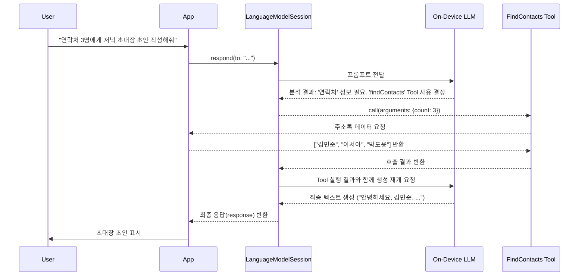

> 이 엔트리는 Blake Crosley의 [Apple Foundation Models: The On-Device LLM Framework, Explained](https://blakecrosley.com/blog/apple-foundation-models-framework)을 정독하고 핵심을 추출한 것이다. API 표기는 WWDC25 "Meet the Foundation Models framework" 세션과 [Apple 공식 문서](https://developer.apple.com/documentation/foundationmodels)로 교차 검증했다.

## 왜 중요한가: 제로-코스트, 완전한 프라이버시

Apple의 Foundation Models 프레임워크는 클라우드 LLM API의 시대에 종말을 고하고, **온디바이스 AI의 새로운 표준**을 제시한다. API 키, 토큰당 과금, 네트워크 지연, 개인정보 유출 위험 없이 iOS가 제공하는 LLM을 무료로 직접 사용할 수 있다.

이는 과거 클라우드 LLM을 사용해야만 했던 텍스트 요약, 분류, 정보 추출과 같은 기능들의 비용을 사실상 0으로 만든다. 개발자는 비싼 API 호출 비용과 복잡한 개인정보 처리 동의 절차 없이 앱의 핵심 가치에 집중할 수 있게 된다.

물론 트레이드오프는 명확하다. 이 모델은 최신 거대 모델(frontier model)이 아니다. 방대한 지식을 묻거나 복잡한 추론을 시키기보다, 앱 내의 **명확한 언어 과업을 수행하는 빠르고 똑똑한 인턴**처럼 활용해야 한다. 주어진 텍스트를 가공하고 구조화하는 데는 뛰어나지만, 세상의 모든 것을 알지는 못한다. 이 경계를 이해하는 것이 프레임워크 활용의 핵심이다.

## 핵심 패턴

### 패턴 1: 작업 단위로 관리되는 `LanguageModelSession`

모든 상호작용은 `LanguageModelSession`에서 시작된다. 이 세션은 대화의 맥락(context)을 유지하는 역할을 한다.

- **멀티턴(Multi-turn) 대화**: 챗봇처럼 이전 대화를 기억해야 하는 경우, 동일한 `LanguageModelSession` 인스턴스를 계속 사용한다.
- **싱글턴(Single-turn) 작업**: '이 텍스트 요약해줘'와 같이 독립적인 작업은 매번 새로운 세션을 생성하여 이전 컨텍스트가 토큰 예산을 낭비하거나 결과에 영향을 주는 것을 방지해야 한다.

```swift
import FoundationModels

// 싱글턴 작업: 매번 새로운 세션 생성
func summarize(text: String) async throws -> String {
  // 1. 모델 사용 가능 여부 확인은 필수
  //    availability는 .available / .unavailable(reason) 두 케이스 enum
  guard case .available = SystemLanguageModel.default.availability else {
    throw MyError.modelNotAvailable
  }
  
  // 2. 일회성 작업을 위한 세션 생성
  let session = LanguageModelSession()
  
  // 3. respond(to:) 호출로 결과 요청
  let response = try await session.respond(to: "Summarize this in one sentence: \(text)")
  
  return response.content
}
```

**주의**: `SystemLanguageModel.default.availability`를 통해 모델 사용 가능 여부를 먼저 확인해야 한다. 이 프로퍼티는 `.available` / `.unavailable(reason)` 두 케이스를 가진 enum이며, `.unavailable`의 reason으로 `.appleIntelligenceNotEnabled`(Apple Intelligence 꺼짐), `.deviceNotEligible`(미지원 기기), `.modelNotReady`(모델 다운로드 중) 등을 구분할 수 있다. 사용자 기기의 시스템 언어가 미지원 언어이면 프레임워크 자체가 비활성화된다.

### 패턴 2: 파싱의 종말, `@Generable`로 구조화된 데이터 직접 생성

이 프레임워크의 존재 이유이자 가장 강력한 기능은 **유도 생성(Guided Generation)**이다. LLM 응답으로 받은 불안정한 JSON 문자열을 파싱하고 예외 처리에 시달리는 대신, Swift 타입을 직접 생성하도록 요청할 수 있다.

`@Generable` 매크로를 Swift 구조체에 붙이면, 프레임워크가 모델의 출력 자체를 제약하여 반드시 해당 타입의 인스턴스를 반환하도록 강제한다.

```swift
@Generable // 모델이 이 타입을 직접 생성할 수 있도록 함
struct Recipe {
    @Guide(description: "The dish name") // 모델에게 필드의 의미를 설명
    let title: String
    
    @Guide(description: "Ingredients, each as 'quantity item'")
    let ingredients: [String]
    
    @Guide(description: "Total minutes, start to finish", .range(5...240)) // 값의 범위까지 제약
    let minutes: Int
}

let session = LanguageModelSession()

// 문자열이 아닌 Recipe.self 타입을 생성하도록 요청
let response = try await session.respond(
  to: "A weeknight pasta for two.", 
  generating: Recipe.self
)

// response.content는 이제 String이 아닌 Recipe 타입의 인스턴스
let recipe: Recipe = response.content 
print(recipe.title) 
```

`@Guide` 매크로를 통해 각 필드에 대한 설명, 숫자 범위, 정규 표현식 등의 제약을 걸 수 있다. 이는 "5에서 240 사이의 숫자를 주세요"라고 부탁하는 것이 아니라, 디코딩 과정 자체를 제약하여 다른 값이 생성될 수 없도록 막는 강력한 기능이다.

### 패턴 3: 모델의 한계를 넘어서는 `Tool` 프로토콜

`Tool` 프로토콜은 온디바이스 모델이 가진 지식의 한계를 극복하게 해준다. 모델이 생성 도중 실시간 정보가 필요하거나 특정 액션을 수행해야 할 때, **앱의 네이티브 코드를 호출**하고 그 결과를 받아와 답변 생성을 이어갈 수 있다.

```swift
struct FindContacts: Tool {
    let name = "findContacts"
    let description = "Find a specific number of contacts from the address book"

    @Generable // Tool의 인자 역시 타입-세이프하게 받음
    struct Arguments {
        @Guide(description: "How many contacts to return", .range(1...10))
        let count: Int
    }
    
    // 모델이 이 함수를 직접 호출
    func call(arguments: Arguments) async throws -> [String] {
        // 여기에 주소록을 읽어오는 실제 코드를 구현
        // let contacts = try fetchContactsFromDevice(limit: arguments.count)
        // return contacts.map { $0.formattedName }
        return ["김민준", "이서아", "박도윤"] // 예시 반환값
    }
}

// 세션을 생성할 때 사용 가능한 Tool을 등록
let session = LanguageModelSession(tools: [FindContacts()])

// 모델은 스스로 Tool 사용을 결정
let response = try await session.respond(to: "Draft a dinner invite to three of my contacts.")

// 최종 응답은 FindContacts().call()의 결과를 포함하여 생성됨
print(response.content) // e.g., "안녕하세요, 김민준, 이서아, 박도윤님! 저녁 식사에 초대합니다..."
```

모델이 `Tool`을 언제 사용할지는 오직 `description`에 달려있다. 다른 엔지니어가 이 설명만 보고도 함수를 정확히 사용할 수 있도록 명확하게 작성해야 한다.



## 실전 적용: `tarosaju` 프로젝트

`tarosaju` 앱에서 사용자가 뽑은 타로 카드 3장에 대한 해석을 생성하는 기능에 Foundation Models를 적용할 수 있다.

1.  **구조화된 데이터 정의**: 먼저 해석 결과를 담을 `@Generable` 타입을 정의한다.
    ```swift
    @Generable
    struct TarotReading {
        @Guide(description: "The overall theme or summary of the reading.")
        let overallMeaning: String
        
        @Guide(description: "Interpretation for each of the three cards in context.")
        let cardInterpretations: [CardInterpretation]
    }

    @Generable
    struct CardInterpretation {
        @Guide(description: "The name of the card.")
        let cardName: String
        
        @Guide(description: "How this card's meaning applies to the reading's context.")
        let meaningInContext: String
    }
    ```

2.  **모델에 생성 요청**: 사용자가 뽑은 카드 목록을 프롬프트에 담아 `TarotReading` 타입 생성을 요청한다.
    ```swift
    let drawnCards = ["The Fool", "The Magician", "The High Priestess"]
    let prompt = "Provide a tarot reading for a user asking about their career path. The cards they drew are: \(drawnCards.joined(separator: ", "))."

    let session = LanguageModelSession()
    let response = try await session.respond(to: prompt, generating: TarotReading.self)
    
    let reading: TarotReading = response.content
    
    // 이제 'reading' 객체를 사용하여 UI를 안전하게 구성할 수 있다.
    // 어떠한 JSON 파싱도, 문자열 분할도 필요 없다.
    updateUI(with: reading)
    ```

이 방식을 통해 `tarosaju` 앱은 API 비용 없이, 사용자의 민감한 질문(커리어, 관계 등)을 외부로 전송하지 않고 개인화된 해석을 제공할 수 있다. Guided Generation 덕분에 서버 없이도 안정적으로 구조화된 결과를 받아 UI에 바인딩할 수 있다.