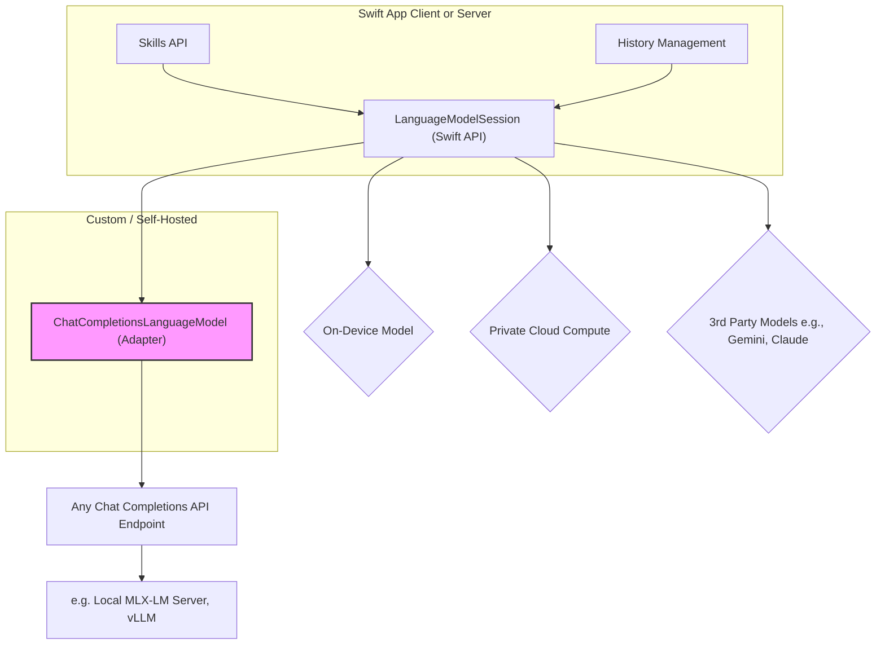

> 이 엔트리는 Blake Crosley의 [Apple Is Open-Sourcing the Foundation Models Framework](https://blakecrosley.com/blog/foundation-models-open-source)을 정독하고 핵심을 추출한 것이다.

이 엔트리는 Blake Crosley의 [Apple Is Open-Sourcing the Foundation Models Framework](https://blake.crosley.com/2026/06/10/apple-is-open-sourcing-the-foundation-models-framework.html)을 정독하고 핵심을 추출한 것이다. 원문은 Apple의 WWDC 발표 내용을 기반으로 작성되었으며, 이 엔트리는 원문이 참조한 Platforms State of the Union 발표와 `FoundationModelsUtilities` GitHub 리포지토리의 내용을 함께 분석한다.

### 왜 중요한가: Client-Server 대칭성의 확보

Apple은 올여름 `Foundation Models` 프레임워크를 오픈소스화할 것을 약속했다. 이는 WWDC에서 발표된 가장 중요한 소식 중 하나다. 지금까지 이 프레임워크는 Apple 디바이스 내에서만 작동했지만, 오픈소스화되면 Swift가 구동되는 모든 환경(특히 Linux 서버)에서도 동일한 API를 사용할 수 있게 된다.

이는 단순히 코드를 공유하는 것을 넘어, **클라이언트와 서버 간의 AI 워크플로우 대칭성(Symmetry)**을 확보하는 것을 의미한다. 개발자는 온디바이스 모델, Private Cloud Compute, 그리고 자체 서버에서 실행되는 모델까지 모두 동일한 `LanguageModelSession` 프로그래밍 모델로 제어할 수 있다.

이 발표와 함께, 즉시 사용 가능한 `FoundationModelsUtilities` Swift 패키지가 Apache-2.0 라이선스로 GitHub에 공개되었다. 이 패키지는 프레임워크의 오픈소스화를 기다리는 동안 우리가 먼저 활용할 수 있는 "실용적인 패턴들의 예고편"이다.

### 핵심 패턴

`FoundationModelsUtilities` 패키지는 에이전트(Agentic) 앱 개발 시 마주치는 세 가지 핵심 문제를 해결하는 패턴을 제시한다. 이 패턴들은 "신흥적이고 실험적"이라고 명시되어 있지만, Apple이 지향하는 AI 앱 아키텍처의 방향을 명확히 보여준다.

#### 1. 동적 컨텍스트 주입: `Skills` API

**문제점**: 기존의 에이전트는 모든 가능한 작업 지시사항을 하나의 거대한 시스템 프롬프트에 담아두는 경향이 있다. 이는 특정 작업과 무관한 지시사항까지 매번 모델에 전달하여 컨텍스트를 오염시키고, 처리 속도(TTFT, Time-To-First-Token)를 저하시킨다.

**해결책**: `Skills` API는 `Dynamic Profiles`라는 기본 기술을 사용하여, 특정 작업에 필요한 지시사항을 **적시에(just-in-time)** 대화 내용(transcript)에 주입한다.

- `Skill`은 특정 작업(예: "코드 작성", "이메일 초안 작성")을 위한 지시사항을 담은 객체다.
- `Skills` 컨테이너는 여러 `Skill`을 관리하며, `@resultBuilder`를 통해 선언적으로 구성된다.
- `allowsDeactivation: true` 옵션을 통해 세션 중간에 특정 스킬을 비활성화하여 컨텍스트를 더욱 동적으로 관리할 수 있다.

```swift
// 개념적 예시: Skills API를 사용한 동적 지시사항 구성
let mySkills = Skills {
  Skill("당신은 Swift 코드 전문가입니다. 항상 명확하고 간결한 코드를 작성해주세요.")
    .activation(.onTool("generate_swift_code"))

  Skill("당신은 친절한 이메일 작성 비서입니다. 격식있고 정중한 톤을 유지해주세요.")
    .activation(.onTool("draft_email"))
    .allowsDeactivation(true)
}

// 세션에 스킬을 적용하면, 해당 도구가 호출될 때만 관련 지시사항이 주입된다.
var session = LanguageModelSession(model: someModel, skills: mySkills)
```

이 패턴은 Apple의 Swift Intelligence Frameworks 수석 엔지니어링 매니저 Lori Hylan-Cho가 언급했듯, `Dynamic Profiles`라는 더 근본적인 기술 위에 구축된 추상화다.

#### 2. 컨텍스트 길이 관리: `History Management`

**문제점**: 에이전트와의 대화가 길어지면 전체 대화 기록이 모델의 컨텍스트 윈도우를 초과하게 된다.

**해결책**: 패키지는 대화 기록을 효율적으로 관리하기 위한 세 가지 프로파일 수정자(profile modifiers) 전략을 제공한다.

1.  **완료된 도구 호출 삭제 (Dropping completed tool calls)**: 결과가 더 이상 필요 없는 도구 호출 과정을 기록에서 제거한다.
2.  **롤링 윈도우 (Rolling-window)**: 전체 기록 대신 최신 일부만 유지한다.
3.  **요약 (Summarization)**: 오래된 대화를 요약하여 더 짧은 형태로 압축한다.

이 전략들은 컨텍스트의 정보성은 유지하면서도 모델이 효율적으로 처리할 수 있는 크기로 제한하는 역할을 한다.

#### 3. 모델 추상화: `ChatCompletionsLanguageModel`

**문제점**: 특정 AI 모델 벤더(vendor)에 종속되면 다른 모델로 전환하기 어렵고, 로컬 모델을 테스트용으로 활용하기 번거롭다.

**해결책**: 이 패키지의 "잠자는 거인(sleeper)"과도 같은 기능이다. `ChatCompletionsLanguageModel`은 표준 OpenAI 스타일의 Chat Completions REST API와 통신할 수 있는 어댑터다.

이는 `Foundation Models` 프로그래밍 모델(세션, 도구, 지시사항 등)을 Apple의 모델뿐만 아니라 **모든 호환 API 엔드포인트**에 연결할 수 있음을 의미한다. 예를 들어, Mac에서 `MLX-LM Server`를 통해 로컬로 실행되는 Llama 3 모델이나, 자체 호스팅하는 다른 오픈소스 모델 서버에도 동일한 Swift 코드로 접근할 수 있다.



### 실전 적용: `aidy` 프로젝트 시나리오

`aidy`는 다양한 작업을 수행하는 AI 비서 프로젝트이므로 `FoundationModelsUtilities`의 패턴을 직접적으로 적용할 수 있다.

1.  **`Skills` API 적용**:
    - `aidy`가 코드 생성, 문서 요약, 일정 관리 등 여러 도메인 지식을 갖도록 `Skill`을 분리하여 정의한다.
    - 사용자가 "이 함수 리팩토링해줘"라고 요청하면, `code_refactoring` 도구가 활성화되고, 이와 연결된 "Clean Code 원칙 준수", "TypeScript 사용" 등의 지시사항이 담긴 `Skill`이 동적으로 컨텍스트에 주입된다.
    - 사용자가 "오늘 내 일정 요약해줘"라고 하면, 코드 관련 `Skill`은 비활성화되고, "간결한 목록 형태로 요약" 지시사항이 담긴 `calendar` `Skill`이 주입된다. 이를 통해 각 작업에 최적화된 응답을 유도하고 컨텍스트 낭비를 막는다.

2.  **`ChatCompletionsLanguageModel` 활용**:
    - **개발 단계**: `aidy`의 서버 로직을 개발할 때, `MLX-LM Server`를 Mac에 띄우고 `ChatCompletionsLanguageModel` 어댑터를 통해 로컬 Llama 3 모델에 연결한다. 이를 통해 API 비용 없이 빠른 기능 테스트와 프롬프트 튜닝이 가능하다.
    - **프로덕션 단계**: 배포 시에는 `LanguageModelSession`의 모델 참조만 GPT-4o나 Claude 3.5 Sonnet과 같은 고성능 모델 엔드포인트로 변경한다.
    - 이처럼 **핵심 애플리케이션 코드를 수정하지 않고** 기본 모델을 유연하게 교체할 수 있어, 비용, 성능, 목적에 따라 최적의 모델을 선택하는 전략적 유연성을 확보할 수 있다. 이는 이론적으로 `aidy`를 특정 클라우드 벤더에 대한 종속성 없이 운영할 수 있게 만든다.