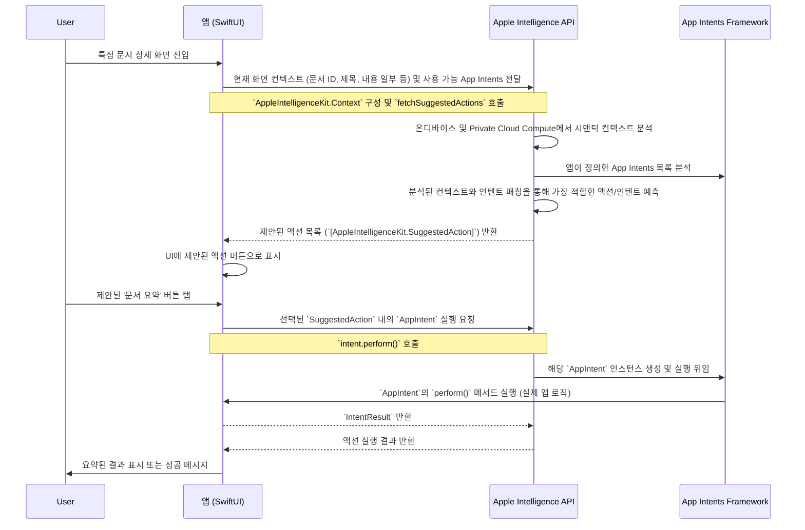

## Apple Intelligence API: 온디바이스 컨텍스트 활용의 새로운 지평

2026년, iOS 개발의 핵심 키워드는 **초개인화된 지능형 사용자 경험**입니다. 단순한 텍스트 생성이나 정보 검색을 넘어, 사용자의 현재 상황, 의도, 그리고 앱 사용 맥락을 심층적으로 이해하고 이에 기반한 유기적인 상호작용을 제공하는 것이 중요해졌습니다. Apple Intelligence API는 바로 이러한 요구사항에 대한 Apple의 해답이며, 개발자들이 복잡한 AI/ML 인프라 없이도 온디바이스 및 프라이빗 클라우드 기반의 강력한 지능을 앱에 통합할 수 있도록 돕습니다.

### 왜 지금 Apple Intelligence API에 주목해야 하는가?

기존의 LLM 기반 서비스들은 대부분 클라우드에 의존하며, 앱이 사용자 데이터를 직접 전송해야만 동작했습니다. 이는 프라이버시 문제와 응답 속도, 그리고 비용 측면에서 한계를 가졌습니다. Apple Intelligence API는 이러한 한계를 극복하고, 다음과 같은 근본적인 이점을 제공합니다.

1.  **깊은 온디바이스 통합:** iOS, iPadOS, macOS 등 Apple 기기 OS 전반에 걸쳐 통합되어, 앱 내외부의 사용자 활동, 시스템 데이터, 개인 정보(캘린더, 메일, 메시지 등)에 대한 안전하고 프라이버시가 보호되는 방식으로 접근하여 컨텍스트를 이해합니다.
2.  **프라이버시 중심 설계:** 모든 처리 과정에서 사용자 프라이버시를 최우선으로 합니다. 온디바이스 처리를 기본으로 하며, 더 복잡한 요청의 경우 Private Cloud Compute를 통해 데이터를 보호하면서 처리합니다. 개발자는 사용자 데이터 유출 걱정 없이 지능형 기능을 구현할 수 있습니다.
3.  **능동적이고 예측적인 상호작용:** 사용자가 명시적으로 요청하기 전에, 현재 맥락에 가장 적합한 정보나 다음 액션을 예측하여 제시함으로써 사용자 경험을 혁신할 수 있습니다. 이는 앱의 몰입도와 유용성을 극대화합니다.
4.  **개발 편의성:** 복잡한 머신러닝 모델 학습이나 인프라 관리에 대한 부담 없이, 직관적인 API를 통해 Apple의 강력한 AI 기능을 활용할 수 있습니다.

### 핵심 개념: 앱 인텐트와 시맨틱 컨텍스트

Apple Intelligence API를 효과적으로 사용하려면 두 가지 핵심 개념을 이해해야 합니다.

*   **앱 인텐트 (App Intents):** 앱이 수행할 수 있는 특정 동작이나 기능을 시스템에 선언하는 방법입니다. 예를 들어, "새로운 할 일 생성", "이메일 보내기", "문서 검색"과 같은 기능들을 `AppIntent` 프로토콜을 구현하여 정의합니다. Apple Intelligence는 이러한 인텐트 목록을 통해 앱이 제공하는 기능을 학습하고, 사용자의 요청이나 상황에 따라 적절한 인텐트를 트리거할 수 있습니다. `AppIntent`는 SwiftUI 기반의 위젯, 시리 단축어 등 기존의 시스템 통합 기능과도 연계됩니다.
*   **시맨틱 컨텍스트 (Semantic Context):** Apple Intelligence가 사용자의 현재 상태와 환경을 심층적으로 이해하는 능력입니다. 단순히 단어의 나열이 아니라, 앱에서 열려 있는 문서, 현재 진행 중인 대화, 캘린더 이벤트, 사진 속 내용 등 다양한 정보원을 종합하여 의미 있는 맥락을 도출합니다. 이 컨텍스트는 개발자가 제공하는 정보와 시스템이 자체적으로 인지하는 정보가 결합되어 더욱 풍부해집니다.

Apple Intelligence는 이 두 가지 개념을 결합하여, "현재 보고 있는 이메일에 대한 회신 초안을 작성해줘"와 같은 요청이 들어왔을 때, 이메일 앱에서 보고 있는 이메일 내용을 시맨틱 컨텍스트로 파악하고, 개발자가 정의한 "이메일 초안 작성" `AppIntent`를 사용하여 응답을 생성합니다.

### 실전 패턴: 상황 인식 기반의 프로액티브 인터페이스 구현

실무에서 Apple Intelligence API를 활용하는 가장 강력한 패턴은 **상황 인식 (context-aware) 기반의 프로액티브 (proactive) 인터페이스 구현**입니다. 즉, 사용자가 명시적으로 요청하기 전에, 앱이 사용자의 의도를 예측하고 가장 관련성 높은 기능이나 정보를 제시하는 것입니다.

#### 1. App Intents 정의하기

먼저 앱의 핵심 기능을 `AppIntent`로 정의해야 합니다. 이 예시에서는 문서 관리 앱에서 특정 문서를 요약하거나, 관련된 액션을 수행하는 인텐트를 정의해 보겠습니다.

```swift
import AppIntents
import Foundation

// 문서 요약 App Intent
struct SummarizeDocumentIntent: AppIntent {
    static var title: LocalizedStringResource = "문서 요약"
    static var description = IntentDescription("현재 보고 있는 문서를 요약합니다.")

    @Parameter(title: "문서 ID", description: "요약할 문서의 고유 ID")
    var documentID: String

    // Apple Intelligence가 컨텍스트에서 이 인텐트를 제안할 때 보여줄 파라미터.
    // 사용자가 현재 보고 있는 문서가 자동으로 채워지도록 설정할 수 있습니다.
    @Parameter(title: "문서 제목", description: "요약될 문서의 제목", requestValueDialog: "어떤 문서를 요약해 드릴까요?")
    var documentTitle: String

    init() { /* 필수 초기화 */ }

    init(documentID: String, documentTitle: String) {
        self.documentID = documentID
        self.documentTitle = documentTitle
    }

    func perform() async throws -> some IntentResult {
        // 실제 문서 요약 로직 호출
        print("문서 ID: \(documentID) - '\(documentTitle)' 요약 실행")
        // 백엔드 또는 온디바이스 LLM을 통한 요약 처리...
        return .result(value: "문서 요약이 완료되었습니다.")
    }
}

// 관련 문서 찾기 App Intent
struct FindRelatedDocumentsIntent: AppIntent {
    static var title: LocalizedStringResource = "관련 문서 찾기"
    static var description = IntentDescription("현재 문서와 관련된 다른 문서를 찾습니다.")

    @Parameter(title: "기준 문서 ID", description: "관련 문서를 찾을 기준 문서 ID")
    var baseDocumentID: String

    init() { /* 필수 초기화 */ }

    init(baseDocumentID: String) {
        self.baseDocumentID = baseDocumentID
    }

    func perform() async throws -> some IntentResult {
        print("문서 ID: \(baseDocumentID)와 관련된 문서 찾기 실행")
        // 문서 데이터베이스에서 관련 문서 검색...
        return .result(value: "관련 문서를 찾았습니다.")
    }
}

// 앱의 모든 인텐트를 시스템에 등록합니다.
struct DocumentAppIntents: AppIntentsConfiguration {
    static var displayRepresentation: DisplayRepresentation = "문서 관리 앱"
    static var intents: [AppIntent.Type] {
        [SummarizeDocumentIntent.self, FindRelatedDocumentsIntent.self]
    }
    // 기타 엔티티 및 단축어 등록
}
```

#### 2. 컨텍스트 질의 및 UI 반영 (가상 Apple Intelligence Kit 사용)

이제 앱 내에서 Apple Intelligence에 현재 화면의 컨텍스트를 제공하고, 이에 기반한 제안을 받아 UI에 반영하는 로직을 구현합니다. 여기서는 `AppleIntelligenceKit`이라는 가상의 프레임워크를 사용합니다.

```swift
import SwiftUI
import AppleIntelligenceKit // 가상의 Apple Intelligence SDK

struct DocumentDetailView: View {
    let document: Document // 현재 보고 있는 문서 모델
    @State private var suggestedActions: [AppleIntelligenceKit.SuggestedAction] = []

    var body: some View {
        VStack {
            Text(document.title)
                .font(.largeTitle)
            Text(document.content)
                .padding()
            
            Divider()

            Text("AI 제안:")
                .font(.headline)
            
            // Apple Intelligence가 제안한 액션들을 버튼으로 표시
            ForEach(suggestedActions) { action in
                Button(action.title) {
                    performSuggestedAction(action)
                }
                .buttonStyle(.bordered)
                .padding(.vertical, 2)
            }
        }
        .navigationTitle("문서 보기")
        .onAppear {
            loadSuggestedActions()
        }
    }

    private func loadSuggestedActions() {
        // 현재 문서의 컨텍스트를 Apple Intelligence에 제공
        let context = AppleIntelligenceKit.Context(
            currentScreen: "DocumentDetailView",
            // App Intents가 이해할 수 있는 형식으로 문서 데이터를 제공
            // 예: 현재 보고 있는 문서의 ID와 제목 등
            relevantEntities: [
                "Document": [
                    "id": document.id,
                    "title": document.title,
                    "contentPreview": String(document.content.prefix(200)) // 내용의 일부만 전달
                ]
            ],
            // 이 앱이 수행할 수 있는 인텐트 타입 목록을 제공하여
            // Apple Intelligence가 제안할 수 있도록 돕습니다.
            availableIntentTypes: [
                SummarizeDocumentIntent.self,
                FindRelatedDocumentsIntent.self
            ]
        )

        // Apple Intelligence에 컨텍스트 기반의 액션 제안을 요청
        Task {
            do {
                self.suggestedActions = try await AppleIntelligenceKit.shared.fetchSuggestedActions(for: context)
            } catch {
                print("Failed to fetch suggested actions: \(error.localizedDescription)")
            }
        }
    }

    private func performSuggestedAction(_ action: AppleIntelligenceKit.SuggestedAction) {
        // 제안된 액션이 AppIntent와 연결되어 있다면, 해당 인텐트를 실행
        if let intent = action.intent {
            Task {
                do {
                    let result = try await intent.perform()
                    print("액션 실행 결과: \(result)")
                    // UI에 결과 반영 또는 사용자에게 피드백 제공
                } catch {
                    print("Failed to perform intent: \(error.localizedDescription)")
                }
            }
        } else {
            // AppIntent가 아닌 다른 종류의 제안 처리 (예: 내부 앱 기능)
            print("비-인텐트 액션 실행: \(action.title)")
        }
    }
}

// 예시 문서 모델
struct Document: Identifiable {
    let id: String
    let title: String
    let content: String
}
```

#### 3. 컨텍스트-인텐트-UI 흐름 다이어그램

다음 Mermaid 다이어그램은 Apple Intelligence가 앱 인텐트와 시맨틱 컨텍스트를 활용하여 사용자에게 프로액티브한 제안을 제공하는 전반적인 흐름을 시각화합니다.



### 2026년의 개발 트렌드와 Apple Intelligence API

Apple Intelligence API는 단순히 기존 앱에 AI 기능을 추가하는 것을 넘어, 완전히 새로운 차원의 사용자 경험을 설계하는 기반이 됩니다.

*   **개인화된 워크플로우 자동화:** 사용자의 특정 작업 패턴을 학습하여 반복적인 작업을 자동으로 제안하거나, 여러 앱을 아우르는 복합적인 워크플로우를 한 번의 탭으로 실행할 수 있게 합니다. 예를 들어, "오늘 회의 준비"라는 요청에 따라 캘린더에서 회의 정보를 가져오고, 관련 문서를 찾아 열며, 메시지 앱으로 참석자에게 알림을 보내는 일련의 과정을 제안할 수 있습니다.
*   **초개인화된 콘텐츠 큐레이션:** 사용자 관심사, 과거 상호작용, 현재 컨텍스트에 기반하여 뉴스, 미디어, 쇼핑 아이템 등을 실시간으로 맞춤형으로 큐레이션합니다. 이는 정적인 추천 시스템을 넘어, 시간에 따라 변화하는 사용자의 니즈를 능동적으로 반영합니다.
*   **AI 기반의 온보딩 및 피처 디스커버리:** 앱이 사용자의 첫 경험을 학습하여, 가장 필요한 기능부터 맞춤형 튜토리얼을 제공하거나, 숨겨진 고급 기능을 적절한 시점에 제안하여 앱의 잠재력을 최대한 활용하도록 돕습니다.
*   **지능형 보조 (Intelligent Assistance) 통합:** 앱 자체적으로 Copilot이나 Assistant와 같은 역할을 수행하며, 사용자 질문에 답하거나, 데이터 분석을 돕고, 복잡한 작업을 대신 처리하는 등 더욱 깊이 있는 보조 기능을 제공합니다.

### 고려사항: 프라이버시와 성능 최적화

Apple Intelligence API를 활용할 때는 항상 사용자 프라이버시를 최우선으로 고려해야 합니다. 민감한 정보는 온디바이스 처리를 유도하고, Private Cloud Compute 사용 시에도 사용자에게 투명하게 고지하며, 최소한의 정보만 전송하도록 설계해야 합니다. 또한, API 호출 횟수와 처리 시간을 최적화하여 앱의 반응성을 유지하는 것도 중요합니다. 불필요한 컨텍스트 전달을 피하고, 필요한 시점에만 지능형 기능을 활용하는 것이 좋습니다.

---

## 자기 점검

1.  Apple Intelligence API가 기존 LLM 기반 서비스와 차별화되는 핵심적인 세 가지 이점은 무엇인가요?
2.  `AppIntent`와 `Semantic Context`는 Apple Intelligence API에서 어떤 역할을 하며, 이 둘이 어떻게 상호작용하여 사용자에게 지능형 기능을 제공하나요?
3.  만약 당신의 생산성 앱이 사용자가 현재 작성 중인 이메일의 내용을 기반으로 첨부할 파일을 제안하고 싶다면, 어떤 `AppIntent`를 정의하고 `AppleIntelligenceKit`의 어떤 기능을 주로 활용해야 할까요?
4.  이 개념을 동료 iOS 개발자에게 설명한다면, Apple Intelligence API가 제공하는 가장 큰 기회가 무엇이라고 강조할 건가요?

**실습 과제:**
당신이 개발하고 있는 가상의 소셜 미디어 앱이 있다고 가정해봅시다. 사용자가 특정 게시물을 보고 있을 때, Apple Intelligence API를 활용하여 '게시물 요약', '게시물 내용 기반 관련 뉴스 검색', '게시물 공유 제안 (특정 플랫폼)'과 같은 기능을 프로액티브하게 제공하려고 합니다. 위 예제 코드를 참조하여 이 세 가지 기능을 수행하는 `AppIntent`들을 정의하고, 이 인텐트들을 `AppIntentsConfiguration`에 등록하는 코드를 작성해보세요. 추가적으로, 게시물 상세 뷰에서 이 `AppIntent`들을 Apple Intelligence API에 전달하기 위한 `AppleIntelligenceKit.Context` 객체를 어떻게 구성할지 의사 코드로 설명해보세요.