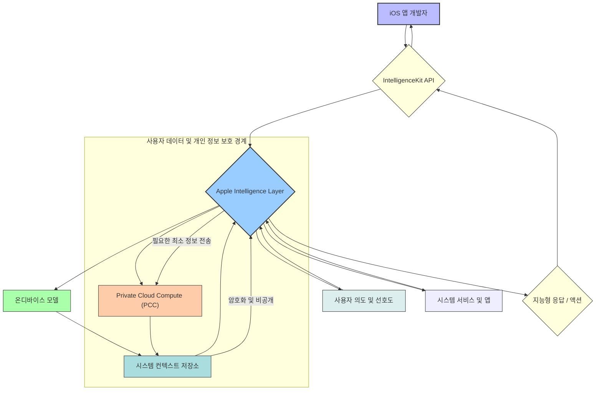

## Apple Intelligence API: 온디바이스 컨텍스트 활용과 iOS 앱의 미래

Apple Intelligence는 iOS, iPadOS, macOS에 걸쳐 사용자의 개인적인 컨텍스트를 이해하고 활용하여 초개인화된 지능형 경험을 제공하는 혁신적인 시스템입니다. iOS 개발자에게 있어 이는 단순한 AI 기능 추가를 넘어, 앱이 사용자의 의도와 니즈를 깊이 이해하고 선제적으로 가치를 제공하는 방식으로 진화할 수 있는 강력한 기회를 의미합니다. 2026년, AI는 더 이상 앱의 부가 기능이 아니라 핵심 사용자 경험의 일부로 내재화될 것이며, Apple Intelligence API는 이러한 변화의 최전선에 서게 될 것입니다.

### 왜 Apple Intelligence API가 중요한가?

기존의 LLM(Large Language Model) 연동은 주로 서버 API 호출을 통해 이루어졌습니다. 이는 강력한 기능을 제공하지만, 네트워크 지연, 개인 정보 보호 문제, 그리고 앱 개발자가 직접 프롬프트 엔지니어링, 모델 선택, Fallback 전략 등을 관리해야 하는 복잡성을 수반합니다.

Apple Intelligence API는 이러한 한계를 극복하며 iOS 앱 개발에 새로운 패러다임을 제시합니다.

1.  **온디바이스 우선, Private Cloud Compute 하이브리드**: 사용자 데이터는 가능한 한 기기 내에서 처리되며, 복잡한 연산이 필요할 경우에만 Private Cloud Compute(PCC)를 통해 안전하게 처리됩니다. 이는 개인 정보 보호를 최우선으로 하면서도 강력한 AI 기능을 제공합니다.
2.  **시스템 컨텍스트 통합**: Safari, Mail, Messages, Calendar, Photos 등 OS 전반의 데이터를 익명화 및 요약하여 지능형 처리에 활용합니다. 앱이 단독으로 제공할 수 없는 풍부한 사용자 컨텍스트를 OS 레벨에서 통합하여 제공함으로써, 앱은 훨씬 더 맥락적이고 유용한 기능을 구현할 수 있습니다.
3.  **개발 복잡성 감소**: 개발자는 직접 LLM을 관리하거나 복잡한 프롬프트 체인을 설계할 필요 없이, 고수준의 API 호출을 통해 OS에 지능형 작업을 위임할 수 있습니다. 이는 개발 생산성을 높이고, Apple이 하드웨어와 소프트웨어에 최적화된 AI 모델을 제공하므로 성능과 효율성도 보장됩니다.

결과적으로 Apple Intelligence API는 앱이 사용자의 삶에 더 깊이 통합되어, 단순한 도구를 넘어 개인 비서처럼 행동할 수 있도록 돕는 기반이 될 것입니다.

### Apple Intelligence의 핵심 작동 방식 (개발자 관점)

Apple Intelligence는 온디바이스 모델과 Private Cloud Compute (PCC)의 하이브리드 아키텍처를 기반으로 합니다. 개발자는 이 둘 사이의 seamless한 전환을 직접적으로 관리하기보다는, Apple이 제공하는 API(`IntelligenceKit` 등 가상 프레임워크)를 통해 최적의 인텔리전스 처리를 요청하게 됩니다.

핵심은 시스템 컨텍스트의 통합입니다. iOS 시스템은 사용자의 동의하에 메일, 메시지, 캘린더, 사진, 파일 등 다양한 앱과 서비스에서 발생하는 개인 데이터를 안전하게 요약하고 익명화하여 '컨텍스트 저장소'를 구축합니다. Apple Intelligence는 이 컨텍스트를 활용하여 사용자의 의도를 파악하고, 앱의 요청에 대한 가장 적절하고 개인화된 응답을 생성합니다.

개발자 앱은 두 가지 주요 방식으로 Apple Intelligence와 상호작용할 수 있습니다.

1.  **Context Contribution (컨텍스트 기여)**: 앱이 자신의 특정 데이터를 OS의 Intelligence Layer에 안전하게 제공하여, 다른 시스템 기능이나 다른 앱의 인텔리전스 요청에 활용될 수 있도록 하는 패턴입니다.
2.  **Context-Aware Action Request (컨텍스트 인지 액션 요청)**: 앱이 직접 LLM 프롬프트를 구성하는 대신, Apple Intelligence Layer에 고수준의 인텐트를 전달하고, OS가 이를 바탕으로 최적의 응답이나 액션을 찾아 앱에 반환하도록 하는 패턴입니다.

### iOS 앱과 Apple Intelligence API 연동 패턴

(*참고: 아래 제시된 API는 2026년 Apple Intelligence API의 방향성을 예상하여 가상으로 구성된 것입니다. 실제 API 명칭과 구조는 다를 수 있습니다.*)

#### 1. Context Contribution Pattern (컨텍스트 기여 패턴)

앱이 생성하거나 관리하는 중요한 데이터를 Apple Intelligence 시스템에 기여하여, 사용자의 전반적인 경험을 향상시키는 패턴입니다. 예를 들어, 사용자의 스케줄 앱이 특정 회의 정보를 OS에 기여하면, 이 정보는 다른 앱이나 시스템 기능(예: 알림, Siri 제안)에서 활용될 수 있습니다.

**Swift 코드 예제:**

```swift
import IntelligenceKit // 가상의 프레임워크
import Foundation

// 1. 앱 내에서 관리하는 데이터 모델 정의
struct MyMeetingEvent: Identifiable, Codable {
    let id: UUID
    let title: String
    let description: String
    let date: Date
    let participants: [String]
    let location: String?
}

// 2. IntelligenceContextRepresentable 프로토콜 채택 및 구현
// 이 프로토콜은 앱 데이터가 Intelligence Layer에서 어떻게 표현될지 정의합니다.
extension MyMeetingEvent: IntelligenceContextRepresentable {
    // Intelligence Layer에 전달될 컨텍스트 페이로드
    var intelligenceContextPayload: IntelligenceContextPayload {
        var payload = IntelligenceContextPayload()
        payload.add(self.title, for: .eventTitle)
        payload.add(self.description, for: .eventDescription)
        payload.add(self.date, for: .eventDate)
        payload.add(self.participants.joined(separator: ", "), for: .peopleNames)
        payload.add(self.id.uuidString, for: .identifier) // 고유 식별자
        self.location.map { payload.add($0, for: .locationName) }
        
        // 이 컨텍스트의 타입을 지정하여 Intelligence Layer가 적절하게 분류하도록 돕습니다.
        payload.setContextType("com.myapp.meeting_event") 
        return payload
    }
}

// 3. 앱 내에서 컨텍스트 기여 및 철회 관리
class MeetingManager {
    // 이벤트 추가 및 컨텍스트 기여
    func addMeeting(_ event: MyMeetingEvent) async throws {
        // ... 앱의 데이터베이스에 이벤트 저장 로직 ...
        
        // Intelligence Layer에 컨텍스트 기여 요청
        try await IntelligenceContextManager.shared.contribute(event)
        print("Meeting context contributed: \(event.title)")
    }

    // 이벤트 삭제 및 컨텍스트 철회
    func deleteMeeting(_ event: MyMeetingEvent) async throws {
        // ... 앱의 데이터베이스에서 이벤트 삭제 로직 ...
        
        // Intelligence Layer에서 컨텍스트 철회 요청
        try await IntelligenceContextManager.shared.revoke(event)
        print("Meeting context revoked: \(event.title)")
    }
}

// 사용 예시:
/*
let newMeeting = MyMeetingEvent(
    id: UUID(), 
    title: "Project Alpha Kickoff", 
    description: "Discussion on project goals and initial roadmap.", 
    date: Date().addingTimeInterval(3600 * 24 * 7), // 1주일 뒤
    participants: ["Alice", "Bob", "Charlie"],
    location: "Conference Room 3"
)

Task {
    let manager = MeetingManager()
    try await manager.addMeeting(newMeeting)
}
*/
```

#### 2. Context-Aware Action Request Pattern (컨텍스트 인지 액션 요청 패턴)

앱이 직접 LLM을 호출하거나 복잡한 프롬프트 엔지니어링을 할 필요 없이, 특정 지능형 작업을 Apple Intelligence Layer에 요청하는 패턴입니다. OS가 통합된 시스템 컨텍스트를 바탕으로 앱에 가장 적합한 응답이나 제안을 제공합니다.

**Swift 코드 예제:**

```swift
import IntelligenceKit // 가상의 프레임워크
import Foundation

enum IntelligentActionType {
    case summarize(content: String) // 특정 텍스트 요약
    case suggestFollowUpActions(forContextIdentifier: String, contextType: String) // 특정 컨텍스트에 대한 후속 조치 제안
    case generateDraft(basedOnContext: IntelligenceContextPayload, intent: String) // 특정 컨텍스트 기반으로 초안 생성
    case refineText(text: String, style: TextRefinementStyle) // 텍스트 다듬기

    enum TextRefinementStyle: String {
        case professional, friendly, concise, elaborate
    }
}

class IntelligentAgent {
    // Intelligence Layer에 지능형 작업 요청
    func requestIntelligentAction(_ action: IntelligentActionType) async throws -> IntelligenceResult {
        let request: IntelligenceActionRequest
        switch action {
        case .summarize(let content):
            request = IntelligenceActionRequest.summarize(content: content)
        case .suggestFollowUpActions(let id, let type):
            request = IntelligenceActionRequest.suggestActions(forContextIdentifier: id, contextType: type)
        case .generateDraft(let payload, let intent):
            request = IntelligenceActionRequest.generateDraft(withContext: payload, intent: intent)
        case .refineText(let text, let style):
            request = IntelligenceActionRequest.refine(text: text, style: style.rawValue)
        }

        // Intelligence Layer로부터 결과 수신
        let response = try await IntelligenceActionManager.shared.perform(request)
        return response
    }
}

// 사용 예시:
/*
Task {
    let agent = IntelligentAgent()
    
    // 1. 앱 내에서 사용자가 선택한 텍스트 요약 요청
    let longText = "이것은 매우 긴 텍스트 내용으로, 사용자가 간략하게 요약하기를 원하는 부분입니다. 이 텍스트는 중요한 정보를 담고 있을 수 있으며..."
    let summaryResult = try await agent.requestIntelligentAction(.summarize(content: longText))
    if let summary = summaryResult.stringValue {
        print("Summarized Text: \(summary)")
    }

    // 2. 이전에 기여한 회의 이벤트에 대한 후속 조치 제안 요청
    // (여기서는 가상의 이벤트 ID와 타입 사용)
    let meetingID = UUID() // 실제 앱의 이벤트 ID
    let suggestedActionsResult = try await agent.requestIntelligentAction(
        .suggestFollowUpActions(forContextIdentifier: meetingID.uuidString, contextType: "com.myapp.meeting_event")
    )
    if let actions = suggestedActionsResult.arrayValue(ofType: String.self) {
        print("Suggested Actions for Meeting: \(actions.joined(separator: ", "))")
    }
}
*/
```

### Apple Intelligence API 상호작용 흐름 다이어그램



*   **A (iOS 앱 개발자)**: 앱 로직을 구현하는 개발자. `IntelligenceKit` API를 통해 Apple Intelligence에 접근합니다.
*   **B (IntelligenceKit API)**: Apple이 제공하는 프레임워크. 개발자 앱과 Apple Intelligence Layer 간의 통신을 담당합니다.
*   **C (Apple Intelligence Layer)**: iOS/iPadOS/macOS에 내장된 핵심 지능형 처리 계층. 다양한 인텔리전스 기능을 조율합니다.
*   **D (온디바이스 모델)**: 기기 내에서 실행되는 소형 AI 모델. 개인 정보 보호가 필수적인 즉각적인 작업, 간단한 연산에 사용됩니다.
*   **E (Private Cloud Compute)**: Apple의 보안 클라우드 기반 AI 인프라. 온디바이스 모델로 처리하기 어려운 복잡한 작업을 안전하게 처리합니다. 사용자 데이터는 암호화되고 익명화된 상태로만 전송됩니다.
*   **F (시스템 컨텍스트 저장소)**: Safari, Mail, Messages, Calendar, Photos 등 다양한 시스템 앱 및 개발자 앱으로부터 수집된 사용자 컨텍스트의 암호화된 요약본이 저장됩니다.
*   **G (사용자 의도 & 선호도)**: 사용자의 앱 사용 패턴, 설정, 명시적인 지시 등이 지능형 처리에 반영됩니다.
*   **H (시스템 서비스 & 앱)**: 다른 시스템 앱(예: 지도, 미리 알림)이나 개발자 앱이 Apple Intelligence와 상호작용하여 기능을 확장합니다.
*   **I (지능형 응답 / 액션)**: Apple Intelligence Layer가 최종적으로 생성하는 결과물. 앱은 이를 받아 사용자에게 표시하거나 다음 작업을 수행합니다.

### 실무 적용 사례와 2026년 트렌드 반영

Apple Intelligence API는 2026년 iOS 앱 개발의 주요 트렌드를 이끌 것이며, 다음과 같은 실무 적용 사례를 통해 앱의 가치를 혁신할 수 있습니다.

*   **스마트한 알림 & 위젯 (Proactive Suggestions)**: 앱이 중요한 정보를 `IntelligenceKit`에 기여하면, OS는 이를 바탕으로 사용자가 가장 필요로 하는 시점에 알림을 보내거나 위젯에 정보를 업데이트합니다. 예를 들어, 여행 앱이 예약 정보를 기여하면, AI는 출국 전 필요한 서류, 교통편 안내, 혹은 날씨 변화에 따른 준비물 등을 제안할 수 있습니다.
*   **지능형 콘텐츠 생성 & 편집 (Generative Writing Tools)**: 앱 내에서 텍스트 입력 시, 시스템 AI가 문맥을 파악하여 초안 작성, 어조 변경, 맞춤법/문법 교정, 번역 등을 제안합니다. 이는 앱이 자체 LLM을 내장하지 않고도 OS의 강력한 기능을 활용하여 사용자 생산성을 극대화하는 방식입니다. 이메일 앱에서 `IntelligenceActionType.generateDraft`를 사용해 답장 초안을 생성하거나, 메모 앱에서 `IntelligenceActionType.refineText`로 작성한 글을 다듬는 것이 가능해집니다.
*   **개인화된 앱 내 검색 & 필터링 (Semantic Search)**: 앱이 제공하는 데이터(사진, 문서, 이메일)를 Apple Intelligence Layer가 인덱싱하도록 허용하면, "지난주에 Bob과 논의했던 프로젝트 계획서"와 같은 자연어 검색 쿼리를 처리할 수 있게 됩니다. 사진 앱이 특정 상황(예: "재작년 여름 휴가 때 찍은 바다 사진")을 이해하고 정확한 결과물을 찾아주는 것과 유사한 경험을 앱 내에서 제공합니다.
*   **복합적인 자동화 워크플로우 (Multi-App Orchestration)**: 단순히 Shortcut을 실행하는 것을 넘어, Apple Intelligence가 여러 앱과 시스템 서비스를 유기적으로 연결하여 복잡한 사용자 의도를 달성합니다. 예를 들어, "다음 주말 가족 모임을 위한 장소 추천과 함께 모두에게 초대장 보내기"와 같은 요청을 받으면, 지도 앱, 캘린더 앱, 메시지 앱을 연동하여 지능적으로 처리할 수 있게 됩니다.
*   **멀티모달리티의 확장**: 텍스트뿐 아니라 이미지, 오디오, 비디오 컨텍스트를 활용하여 더욱 풍부한 인텔리전스를 제공합니다. 앱에서 특정 사진을 선택하면, AI가 해당 사진의 내용(장소, 인물)을 분석하여 관련 정보를 제안하거나, 앱 내 오디오 녹음 파일에서 특정 주제의 대화를 찾아주는 기능 등을 구현할 수 있습니다.

### 기존 LLM 통합 방식과의 비교

| 특징             | 기존 LLM 직접 통합 방식                     | Apple Intelligence API 연동 방식              |
| :--------------- | :------------------------------------------- | :-------------------------------------------- |
| **데이터 처리 위치** | 주로 서버 사이드 (API 호출)                | 온디바이스 + Private Cloud Compute (하이브리드) |
| **컨텍스트 활용** | 앱 자체 데이터 및 명시적 프롬프트            | OS 전반의 시스템 컨텍스트 (메일, 사진 등) 자동 활용 |
| **개인 정보 보호** | LLM 제공자에 데이터 전송 (별도 처리 필요)   | 온디바이스 우선, PCC는 암호화된 익명 데이터 처리 |
| **개발 복잡성**  | 프롬프트 엔지니어링, 스트리밍, 가드 레일 등 직접 구현 | 고수준 API 호출로 OS에 위임, 복잡성 감소        |
| **최적화**       | 앱 개발자가 직접 모델 선택 및 최적화        | Apple이 하드웨어 및 소프트웨어에 최적화된 모델 제공 |
| **에코시스템 통합**| 앱 독립적                                    | OS 및 다른 앱과의 유기적인 연동                 |

---

## 자기 점검

1.  Apple Intelligence API가 기존 LLM API 연동 방식과 가지는 가장 큰 차이점은 무엇인가요? 최소 두 가지 이상 설명해보세요.
2.  `IntelligenceKit`의 `IntelligenceContextRepresentable` 프로토콜과 `IntelligenceActionType` enum은 각각 어떤 역할을 하며, 어떤 상황에서 사용될 수 있을까요?
3.  앱이 `IntelligenceKit`을 통해 시스템 컨텍스트에 데이터를 기여할 때, 사용자 개인 정보 보호는 어떻게 보장될 것이라고 예상할 수 있나요? Apple의 접근 방식을 바탕으로 설명해보세요.
4.  Mermaid 다이어그램에서 Private Cloud Compute (PCC)가 시스템 컨텍스트 저장소(System Context Store)와 어떻게 상호작용하는지 설명하고, 이 과정에서 개인 정보 보호 경계가 어떻게 작동하는지 덧붙여 설명해보세요.

### 이 개념을 동료에게 설명한다면?

"우리가 지금 개발하는 iOS 앱에 LLM 기능을 넣으려고 해. 그런데 기존에 우리가 써봤던 OpenAI나 다른 LLM API랑은 좀 다를 거야. Apple Intelligence API는 단순히 LLM 모델에 텍스트를 던지고 응답받는 걸 넘어서, 사용자의 아이폰 전체 맥락을 이해하고 알아서 똑똑하게 반응해주는 방식에 가깝거든. 특히 어떤 점에서 이게 우리 앱 개발에 큰 변화를 가져올지 설명해줄 수 있을까?"

### 실습 과제

가상의 "스마트 스케줄 관리 앱"을 개발한다고 가정해봅시다. 이 앱은 사용자의 약속, 할 일, 메모 등을 관리합니다. Apple Intelligence API (위 예시를 참고하여 가상으로 작성)를 활용하여 다음 기능을 구현하기 위한 Swift 코드 스니펫을 작성하고, 어떤 `IntelligenceActionType`과 `IntelligenceContextRepresentable`을 활용할지 구체적으로 서술하세요.

**기능**: 사용자가 특정 회의 일정을 앱에 추가하면, 이 정보를 바탕으로 Apple Intelligence가 해당 회의에 필요한 "사전 준비물 (예: 안건 작성, 관련 문서 찾기)"을 제안하고, 이 제안을 앱의 할 일 목록에 추가할 수 있도록 하는 기능.

```swift
// 여기에 실습 과제 코드를 작성해주세요.
// 가상의 MyMeetingEvent 모델과 IntelligenceKit API를 활용하세요.

import IntelligenceKit // 가상의 프레임워크
import Foundation

// 1. MyMeetingEvent 모델 (위에 정의된 것을 재활용하거나 새롭게 정의)
struct MyMeetingEvent: Identifiable, Codable {
    let id: UUID
    let title: String
    let description: String
    let date: Date
    let participants: [String]
    let location: String?
}

extension MyMeetingEvent: IntelligenceContextRepresentable {
    var intelligenceContextPayload: IntelligenceContextPayload {
        var payload = IntelligenceContextPayload()
        payload.add(self.title, for: .eventTitle)
        payload.add(self.description, for: .eventDescription)
        payload.add(self.date, for: .eventDate)
        payload.add(self.participants.joined(separator: ", "), for: .peopleNames)
        payload.add(self.id.uuidString, for: .identifier)
        self.location.map { payload.add($0, for: .locationName) }
        payload.setContextType("com.myapp.meeting_event")
        return payload
    }
}

// 2. 할 일 모델
struct TodoItem: Identifiable, Codable {
    let id: UUID
    var title: String
    var isCompleted: Bool = false
    var relatedEventId: UUID? // 어떤 이벤트와 관련된 할 일인지 추적
}

class SmartSchedulerApp {
    private var todoList: [TodoItem] = []
    private let meetingManager = MeetingManager() // 위에 정의된 MeetingManager 인스턴스
    private let intelligentAgent = IntelligentAgent() // 위에 정의된 IntelligentAgent 인스턴스

    func addMeetingAndSuggestTodos(_ event: MyMeetingEvent) async throws {
        // 1. 회의 이벤트 추가 및 컨텍스트 기여
        try await meetingManager.addMeeting(event)

        // 2. Apple Intelligence에 후속 조치 제안 요청
        let suggestedActionsResult = try await intelligentAgent.requestIntelligentAction(
            .suggestFollowUpActions(forContextIdentifier: event.id.uuidString, contextType: "com.myapp.meeting_event")
        )

        // 3. 제안된 할 일들을 앱의 할 일 목록에 추가
        if let actions = suggestedActionsResult.arrayValue(ofType: String.self) {
            for action in actions {
                let newTodo = TodoItem(id: UUID(), title: action, relatedEventId: event.id)
                todoList.append(newTodo)
                print("Added suggested todo: '\(action)' for meeting '\(event.title)'")
            }
        } else {
            print("No follow-up actions suggested for meeting: \(event.title)")
        }
    }
    
    // 할 일 목록 조회 (예시용)
    func getTodoList() -> [TodoItem] {
        return todoList
    }
}

// 실습 과제 실행 예시
/*
let newProjectMeeting = MyMeetingEvent(
    id: UUID(),
    title: "Quarterly Review Meeting",
    description: "Review Q1 performance and plan for Q2.",
    date: Date().addingTimeInterval(3600 * 24 * 10), // 10일 뒤
    participants: ["CEO", "CFO", "CTO"],
    location: "Main Office Boardroom"
)

Task {
    let smartApp = SmartSchedulerApp()
    try await smartApp.addMeetingAndSuggestTodos(newProjectMeeting)
    
    print("\nCurrent Todo List:")
    for todo in smartApp.getTodoList() {
        print("- \(todo.title)")
    }
}
*/
```
**활용된 `IntelligenceActionType`**: `suggestFollowUpActions(forContextIdentifier:contextType:)`를 사용하여 특정 컨텍스트(회의 이벤트)에 대한 후속 조치를 요청합니다.

**활용된 `IntelligenceContextRepresentable`**: `MyMeetingEvent` 모델이 이 프로토콜을 채택하여, 회의 이벤트 정보를 `IntelligenceContextPayload` 형태로 Apple Intelligence Layer에 기여합니다. 이를 통해 시스템은 해당 회의의 맥락을 이해하고 적절한 할 일을 제안할 수 있게 됩니다.