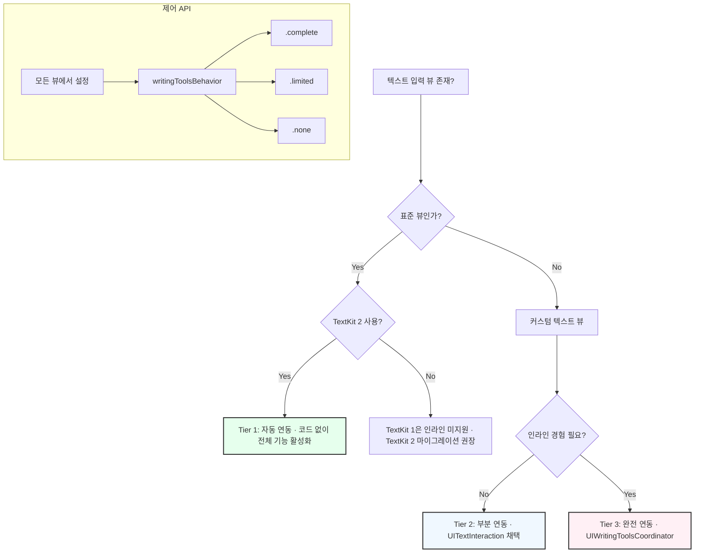

> 이 엔트리는 Apple Intelligence의 Writing Tools API를 iOS 앱에 연동하는 방법을 정리한 것이다. 핵심 API(`UIWritingToolsCoordinator`, `UITextInteraction`, `writingToolsBehavior`)는 Apple 공식 개발자 문서와 WWDC24 "Get started with Writing Tools" 세션을 근거로 한다.

### 왜 중요한가: 시스템 레벨 AI UX의 새로운 표준

Apple Intelligence의 Writing Tools는 단순한 앱 기능이 아닌, **iOS 18 시스템 자체에 내장된 글쓰기 지원 레이어**다. 사용자는 어떤 앱에서든 텍스트를 입력할 때 교정, 재작성, 요약 기능을 기대하게 될 것이다. 이는 개발자에게 두 가지 의미를 갖는다.

1.  **기회**: `UITextView` 등 표준 컴포넌트를 사용하면 코드 한 줄 없이 강력한 AI 기능을 사용자에게 제공할 수 있다. 이는 앱의 가치를 즉시 높이는 '공짜' 업그레이드다.
2.  **의무**: 사용자는 모든 텍스트 필드에서 Writing Tools가 작동하리라 기대하므로, 개발자는 이 기능을 언제 활성화하고, 언제 비활성화할지 명확히 결정해야 한다. 비밀번호나 소스 코드 필드에 자동 재작성 기능이 작동하면 치명적인 문제가 발생할 수 있다.

이 기능은 Apple의 온디바이스 모델과 Private Cloud Compute를 통해 구동되므로, 사용자의 텍스트가 서드파티에 공유되지 않는다는 강력한 개인정보 보호를 전제로 한다. 따라서 개발자는 별도의 개인정보 정책 고민 없이 이 기능을 도입할 수 있다.

### 핵심 패턴: 3단계 연동 모델과 명시적 제어

Writing Tools 연동 방식은 앱의 텍스트 뷰 구현 방식에 따라 세 가지 단계(Tier)로 나뉜다. 개발자는 자신의 앱에 맞는 단계를 선택하고, `writingToolsBehavior` 속성으로 동작을 명시적으로 제어해야 한다.



**Tier 1: 자동 연동 (Zero Code)**
`UITextView`, `NSTextView`, `WKWebView` 같이 TextKit 2 기반의 표준 텍스트 뷰를 사용하면 모든 기능이 자동으로 활성화된다. 인라인 교정 제안, 텍스트가 변하는 애니메이션까지 시스템이 모두 처리한다.

```swift
// iOS 16+에서 기본적으로 TextKit 2를 사용
let textView = UITextView()
textView.isEditable = true
// 별도 코드 없이 Writing Tools가 완벽하게 작동한다.
```

**Tier 2: 부분 연동 (`UITextInteraction` 활용)**
자체 제작한 커스텀 텍스트 뷰를 사용하는 경우, `UITextInteraction`을 채택하면 컨텍스트 메뉴(오려두기, 복사하기 등이 나오는 메뉴)에 Writing Tools 옵션이 자동으로 추가된다. 사용자가 기능을 실행하면 결과 텍스트가 클립보드를 통해 앱에 전달(paste)된다. 인라인 애니메이션 같은 고급 기능은 지원되지 않지만, 최소한의 노력으로 핵심 기능을 제공할 수 있다.

**Tier 3: 완전 연동 (`UIWritingToolsCoordinator` API)**
노션이나 옵시디언처럼 고유한 텍스트 저장 및 렌더링 엔진을 가진 앱을 위한 방식이다. `UIWritingToolsCoordinator`와 그 `Delegate` 프로토콜을 사용해 Writing Tools 시스템과 앱의 텍스트 엔진이 직접 통신한다.

-   `writingToolsCoordinator(_:requestsContextsForScope:completion:)`: Writing Tools가 앱에게 현재 선택된 텍스트와 주변 문맥을 `NSAttributedString` 형태로 요청한다.
-   `writingToolsCoordinator(_:replaceRange:inContext:proposedText:...)`: Writing Tools가 제안하는 변경 사항을 앱의 데이터 모델에 직접 적용하도록 요청한다.
-   `writingToolsCoordinator(_:willChangeToState:completion:)`: Writing Tools UI가 활성화/비활성화되는 등 세션의 상태 변화를 앱에 알려준다.

이 방식은 가장 복잡하지만, 커스텀 뷰에서도 네이티브 앱과 동일한 사용자 경험을 제공할 수 있게 해준다.

### 실전 적용

#### 1. `writingToolsBehavior`로 명시적 제어하기

가장 중요한 실천 사항은 모든 텍스트 입력 필드에 대해 Writing Tools 동작을 의식적으로 결정하는 것이다.

-   **.complete**: 블로그 글쓰기, 이메일 작성 등 긴 글을 위한 필드. 모든 기능을 활성화한다.
-   **.limited**: 인라인 애니메이션이 부자연스러울 수 있는 짧은 텍스트 필드. 패널 UI만 제공한다.
-   **.none**: 비밀번호, API 키, 소스 코드, 검색창, 민감한 정보를 다루는 채팅 필드 등 **내용이 절대로 변경되어서는 안 되는** 곳에 반드시 설정해야 한다.
-   **.default**: 시스템이 뷰의 특성(`UITextInputTraits`)에 따라 위 세 가지 중 하나를 자동으로 결정한다. 하지만 중요한 필드는 명시적으로 `.none`을 설정하는 것이 안전하다.

```swift
import UIKit

// 시나리오 1: 노트 앱의 본문 (모든 기능 환영)
let noteBodyTextView = UITextView()
noteBodyTextView.writingToolsBehavior = .complete

// 시나리오 2: 민감한 정보를 입력하는 채팅 필드 (기능 비활성화)
let secureChatField = UITextField()
secureChatField.placeholder = "절대 외부에 공유되지 않는 메시지"
secureChatField.writingToolsBehavior = .none
```

#### 2. 프로젝트 적용 시나리오: `aidy`

`aidy` 프로젝트의 일기(journal) 작성 기능에 Writing Tools를 적용하는 시나리오를 생각할 수 있다.

-   **일기 본문 (`UITextView`)**:
    -   사용자가 길게 작성하는 공간이므로 `writingToolsBehavior = .complete`로 설정하여 모든 기능을 제공한다.
    -   사용자는 감정적인 글을 쓴 뒤 '전문적인 톤으로 변경' 기능을 사용해 자기 성찰 보고서 초안으로 바꾸거나, '핵심 포인트 요약'으로 그날의 생각을 정리할 수 있다. 이는 `aidy`의 핵심 가치를 높이는 직접적인 기능이 된다.
-   **태그 입력 필드 (`UITextField`)**:
    -   태그는 '#일기', '#성장'처럼 특정 형식을 갖는 짧은 텍스트다. AI가 이를 '일기입니다', '성장했어요'로 '개선'하면 시스템이 태그를 인식하지 못한다.
    -   따라서 이 필드는 `writingToolsBehavior = .none`으로 설정하여 의도치 않은 변경을 원천 차단해야 한다.
-   **허용 결과물 지정**: 만약 `aidy`의 텍스트 뷰가 테이블이나 리스트 렌더링을 지원하지 않는다면, `allowedWritingToolsResultOptions` 속성을 설정해 요약 기능이 일반 텍스트(plain text) 결과만 생성하도록 제한할 수 있다. 이는 앱의 안정성을 높인다.

### 출처 및 근거

핵심 API인 `UIWritingToolsCoordinator`, `UITextInteraction`, `UIWritingToolsBehavior`는 모두 Apple 공식 개발자 문서와 WWDC24 "Get started with Writing Tools" 세션에서 확인되는 공식 API다. TextKit 2 기반 표준 뷰의 자동 인라인 연동, `.complete`/`.limited`/`.none` 동작 제어, 커스텀 엔진을 위한 Coordinator 패턴은 모두 공식 문서로 검증되었다.

- [UIWritingToolsCoordinator — Apple Developer Documentation](https://developer.apple.com/documentation/uikit/uiwritingtoolscoordinator)
- [UIWritingToolsBehavior — Apple Developer Documentation](https://developer.apple.com/documentation/uikit/uiwritingtoolsbehavior)
- [Get started with Writing Tools — WWDC24](https://developer.apple.com/videos/play/wwdc2024/10168/)