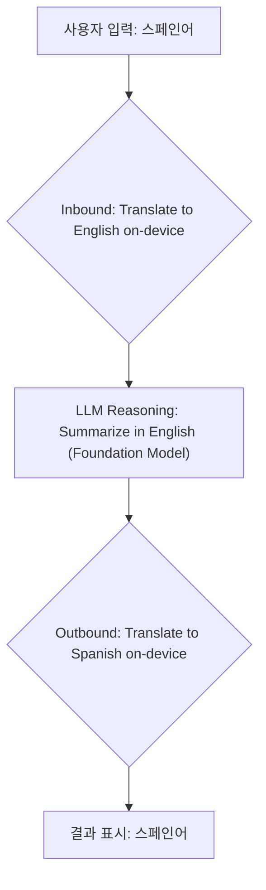

> 이 엔트리는 Blake Crosley의 [Apple's Translation Framework: Free, On-Device, and Sharper Than It Looks](https://blakecrosley.com/blog/apple-translation-framework-on-device)을 정독하고 핵심을 추출한 것이다.

이 엔트리는 Blake Crosley의 [Apple's Translation Framework: Free, On-Device, and Sharper Than It Looks](https://blake.crosley.com/blog/apples-translation-framework-free-on-device-and-sharper-than-it-looks/)를 정독하고 핵심을 추출한 것이다. Crosley는 Apple의 WWDC 발표와 공식 API 문서를 기반으로 실제 구현 시 마주할 수 있는 함정과 강력한 활용 패턴을 분석한다.

## 왜 중요한가: 온디바이스 AI의 '마지막 마일' 해결

지금까지 디바이스에서 직접 실행되는 AI 기능은 대부분 영어 중심의 단일 언어 모델에 의존했다. 이는 글로벌 사용자에게 앱의 핵심 AI 기능을 제공하는 데 명백한 한계였다. 클라우드 기반 번역 API(Google Translate, DeepL 등)는 비용, 개인정보 보호, 네트워크 의존성 문제를 야기했다.

Apple의 Translation Framework는 이 문제를 정면으로 해결한다. **완전 무료, 100% 온디바이스**로 동작하며, 한 번 언어팩이 설치되면 네트워크 연결 없이도 번역을 수행한다.

이는 단순히 '번역' 기능 추가를 넘어, `Foundation Models` 프레임워크와 결합될 때 진정한 가치를 발휘한다. 핵심 로직은 영어로 한 번만 개발하고, 사용자의 입력과 앱의 출력을 동적으로 번역함으로써 모든 AI 기능을 즉시 다국어로 확장할 수 있다. 이는 비용과 개인정보 침해 없이 진정으로 글로벌한 온디바이스 AI 경험을 구축하는 핵심 열쇠다.

## 핵심 패턴: API 표면부터 엣지 케이스까지

### 1. 두 개의 API 표면: 시스템 UI 위임 vs. 직접 제어

Apple은 사용 사례에 따라 명확히 구분되는 두 가지 API를 제공한다.

- **`translationPresentation` (iOS 17.4+): 가벼운 사용자 주도 번역**
  사용자가 화면의 텍스트를 직접 번역하고 싶을 때 사용하는 시스템 제공 팝오버. 개발자는 번역 로직에 관여하지 않고, 결과값도 받지 않는다. 단순히 '이 텍스트를 사용자가 번역하게 해주기' 기능에 최적화되어 있다.

  ```swift
  // 사용자가 선택한 텍스트를 시스템 팝오버로 번역
  .translationPresentation(
      isPresented: $showTranslation,
      text: selectedText
  )
  ```

- **`TranslationSession` (iOS 18+): 프로그래밍 방식의 완전한 제어**
  번역된 텍스트를 코드 내에서 직접 받아와 커스텀 UI에 렌더링하거나 후속 로직에 사용해야 할 때 쓴다. `.translationTask` 수정자를 통해 비동기적으로 세션을 얻고, 번역을 요청한다.

  ```swift
  // "Good morning"을 프로그래밍 방식으로 번역하여 상태 변수에 저장
  .translationTask(configuration) { session in
      let response = try await session.translate("Good morning")
      await MainActor.run {
          translated = response.targetText
      }
  }
  ```

### 2. '브라켓(Bracket)' 패턴: Translate → Reason → Translate

이 프레임워크의 가장 강력한 활용법은 Foundation Models와의 연계다. 핵심 로직은 영어로만 작성하고, 사용자와의 상호작용 양 끝단에 번역 계층을 추가하는 '샌드위치' 또는 '브라켓' 구조다.



이 패턴을 사용하면 단일 언어로 작성된 AI 기능(요약, 의도 분석, 분류 등)이 즉시 모든 지원 언어로 확장된다. 모든 과정이 디바이스 내에서 일어나므로 개인정보와 비용 문제를 원천 차단한다.

```swift
// 1. 사용자 입력을 영어로 번역
let englishRequest = try await inboundSession.translate(userText).targetText

// 2. 영어로 된 핵심 로직 실행 (온디바이스 LLM)
let summary = try await LanguageModelSession().respond(
    to: "Summarize in one line: \(englishRequest)"
).content

// 3. 결과를 다시 사용자 언어로 번역
let localizedResponse = try await outboundSession.translate(summary).targetText
```

### 3. 배치(Batch) 처리: 루프가 아닌 리스트로

여러 텍스트(채팅 메시지 목록, 상품 설명 등)를 번역할 때, for-loop 안에서 `await`를 반복 호출하는 것은 성능 저하와 버벅이는 UX를 유발한다. `TranslationSession`은 배치 처리를 1급 시민으로 지원한다.

- `clientIdentifier`를 통해 각 요청과 응답을 순서에 상관없이 매칭할 수 있다.
- 프레임워크가 내부적으로 작업을 최적화하여 오버헤드를 줄인다.

```swift
.translationTask(configuration) { session in
    // 1. 번역할 항목들을 Request 객체 리스트로 매핑
    let requests = items.map {
        TranslationSession.Request(sourceText: $0.text, clientIdentifier: $0.id)
    }

    // 2. 배치 번역 요청 (AsyncStream으로 응답이 하나씩 돌아옴)
    for try await response in session.translate(batch: requests) {
        // 3. clientIdentifier를 사용해 올바른 위치에 결과 저장
        store[response.clientIdentifier] = response.targetText
    }
}
```

### 4. 현실적인 제약: '오프라인'의 함정과 테스트 환경

데모에서는 보이지 않는 두 가지 중요한 현실적 제약이 있다.

1.  **최초 번역 시 언어팩 다운로드**: '온디바이스'는 언어팩이 기기에 '설치된 후'를 의미한다. 특정 언어 쌍(예: KO→EN)에 대한 최초 번역 시도 시, 시스템은 해당 언어팩을 다운로드하며 이는 시간과 네트워크를 필요로 한다. 이 대기 상태를 처리하지 않으면 앱이 멈춘 것처럼 보인다. `availability`를 확인하고 필요시 미리 다운로드(`prepare`)하는 UX 설계가 필수다.
2.  **시뮬레이터 미지원**: Translation Framework는 **iOS/iPadOS 시뮬레이터에서 동작하지 않는다.** 모든 테스트는 반드시 실제 기기에서 이루어져야 한다.

## 실전 적용: `aidy`에 다국어 질의응답 기능 추가하기

`aidy`는 현재 영어 기반의 온디바이스 LLM을 사용하여 사용자의 질문에 답변한다. Translation Framework를 활용해 `aidy`를 즉시 다국어 서비스로 확장할 수 있다.

**시나리오:** 사용자가 한국어로 "오늘 내 제일 중요한 미팅이 뭐야?"라고 질문한다.

1.  **Inbound Translation (KO → EN):**
    - `aidy` 앱은 `TranslationSession`을 사용하여 사용자 질문 "오늘 내 제일 중요한 미팅이 뭐야?"를 영어 "What is my most important meeting today?"로 번역한다.
    - 이때, `isAvailable`을 체크하여 한국어-영어 언어팩이 없다면 "번역 엔진 준비 중..." 같은 UI를 표시하고 `prepare`를 호출한다.

2.  **Core Logic (in English):**
    - 영어로 번역된 질문은 기존 `aidy`의 `Foundation Models` 기반 로직으로 전달된다.
    - LLM은 이 질문을 이해하고 사용자의 캘린더 데이터와 연동하여 "Your most important meeting is the 'Q3 Strategy Sync' at 2 PM."이라는 답변을 영어로 생성한다.

3.  **Outbound Translation (EN → KO):**
    - 영어로 생성된 답변을 다시 `TranslationSession`을 사용해 한국어 "가장 중요한 미팅은 오후 2시의 '3분기 전략 회의'입니다."로 번역한다.

4.  **Display:**
    - 최종적으로 한국어로 번역된 답변이 사용자에게 표시된다.

**기대 효과:**
- **개발 비용 절감:** 핵심 로직을 영어로 한 번만 개발하고, 수십 개의 언어를 추가 비용 없이 지원할 수 있다.
- **완벽한 개인정보 보호:** 사용자의 민감한 질문과 답변(일정, 메모 등)이 기기 밖으로 절대 나가지 않는다.
- **오프라인 지원:** 언어팩 다운로드 후에는 비행기 모드에서도 `aidy`의 모든 기능을 다국어로 사용할 수 있다.

이처럼 `aidy`는 Translation Framework의 '브라켓 패턴'을 적용하여, 서버 비용과 개인정보 리스크 없이 핵심 AI 기능을 글로벌 사용자에게 제공하는 강력한 경쟁력을 확보할 수 있다.