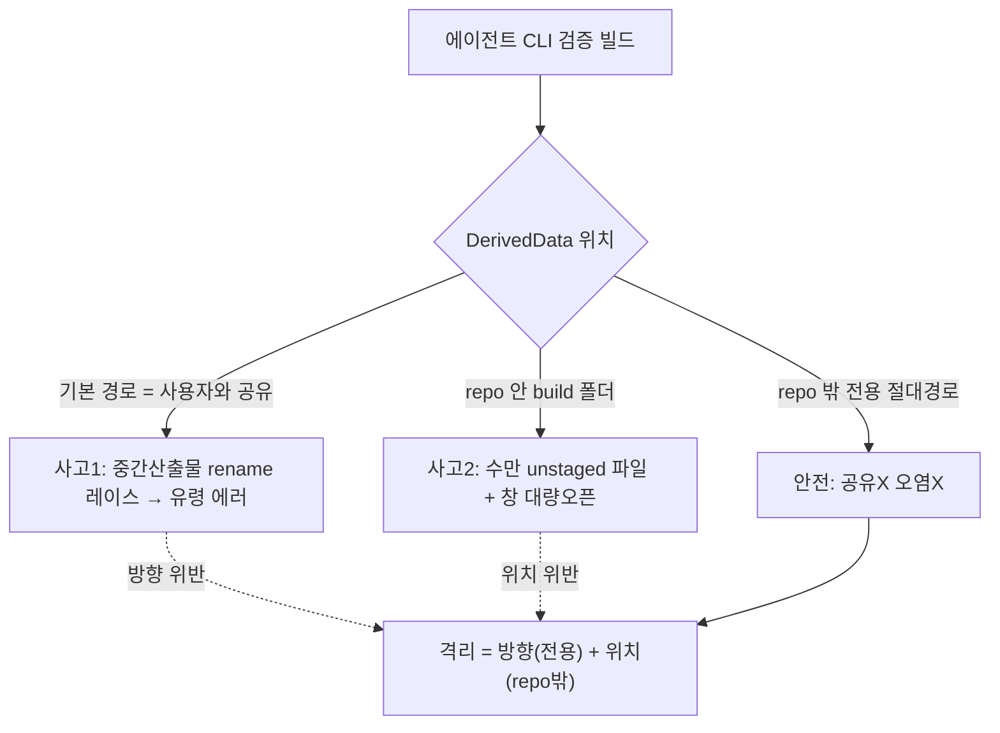

## 들어가며

이 글은 에이전트가 iOS 프로젝트를 CLI로 검증 빌드하다 겪은 두 건의 사고를 익명화한 기록이다. 예시 앱은 moneyflow, 하네스는 team-harness 플러그인으로 일반화한다. 두 사고는 표면상 반대 방향처럼 보이지만("공유해서 문제" vs "격리하려다 문제"), 사실 같은 원칙의 두 위반이다 — **빌드 산출물(DerivedData)은 공유 상태이며, 격리하되 올바른 위치에 격리해야 한다.**

이는 [harness-journal-036](harness-engineering/harness-journal-036-shared-state-write-serialization-file-lock)의 "공유 상태 쓰기는 격리하거나 직렬화하라"의 iOS 빌드 판이다. 그리고 [ios-ai-journal-022](ios-ai/ios-ai-journal-022-worker-derived-data-isolation)에서 이미 워커 DerivedData 격리를 다뤘는데, 여기서 다시 재발한 것이라 격리의 *위치*까지 못박을 필요가 있었다.

## 1. 사고 1 — 사용자 Xcode와 DerivedData를 공유한 레이스

첫 사고는 이렇다. 사용자가 Xcode로 moneyflow를 빌드하고 있는 동안, 에이전트가 검증을 위해 CLI(`xcodebuild`)로 같은 프로젝트를 빌드했다. 둘 다 **기본 DerivedData 경로**(`~/Library/Developer/Xcode/DerivedData/...`)를 썼다.

결과는 유령 컴파일 에러였다. `no such module`, `no member` 같은, 코드엔 실제로 존재하지 않는 에러가 양쪽 빌드에서 튀어나왔다. 원인은 코드가 아니라 **중간 산출물 레이스**다. DerivedData는 컴파일 중간 산출물(`.o`, `.swiftmodule`, `.o.tmp` 등)이 쌓이는 공유 저장소다. 두 빌드가 같은 경로에 동시에 쓰면, 한 빌드가 `.o.tmp`를 최종 파일로 `rename`하는 중에 다른 빌드가 그 반쯤 완성된 상태를 읽는다. 반쯤 쓰인 모듈을 읽으면 "이 모듈에 그 심볼이 없다" 같은 에러가 나는데, 이건 실재하지 않는다 — rename이 끝나면 있다.

이 에러의 고약함은 **재현이 비결정적**이라는 점이다. 타이밍에 따라 났다 안 났다 한다. 에이전트가 "코드에 에러가 있나?" 하고 조사에 들어가면([harness-journal-037](harness-engineering/harness-journal-037-verify-context-domino-role-boundary-preemptive-clear)의 컨텍스트 폭증 위험) 한참을 헤맨다. 실제로는 코드는 멀쩡하고 산출물 저장소를 공유한 게 죄다.

## 2. 사고 2 — repo 안에 DerivedData를 둔 오염

사고 1을 겪고 "그럼 에이전트 빌드는 DerivedData를 따로 쓰자"로 갔다. 여기까지는 맞다. 문제는 격리 *위치*였다. `-derivedDataPath`를 **repo 디렉토리 안**(예: `./build/DerivedData`)으로 지정했다.

결과는 repo 오염이었다. 빌드가 산출물 수만 개(실측 1만2천여 파일)를 repo 안에 만들었고, git이 이를 전부 unstaged 파일로 잡았다. 게다가 일부 도구가 변경된 파일을 자동으로 열려 시도하면서 대량의 창이 떴다. 작업 환경이 순식간에 난장판이 됐다.

이 사고의 교훈 — **격리의 방향은 맞았지만 위치가 틀렸다.** "전용 DerivedData를 쓴다"는 옳았는데, 그 전용 경로를 repo 안에 뒀다. repo 안은 git이 감시하는 공간이라, 거기에 대량 산출물을 쏟으면 git 상태가 오염된다. `.gitignore`에 넣으면 git 추적은 피하지만, 도구가 여전히 그 파일들을 스캔/열 수 있고, repo 크기와 인덱싱 부담이 커진다.

## 3. 두 사고의 공통 원칙 — repo 밖 절대경로로 격리

두 사고를 합치면 정답이 명확해진다. 에이전트의 검증 빌드 산출물은 **repo 밖의 전용 절대경로**에 둔다.

```
xcodebuild ... -derivedDataPath /absolute/path/outside/repo/agent-dd-<id>
```

이 한 줄이 두 사고를 동시에 막는다.

- **사고 1 방지(공유 레이스)**: 사용자 Xcode의 기본 DerivedData와 경로가 다르니 중간 산출물이 겹치지 않는다. 두 빌드가 각자의 저장소에 쓴다.
- **사고 2 방지(repo 오염)**: 산출물이 repo 밖에 있으니 git이 못 본다. 도구도 repo 스캔에서 안 잡는다.

핵심은 격리에 **방향과 위치 두 축**이 있다는 것이다. 방향 = "전용 경로를 쓴다"(공유 안 함). 위치 = "repo 밖"(오염 안 함). 사고 1은 방향을 안 지켰고, 사고 2는 방향은 지켰지만 위치를 틀렸다. 둘 다 맞아야 안전하다.



## 4. 에이전트 안전 관점 — 되돌리기 어려운 부작용을 기본값으로 두지 마라

이 두 사고는 에이전트 안전의 일반 교훈으로도 읽힌다. 에이전트가 실행하는 명령의 **부작용이 공유 상태나 감시 공간에 닿으면** 사고가 커진다. `xcodebuild`를 기본값으로 돌리는 건 겉보기엔 무해한 검증 행위지만, 그 기본값이 사용자와 공유하는 DerivedData를 건드리고, 잘못된 격리는 repo를 오염시킨다.

그래서 에이전트가 빌드/생성 명령을 낼 때의 규율은 이렇다. (1) 산출물이 어디로 가는지 명시적으로 지정한다(기본값에 맡기지 않는다). (2) 그 위치가 공유 상태(사용자 빌드 캐시)나 감시 공간(repo, git tree)과 겹치지 않는지 확인한다. (3) 겹치면 repo 밖 전용 경로로 보낸다. 이는 [harness-journal-036](harness-engineering/harness-journal-036-shared-state-write-serialization-file-lock)에서 본 "공유 상태 쓰기는 격리하거나 직렬화" 원칙의 빌드 버전이다 — 여기선 직렬화(사용자 빌드 끝나길 대기)보다 격리(전용 경로)가 옳은 선택인데, 사용자 빌드를 막을 수 없기 때문이다.

특히 사고 2 같은 "대량 부작용"은 되돌리기 비싸다(수만 파일 정리, 창 닫기). 되돌리기 어려운 부작용을 낼 수 있는 명령은 기본값으로 돌리지 말고, 부작용의 착지점을 반드시 안전한 곳으로 명시해야 한다.

## 자기 점검

1. 에이전트의 검증 빌드가 사용자 Xcode와 같은 기본 DerivedData를 쓰고 있진 않은가? 유령 컴파일 에러(no such module/no member)를 코드 문제로 오해해 조사에 빠지고 있진 않은가?
2. DerivedData를 격리했다면 그 경로가 repo *안*인가 *밖*인가? repo 안이면 수만 산출물로 git 상태를 오염시키고 있진 않은가?
3. 격리의 두 축(방향=전용 경로 / 위치=repo 밖)을 둘 다 지켰는가? 하나만 지키면 다른 사고가 난다는 걸 아는가?
4. 에이전트가 빌드/생성 명령을 낼 때 산출물 착지점을 명시적으로 지정하는가? 되돌리기 어려운 대량 부작용을 기본값에 맡기고 있진 않은가?
