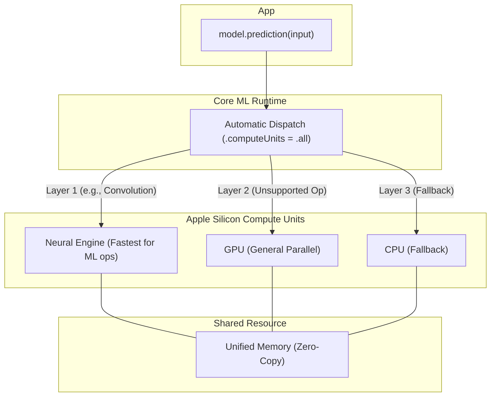

> 이 엔트리는 Blake Crosley의 [Core ML On-Device Inference: The Patterns That Actually Ship Core ML runs models on Neural Engi](https://blakecrosley.com/blog/core-ml-on-device-inference)을 정독하고 핵심을 추출한 것이다.

이 엔트리는 Blake Crosley의 [Core ML On-Device Inference: The Patterns That Actually Ship](https://b-crosley.com/core-ml-on-device-inference)를 정독하고 핵심을 추출한 것이다.

### 왜 중요한가: On-Device ML의 '공짜 점심'은 아키텍처에서 나온다

Core ML은 단순한 프레임워크가 아니다. Apple Silicon의 **통합 메모리 아키텍처(Unified Memory Architecture)**를 활용해, 네트워크 지연 시간이나 서버 비용, 개인정보 노출 없이 기기 내에서 밀리초 단위의 추론을 가능하게 하는 핵심 기술이다. 모델 가중치를 Neural Engine, GPU, CPU 간에 복사할 필요가 없는 이 아키텍처 덕분에, 여러 연산 장치를 오가는 작업이 '데이터 복사 비용'이 아닌 '스케줄링 결정'으로 전환된다. 이는 Apple Intelligence의 온디바이스 LLM부터 사진 앱의 시맨틱 검색까지, 실제 제품에 탑재된 AI 기능의 근간을 이룬다.

이 글은 '내 Mac에서는 잘 되는데' 수준을 넘어, 실제로 출시 가능한(shippable) On-Device ML 기능을 구현하는 데 필요한 4가지 핵심 패턴을 제시한다.

### 핵심 패턴: 출시를 위한 4가지 실천 사항

#### 1. 디스패치: 프레임워크를 믿되, 원리는 이해하라

Core ML은 세 가지 연산 장치(Compute Unit)를 활용하며, 모델의 각 레이어에 가장 적합한 유닛을 자동으로 선택한다.

- **Neural Engine (NE)**: 저전력으로 행렬 곱셈, 컨볼루션 등 ML 핵심 연산에 특화된 가장 빠른 가속기.
- **GPU**: NE가 지원하지 않는 연산을 처리하는 범용 병렬 컴퓨팅 유닛.
- **CPU**: 항상 사용 가능하며 모든 연산을 지원하는 최후의 보루.



개발자는 대부분 기본값인 `.all`을 사용하면 된다. 프레임워크의 자동 결정이 거의 항상 최적의 경로를 찾는다.

```swift
// Swift
import CoreML

let config = MLModelConfiguration()
// .all이 기본값. NE, GPU, CPU를 모두 활용하여 최적 경로 자동 선택
config.computeUnits = .all 

// 특정 테스트나 리소스 경합을 피해야 할 때만 오버라이드
// config.computeUnits = .cpuOnly 
// config.computeUnits = .cpuAndGPU

let model = try MyModel(configuration: config)
```

`.cpuOnly`는 서로 다른 하드웨어에서 결정론적(deterministic) 동작을 보장해야 하는 테스트 시나리오 외에는 거의 사용하지 않는다.

#### 2. 모델 변환: 런타임이 아닌 '빌드 타임' 작업

ML 모델은 대부분 PyTorch나 TensorFlow로 학습된다. 이를 Core ML에서 사용하려면 `.mlpackage` 파일로 변환해야 한다. 이 과정은 사용자의 기기가 아닌, 개발 환경에서 `coremltools` 패키지를 통해 **단 한 번** 수행하는 '툴링' 작업이다.

```python
# Python (in development environment)
import torch
import coremltools as ct

# 1. 학습된 PyTorch 모델 로드
model = MyTrainedModel()
model.load_state_dict(torch.load("weights.pth"))
model.eval() # 추론 모드로 설정

# 2. 예제 입력으로 모델 트레이싱
example_input = torch.rand(1, 3, 224, 224)
traced_model = torch.jit.trace(model, example_input)

# 3. coremltools로 변환
mlmodel = ct.convert(
    traced_model,
    inputs=[ct.ImageType(name="image", shape=example_input.shape)],
    # 타겟 iOS 버전을 명시하여 호환성 보장
    minimum_deployment_target=ct.target.iOS18,
    compute_units=ct.ComputeUnit.ALL,
)

# 4. Xcode 프로젝트에 추가할 .mlpackage 파일 저장
mlmodel.save("MyModel.mlpackage")
```

변환 시 주의할 점은 가변 크기 입력을 다룰 때 `ct.RangeDim`을 명시해야 한다는 것과, Core ML에 없는 커스텀 연산은 Swift로 직접 구현하거나 모델 구조에서 제거해야 한다는 것이다.

#### 3. 지연 시간 예산: 실제 기기에서 측정하라

앱의 UX에 따라 허용 가능한 지연 시간(Latency)은 명확히 구분된다.

- **16ms (실시간 UI, 60fps)**: 실시간 카메라 필터, AR 효과 등. 전처리, 추론, 후처리, UI 렌더링까지 모두 포함. MobileNetV3급의 소형 모델이 적합.
- **100ms (상호작용 UI)**: 사용자가 버튼을 탭하여 객체를 인식하거나, 음성을 텍스트로 변환하는 등 즉각적인 피드백이 필요한 경우. 10억 파라미터 미만의 중소형 모델이 해당.
- **1초 이상 (백그라운드 작업)**: 앱 실행 시 모델 워밍업, 사진 라이브러리 인덱싱 등. 사용자에게 프로그레스 바를 보여줘야 함.

이 수치는 이론적인 값이 아닌 가이드라인이다. Xcode의 `Instruments`나 `os_signpost`를 사용해 **실제 타겟 기기에서** 성능을 측정하는 것이 필수적이다.

#### 4. 양자화: 속도와 크기를 위해 정확도를 거래하라

양자화(Quantization)는 모델 가중치의 정밀도를 낮춰 파일 크기를 줄이고 추론 속도를 높이는 기술이다. Neural Engine에서 특히 효과적이다.

- **Float32 (32비트 부동소수점)**: 원본. 가장 크고 정확하지만 가장 느림.
- **Float16 (16비트 부동소수점)**: 크기가 절반으로 줄고 GPU/NE에서 더 빠름. 정확도 손실은 미미한 경우가 많음.
- **INT8 (8비트 정수)**: Float32 대비 크기는 1/4, NE에서 속도는 2-4배 빠름. 약간의 정확도 손실이 발생하며, 이를 최소화하기 위해 양자화 인식 학습(QAT)이 권장됨.
- **INT4 (4비트 정수)**: 최신 Core ML에서 지원하는 공격적인 양자화. LLM 등 거대 모델에 적용되지만 상당한 정확도 손실을 감수해야 함.

`coremltools`를 통해 쉽게 적용할 수 있으며, 대부분의 비전 모델에서 INT8은 성능과 정확도 사이의 훌륭한 균형점이다.

### 실전 적용: `tarosaju` 앱의 실시간 카드 인식기

`tarosaju` 앱에 실시간으로 카메라에 비친 타로 카드를 인식하는 기능을 추가한다고 가정해보자.

1.  **모델 선정 및 학습**: 78종의 타로 카드를 분류하는 MobileNetV3급 경량 이미지 분류 모델을 학습시킨다.
2.  **지연 시간 예산 설정**: 실시간 카메라 위에 인식 결과를 오버레이로 띄워야 하므로, 전체 파이프라인(카메라 프레임 캡처 → 전처리 → 추론 → 결과 렌더링)은 **16ms** 이내에 완료되어야 한다.
3.  **모델 변환 및 양자화**:
    - `coremltools`를 사용해 학습된 PyTorch 모델을 `.mlpackage`로 변환한다.
    - 16ms 예산을 맞추기 위해 **INT8 양자화**를 적용한다. 이를 통해 모델 크기를 줄이고 Neural Engine에서의 추론 속도를 극대화한다.
4.  **디스패치 및 측정**:
    - Swift 코드에서는 `computeUnits`를 기본값인 `.all`로 설정한다. Core ML은 이미지 분류 모델의 컨볼루션 연산을 자동으로 Neural Engine에 할당할 것이다.
    - 아이폰 실물 기기에서 `Instruments`의 Core ML 템플릿으로 프로파일링하여, 매 프레임 처리가 16ms를 넘지 않는지 검증한다. 만약 예산을 초과하면, 모델 아키텍처를 더 단순하게 변경하거나 입력 이미지 해상도를 낮추는 등의 추가 최적화를 진행한다.

이처럼 Core ML의 핵심 패턴을 이해하고 적용하면, 막연한 '온디바이스 AI'를 실제 사용자의 손에 쥐어줄 수 있는 안정적인 제품 기능으로 구현할 수 있다.