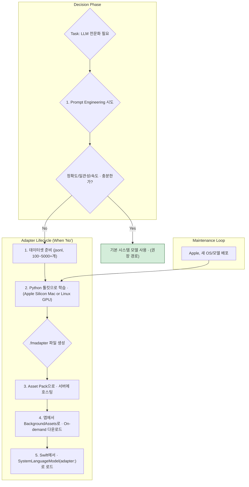

> 이 엔트리는 Blake Crosley의 [Foundation Models Custom Adapters: When To Train One](https://blakecrosley.com/blog/foundation-models-custom-adapters)을 정독하고 핵심을 추출한 것이다.

이 엔트리는 Blake Crosley의 [Custom Adapters: When To Train One](https://crosley.com/writing/apple-ecosystem-series/foundation-models/custom-adapters-when-to-train-one/)을 정독하고 핵심을 추출한 것이다.

### 왜 중요한가

Apple Intelligence는 강력한 온디바이스(On-device) Foundation Model을 제공하지만, 대부분의 경우 프롬프트 엔지니어링과 Tool Calling으로 충분하다. 커스텀 어댑터(Custom Adapter)는 모델의 가중치(weights)를 직접 미세조정할 수 있는 유일한 방법이지만, Apple은 이를 '마지막 수단'으로 규정한다.

어댑터 도입은 약 160MB의 저장 공간, 새 OS 버전마다 모델을 재학습해야 하는 지속적인 운영 비용, 그리고 `BackgroundAssets`를 통한 복잡한 배포 파이프라인을 감수해야 하는 중요한 기술적 결정이다. 따라서 어댑터를 언제 사용하고, 언제 사용하지 말아야 하는지 명확히 이해하는 것이 앱의 성능과 유지보수성을 좌우한다.

### 핵심 패턴

#### 1. LoRA를 통한 파라미터 효율적 미세조정 (PEFT)

Apple의 어댑터는 전체 모델을 재학습하는 것이 아니다. Apple 공식 문서에 따르면, 이는 LoRA(Low-Rank Adaptation)라는 PEFT(Parameter-Efficient Fine-Tuning) 기술을 사용한다.

- **작동 방식**: 기존의 거대한 시스템 모델 가중치는 그대로 두고(frozen), 모델의 네트워크 곳곳에 작고 훈련 가능한 '어댑터' 행렬을 추가한다. 학습 과정에서는 오직 이 어댑터 가중치만 업데이트된다.
- **장점**: 학습해야 할 파라미터 수가 극적으로 줄어들어, 비교적 적은 데이터셋(100~1,000개 샘플)으로도 특정 작업에 대한 전문화가 가능하다. 이는 Microsoft Research가 발표한 [LoRA: Low-Rank Adaptation of Large Language Models](https://arxiv.org/abs/2106.09685) 논문에 기반한 공개된 기술이다.

#### 2. 명확하고 엄격한 도입 기준

Apple은 프롬프트 엔지니어링이나 Tool Calling이 실패했을 때만 어댑터를 고려하라고 명시적으로 권고한다. 구체적인 도입 신호는 다음과 같다.

- **주제 전문가**: 모델이 특정 분야(예: 법률, 의료, 특정 게임 세계관)의 전문가가 되어야 할 때.
- **스타일/형식/정책 준수**: 모델이 항상 일관된 스타일, 특정 JSON 형식, 또는 회사의 정책을 준수하는 답변을 생성해야 할 때.
- **프롬프트 엔지니어링의 한계**: Few-shot 프롬프트나 복잡한 지시문으로도 원하는 정확도나 일관성을 달성할 수 없을 때.
- **지연 시간(Latency) 감소**: 매번 긴 예제 프롬프트를 보내는 대신, 작업에 특화된 어댑터를 사용하여 프롬프트를 최소화하고 추론 속도를 높이고 싶을 때.

#### 3. 시스템 모델 버전에 대한 강한 종속성

어댑터의 가장 큰 운영상 제약은 특정 시스템 모델 버전에 강하게 종속된다는 점이다.

- **1:1 매핑**: 어댑터 파일(`.fmadapter`)은 오직 하나의 시스템 모델 버전(예: iOS 26.0.0 탑재 모델)과만 호환된다.
- **필수 재학습**: Apple이 OS를 업데이트하여 새로운 버전의 시스템 모델을 배포하면, 기존 어댑터는 작동하지 않으며 런타임 오류가 발생한다. 개발자는 새 모델 버전에 맞춰 어댑터를 반드시 재학습하고 재배포해야 한다.
- **지속적인 유지보수**: 이는 어댑터를 위한 지속적인 데이터셋 관리, 학습, 평가, 배포 파이P라인 구축이 필수적임을 의미한다.

#### 4. 앱 번들 외부에서의 배포 및 로딩

어댑터 파일은 약 160MB에 달하므로 앱의 메인 번들에 포함해서는 안 된다. Apple은 이를 On-demand 방식으로 배포하도록 강제한다.

- **배포**: 학습된 어댑터는 서버에 호스팅된 Asset Pack의 일부로 제공되어야 한다.
- **다운로드**: 앱은 `BackgroundAssets` 프레임워크를 사용해 사용자 기기에 필요한 어댑터를 다운로드하고 관리한다.
- **권한**: 앱 스토어에 제출하기 전, `com.apple.developer.foundation-model-adapter` 권한(Entitlement)을 반드시 활성화해야 한다.



### 실전 적용

#### Swift 코드 예시: BackgroundAssets로 다운로드된 어댑터 로드

다음은 `BackgroundAssets`를 통해 기기에 다운로드된 어댑터를 이름으로 찾아 `LanguageModelSession`을 생성하는 예시이다. 어댑터 이름에 버전 정보를 포함하여 관리하는 것이 좋다.

```swift
import FoundationModels
import BackgroundAssets

// tarosaju 앱에서 특정 타로카드 해석 스타일에 특화된 어댑터를 로드하는 시나리오
class TarotReadingViewModel: ObservableObject {

    private var session: LanguageModelSession?

    func initializeSpecializedModel() async {
        let adapterIdentifier = "TarotExpert_v26.0.0" // OS 버전에 맞는 어댑터 이름

        do {
            // BackgroundAssets를 통해 다운로드된 어댑터를 이름으로 로드
            // 이 이름은 Asset Pack manifest에 정의된 이름과 일치해야 함
            let adapter = try SystemLanguageModel.Adapter(name: adapterIdentifier)
            
            // Draft Model이 포함된 경우, 성능 최적화를 위해 컴파일
            try await adapter.compile()

            // 어댑터를 적용하여 시스템 모델 인스턴스화
            let specializedModel = SystemLanguageModel(adapter: adapter)
            
            // 가드레일을 포함한 세션 생성
            self.session = LanguageModelSession(model: specializedModel, guardrails: .default)
            print("타로 전문가 어댑터 로딩 성공!")

        } catch {
            print("오류: \(adapterIdentifier) 어댑터 로딩 실패. \(error.localizedDescription)")
            // 어댑터 로드 실패 시, 기본 시스템 모델로 폴백(fallback)하는 로직 필요
            self.session = LanguageModelSession(model: .default)
        }
    }
    
    // 이 세션을 사용하여 추론 수행
    func generateReading(prompt: String) async -> String? {
        guard let session else { return nil }
        // ... session.generate() 호출 로직
        return nil
    }
}
```

#### tarosaju 프로젝트 적용 시나리오

- **문제**: `tarosaju` 앱에서 타로카드 해석을 제공할 때, 일반적인 LLM은 건조하고 일관성 없는 답변을 생성할 수 있다. 사용자는 신비롭고 공감적인 특정 "타로 마스터"의 목소리를 원한다.
- **해결책**: 커스텀 어댑터를 도입한다.
    1.  **데이터셋 구축**: 수백 개의 `{"prompt": "켈틱 크로스 배열의 연인 카드 해석", "response": "..."}`와 같은 고품질 프롬프트-응답 쌍을 `jsonl` 형식으로 제작한다. 이 데이터는 전문 타로 리더의 스타일과 철학을 반영해야 한다.
    2.  **어댑터 학습**: Apple의 Python 툴킷을 사용하여 `TarotMaster_v26.0.0.fmadapter` 파일을 학습시킨다.
    3.  **배포 및 통합**:
        - 어댑터 파일을 서버에 Asset Pack으로 업로드한다.
        - 사용자가 앱 내 '전문가 모드'를 활성화하면 `BackgroundAssets`를 통해 해당 어댑터를 다운로드하도록 트리거한다.
        - 위 Swift 코드 예시처럼 어댑터를 로드하여, 사용자는 일관되고 전문적인 타로 해석을 온디바이스 환경에서 빠르게 받아볼 수 있다.
    4.  **유지보수 계획**: 다음 iOS 메이저 업데이트가 베타로 출시되면, 새 버전에 맞는 툴킷을 사용하여 `TarotMaster_v27.0.0` 어댑터를 미리 학습하고 테스트하여 OS 출시와 함께 업데이트를 제공할 준비를 한다.