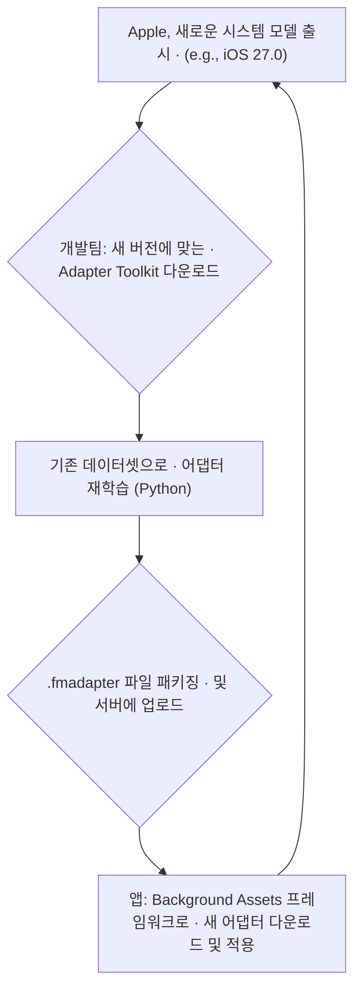

> 이 엔트리는 Blake Crosley의 [Foundation Models Custom Adapters: When To Train One iOS 26 Foundation Models custom adapters t](https://blakecrosley.com/blog/foundation-models-custom-adapters)을 정독하고 핵심을 추출한 것이다.

이 엔트리는 Blake Crosley의 [Foundation Models Custom Adapters: When To Train One](https://crosley.dev/blog/foundation-models-custom-adapters)을 정독하고 핵심을 추출한 것이다. 원문은 Apple의 공식 문서를 다수 인용하며, 온디바이스 AI 모델을 커스터마이징하는 '어댑터'의 기술적 실체와 운영 비용을 명확히 제시한다.

### 왜 중요한가

Apple Intelligence가 제공하는 온디바이스 `SystemLanguageModel`은 대부분의 앱에서 프롬프트 엔지니어링과 Tools 사용만으로 충분하다. 하지만 특정 도메인 전문성, 일관된 스타일, 또는 극도의 저지연성이 요구될 때, 모델의 가중치를 직접 미세 조정하는 '커스텀 어댑터(Custom Adapter)'가 유일한 해법이 될 수 있다.

그러나 어댑터 도입은 "세 번째 레일(the third rail)"에 비유될 만큼 신중한 접근이 필요하다. Apple조차 "대부분의 앱에 권장되지 않는다"고 명시할 정도로, 높은 저장 공간 비용과 지속적인 재학습이라는 운영 부담이 따르기 때문이다. 이 글은 어댑터를 언제 고려하고, 어떤 비용을 감수해야 하는지에 대한 명확한 기준점을 제시한다.

### 핵심 패턴

#### 패턴 1: LoRA, 완전한 파인튜닝이 아니다

Apple의 어댑터는 완전한 모델 재학습이 아닌, **LoRA (Low-Rank Adaptation)** 기법을 사용한다. 이는 Apple의 공식 어댑터 학습 가이드에 명시된 내용이다.

-   **동작 원리**: 기존 시스템 모델의 가중치(Base Weights)는 그대로 동결시킨다. 그 대신, 모델 네트워크 전반에 '어댑터'라 불리는 작고 훈련 가능한 가중치 행렬들을 추가한다. 훈련 과정에서는 이 어댑터 가중치만 업데이트된다.
-   **장점**: 훈련해야 할 파라미터 수가 크게 줄어들어, 파라미터 효율적 파인튜닝(PEFT)이 가능하다.
-   **실체**: `SystemLanguageModel.Adapter`는 이 LoRA 가중치를 담은 파일(`.fmadapter`)을 로드하는 Swift 구조체다.

#### 패턴 2: "최후의 수단"으로서의 도입 기준

Apple은 프롬프트 엔지니어링이나 Tool 호출이 실패했을 때 비로소 어댑터를 고려하라고 명확히 안내한다. 도입을 정당화하는 구체적인 신호는 다음과 같다.

1.  **도메인 전문가화**: 모델이 특정 주제(예: 법률, 의료, 특정 게임 세계관)의 전문가가 되어야 할 때.
2.  **스타일/포맷/정책 강제**: 모델이 항상 정해진 스타일, 포맷, 또는 정책을 따라야 할 때.
3.  **정확도/일관성 한계**: 프롬프트 엔지니어링만으로는 원하는 정확도나 일관성을 달성할 수 없을 때.
4.  **추론 지연 시간 단축**: 매번 긴 예제를 포함한 프롬프트(Few-shot prompting)를 사용해야 해서 응답 속도가 느릴 때. 어댑터는 이 정보를 가중치에 내장하므로 프롬프트를 최소화할 수 있다.

#### 패턴 3: 시스템 모델 버전에 종속된 운영 라이프사이클

가장 중요한 운영상의 제약은 **어댑터가 특정 시스템 모델 버전에 강하게 결합**된다는 점이다. Apple이 iOS 업데이트를 통해 베이스 모델을 개선하면, 기존 어댑터는 호환되지 않아 런타임 오류를 발생시킨다.

이는 다음과 같은 반복적인 라이프사이클을 강제한다.



이 라이프사이클은 어댑터 도입이 일회성 작업이 아닌, 지속적인 유지보수 비용을 수반하는 인프라 투자임을 의미한다.

#### 패턴 4: 거대한 에셋의 On-Demand 배포

어댑터 파일 하나의 크기는 약 160MB에 달한다. 이는 앱의 메인 번들에 포함하기에는 너무 큰 크기다.

-   **배포 전략**: 어댑터는 앱 설치 시점이 아닌, 필요할 때 다운로드해야 한다.
-   **Apple의 솔루션**: 호스팅된 에셋 팩(hosted asset packs)과 `Background Assets` 프레임워크를 통해 이를 처리하도록 권장한다. 사용자는 앱을 사용하는 동안 백그라운드에서 필요한 어댑터를 다운로드하게 된다.

### 실전 적용

#### Swift 코드 예시

앱에서 Background Assets를 통해 다운로드된 어댑터를 로드하고 사용하는 방법은 다음과 같다. 배포를 위해서는 `com.apple.developer.foundation-model-adapter` 권한(Entitlement)이 반드시 필요하다.

```swift
import FoundationModels
import BackgroundAssets

// 가정: "saju-tarot-interpreter-v2" 라는 이름의 에셋을
// Background Assets를 통해 다운로드하도록 요청 및 완료된 상태

func createTarotReadingModel() async throws -> LanguageModelSession {
    do {
        // 1. 이름으로 다운로드된 어댑터를 초기화
        let customAdapter = try SystemLanguageModel.Adapter(name: "saju-tarot-interpreter-v2")

        // 2. 어댑터를 적용하여 시스템 언어 모델 인스턴스 생성
        let specializedModel = SystemLanguageModel(adapter: customAdapter)

        // 3. 모델을 사용한 세션 시작
        let session = LanguageModelSession(model: specializedModel)
        return session
    } catch {
        print("어댑터 로드 실패: \(error)")
        // 어댑터 로드 실패 시, 기본 모델로 fallback 하는 로직 필요
        let baseModel = SystemLanguageModel.shared
        let session = LanguageModelSession(model: baseModel)
        return session
    }
}

// 앱 배포를 위해서는 .entitlements 파일에 아래 키가 필요
// <key>com.apple.developer.foundation-model-adapter</key>
// <true/>
```

#### tarosaju 프로젝트 적용 시나리오

`tarosaju` 앱에서 일반적인 타로 카드 해석이 아닌, 고유한 사주 명리학 관점을 결합한 해석을 제공하고자 할 때 어댑터를 활용할 수 있다.

1.  **문제 정의**: 기본 `SystemLanguageModel`은 서양 중심의 보편적인 타로 해석을 제공한다. 프롬프트로 "사주 명리학 관점에서 해석해줘"라고 매번 지시하는 것은 길고, 일관성이 떨어지며, 응답 지연을 유발한다.
2.  **데이터셋 구축**: `(카드 이름, 사주 관점의 해석)` 쌍으로 구성된 `jsonl` 형식의 데이터 1,000개를 구축한다.
    -   `{"prompt": "컵의 기사", "response": "이는 수(水)의 기운이 강한 인물의 등장을 의미하며, 관계의 흐름에 새로운 감정적 제안이 들어올 수 있음을 암시합니다..."}`
3.  **어댑터 학습**: Apple이 제공하는 Python 툴킷을 사용하여 `saju-tarot-interpreter` 어댑터를 학습시킨다.
4.  **배포 및 적용**: 학습된 어댑터(`.fmadapter`)를 서버에 업로드하고, 앱은 `Background Assets`를 통해 이를 다운로드한다. 사용자가 타로 기능을 처음 사용할 때 다운로드를 트리거할 수 있다.
5.  **결과**: 이제 앱은 `"컵의 기사"`라는 짧은 프롬프트만으로도 즉각적이고 일관된, 사주 기반의 해석을 온디바이스에서 제공할 수 있다. 하지만 `iOS 27`이 출시되면, 이 모든 과정을 다시 반복해야 한다는 점을 인지하고 있어야 한다.