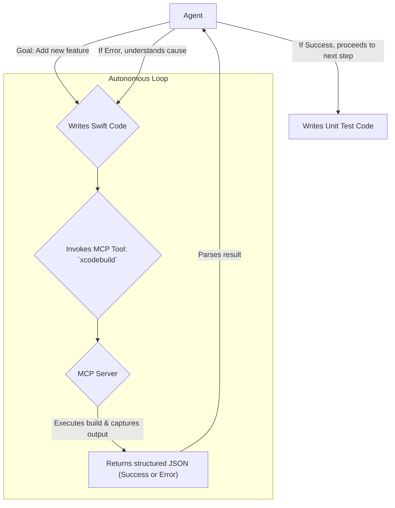

> 이 엔트리는 Blake Crosley의 [iOS Agent Development](https://blakecrosley.com/guides/ios-agent-development)을 정독하고 핵심을 추출한 것이다.

이 엔트리는 Blake Crosley의 블로그 글 [Building iOS Apps with AI Agents: The Practitioner's Guide](https://blakecrosley.com/blog/ios-agent-development-guide)를 정독하고 핵심을 추출한 것이다. Crosley는 8개의 프로덕션 iOS 앱(총 293개 Swift 파일)을 AI 에이전트로 개발한 경험을 바탕으로, 단순한 프롬프트 엔지니어링을 넘어선 구조적인 에이전트 활용 시스템을 제시한다.

### 왜 중요한가: '코드 생성'을 넘어선 '자율 개발 루프'

iOS 개발에서 AI 에이전트의 역할은 단순히 코드를 생성하는 데 그치지 않는다. 핵심은 **MCP(Model-driven Code Production) 서버**를 통해 에이전트가 Xcode 빌드 시스템에 직접 접근하여 **`작성 → 빌드 → 에러 분석 → 수정 → 테스트`**의 자율적인 개발 루프를 실행하게 하는 것이다.

이전에는 에이전트가 작성한 코드가 컴파일되는지 확인하려면 개발자가 직접 코드를 복사해 Xcode에 붙여넣고 빌드 결과를 다시 에이전트에게 알려줘야 했다. Crosley가 제시하는 시스템은 이 과정을 자동화하여, 에이전트가 구조화된 빌드/테스트 결과(JSON)를 직접 읽고 스스로 문제를 해결하게 만든다.

이는 "더 나은 프롬프트"가 아니라 "더 나은 환경과 도구(Configuration)"가 에이전트의 생산성을 결정한다는 패러다임의 전환을 의미한다.

### 핵심 패턴: MCP, CLAUDE.md, Hooks

Crosley는 성공적인 AI 기반 iOS 개발을 위해 세 가지 핵심 구성요소를 강조한다.

#### 1. MCP 서버: 에이전트의 눈과 손

MCP 서버는 LLM과 Xcode 빌드 시스템 사이의 브릿지 역할을 한다. 에이전트는 자연어 대신 구조화된 도구(tool)를 호출하여 빌드, 테스트, 시뮬레이터 실행 등의 작업을 수행한다.

- **`XcodeBuildMCP`**: 59개의 도구를 제공하는 가장 성숙한 MCP 서버.
- **`xcrun mcpbridge`**: Apple이 제공하는 네이티브 MCP 서버로 20개의 도구를 포함.

이 서버들을 통해 에이전트는 단순한 텍스트 출력을 넘어, 실제 개발 환경과 상호작용하는 능력을 갖게 된다.



#### 2. `CLAUDE.md`: 프로젝트 온보딩 문서

`CLAUDE.md` 파일은 에이전트를 위한 "프로젝트 온보딩 문서"다. 에이전트가 작업을 시작하기 전에 이 파일을 먼저 읽어 프로젝트의 맥락을 파악한다. 여기에 시간을 투자하는 것은 모든 에이전트 세션의 효율을 높이는 최고의 방법이다.

**주요 포함 내용:**
- 프로젝트 아키텍처 (MVVM, VIPER 등)
- 핵심 파일 및 폴더 구조 설명
- 데이터 모델링 가이드 (e.g., SwiftData 스키마)
- 코딩 컨벤션 및 스타일 가이드
- **절대 수정하면 안 되는 파일 목록 (`.pbxproj` 등)**

> "에이전트의 효율은 프로젝트 크기가 아니라, CLAUDE.md 문서의 상세함에 비례한다."

#### 3. Hooks: 파괴적 행동 방지 장치

Hooks는 에이전트가 도구를 사용하기 전후(Pre/Post-ToolUse)에 특정 로직을 실행하는 안전장치다. 가장 중요한 훅은 에이전트가 Xcode 프로젝트 설정 파일(`.pbxproj` 또는 `.xcodeproj/`)을 수정하려는 시도를 원천 차단하는 것이다. 에이전트는 이 파일을 안정적으로 수정하지 못하며, 손상 시 프로젝트를 복구하는 데 몇 시간이 걸릴 수 있다.

**`.pbxproj` 보호를 위한 `PreToolUse` Hook 예시 (TypeScript):**
```typescript
// 에이전트가 'writeFile' 도구를 사용하기 전에 실행되는 훅
const preToolUseHook = (toolName: string, toolInput: any): { continue: boolean } => {
  if (toolName === 'writeFile') {
    const filePath = toolInput.path;
    if (filePath.endsWith('.pbxproj') || filePath.includes('.xcodeproj/')) {
      console.error(`[HOOK BLOCKED] Agent tried to modify project file: ${filePath}`);
      // 에이전트에게 작업을 중단하고 대안을 찾으라는 피드백을 줄 수 있음
      return { continue: false }; 
    }
  }
  return { continue: true };
};
```
이 훅 하나만으로도 수많은 잠재적 문제를 예방할 수 있다.

### 실전 적용

#### 1. moneyflow 프로젝트 적용 시나리오

`moneyflow` 앱에 '월별 소비 리포트' 기능을 추가하는 작업을 에이전트에게 맡길 수 있다.

1.  **`CLAUDE.md` 업데이트**:
    - `Transaction`과 `Category` SwiftData 모델의 구조를 명시한다.
    - `ReportView.swift` 파일을 생성하고, MVVM 패턴을 따라 `ReportViewModel.swift`도 함께 만들어야 한다고 지시한다.
    - 차트 라이브러리(e.g., `Charts`) 사용법을 간략히 설명한다.

2.  **작업 지시**:
    - "Create `ReportView.swift` and `ReportViewModel.swift`. The view should display a bar chart of total spending for each of the last 6 months using the `Transaction` SwiftData model."

3.  **에이전트 작업 루프**:
    - 에이전트가 `ReportViewModel.swift`에 `SwiftData` 쿼리 코드를 작성한다.
    - `XcodeBuildMCP`를 호출하여 컴파일한다.
    - 컴파일 에러 발생 시(e.g., 잘못된 predicate 사용), MCP가 반환한 JSON 에러를 분석하여 코드를 스스로 수정한다.
    - 컴파일 성공 후, `ReportView.swift`에 SwiftUI 코드를 작성한다.

4.  **개발자의 역할**:
    - 에이전트가 생성한 `ReportView.swift`와 `ReportViewModel.swift` 파일을 Xcode 프로젝트에 **수동으로 추가한다.** (`.pbxproj`는 에이전트가 건드릴 수 없기 때문)
    - 시뮬레이터에서 UI의 시각적 완성도를 확인하고 미세 조정한다.
    - App Store 제출을 위한 코드 서명 및 최종 검수를 진행한다.

#### 2. 에이전트 활용 명세 (Do & Don't)

Crosley의 경험에 따르면, 에이전트의 능력에는 명확한 한계가 있다.

| O | **에이전트에게 맡기기 좋은 작업 (Do)** |
| :--- | :--- |
| **코드 작성** | SwiftUI 뷰, SwiftData 모델, 비즈니스 로직 |
| **리팩토링** | 기존 코드를 더 효율적인 구조나 최신 API로 변경 |
| **오류 진단** | 컴파일 에러 메시지를 분석하고 수정안 제시 |
| **테스트 작성** | 특정 함수에 대한 유닛 테스트 케이스 생성 |

| X | **인간이 직접 해야 할 작업 (Don't)** |
| :--- | :--- |
| **프로젝트 설정** | `.pbxproj` 파일 수정, 새로운 파일/타겟 추가 |
| **코드 서명** | 프로비저닝 프로파일, 인증서 관련 모든 작업 |
| **시각적 디버깅** | "버튼이 1px 벗어났어요" 같은 미세한 UI 조정 |
| **성능 튜닝** | 프로파일링을 통한 병목 현상 개선 (e.g., Metal 셰이더 최적화) |
| **배포** | App Store Connect에 빌드를 올리고 심사를 제출하는 과정 |


### 참고 자료 (Crosley가 언급한 자료)

- **MCP 서버**: [Two MCP Servers Made Claude Code an iOS Build System](https://blakecrosley.com/blog/mcp-servers-ios-build-system)
- **Claude Code CLI**: [Claude Code CLI: The Complete Guide](https://blakecrosley.com/blog/claude-code-cli-guide)
- **Hooks 시스템**: [Anatomy of a Claw: 84 Hooks as an Orchestration Layer](https://blakecrosley.com/blog/anatomy-of-a-claw-hooks)
- **Apple 생태계 시리즈**: [Apple Ecosystem Series Hub](https://blakecrosley.com/series/apple-ecosystem)