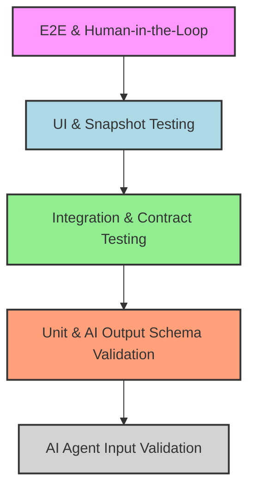

## 한 줄 요약

AI 에이전트가 iOS 코드를 수정했을 때, 그 수정이 안전한지 검증하는 테스트 하네스를 구축하는 실전 가이드.

## 왜 AI 생성 코드에 특별한 테스트가 필요한가

AI는 컴파일되는 코드를 잘 생성하지만, 런타임 동작이 개발자의 의도와 다를 수 있다. 특히 iOS는 타겟 멤버십, 모듈 의존성, 스토리보드/XIB 연결 등 빌드 시스템 특유의 함정이 많아서 "빌드 성공"과 "동작 정상" 사이에 큰 간극이 존재한다. 테스트 하네스 없이 AI 생성 코드를 머지하면, **빌드 통과를 검증 완료로 착각하는 위험한 루프**에 빠진다.

## 테스트 피라미드



- **E2E & Human-in-the-Loop** — 실제 사용자 시나리오 전체 흐름. 사람 최종 검토 필수.
- **UI & Snapshot** — SwiftUI 뷰의 시각적 회귀 방지.
- **Integration & Contract** — 모듈 간 API 계약 검증, 비동기 데이터 흐름.
- **Unit & Schema Validation** — 개별 함수/구조체 + AI 출력 스키마 검증.
- **Input Validation** — AI 에이전트에 전달되는 프롬프트/인자 사전 검증.

아래에서부터 위로 갈수록 비용이 증가한다. AI 생성 코드는 **Unit + Integration 계층을 두텁게** 가져가는 것이 핵심이다.

## 실전 구축 -- 5단계 체크리스트

### Step 1: SwiftLint + SwiftFormat pre-commit 훅

AI가 생성한 코드가 커밋되기 전에 스타일/린트 위반을 자동 교정한다.

**.githooks/pre-commit:**

```bash
#!/bin/bash
set -e

# SwiftLint
if command -v swiftlint &> /dev/null; then
  echo "[pre-commit] Running SwiftLint..."
  swiftlint lint --strict --quiet
fi

# SwiftFormat
if command -v swiftformat &> /dev/null; then
  echo "[pre-commit] Running SwiftFormat..."
  STAGED=$(git diff --cached --name-only --diff-filter=ACM -- '*.swift')
  if [ -n "$STAGED" ]; then
    echo "$STAGED" | xargs swiftformat
    echo "$STAGED" | xargs git add
  fi
fi

echo "[pre-commit] Lint passed."
```

**setup.sh (팀원 전원 자동 설정):**

```bash
#!/bin/bash
git config core.hooksPath .githooks
chmod +x .githooks/pre-commit
echo "Git hooks configured."
```

프로젝트 clone 후 `./setup.sh` 한 번이면 끝. AI가 어떤 스타일로 코드를 생성해도 커밋 전에 프로젝트 컨벤션으로 자동 교정된다.

### Step 2: XCTest 유닛 테스트 -- Protocol 기반 의존성 주입

AI가 생성한 ViewModel의 비즈니스 로직을 검증하는 핵심 패턴.

**Protocol 정의 + Mock:**

```swift
protocol ArticleServiceProtocol: Sendable {
    func fetchArticles() async throws -> [Article]
}

final class MockArticleService: ArticleServiceProtocol {
    var result: Result<[Article], Error> = .success([])

    func fetchArticles() async throws -> [Article] {
        try result.get()
    }
}
```

**ViewModel (AI가 생성한 코드):**

```swift
@MainActor
final class ArticleListViewModel: ObservableObject {
    @Published private(set) var articles: [Article] = []
    @Published private(set) var errorMessage: String?

    private let service: ArticleServiceProtocol

    init(service: ArticleServiceProtocol) {
        self.service = service
    }

    func load() async {
        do {
            articles = try await service.fetchArticles()
        } catch {
            errorMessage = error.localizedDescription
        }
    }
}
```

**async/await 기반 테스트 (XCTestExpectation 불필요):**

```swift
import XCTest

@MainActor
final class ArticleListViewModelTests: XCTestCase {

    func testLoadSuccess() async {
        let mock = MockArticleService()
        mock.result = .success([
            Article(id: "1", title: "Hello", content: "World")
        ])
        let vm = ArticleListViewModel(service: mock)

        await vm.load()

        XCTAssertEqual(vm.articles.count, 1)
        XCTAssertNil(vm.errorMessage)
    }

    func testLoadFailure() async {
        let mock = MockArticleService()
        mock.result = .failure(URLError(.notConnectedToInternet))
        let vm = ArticleListViewModel(service: mock)

        await vm.load()

        XCTAssertTrue(vm.articles.isEmpty)
        XCTAssertNotNil(vm.errorMessage)
    }
}
```

### Step 3: 통합 테스트 -- SPM 모듈 간 계약 검증

SPM 멀티모듈 구조에서 모듈 A가 모듈 B의 public API를 올바르게 사용하는지 검증한다. AI가 모듈 경계를 넘는 수정을 했을 때 계약 위반을 즉시 감지할 수 있다.

**Package.swift 구성:**

```swift
// Package.swift
let package = Package(
    name: "MyApp",
    products: [
        .library(name: "Domain", targets: ["Domain"]),
        .library(name: "Networking", targets: ["Networking"]),
    ],
    targets: [
        .target(name: "Domain"),
        .target(name: "Networking", dependencies: ["Domain"]),
        .testTarget(name: "NetworkingTests", dependencies: ["Networking"]),
    ]
)
```

**계약 테스트 예시:**

```swift
// NetworkingTests/ContractTests.swift
import XCTest
@testable import Networking
import Domain

final class APIContractTests: XCTestCase {

    func testArticleResponseConformsToDomainModel() throws {
        // Networking 모듈의 DTO가 Domain 모듈의 모델로 변환 가능한지 검증
        let dto = ArticleDTO(id: "1", title: "Test", body: "Content")
        let domainModel = dto.toDomain()

        XCTAssertEqual(domainModel.id, "1")
        XCTAssertEqual(domainModel.title, "Test")
    }
}
```

**실행 명령어:**

```bash
# 특정 모듈만 테스트
swift test --filter NetworkingTests

# 전체 패키지 테스트
swift test
```

AI가 `Domain` 모듈의 public 인터페이스를 변경하면, `NetworkingTests`가 즉시 실패하여 계약 위반을 알려준다.

### Step 4: Snapshot 테스트 -- SwiftUI 시각적 회귀 방지

**SPM 패키지 추가:**

```swift
// Package.swift dependencies에 추가
.package(url: "https://github.com/pointfreeco/swift-snapshot-testing", from: "1.15.0")

// testTarget dependencies에 추가
.product(name: "SnapshotTesting", package: "swift-snapshot-testing")
```

**테스트 코드:**

```swift
import XCTest
import SwiftUI
import SnapshotTesting

final class CardViewSnapshotTests: XCTestCase {

    func testDefaultCard() {
        let view = CardView(title: "AI Card", subtitle: "Generated content")
        assertSnapshot(
            of: view,
            as: .image(layout: .fixed(width: 320, height: 120))
        )
    }

    func testDarkModeCard() {
        let view = CardView(title: "Dark", subtitle: "Theme test")
            .environment(\.colorScheme, .dark)
        assertSnapshot(
            of: view,
            as: .image(layout: .fixed(width: 320, height: 120))
        )
    }
}
```

**CI 레퍼런스 이미지 관리 전략:**

- 레퍼런스 이미지는 반드시 Git에 커밋 (`.gitignore`에 포함하면 안 됨)
- 첫 실행 시 `record: true` 파라미터로 레퍼런스 생성 후 커밋
- PR에서 스냅샷 변경이 있으면 diff 이미지를 리뷰어가 확인
- CI 환경의 렌더링 차이를 방지하려면 `perceptualPrecision: 0.98` 사용

### Step 5: CI 게이트 -- xcodebuild + GitHub Actions

**xcodebuild test 명령어:**

```bash
xcodebuild test \
  -scheme MyApp \
  -destination 'platform=iOS Simulator,name=iPhone 16,OS=18.0' \
  -resultBundlePath TestResults.xcresult \
  -only-testing:MyAppTests \
  | xcpretty
```

**GitHub Actions 워크플로우:**

```yaml
name: iOS Test Gate
on:
  pull_request:
    branches: [main]

jobs:
  test:
    runs-on: macos-15
    steps:
      - uses: actions/checkout@v4

      - name: Select Xcode
        run: sudo xcode-select -s /Applications/Xcode_16.app

      - name: Run Tests
        run: |
          xcodebuild test \
            -scheme MyApp \
            -destination 'platform=iOS Simulator,name=iPhone 16,OS=18.0' \
            | xcpretty --report junit

      - name: Upload Results
        if: always()
        uses: actions/upload-artifact@v4
        with:
          name: test-results
          path: build/reports/
```

이 워크플로우를 PR 머지 게이트(required status check)로 설정하면, 테스트 실패 시 머지가 차단된다.

## AI Agent Directive

**Trigger**: iOS 프로젝트에 AI 에이전트 도입 시 테스트 하네스 구축, 또는 AI 수정 코드의 신뢰성 검증 필요 시

**Prerequisites**: [iOS Legacy to AI-Ready](/wiki/ios-ai/ios-legacy-to-ai-ready), [Apple Intelligence API](/wiki/ios-ai/apple-intelligence-api)

### Actionable Steps
1. `.githooks/pre-commit`에 SwiftLint + SwiftFormat 게이트 구성
2. Protocol 기반 의존성 주입 패턴으로 모든 ViewModel 리팩터 (Mock 주입 가능하게)
3. XCTest async/await 테스트 작성 (XCTestExpectation 불필요)
4. SPM 모듈 간 계약 테스트 추가 (API 호출 유효성)
5. SwiftUI 뷰는 snapshot testing으로 회귀 방지
6. GitHub Actions CI에 `xcodebuild test` 게이트 추가 (PR 머지 차단 설정)
7. iOS 테스트 함정 5가지 체크리스트 확인 (타겟 멤버십, @MainActor, import XCTest, timeout, testTarget)

### Anti-patterns
- 테스트 없이 "컴파일 성공"만으로 검증 완료 선언
- XCUITest를 단위 테스트로 사용 (너무 느림)
- Mock에 실제 네트워크/DB 호출 포함
- 스냅샷 레퍼런스를 .gitignore에 추가

---

## AI 에이전트가 빠지는 iOS 테스트 함정 5가지

### 1. 타겟 멤버십 누락

**증상**: 새 파일을 추가했는데 Test 타겟에서 `No such module` 또는 `Use of unresolved identifier` 에러.

**수정**: Xcode 프로젝트 파일에서 해당 파일의 Target Membership에 Test 타겟 체크. SPM이면 `testTarget`의 `dependencies`에 추가.

### 2. @MainActor 누락

**증상**: UI 업데이트 코드가 테스트에서는 통과하지만 런타임에 `Purple runtime warning` 또는 크래시 발생.

**수정**: ViewModel 클래스에 `@MainActor` 어노테이션 추가. 테스트 함수에도 `@MainActor` 적용.

### 3. import XCTest 프로덕션 코드 혼입

**증상**: Archive 빌드 시 `No such module 'XCTest'` 링크 에러.

**수정**: XCTest import가 Test 타겟 파일에만 존재하는지 확인. `#if DEBUG` 가드도 Archive에서는 strip되므로 근본 해결이 아님.

### 4. 비동기 테스트 timeout 미설정

**증상**: CI에서 테스트가 무한 대기하다가 job timeout으로 실패.

**수정**: `async` 테스트 함수 사용 시에도 전체 test suite에 `executionTimeAllowance = 60` 설정. `XCTestExpectation` 사용 시 반드시 `timeout` 파라미터 명시.

### 5. SPM testTarget 미선언

**증상**: `swift test` 실행 시 `0 tests executed` -- 테스트 코드가 있는데도 실행되지 않음.

**수정**: `Package.swift`에 `.testTarget(name: "MyTests", dependencies: ["MyModule"])` 선언 추가.

## For AI Agents

**Trigger**: iOS 프로젝트에서 테스트 환경 구축 요청, 또는 AI 수정 코드의 검증 방법 질문

**Prerequisites**:
- Xcode 프로젝트 또는 SPM Package.swift 존재
- 최소 1개 모듈의 소스 코드

**Actionable Steps**:
1. `.githooks/pre-commit` 확인 -- 없으면 Step 1 실행
2. 테스트 타겟 존재 확인 (`xcodebuild -list`) -- 없으면 생성
3. Protocol 기반 DI 패턴 확인 -- 없으면 리팩터 제안
4. `swift test` 또는 `xcodebuild test` 실행 가능 확인
5. CI 워크플로우에 테스트 게이트 존재 확인

**Anti-patterns**:
- 테스트 없이 "빌드 성공"만으로 검증 완료 선언
- XCUITest를 유닛 테스트 대신 사용 (느리고 불안정)
- Mock 객체에 실제 네트워크 호출 포함
- 스냅샷 레퍼런스 이미지를 .gitignore에 포함

---

## 자기 점검

1. AI 생성 코드의 테스트가 일반 코드 테스트와 다른 이유 세 가지를 설명할 수 있는가?
2. Protocol 기반 DI 패턴으로 ViewModel 테스트를 작성할 수 있는가?
3. SPM 멀티모듈에서 계약 테스트가 어떤 문제를 방지하는지 설명할 수 있는가?
4. Snapshot 테스트의 레퍼런스 이미지를 CI에서 어떻게 관리해야 하는가?
5. 위 "함정 5가지" 중 본인 프로젝트에 해당하는 것이 있는가?

### 이 개념을 동료에게 설명한다면?

"AI가 코드를 생성해주면 빌드는 잘 되는데, 런타임에서 터지는 경우가 꽤 있거든. 특히 iOS는 타겟 멤버십이나 MainActor 같은 빌드 시스템 함정이 많아서, 테스트 없이 AI 코드를 머지하면 위험해. pre-commit 훅부터 CI 게이트까지 5단계로 방어선을 쌓으면, AI가 뭘 생성하든 안전하게 검증할 수 있어."
