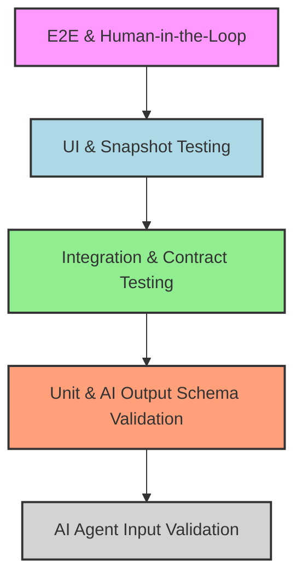
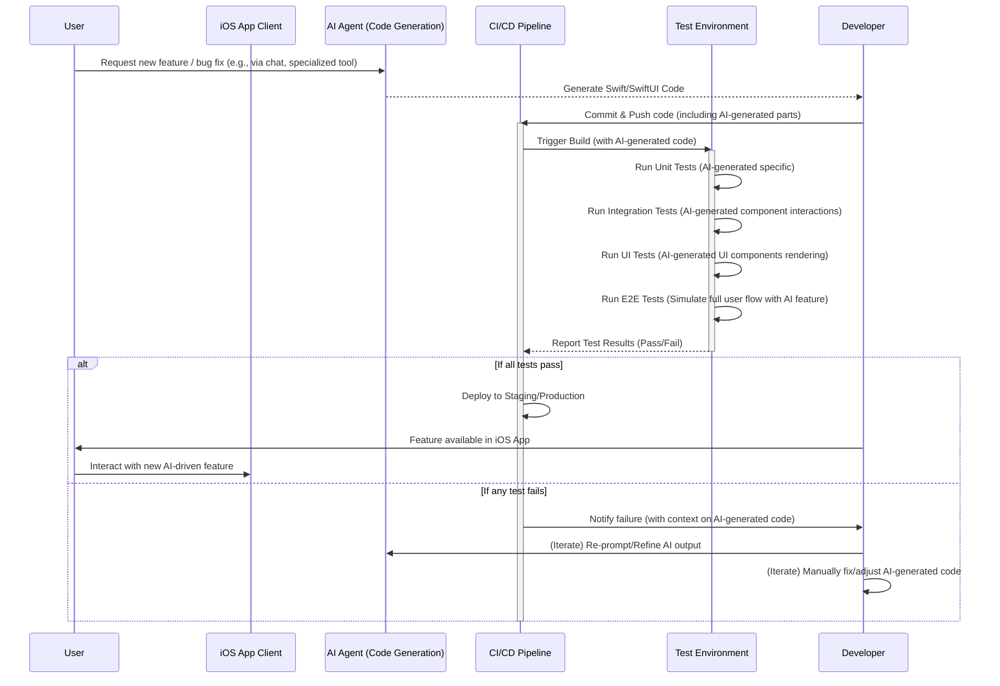

### AI 생성 코드, 왜 특별한 테스트 전략이 필요한가?

최근 AI 에이전트와 코드 도우미는 iOS 개발의 생산성을 혁신하고 있습니다. Swift/SwiftUI 코드 자동 생성, 리팩토링 제안, 버그 수정 등 그 활용 범위는 날로 넓어지고 있습니다. 하지만 AI가 생성한 코드는 개발 속도를 비약적으로 높이는 동시에, 예측 불가능성과 잠재적 버그라는 새로운 도전 과제를 제시합니다. AI 모델의 환각(Hallucination), 비결정론적 특성, 특정 컨텍스트에 대한 의존성, 그리고 사람이 놓치기 쉬운 미묘한 비일관성 등은 전통적인 코드와는 다른 촘촘하고 다층적인 검증을 요구합니다.

AI 생성 코드의 품질 보증은 단순한 버그 발견을 넘어, AI가 개발자의 의도를 얼마나 정확히 반영하고 있는지, 그리고 실제 프로덕션 환경에서 사용자에게 안정적이고 예상 가능한 경험을 제공할 수 있는지 확인하는 과정입니다. 이 글에서는 iOS 앱에서 AI가 생성하거나 수정한 코드의 신뢰성을 확보하기 위한 유닛, 통합, UI, E2E 테스트 환경 구성 및 실전 Swift/SwiftUI 패턴을 딥 리서치합니다.

### iOS AI 코드 테스트 피라미드 재정의

전통적인 테스트 피라미드(유닛 > 통합 > UI/E2E)는 AI 생성 코드에도 유효하지만, AI의 고유한 특성을 고려하여 각 계층을 강화하고 AI 시스템 자체의 유효성 검증 단계를 추가해야 합니다.



*   **AI Agent Input Validation (최하단)**: AI 에이전트에 전달되는 프롬프트, 툴 호출 인자 등이 유효한지 사전 검증합니다. 잘못된 입력은 잘못된 코드를 생성하므로, 이는 AI 시스템 자체의 견고성을 높이는 기초 단계입니다.
*   **Unit & AI Output Schema Validation**: AI가 생성한 코드 단위의 기능 검증과 더불어, AI의 중간 출력 (예: JSON)이 Swift 코드 생성 전 유효한 스키마를 따르는지 검증합니다. 이는 AI의 환각을 초기에 방지하는 중요한 방어선입니다.
*   **Integration & Contract Testing**: AI가 생성한 모듈과 기존 시스템 간의 연동, AI가 생성한 여러 컴포넌트 간의 상호작용을 검증합니다.
*   **UI & Snapshot Testing**: AI가 생성한 SwiftUI 뷰가 시각적으로 올바르게 렌더링되고 사용자 경험(UX) 표준을 준수하는지 확인합니다.
*   **E2E & Human-in-the-Loop**: 실제 사용자 시나리오에서 AI가 생성한 모든 요소가 완벽하게 작동하는지 검증합니다. 복잡한 AI 에이전트 워크플로우의 경우 사람의 개입을 통한 최종 검토가 필수적입니다.

### 유닛 테스트: AI 생성 Swift 코드의 최소 단위 검증

AI가 생성한 함수, 구조체, 클래스 등 개별 코드 조각의 동작을 Swift의 `XCTest` 프레임워크를 활용하여 검증합니다. 핵심은 '결정론적 환경' 구축과 'AI 출력 유효성' 검증입니다.

#### 1. 결정론적 출력 확보를 위한 패턴

AI 생성 코드는 `Date`나 `UUID`처럼 비결정론적 요소를 포함할 수 있습니다. 테스트 시에는 Mocking/Stubbing을 통해 이러한 요소를 고정된 값으로 주입하여 예측 가능한 환경을 구축해야 합니다.

```swift
// AI가 생성한 것으로 가정하는 유틸리티 함수
struct AIDrivenDateFormatter {
    static func format(date: Date, format: String) -> String {
        let formatter = DateFormatter()
        formatter.dateFormat = format
        formatter.timeZone = TimeZone(secondsFromGMT: 0) // UTC 고정
        return formatter.string(from: date)
    }
}

// 테스트 코드
import XCTest

final class AIDrivenDateFormatterTests: XCTestCase {
    func testFormatDate() {
        // 고정된 Date 객체를 사용하여 결정론적 테스트 환경 조성
        let fixedDate = Date(timeIntervalSinceReferenceDate: 0) // 2001-01-01 00:00:00 UTC
        
        let formattedString = AIDrivenDateFormatter.format(date: fixedDate, format: "yyyy-MM-dd")
        XCTAssertEqual(formattedString, "2001-01-01")

        let formattedStringWithTime = AIDrivenDateFormatter.format(date: fixedDate, format: "HH:mm:ss")
        XCTAssertEqual(formattedStringWithTime, "00:00:00") // UTC 기준
    }
}
```

#### 2. AI 출력 스키마 유효성 검증 (Swift 측)

AI가 직접 Swift 코드를 생성하기 전에, JSON 등의 구조화된 중간 출력을 내놓는 경우가 많습니다. 이 중간 출력이 유효한지 Swift의 `Codable` 프로토콜과 커스텀 유효성 검증 로직을 활용하여 검증합니다. 이는 `AI 출력 Zod 검증 패턴`의 Swift 버전으로 볼 수 있습니다.

```swift
// AI가 생성할 것으로 기대되는 UI 컴포넌트 정의
struct AIComponentConfig: Codable, Equatable {
    let type: String
    let title: String
    let description: String?
    let primaryAction: String?

    // 커스텀 유효성 검증을 포함한 초기화
    init(from decoder: Decoder) throws {
        let container = try decoder.container(keyedBy: CodingKeys.self)
        type = try container.decode(String.self, forKey: .type)
        title = try container.decode(String.self, forKey: .title)
        description = try container.decodeIfPresent(String.self, forKey: .description)
        primaryAction = try container.decodeIfPresent(String.self, forKey: .primaryAction)

        // 비즈니스 로직에 따른 추가 검증
        if type.isEmpty || title.isEmpty {
            throw DecodingError.dataCorruptedError(forKey: .type, in: container, debugDescription: "Type and title cannot be empty.")
        }
    }
}

// 테스트 코드
import XCTest

final class AIComponentConfigTests: XCTestCase {
    func testValidConfigDecoding() throws {
        let jsonString = """
        {
            "type": "Card",
            "title": "Welcome",
            "description": "This is a welcome card.",
            "primaryAction": "Get Started"
        }
        """
        let jsonData = jsonString.data(using: .utf8)!
        let config = try JSONDecoder().decode(AIComponentConfig.self, from: jsonData)

        XCTAssertEqual(config.type, "Card")
        XCTAssertEqual(config.title, "Welcome")
        XCTAssertEqual(config.description, "This is a welcome card.")
        XCTAssertEqual(config.primaryAction, "Get Started")
    }

    func testInvalidConfigDecoding() {
        let jsonString = """
        {
            "type": "",
            "title": "Empty Type",
            "description": "Should fail validation"
        }
        """
        let jsonData = jsonString.data(using: .utf8)!

        XCTAssertThrowsError(try JSONDecoder().decode(AIComponentConfig.self, from: jsonData)) { error in
            guard let decodingError = error as? DecodingError else {
                XCTFail("Expected DecodingError, got \(error)")
                return
            }
            if case .dataCorrupted(let context) = decodingError {
                XCTAssertTrue(context.debugDescription.contains("Type and title cannot be empty."))
            } else {
                XCTFail("Expected dataCorrupted error with specific message, got \(decodingError)")
            }
        }
    }
}
```

### 통합 테스트: AI 생성 컴포넌트 간, 그리고 기존 시스템과의 연동 보증

AI가 생성한 여러 코드 블록이 서로 올바르게 상호작용하는지, 혹은 기존의 iOS 모듈과 통합될 때 문제가 없는지 검증합니다. 특히 비동기 로직과 데이터 흐름에 집중합니다.

#### 서비스 계층 통합 테스트

AI가 생성한 데이터 처리 로직(예: 네트워크 통신 계층, 데이터 변환 로직)이 실제 백엔드나 로컬 저장소와 잘 연동되는지 확인합니다. Mock 서버나 인메모리 데이터베이스를 활용하여 테스트 환경을 격리하고, 비동기 작업을 `XCTestExpectation` 또는 `async/await`와 함께 검증합니다.

```swift
// AI가 생성한 것으로 가정하는 데이터 모델 및 서비스
struct Article: Codable, Identifiable, Equatable {
    let id: String
    let title: String
    let content: String
}

protocol ArticleServiceProtocol {
    func fetchArticles() async throws -> [Article]
}

class MockArticleService: ArticleServiceProtocol {
    var articlesToReturn: [Article]?
    var errorToThrow: Error?

    func fetchArticles() async throws -> [Article] {
        if let error = errorToThrow {
            throw error
        }
        return articlesToReturn ?? []
    }
}

// AI가 생성한 뷰모델 (서비스 의존성 주입)
class ArticleListViewModel: ObservableObject {
    @Published var articles: [Article] = []
    @Published var isLoading = false
    @Published var errorMessage: String?

    private let service: ArticleServiceProtocol

    init(service: ArticleServiceProtocol) {
        self.service = service
    }

    @MainActor
    func loadArticles() async {
        isLoading = true
        errorMessage = nil
        do {
            articles = try await service.fetchArticles()
        } catch {
            errorMessage = error.localizedDescription
        }
        isLoading = false
    }
}

// 통합 테스트 코드
import XCTest
import Combine // Combine 프레임워크는 @Published 속성을 구독하는 데 사용

final class ArticleListViewModelIntegrationTests: XCTestCase {
    private var cancellables: Set<AnyCancellable>!

    override func setUp() {
        super.setUp()
        cancellables = []
    }

    override func tearDown() {
        cancellables = nil
        super.tearDown()
    }

    func testLoadArticlesSuccess() async throws {
        let mockService = MockArticleService()
        let expectedArticles = [
            Article(id: "1", title: "Test Article 1", content: "Content 1"),
            Article(id: "2", title: "Test Article 2", content: "Content 2")
        ]
        mockService.articlesToReturn = expectedArticles
        let viewModel = ArticleListViewModel(service: mockService)

        let expectation = XCTestExpectation(description: "Articles loaded successfully")
        viewModel.$articles
            .dropFirst() // Initial empty array
            .sink { articles in
                if !articles.isEmpty {
                    XCTAssertEqual(articles, expectedArticles)
                    expectation.fulfill()
                }
            }
            .store(in: &cancellables)

        await viewModel.loadArticles()

        await fulfillment(of: [expectation], timeout: 1.0)
        XCTAssertFalse(viewModel.isLoading)
        XCTAssertNil(viewModel.errorMessage)
    }

    func testLoadArticlesFailure() async {
        let mockService = MockArticleService()
        enum TestError: Error { case networkError }
        mockService.errorToThrow = TestError.networkError
        let viewModel = ArticleListViewModel(service: mockService)

        let expectation = XCTestExpectation(description: "Error message displayed")
        viewModel.$errorMessage
            .dropFirst() // Initial nil
            .sink { message in
                if message != nil {
                    XCTAssertEqual(message, TestError.networkError.localizedDescription)
                    expectation.fulfill()
                }
            }
            .store(in: &cancellables)

        await viewModel.loadArticles()

        await fulfillment(of: [expectation], timeout: 1.0)
        XCTAssertFalse(viewModel.isLoading)
        XCTAssertNotNil(viewModel.errorMessage)
    }
}
```

### UI 테스트: AI 생성 SwiftUI 뷰의 시각적 및 상호작용 검증

AI가 생성하거나 수정한 SwiftUI 뷰의 레이아웃, 스타일, 사용자 상호작용을 검증합니다. `XCUITest`와 Snapshot Testing을 활용하여 시각적 회귀를 방지하고 사용자 흐름을 확인합니다.

#### 1. XCUITest를 이용한 사용자 흐름 검증

AI가 특정 비즈니스 로직에 따라 생성한 화면이 예상대로 작동하는지 `XCUITest`로 검증합니다. 접근성 식별자(`accessibilityIdentifier`)를 활용하여 UI 요소에 안정적으로 접근하는 것이 중요합니다.

```swift
// AI가 생성한 것으로 가정하는 로그인 뷰
import SwiftUI

struct AILoginView: View {
    @State private var username = ""
    @State private var password = ""
    @State private var isAuthenticated = false
    @State private var errorMessage: String?

    var body: some View {
        NavigationView {
            VStack {
                TextField("사용자 이름", text: $username)
                    .textFieldStyle(RoundedBorderTextFieldStyle())
                    .padding()
                    .accessibilityIdentifier("username_field")

                SecureField("비밀번호", text: $password)
                    .textFieldStyle(RoundedBorderTextFieldStyle())
                    .padding()
                    .accessibilityIdentifier("password_field")

                Button("로그인") {
                    // AI가 생성한 로그인 로직
                    if username == "test" && password == "password" {
                        isAuthenticated = true
                    } else {
                        errorMessage = "아이디 또는 비밀번호가 잘못되었습니다."
                    }
                }
                .padding()
                .accessibilityIdentifier("login_button")

                if let errorMessage = errorMessage {
                    Text(errorMessage)
                        .foregroundColor(.red)
                        .accessibilityIdentifier("error_message")
                }

                NavigationLink(destination: Text("환영합니다!"), isActive: $isAuthenticated) {
                    EmptyView()
                }
                .accessibilityIdentifier("welcome_navigation_link") // 숨겨진 네비게이션 링크 식별자
            }
            .navigationTitle("AI 로그인")
        }
    }
}

// XCUITest 코드
import XCTest

final class AILoginUITests: XCTestCase {
    var app: XCUIApplication!

    override func setUpWithError() throws {
        continueAfterFailure = false
        app = XCUIApplication()
        // 테스트할 뷰를 호스팅하는 앱을 실행
        // 실제 앱의 Entry Point에서 AILoginView를 Root View로 설정해야 함
        app.launchArguments = ["-AILoginView"] // 예시: 특정 뷰를 시작하도록 앱에 인자 전달
        app.launch()
    }

    func testLoginSuccess() throws {
        let usernameField = app.textFields["username_field"]
        let passwordField = app.secureTextFields["password_field"]
        let loginButton = app.buttons["login_button"]

        XCTAssertTrue(usernameField.waitForExistence(timeout: 5), "Username field not found")
        XCTAssertTrue(passwordField.waitForExistence(timeout: 5), "Password field not found")
        XCTAssertTrue(loginButton.waitForExistence(timeout: 5), "Login button not found")

        usernameField.tap()
        usernameField.typeText("test")

        passwordField.tap()
        passwordField.typeText("password")

        loginButton.tap()

        // "환영합니다!" 텍스트가 나타날 때까지 기다림
        let welcomeText = app.staticTexts["환영합니다!"]
        let existsPredicate = NSPredicate(format: "exists == true")
        expectation(for: existsPredicate, evaluatedWith: welcomeText, handler: nil)
        waitForExpectations(timeout: 5.0, handler: nil)

        XCTAssertTrue(welcomeText.exists, "Welcome text not displayed after successful login")
    }

    func testLoginFailure() throws {
        let usernameField = app.textFields["username_field"]
        let passwordField = app.secureTextFields["password_field"]
        let loginButton = app.buttons["login_button"]
        let errorMessage = app.staticTexts["error_message"]

        XCTAssertTrue(usernameField.waitForExistence(timeout: 5), "Username field not found")
        XCTAssertTrue(passwordField.waitForExistence(timeout: 5), "Password field not found")
        XCTAssertTrue(loginButton.waitForExistence(timeout: 5), "Login button not found")

        usernameField.tap()
        usernameField.typeText("wrong_user")

        passwordField.tap()
        passwordField.typeText("wrong_pass")

        loginButton.tap()

        XCTAssertTrue(errorMessage.waitForExistence(timeout: 2.0), "Error message not displayed")
        XCTAssertEqual(errorMessage.label, "아이디 또는 비밀번호가 잘못되었습니다.")
    }
}
```

#### 2. SwiftUI Snapshot Testing

AI가 생성한 SwiftUI 뷰의 시각적 회귀를 방지하기 위해 Snapshot Testing을 활용합니다. [`pointfreeco/swift-snapshot-testing`](https://github.com/pointfreeco/swift-snapshot-testing) 라이브러리가 널리 사용되며, AI가 생성한 UI 컴포넌트의 일관된 렌더링을 보장하는 데 매우 효과적입니다.

```swift
// AI가 생성한 것으로 가정하는 SwiftUI Card 뷰
import SwiftUI

struct AICardView: View {
    let title: String
    let description: String
    let accentColor: Color

    var body: some View {
        VStack(alignment: .leading) {
            Text(title)
                .font(.headline)
                .foregroundColor(.white)
            Text(description)
                .font(.subheadline)
                .foregroundColor(.white.opacity(0.8))
        }
        .padding()
        .frame(maxWidth: .infinity)
        .background(accentColor)
        .cornerRadius(10)
        .shadow(radius: 5)
    }
}

// Snapshot Test 코드
import XCTest
import SwiftUI
import SnapshotTesting // 'swift-snapshot-testing' 라이브러리 필요

final class AICardViewSnapshotTests: XCTestCase {
    // Xcode Scheme에서 "Environment Variables"에 `FB_REFERENCE_IMAGE_DIR` 설정 필요
    // 예: `$(SOURCE_ROOT)/$(PROJECT_NAME)Tests/ReferenceImages`

    func testAICardViewDefault() {
        let view = AICardView(title: "AI Card", description: "This is an AI-generated card.", accentColor: .blue)
        assertSnapshot(matching: view, as: .image(layout: .fixed(width: 300, height: 100)))
    }

    func testAICardViewLongDescription() {
        let view = AICardView(title: "Important Notice", description: "This is a very long description that should wrap into multiple lines to test the layout integrity of the AI-generated card view. We need to ensure that the text flows correctly and doesn't get truncated.", accentColor: .red)
        assertSnapshot(matching: view, as: .image(layout: .fixed(width: 300, height: 200))) // 높이 조정
    }

    func testAICardViewDifferentColor() {
        let view = AICardView(title: "Green Card", description: "Another example.", accentColor: .green)
        assertSnapshot(matching: view, as: .image(layout: .fixed(width: 300, height: 100)))
    }
}
```

### E2E 테스트: AI 기반 iOS 앱의 전체 사용자 여정 검증

AI가 생성한 컴포넌트, 로직, UI가 통합된 상태에서 실제 사용자 시나리오를 처음부터 끝까지 검증합니다. 이는 AI가 기여한 기능이 전체 앱 생태계 내에서 완벽하게 작동하는지 확인하는 최상위 테스트입니다. CI/CD 파이프라인에 통합하여 자동화함으로써 지속적인 품질 보증을 달성합니다.

#### AI 에이전트 워크플로우 테스트

AI 에이전트가 복잡한 작업을 수행하고 그 결과를 iOS 앱에 반영하는 시나리오라면, 그 전체 흐름을 E2E 테스트로 검증합니다. 예를 들어, AI 에이전트가 사용자 요청을 받아 Swift 코드를 생성하고, 그 코드가 빌드되어 앱에 포함되고, 사용자가 해당 기능을 실행했을 때 올바른 결과가 나오는지 확인합니다.



**E2E 테스트 환경 구성:**

*   **시뮬레이터/실제 기기**: 테스트 환경은 실제 사용자 환경과 최대한 유사하게 구성하여 잠재적 문제를 조기에 발견합니다.
*   **데이터 Mocking/Setup**: E2E 테스트 전에 필요한 사용자 데이터, AI 응답 데이터 등을 미리 준비하거나 Mocking합니다. AI API에 대한 직접적인 의존성을 줄여 테스트의 안정성과 속도를 확보합니다.
*   **Test Harness**: AI가 생성한 특정 기능을 쉽게 트리거하고 결과를 검증할 수 있도록 테스트용 진입점(예: 디버그 메뉴의 특정 버튼, CLI 커맨드)을 마련합니다. 이는 `Harness Engineering` 원칙을 iOS 앱에 적용하는 것입니다. (`iOS Harness Journal` 시리즈 참조)

### CI/CD 파이프라인과의 통합: 자동화된 품질 보증

AI 생성 코드의 품질 보증은 CI/CD 파이프라인에 깊이 통합되어야 합니다. `git pre-commit 훅`부터 `CI 머지 게이트`까지, 각 단계에서 AI 생성 코드에 특화된 검증을 수행합니다.

1.  **프리-커밋 훅 (Pre-commit Hook)**: AI가 생성한 코드가 커밋되기 전에 SwiftLint, SwiftFormat 등의 코드 스타일 검사를 자동으로 수행합니다. 이는 `iOS Harness Journal 001`에서 다루는 내용과 유사합니다.
2.  **빌드 및 유닛 테스트 (Build & Unit Test)**: 풀 리퀘스트(PR) 시 AI 생성 코드를 포함한 전체 프로젝트를 빌드하고 모든 유닛 테스트를 실행합니다. AI 출력 스키마 유효성 검증도 이 단계에서 이루어져야 합니다.
3.  **통합/UI/E2E 테스트 (Integration/UI/E2E Test)**: 복잡도가 높은 테스트들은 별도의 CI 잡으로 실행하며, 실패 시 PR 머지를 차단하는 게이트(Gate)로 활용합니다.
4.  **코드 리뷰 (Code Review)**: AI가 생성한 코드라도 사람이 최종적으로 검토하여 의도와 일치하는지, 잠재적 문제점은 없는지 확인합니다. `LLM-as-a-Judge` 패턴을 활용하여 AI가 생성한 코드에 대한 또 다른 AI의 리뷰를 추가할 수도 있으나, 최종적인 인간 검토는 필수입니다.
5.  **스냅샷 테스트 결과 비교 (Snapshot Test Result Comparison)**: CI 시스템에서 스냅샷 테스트를 실행하고, 변경된 스냅샷 이미지를 PR에 첨부하여 시각적 변경 사항을 사람이 쉽게 검토할 수 있도록 합니다.

### 2026년 트렌드: 온디바이스 AI와 테스트의 미래

2026년에는 Apple Intelligence와 같은 온디바이스 AI 모델의 활용이 더욱 확대될 것입니다. 이는 테스트 환경에 새로운 도전 과제를 제시하며, iOS 개발자는 다음 영역에 주목해야 합니다.

*   **온디바이스 모델의 성능 및 자원 소모 테스트**: AI가 생성한 코드나 AI 모델 자체가 기기 성능(배터리 소모, CPU/GPU 사용량, 메모리)에 미치는 영향을 측정하고 최적화하는 테스트가 중요해집니다.
*   **개인정보 보호 및 보안 테스트**: 온디바이스 AI가 사용자 데이터를 처리할 때 개인정보 보호 및 보안 규정을 준수하는지 검증하는 것이 필수적입니다. 데이터 처리 로직에 대한 엄격한 테스트가 필요합니다.
*   **엣지 케이스 및 복원력 테스트**: 네트워크 연결이 불안정하거나, 저장 공간이 부족하거나, 리소스가 제한적인 상황(저전력 모드 등)에서 AI 생성 코드가 얼마나 안정적으로 작동하는지 테스트하여 앱의 복원력을 보장해야 합니다.

---

## 자기 점검

1.  AI 생성 코드의 테스트가 일반적인 코드 테스트와 구별되는 주요 이유는 무엇이며, 최소 세 가지 이상 설명해 보세요.
2.  `AI 출력 스키마 유효성 검증`이 유닛 테스트 단계에서 중요한 이유는 무엇이며, Swift에서 이를 `Codable` 프로토콜을 활용하여 어떻게 구현할 수 있었나요?
3.  SwiftUI 뷰의 시각적 일관성을 AI 생성 코드 환경에서 보장하기 위한 가장 효과적인 테스트 전략은 무엇이며, 그 이유를 설명해 보세요.
4.  E2E 테스트에서 `AI API Mocking`과 `Test Harness`가 왜 중요한 역할을 하는지 설명해 보세요.
5.  CI/CD 파이프라인에서 AI 생성 코드의 품질을 보증하기 위해 어떤 단계를 구성할 수 있을까요? 최소 세 가지 이상 구체적인 예시를 들어 설명해 보세요.

### 이 개념을 동료에게 설명한다면?

"AI가 코드를 짜주는 세상에서, 우리는 그 코드를 어떻게 믿고 프로덕션에 내보낼 수 있을까? 특히 iOS 앱에서는 다양한 레이어를 거쳐 코드가 통합되는데, AI의 비결정성 때문에 예상치 못한 버그가 생기기 쉽거든. 유닛 테스트부터 E2E 테스트까지, AI 코드의 특성을 고려해서 어떻게 견고한 테스트 환경을 만들고 실무에서 바로 쓸 수 있는 Swift 패턴들을 적용할 수 있는지 알려줄게. AI가 생성한 코드가 망가지는 걸 막는 우리의 방어 전략이라고 보면 돼."

### 실습 과제

다음 요구사항을 충족하는 간단한 iOS 앱 프로젝트를 생성하세요.

1.  **AI 생성 뷰 (가정)**: AI가 사용자에게 랜덤한 명언을 보여주는 `QuoteCardView` SwiftUI 뷰를 생성했다고 가정합니다. (실제 AI 생성 코드가 아니어도 무방하며, 사람이 작성해도 됩니다.)
    *   `QuoteCardView`는 `quote: String`과 `author: String` 두 개의 프로퍼티를 받아 화면에 표시합니다.
    *   배경색은 파란색으로 고정하고, 패딩과 코너 반경을 적절히 적용합니다.
2.  **Snapshot Test 구현**: `QuoteCardView`에 대한 Snapshot Test를 `swift-snapshot-testing` 라이브러리를 사용하여 구현하세요.
    *   기본 명언 (`"Hello AI", "ChatGPT"`) 하나.
    *   길이가 긴 명언 (`"A very long quote that tests the wrapping capabilities of the text views within the card, ensuring proper layout and display across multiple lines. This is a crucial test for UI consistency.", "Unknown Author"`) 하나.
    *   총 두 가지 스냅샷 테스트 케이스를 작성하고, 각 케이스에 대해 이미지 스냅샷을 검증하세요. (Xcode Test Scheme에 `FB_REFERENCE_IMAGE_DIR` 환경 변수를 설정해야 합니다.)
3.  **AI 생성 서비스 (가정)**: AI가 백엔드 API에서 명언 목록을 가져오는 `QuoteService` 프로토콜과 `MockQuoteService` 구현체를 제공했다고 가정합니다.
    *   `QuoteService` 프로토콜은 `fetchQuotes() async throws -> [Quote]` 메서드를 가집니다.
    *   `Quote` 구조체는 `id: String`, `text: String`, `author: String`을 포함하며 `Codable`과 `Identifiable`을 준수해야 합니다.
    *   `MockQuoteService`는 미리 정의된 명언 목록을 반환하거나, 특정 에러를 발생시킬 수 있도록 구현하세요.
4.  **ViewModel 및 View 구현**: `QuoteService`를 사용하여 명언 목록을 로드하고 `QuoteCardView` 목록으로 표시하는 `QuoteListViewModel` (ObservableObject)과 `QuoteListView` (SwiftUI)를 구현하세요.
5.  **통합 테스트 작성**: `QuoteListViewModel`에 대한 통합 테스트를 작성하여, `MockQuoteService`를 주입했을 때 명언 목록이 성공적으로 로드되고 `articles` Published 프로퍼티가 업데이트되는지 검증하세요. (비동기 테스트를 위해 `XCTestExpectation` 또는 `async/await`를 활용하세요.)