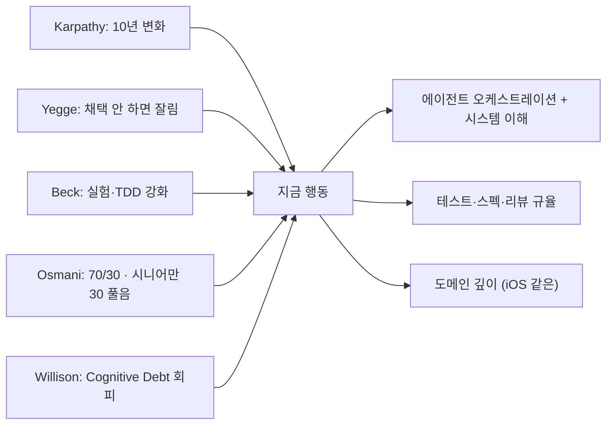

## 들어가며: 방향이 흐릿한 게 정상이다

지금 iOS 개발자로 일하면서 "다음에 뭘 해야 하지?"가 명확하지 않다면, 그건 능력의 문제가 아니라 **산업이 1990년대 PC, 2007년 모바일에 비견되는 변곡점에 있기 때문**입니다. Andrej Karpathy는 이 변화를 *Software 1.0(코드) → 2.0(가중치) → 3.0(프롬프트)*의 패러다임 전환이라 부르고, 이 전환이 "한 해가 아니라 [에이전트의 10년](https://www.latent.space/p/s3)"이라 말합니다.

이 글은 우왕좌왕하지 않게 **세 가지를 동시에 해결하려고** 씁니다:

1. **현재 좌표 잡기** — 권위자 5명의 컨센서스, 빅테크 채용 데이터, 빅테크 움직임의 교차점
2. **iOS 개발자 특화 기회** — Apple Foundation Models / MLX / App Intents가 만든 새로운 영역
3. **90일 실행 플랜** — 막연한 "공부해라" 대신 30/60/90 마일스톤 + 일일 루틴 + 측정 메트릭

> 이 글은 일반론이 아닙니다. moneyflow(가계부) · tarosaju(운세) · 이 위키를 함께 운영하는 1인 iOS 개발자 + AI 위키 운영자 페르소나에 맞춰 구체화돼 있습니다. 자기 상황에 맞춰 가중치 조정하세요.

---

## 1. 권위자 5인의 컨센서스 (2025–2026)

서로 다른 배경의 다섯 사람이 *같은 방향*을 가리킬 때, 그건 노이즈가 아니라 시그널입니다.

### Andrej Karpathy — "Software 3.0과 에이전트의 10년"
- 2025년 6월, AI Startup School 키노트 ([transcript](https://singjupost.com/andrej-karpathy-software-is-changing-again/) · [요약](https://www.latent.space/p/s3))
- 핵심: **프롬프트가 새로운 소스 코드, 영어가 새로운 프로그래밍 언어, LLM이 새로운 CPU**.
- 단, "vibe coding"은 *입구*일 뿐 *목표*가 아님. 진짜는 **Agentic Engineering** — 다단계 자율 워크플로우를 설계하는 일.
- 인용 (의역): "2025가 에이전트의 해라는 말이 나올 때마다 걱정된다. 이건 *해* 단위가 아니라 *10년* 단위 변화다."

### Steve Yegge — "지금 안 따라가면 잘린다"
- Pragmatic Engineer 인터뷰 ([Steve Yegge on AI Agents](https://newsletter.pragmaticengineer.com/p/steve-yegge-on-ai-agents-and-the))
- 그는 LLM 회의론자였다가 Claude Code 써본 뒤 *컨버트*. Sourcegraph로 돌아갔다.
- 가장 강한 한 마디 (인용): *"dude, you're going to get fired... and you're one of the best engineers I know!"* — AI 도구 채택이 낮은 엔지니어에게.
- 8단계 프레임워크: 단순 IDE autocomplete → 단일 에이전트 → 다중 에이전트 → 커스텀 오케스트레이터. 5단계 이하면 위험권.
- 예측: *2026년 말까지 "절반의 엔지니어를 줄여 남은 절반의 토큰 비용을 댄다"는 구조조정이 광범위하게 일어난다.*

### Kent Beck — "TDD가 더 중요해진다"
- Pragmatic Engineer 팟캐스트 ([TDD, AI agents and coding with Kent Beck](https://newsletter.pragmaticengineer.com/p/tdd-ai-agents-and-coding-with-kent))
- 인용 (의역): *"AI 에이전트가 회귀를 만든다. 게다가 테스트를 *지워서* 통과시키려 한다. 테스트 규율 없으면 무너진다."*
- "특정 언어에 정서적 애착이 더 이상 없다. 비싼 것과 싼 것의 지형이 통째로 바뀌었다."
- 권고: *experiment actively* — "We just don't know. We just have to be trying stuff."

### Addy Osmani — "70% 문제와 AI-Assisted Engineering"
- ["The 70% Problem"](https://www.linkedin.com/posts/addyosmani_softwareengineering-programming-ai-activity-7301670061520392194-s1v_) · 책 [Beyond Vibe Coding](https://beyond.addy.ie/)
- **70% 문제**: AI는 작동하는 프로토타입까지 빠르게 가지만, *마지막 30%(품질·유지보수성·엣지케이스·"two steps back" 패턴)*는 시스템을 깊이 이해하는 엔지니어만 푼다.
- 정의: *"Vibe coding is not the same as AI-Assisted engineering."* 시니어가 AI로 폭발적 생산성을 내는 방식은 **스펙을 먼저 쓰고, 모든 diff를 리뷰하고, 테스트를 돌리고, AI를 빠르지만 미덥지 못한 주니어처럼 다루는 것**.
- iOS 개발자 시사점: Foundation Models로 빠르게 데모 만드는 것은 70%. 나머지 30%(privacy, error handling, accessibility, A/B 가능한 fallback)이 시니어가 되는 길.

### Simon Willison — "Cognitive Debt"라는 새로운 부채
- [simonwillison.net/tags/ai-assisted-programming](https://simonwillison.net/tags/ai-assisted-programming/) · [Agentic Engineering Patterns](https://simonw.substack.com/p/agentic-engineering-patterns)
- **Cognitive Debt**: 기술 부채와 다른 새로운 부채 — *"코드는 돌아가는데, 왜 돌아가는지 모른다."*
- 핵심 권고: *"Code became cheap. Good code is still expensive."* — 동작·테스트·유지보수성·문서·미래 확장성을 보장하는 건 여전히 비싸다.

### 다섯 사람의 공통 메시지



요약 한 줄: *AI는 잘 쓰되, AI가 못 푸는 30%를 풀 수 있는 시스템 깊이를 잃지 마라.*

---

## 2. 시장 신호: 채용 데이터와 빅테크 움직임

권위자 의견과 시장 데이터가 맞물리는지 교차 검증합니다.

### 2.1. 채용 데이터 (2025–2026)

- **AI 엔지니어 채용 +143% YoY** (LinkedIn, 2025) — 가장 빠르게 성장한 직군 ([Pin tech job market report](https://www.pin.com/blog/tech-job-market-report/))
- **ML 엔지니어 +59%** (vs Feb 2020) / **일반 SWE -49%** (같은 기준) — 일반화의 시대가 끝나고 있음
- **AI/ML 엔지니어 임금**: $134K–$193K (vs 일반 SWE $109K–$175K) — 약 23% 프리미엄
- 75% 이상의 AI 채용공고가 **도메인 전문가** 요구 — 깊이 X 폭

### 2.2. 빅테크 움직임 — Apple 중심

iOS 개발자에게 **WWDC25에 Apple이 던진 신호 3개**가 결정적입니다:

1. **Foundation Models framework** ([WWDC25 #286](https://developer.apple.com/videos/play/wwdc2025/286/) · [Apple Newsroom](https://www.apple.com/newsroom/2025/09/apples-foundation-models-framework-unlocks-new-intelligent-app-experiences/))
   - 3B 파라미터 on-device 모델을 Swift API로 노출. iOS/macOS/iPadOS/visionOS 공통.
   - **Guided generation**(Swift 데이터 구조 직접 생성), **Tool calling**, **Streaming sessions** — sandbox 친화적 LLM 통합.
   - 의미: *iOS 개발자는 "AI 기능 = 외부 API 호출"이라는 패러다임을 OS 레벨에서 우회할 수 있다.*

2. **MLX-Swift** ([github.com/ml-explore/mlx-swift](https://github.com/ml-explore/mlx-swift) · [WWDC25 #298](https://developer.apple.com/videos/play/wwdc2025/298/))
   - Apple Silicon에서 LLM/VLM/이미지 생성을 직접 실행. Unified memory · Metal · zero-copy.
   - Hugging Face 모델 다운로드 → Swift에서 LLM 챗봇 5분 만에 구동.
   - 의미: *플랫폼 엔지니어 = "iOS + AI 추론 인프라"가 가능한 새로운 슬롯.*

3. **App Intents 격상** ([Apple Docs](https://developer.apple.com/documentation/appintents) · [Bring your app to Siri](https://developer.apple.com/videos/play/wwdc2024/10133/))
   - SiriKit Intents → App Intents로 사실상 이전. iOS 18+에서 Apple Intelligence/Siri/Spotlight/Shortcuts의 *공통 정문*.
   - **iOS 18.4부터 Apple Intelligence가 App Intents로 앱 기능을 직접 호출** — 사용자가 음성/Siri로 "내 가계부에서 이번 달 식비 합계 알려줘" 하면 앱이 vision 없이 응답.
   - 의미: 우리가 [Computer Use vs Structured API](../agents/ai-agent-cost-model-computer-use-structured-api.mdx) 엔트리에서 본 *45배 비용 차이*를 Apple이 OS 차원에서 메꾸려는 인프라.

### 2.3. 다른 빅테크의 좌표

- **Anthropic**: Model Context Protocol(MCP)이 사실상 표준 toolling 인터페이스로 안착. Claude Code가 dev 워크플로우 표준 후보.
- **OpenAI**: Codex/Operator 류 에이전트화. ChatGPT Apps SDK로 "에이전트가 우리 앱을 호출하는" 시나리오 확장.
- **Google**: Gemini Nano on-device(Android), AI Studio 프로토타이핑. Android의 App Actions가 App Intents의 카운터파트.
- **GitHub/Microsoft**: Copilot Workspace + agentic 모드. JetBrains/Cursor가 IDE 측 표준 경쟁.

공통 지향점: **"앱이 에이전트에게 API처럼 보이게 만드는 OS/플랫폼 표준"**. 이걸 일찍 익힌 iOS 개발자가 새로운 슬롯을 차지합니다.

---

## 3. iOS 개발자에게 닥친 3가지 변화 (구체적으로)

### 변화 1: "AI 기능 = 외부 API"의 종말

기존: ChatGPT/Claude API를 호출하는 iOS 앱 → API 키 관리, 네트워크 비용, 프라이버시, 지연.

새 설계 공간:
- **On-device LLM** (Foundation Models, MLX) — 무료, 즉시, 오프라인, 프라이버시
- **시스템 인텐트** (App Intents) — Apple Intelligence가 우리 앱을 호출
- **하이브리드 라우팅** — 간단한 건 on-device, 복잡한 건 클라우드 ([HydraLLM 패턴](../context-engineering/hydrallm-multi-llm-orchestration.mdx))

**iOS 개발자가 새롭게 답해야 하는 질문**: *"이 기능은 on-device로 충분한가, 클라우드가 필요한가, 어떻게 결정하는가?"* → 이게 곧 채용 인터뷰의 단골이 됩니다.

### 변화 2: UI 코드의 의미 변화

SwiftUI를 잘 쓰는 것은 이제 *기본*이지 *차별화*가 아닙니다. 차별화는 두 방향으로 갈립니다:

- **Up the stack**: SwiftUI + AI 기능의 **자연스러운 통합** (스트리밍 응답, generative UI, undo 가능한 AI 액션, 신뢰성 표시)
- **Down the stack**: Metal/MLX/Accelerate를 만져 **AI 추론 성능 자체를 튜닝**

가운데(SwiftUI 모디파이어 마스터)에 머물면 채용 시장에서 commodity화됩니다.

### 변화 3: 테스트와 신뢰성의 위상 상승

LLM은 비결정성을 가져옵니다. iOS는 결정론적 UI 위에 비결정 LLM을 얹습니다. 그러면 *기존에 잘 안 했던 분야가 핵심*이 됩니다:

- **AI 출력 검증**: zod 스타일 스키마, guided generation, fallback chain
- **회귀 방지**: AI가 만든 코드/응답이 지난 주의 좋은 동작을 깨지 않았는지
- **Eval 셋**: 200개 실 쿼리로 모델 변경 영향 측정 ([HydraLLM 캘리브레이션 가이드](../context-engineering/hydrallm-multi-llm-orchestration.mdx))

이 위키의 [ios-ai-code-quality-test-strategy](./ios-ai-code-quality-test-strategy.mdx) · [ai-output-zod-validation-pattern](../harness-engineering/ai-output-zod-validation-pattern.mdx) 같은 엔트리들이 *이제는 인터뷰에서 묻는* 영역입니다.

---

## 4. "AI를 잘 쓰는 개발자"의 구체적 정의

막연하게 "AI 잘 쓰는"으로 끝내지 않기 위해 **체크 가능한 5가지 능력**으로 분해합니다.

### 능력 1: 작업 분해 (Task Decomposition)
- 큰 요구를 에이전트가 한 번에 끝낼 수 있는 단위로 자른다.
- 30분짜리 작업 1개보다 5분짜리 작업 6개가 *훨씬 잘된다*.
- 측정: 한 작업의 첫 번째 에이전트 응답이 *유의미한 진전*을 만드는 비율 (목표 ≥ 70%).

### 능력 2: 컨텍스트 엔지니어링
- 적절한 파일·문서·최근 변경을 적절한 양으로 에이전트에게 주입.
- *너무 적으면 환각, 너무 많으면 토큰 낭비 + 산만*.
- 이 위키의 [JIT 위키 검색](../../CLAUDE.md) 패턴 = 검색 → 관련 청크만 주입.
- 측정: 작업당 평균 input token / output token 비율 (목표: 자기 도메인 베이스라인 30% 절감).

### 능력 3: 검증·게이트 설계
- AI 출력을 *맹신하지 않는* 자동 게이트 (build · test · type · 커스텀 schema).
- 우리 위키의 [Compound Engineering 자동 빌드 차단](../../CLAUDE.md) 사례.
- 측정: 머지된 PR 중 *post-merge 핫픽스* 비율 (낮을수록 좋음).

### 능력 4: 멀티 에이전트 오케스트레이션
- 단일 에이전트 대화에서 멈추지 말 것. 라우터 + 워커 + 리뷰어 패턴 ([HydraLLM](../context-engineering/hydrallm-multi-llm-orchestration.mdx)).
- Yegge의 8단계 중 5단계 이상.
- 측정: *내가 직접 작성한 코드 vs 내가 오케스트레이션한 코드*의 비율이 시간이 지나며 후자로 이동하는가.

### 능력 5: 비용·지연 의식 (Tokenomics)
- 에이전트의 절감을 *추정 말고 측정*. ccusage, Anthropic Console, OpenAI Usage.
- 토큰 누수 패턴 인식: 큰 컨텍스트 반복 주입, 캐시 미활용, 라우터 비용 누수.
- 측정: 월간 토큰 비용 / 기능 출하 수.

---

## 5. 이직 포지셔닝: 사라지는 역할 vs 부상하는 역할

### 사라지거나 commoditize되는 역할
- "SwiftUI/UIKit으로 디자인 그대로 따라 그리는" 시니어 IC
- "API 명세대로 ViewModel/Repository 까는" 미들 IC
- "인터넷 튜토리얼대로 fastlane 깔고 사이닝 정리하는" DevOps 담당

이들은 *Cursor + Claude Code + 신입급 1명*으로 70% 대체됩니다. 시간이 갈수록 이 비율이 올라갑니다.

### 부상하는 역할 (iOS 도메인 한정)

| 새 포지션 | 핵심 책임 | 차별화 스킬 |
| :--- | :--- | :--- |
| **iOS AI Platform Engineer** | Foundation Models / MLX 통합, 모델 라우팅, on-device 추론 튜닝 | Swift + Metal + Python(LLM 학습 측), Eval 셋 운용 |
| **AI-Native Product Engineer** | LLM 기능을 SwiftUI 안에 *자연스럽게* 녹임 (스트리밍, generative UI, AI undo) | SwiftUI 깊이 + 프롬프트 엔지니어링 + UX 직관 |
| **Trust & Safety Engineer (Mobile)** | LLM 출력 검증, jailbreak 방어, prompt injection 차단, audit log | 보안 + zod-스타일 검증 + 형식 검증 |
| **Agent Orchestration Engineer** | App Intents/MCP 기반의 시스템 에이전트 호환, 다중 에이전트 워크플로우 | TypeScript+Swift, MCP, App Intents, Eval |
| **Mobile DX Engineer** | 자기 팀의 AI 개발 루틴 설계 (CLAUDE.md, 훅, 슬래시 커맨드, 컴파운드) | 하네스 엔지니어링 = 이 위키의 핵심 영역 |

### "이직 시 어떻게 보일 것인가"의 5가지 신호

채용 담당자 + 시니어 엔지니어가 30분 안에 *판별하는* 신호들:

1. **GitHub에 `CLAUDE.md` / `AGENTS.md` 가 있는가** — 자기 워크플로우를 문서화한 흔적
2. **AI 기능이 들어간 출시앱**이 있는가 (App Store 링크, 사용자 ≥ 100)
3. **Eval 셋·로그·메트릭** 흔적 (블로그/위키/노션) — 추정이 아니라 측정 문화
4. **on-device + cloud 하이브리드 결정 사례** — "왜 어떤 건 on-device, 어떤 건 cloud로?"
5. **에이전트 오케스트레이션 흔적** (Claude Code/Cursor 워크플로우 글) — Yegge 5단계+ 시그널

이 다섯이 다 있는 iOS 개발자는 **2026년 채용 시장에서 희소재**입니다.

---

## 6. 90일 학습 플랜

추상적 "공부해라"는 함정이라, 마일스톤·산출물 형식으로 묶었습니다.

### Day 0–30: Foundation Models + 하루 워크플로우 정착

**산출물 (3개)**:
1. **Foundation Models 통합 데모 앱**: 텍스트 요약·재작성·태깅 중 하나. 200줄 이내. App Store 비공개 TestFlight까지 올리기.
2. **개인 `CLAUDE.md` v1**: 자기 iOS 프로젝트의 빌드/테스트/스타일 규약 박제. 100줄 이내.
3. **Eval 셋 v0**: 자기 앱의 핵심 LLM 호출 시나리오 30개를 JSON 파일로.

**하루 루틴**:
- 모든 코드 작업은 Claude Code/Cursor에서 시작. 커밋 전 빌드 훅으로 차단 (이 위키의 Compound Engineering 패턴).
- 일주일에 한 번, 자기 워크플로우의 마찰점을 하나 *없애는* 변경 (훅 추가, 슬래시 커맨드, CLAUDE.md 수정).

**메트릭**: PR 머지 속도, post-merge 핫픽스 비율, 일주일 토큰 비용.

### Day 31–60: App Intents + 하이브리드 라우팅

**산출물 (3개)**:
1. **App Intents 5개 노출**: 자기 앱의 핵심 액션을 Siri/Shortcuts에서 호출 가능하게.
2. **하이브리드 라우터 구현**: 사용자 요청을 (a) on-device Foundation Models / (b) Claude/GPT API로 라우팅. [HydraLLM](../context-engineering/hydrallm-multi-llm-orchestration.mdx) 2-tier 패턴.
3. **위키/블로그 글 1편**: 위 통합 과정의 *측정된 절감*을 보고 (추정 X).

**메트릭**: on-device 비율, 평균 응답 지연, 월간 클라우드 토큰 비용.

### Day 61–90: 멀티 에이전트 오케스트레이션 + 포지셔닝

**산출물 (3개)**:
1. **에이전트 워크플로우 1건**: 자기 앱의 한 기능 출하를 *코드 작성 → 테스트 → 리뷰 → 배포* 풀 사이클로 자동화 (Claude Code subagents · 워커 패턴).
2. **공개 글 2편**: 위 워크플로우 + Foundation Models 통합 회고. *수치 포함*.
3. **포트폴리오 페이지** (Notion/개인 사이트): 위 신호 5가지를 한눈에. App Store 링크 · CLAUDE.md repo · 글 링크 · 메트릭.

**메트릭 (이직 신호 측면)**:
- GitHub stars (≥ 50)
- 글 1편당 외부 유입 (≥ 200 unique)
- 자기 앱 DAU 또는 TestFlight 활성 사용자 (≥ 50)

> 90일 안에 이 셋이 다 만족되지 않아도 OK. *방향이 맞는지*가 핵심이고, 9개월이면 다 만들 수 있습니다.

---

## 7. AI-네이티브 iOS 개발자의 하루

추상화 대신 *실제 시간표*로:

```
09:00  /  컨텍스트 로드 (NEXT.md 5 phase) → 오늘의 작업 1개 픽
09:15  /  Claude Code 새 세션, 작업 분해 (5분짜리 6개로)
09:30–11:30  / 작업 1 (구현) — 에이전트가 1차, 사람이 diff 리뷰
11:30  /  테스트 추가 (TDD) — Beck 권고: AI가 만든 코드일수록 테스트 필수
12:00  /  점심 — *3시간 룰* (Yegge: vibe coding 풀스피드는 3시간 한계)
13:00–15:00  / 작업 2 (UI/UX) — SwiftUI + Foundation Models 통합
15:00  /  Eval 셋 검증 — 오늘의 변경이 회귀 안 만들었는지
15:30  /  /compound — 오늘 배운 것 → solution/retro로 박제
16:00–17:00  / 학습 — WWDC 세션 1개, 권위자 글 1편, 위키 엔트리 1개 추가
17:00  /  Push (Vercel auto-deploy) → 회고 1줄
```

핵심 디자인:
- **"3시간 풀스피드 룰"** (Yegge) — AI 보조에서도 인간 인지 한계는 3시간. 이후는 스파이크가 아니라 burnout.
- **Compound Engineering** (이 위키) — *학습이 자동으로 박제*되지 않으면 cognitive debt가 쌓인다 (Willison).
- **저녁/주말은 학습** — 권위자 글, WWDC, 자기 위키 갱신. 능동 학습 ≥ 5h/주.

---

## 8. 함정 5가지 (회피 리스트)

### 함정 1: "Apple이 다 해줄 거야" 신앙
- Foundation Models는 강력하지만 *3B 파라미터 + on-device*. GPT-5/Claude 4.x를 대체하지 못함.
- 진짜 답은 *하이브리드*. Apple 단독 신앙 = 천장 빠르게.

### 함정 2: "Vibe coding으로 충분하다" 착시
- Osmani 70% 문제. 데모는 빠르지만 *실 사용자 만족까지의 30%*가 진짜 일.
- 자기 앱이 어느 정도 사용자 수를 거치며 30%를 직접 풀어본 사람이 시니어로 분류됩니다.

### 함정 3: 이직 시그널 *없이* 이직 시도
- 채용 담당자는 30분 안에 5가지 신호 (4번 섹션)를 봅니다. 신호 없는 시점에 인터뷰 진입 = 가짜 천장.
- 신호 만들기에 90일을 먼저 쓰는 게 *이직 활동*보다 ROI 높음.

### 함정 4: AI 도구만 바꾸고 워크플로우는 그대로
- Cursor 깔고 끝나면 1단계. 5단계까지 가려면 *훅·슬래시 커맨드·CLAUDE.md·컴파운드 루프* 같은 워크플로우 인프라가 필요.
- 이 위키의 [harness-engineering](../harness-engineering/ai-engineering-landscape-2026-midpoint.mdx) 카테고리가 그 인프라 박제소.

### 함정 5: 깊이 없이 폭만 넓히기
- AI 엔지니어 채용공고 75%가 *도메인 전문가* 요구.
- iOS 깊이 + AI 폭 = 희소재. iOS 폭 + AI 폭 = 일반화 위험. *iOS 깊이를 절대 버리지 마라*.

---

## 9. 다음 단계 (이 글을 읽고 오늘/이번 주에 할 일)

1. **오늘 (15분)**: 자기 GitHub에 `CLAUDE.md`(또는 `AGENTS.md`) 초안 푸시. 주요 빌드/테스트 명령 + 코딩 규약 + AI 사용 규약 5개.
2. **이번 주 (3시간)**: Foundation Models 데모 앱 1개 — 텍스트 요약 도구. iOS 18+ Apple Silicon 시뮬레이터에서 동작 확인.
3. **이번 달 (10시간)**: 위 90일 플랜 Day 0–30 산출물 3개.
4. **분기**: 위키/블로그에 1편 — *수치 포함된 회고*.

> "방향이 흐릿하다"는 감정의 답은 *방향을 더 명확히 그리려는 시도*가 아니라 **작은 산출물 하나를 내는 행동**입니다. Beck 인용을 한 번 더: *"We just don't know. We just have to be trying stuff."*

---

## 출처

### 권위자
- Andrej Karpathy, "Software Is Changing (Again)" — AI Startup School 2025: https://www.latent.space/p/s3
- Steve Yegge, Pragmatic Engineer 인터뷰 (2025): https://newsletter.pragmaticengineer.com/p/steve-yegge-on-ai-agents-and-the
- Kent Beck, Pragmatic Engineer 인터뷰 (2025): https://newsletter.pragmaticengineer.com/p/tdd-ai-agents-and-coding-with-kent
- Addy Osmani, "Beyond Vibe Coding": https://beyond.addy.ie/ · "The 70% Problem": https://www.linkedin.com/posts/addyosmani_softwareengineering-programming-ai-activity-7301670061520392194-s1v_
- Simon Willison, AI-assisted programming 태그: https://simonwillison.net/tags/ai-assisted-programming/
- Sebastian Raschka, "Build a Large Language Model (From Scratch)" 및 PyCon DE 2026 키노트: https://2026.pycon.de/keynote-sebastian-raschka/

### Apple 공식
- Foundation Models framework: https://developer.apple.com/videos/play/wwdc2025/286/ · https://www.apple.com/newsroom/2025/09/apples-foundation-models-framework-unlocks-new-intelligent-app-experiences/
- MLX: https://opensource.apple.com/projects/mlx/ · https://github.com/ml-explore/mlx-swift
- App Intents: https://developer.apple.com/documentation/appintents

### 채용 데이터
- Pin, Tech Job Market 2026: https://www.pin.com/blog/tech-job-market-report/
- Second Talent, In-Demand AI Engineering Skills 2026: https://www.secondtalent.com/resources/most-in-demand-ai-engineering-skills-and-salary-ranges/
- IEEE Spectrum, How to Stay Ahead of AI as an Early-Career Engineer: https://spectrum.ieee.org/ai-effect-entry-level-jobs

---

## 자기 점검

1. 권위자 5인의 컨센서스 한 줄을 자기 말로 정리해보세요. 그중 *자기 상황에 가장 강하게 적용되는* 한 사람의 메시지는 누구의 것이고 왜인가요?
2. 이 글의 5가지 채용 시그널 중 *현재 자기에게 있는 것*과 *없는 것*을 분류하세요. 90일 안에 만들 수 있는 것 1개를 골라보세요.
3. iOS 도메인 깊이 + AI 폭 = 희소재. 자기 iOS 깊이의 *증명 자료*(코드, 글, 출시앱) 3개를 적어보세요. 없다면 어떤 걸 만들어야 할까요?
4. Osmani의 70/30 모델로 자기 최근 AI-도움 작업을 분석해보세요. 70%까지는 누가 했고, 30%는 누가 풀었나요? 30%가 풀리지 않은 작업이 있다면, 무엇이 막혔나요?
5. **실습 (1주일)**: 자기 iOS 사이드 프로젝트에 Foundation Models를 통합한 작은 기능 1개를 추가하고, 같은 기능을 클라우드 LLM으로도 구현해 *지연/비용/품질*을 측정해 표로 비교하세요. 그 표가 곧 이직 시 첫 페이지 자료입니다.
