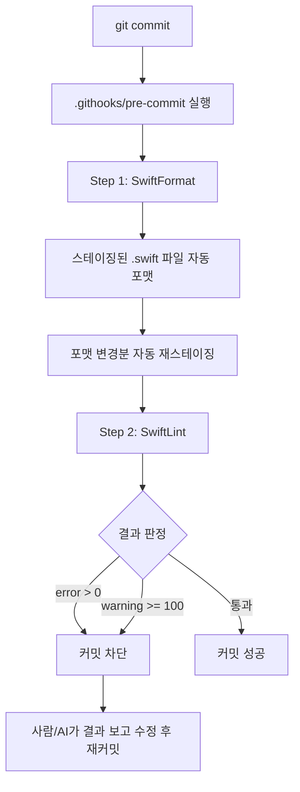

## 한 줄 요약

Swift 코드 규칙은 **git pre-commit 훅**(`.githooks/`)이 차단한다. Claude의 PreToolUse 훅이 Write 직전에 lint를 돌리는 게 아니다. `./setup.sh`가 `git config core.hooksPath .githooks`를 한 번 걸어두면, 이후 모든 `git commit`은 SwiftFormat → SwiftLint 게이트를 통과해야 한다. Claude 훅은 그 위에 얹힌 미리보기 5줄이 전부다.

---

## 문제

Claude가 Swift 코드를 작성할 때 프로젝트별 `.swiftlint.yml` 규칙을 전부 기억한다고 기대할 수 없다. 매 프롬프트에 규칙을 붙여넣는 건 토큰 낭비고, 심지어 그렇게 해도 간헐적으로 위반 코드가 나온다.

기존 수동 워크플로:

```
AI가 코드 생성 → 개발자가 swiftlint 돌림 → 위반 확인 → 수동 수정 → 재커밋
```

평균 왕복 3회. 린트 결과를 사람이 다시 AI에게 붙여넣어야 했다. 구조가 없으면 매번 수작업으로 해결된다.

---

## 흔한 오해: "Claude PreToolUse on Write로 막으면 되지 않나?"

처음엔 당연히 이 방향을 생각했다. Claude의 `PreToolUse` 훅이 `Write` 툴 직전에 작성 예정 콘텐츠를 임시 파일에 뿌리고 `swiftlint`를 돌려서 `exit 1`로 차단하면 되지 않을까?

실제로 해 보면 **brittle**하다.

- **Write 툴 input format에 의존**한다. 환경변수 이름이 바뀌거나 툴 입력 스키마가 진화하면 훅이 조용히 깨진다.
- **임시 파일 한 개만으로는 lint 정확도가 낮다.** SwiftLint는 프로젝트 컨텍스트(모듈 경계, excluded 경로, opt_in_rules 파일 단위 해석)를 보고 판단하는데, 한 파일만 임시 디렉터리로 빼내면 규칙 일부가 오판된다.
- **Edit 툴은 못 잡는다.** Write만 가로채도 Edit으로 우회된다.
- **커밋 없이 수정하는 케이스를 지나치게 많이 차단한다.** 스크래치 파일, 주석만 고치는 경우까지 막히면 AI가 무한 루프에 빠진다.

결정적으로, 이 방식은 **사람의 작업**은 막지 못한다. 개발자가 에디터로 직접 Swift 파일을 수정한 뒤 커밋하면 Claude 훅은 개입할 기회조차 없다.

진짜 게이트는 AI 레이어가 아니라 **저장소 레이어**에 박혀야 한다.

---

## 실제 채택한 패턴: `.githooks/pre-commit`

AI와 사람이 공유하는 단 하나의 병목이 있다. `git commit`. 여기에 게이트를 박으면 누가 커밋을 시도하든 통과해야 한다.

### 활성화: `./setup.sh` 한 줄

```bash
./setup.sh
# 내부에서 실행:
#   git config core.hooksPath .githooks
```

기본 경로인 `.git/hooks/`가 아니라 **저장소에 체크인된 `.githooks/`** 를 사용한다는 점이 중요하다. 이렇게 하면 훅 자체가 버전 관리되고, 모든 기여자가 동일한 게이트를 공유한다.

### 흐름 다이어그램



### Step 1 — SwiftFormat (자동 교정)

스테이징된 `.swift` 파일만 대상으로 SwiftFormat을 돌린다. 포맷이 바뀐 파일은 **자동으로 `git add` 재스테이징**해서 커밋 대상에 포함시킨다. 사람이 손 댈 필요 없음. 부수효과는 일관된 스타일뿐.

### Step 2 — SwiftLint (차단 기준)

SwiftFormat이 끝난 뒤 SwiftLint를 돌린다. 차단 기준은 두 개:

- **error > 0** — 하나라도 있으면 차단
- **warning ≥ 100** — 누적 경고가 임계치를 넘으면 차단

warning 임계치를 0이 아닌 100으로 둔 건 의도적이다. 엄격한 0-warning 정책은 기존 레거시 경고 때문에 매 커밋마다 무관한 수정을 강요하게 되고, AI가 이걸 해결하느라 무한 루프에 빠진다. **error는 반드시 0, warning은 완만한 압력**.

### 실제 `.swiftlint.yml` 규칙 (일부)

```yaml
line_length: 99

opt_in_rules:
  - force_unwrapping
  - sorted_imports
  # ... 총 25개

custom_rules:
  no_add_target:
    name: "no addTarget"
    regex: "\\.addTarget\\("
    message: "addTarget 대신 Rx 바인딩을 사용하세요"
    severity: error

excluded:
  - .build
  - Pods
  - .swiftpm
  - SPM
```

`force_unwrapping`이 opt-in + error로 올라가 있어서 `!` 강제 언래핑은 커밋 자체가 막힌다. `no_add_target`은 UIKit 타깃 API 대신 Rx 바인딩 스타일을 강제하는 프로젝트 고유 규칙.

---

## Claude의 보조 역할: 커밋 전 미리보기 5줄

그렇다고 Claude 훅이 아무것도 안 하는 건 아니다. `.claude/settings.json`의 `PreToolUse on Bash` 훅이 **`git commit` 명령을 감지했을 때만** 다음을 실행한다.

```bash
#!/bin/bash
# .claude/hooks/git-commit-lint-preview.sh (요약)

# 이 훅의 stdin으로 전달된 bash command에 'git commit'이 포함되어 있을 때만 동작
if echo "$COMMAND" | grep -q "git commit"; then
  # 전체 결과를 다 뿌리지 않고 head -5만
  swiftlint --quiet 2>/dev/null | head -5
fi

# 반드시 exit 0 — 차단하지 않는다
exit 0
```

목적은 단 하나: **"지금 커밋하면 이런 게 걸릴 수 있어"를 Claude에게 미리 보여주기.** 실제 차단은 `.githooks/pre-commit`이 한다.

왜 굳이? Claude가 `git commit`을 시도했을 때 곧바로 보조 신호를 받으면, pre-commit 훅이 실제로 실패하기 전에 한 번 더 self-check를 하게 된다. 체감상 성공률이 올라간다. 하지만 **이 훅이 `exit 1`을 하지 않는다는 점이 중요하다.** 차단은 한 곳(git 훅)에서만 일어나야 디버깅이 쉽다.

---

## 실제 효과

```
훅 없을 때:
  AI 코드 생성 → 커밋 → CI에서 lint 실패 → 개발자가 결과 복붙 → AI 재수정 → 재커밋
  평균 왕복 3회

git 훅 있을 때:
  AI 코드 생성 → git commit 시도
  → PreToolUse 미리보기에서 swiftlint 경고 5줄 확인
  → (AI가 먼저 수정 시도)
  → .githooks/pre-commit이 실제 검증
  → 통과하면 커밋, 실패하면 출력 보고 AI가 자동 수정 → 재커밋
  평균 왕복 1회, 사람 개입 없음
```

핵심은 "사람이 lint 결과를 다시 AI에게 붙여넣을 필요가 없다"는 것. 훅이 뱉는 출력은 그대로 Claude의 Bash 결과로 들어오고, Claude는 그걸 읽고 스스로 수정한다.

### 주의사항

- SwiftLint, SwiftFormat이 로컬에 설치되어 있어야 한다 (`brew install swiftlint swiftformat`). `setup.sh`가 이걸 검증한다.
- 팀 전체가 버전을 맞춰야 한다. 한 명만 오래된 SwiftLint를 쓰면 해당 사람 로컬은 통과하는데 남들 로컬에서 막히는 짜증나는 상황이 생긴다.
- warning 임계치 100은 프로젝트 크기에 맞춰 조정. 새 프로젝트라면 20~50이 적당하다.

---

## 다음 에피소드

[Ep.002](/wiki/ios-ai/ios-ai-journal-002-ios-slash-commands) — iOS 특화 슬래시 커맨드 7종 설계. `/ios-triage`, `/ios-investigate`, `/ios-bugfix`, `/ios-review`, `/ios-arch`, `/ios-ship`, `/compound`.

---

> Web Harness Journal [Ep.002 인라인 테스트 게이트](/wiki/harness-engineering/harness-journal-002-inline-test-gate)와 같은 원칙. "테스트를 돌려라"가 아니라 "테스트 없이는 머지 불가".
> iOS 버전도 마찬가지: "Lint 지켜라"가 아니라 "Lint 통과 전엔 **커밋 불가**". 그리고 그 차단은 AI 레이어가 아니라 git 레이어에 있어야 한다.
