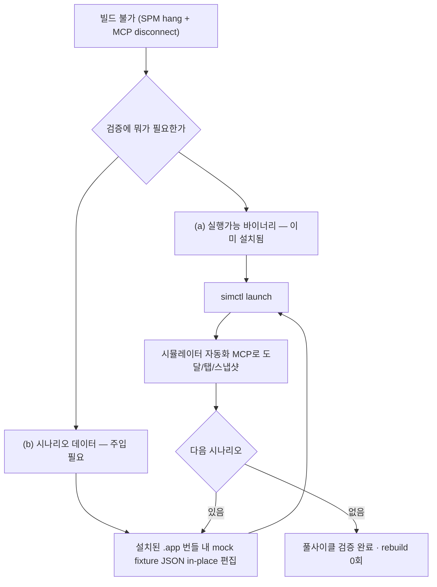

## 들어가며

이 저널은 빌드 인프라가 통째로 멈춘 상황에서도 UI 검증을 완주한 기록을 익명화한 것이다. 예시 앱은 moneyflow, 하네스는 team-harness 플러그인으로 일반화한다. moneyflow는 RIBs/ReactorKit 기반 iOS 앱이고, 검증은 시뮬레이터에서 화면을 실제로 도달·확인하는 grounded 방식을 표준으로 한다.

그날의 상황은 최악이었다. 의존성 resolve(SPM)가 무한 hang에 빠졌고, 빌드를 담당하는 도구(MCP)가 세션 전역에서 disconnect됐다. 앱을 **새로 빌드할 수단이 하나도 없었다.** 보통은 여기서 "빌드 인프라 복구 전까지 검증 불가"로 멈춘다. 그런데 여러 기능 요구사항(FR)을 풀사이클로 grounded 검증하는 걸 rebuild 0회로 완주했다.

전이 가능한 교훈은 하나다 — **빌드는 검증의 수단이지 목적이 아니다.** 수단이 막혔을 때 목적("이 시나리오에서 화면이 맞나")을 다시 보면, 막히지 않은 다른 경로가 보인다.

## 1. 왜 "빌드 불가 = 검증 불가"가 아닌가

검증이 실제로 필요로 하는 것을 분해하면 이렇다. "특정 시나리오(예: 예약 진행 중, 예약 없음, 에러 상태)에서 화면이 스펙대로 그려지고 인터랙션이 맞는가." 여기서 필요한 입력은 두 가지다 — **(a) 실행 가능한 앱 바이너리**와 **(b) 그 시나리오를 만드는 데이터/상태**.

빌드가 죽었을 때 사라진 건 (a)를 *새로* 만드는 능력이다. 하지만 앱은 이미 시뮬레이터에 설치돼 있었다. 즉 (a)는 이미 손에 있었다. 코드를 이번에 고친 게 아니라면, 이미 설치된 바이너리가 검증에 필요한 (a)를 완전히 충족한다. 그렇다면 남은 건 (b)를 어떻게 주입하느냐다.

이 분해가 핵심이다. "빌드 불가"를 "검증 불가"로 곧장 연결하는 건, (a)를 매번 새로 만들어야 한다고 무의식적으로 가정하기 때문이다. 코드 변경이 없는 검증에서 그 가정은 틀렸다.

## 2. 번들 내부 mock fixture in-place 편집 — (b)를 재빌드 없이 주입

moneyflow는 개발/검증용으로 API 응답을 mock JSON fixture로 대체할 수 있다. 이 fixture들은 앱 번들 안에 리소스로 담겨 있다. 여기서 결정적 성질 하나 — **번들 리소스는 컴파일 산출물이 아니라 데이터**다. Swift 코드는 컴파일해야 바이너리에 반영되지만, 번들에 담긴 JSON은 런타임에 읽는 데이터라 파일만 바꿔도 다음 실행 때 그대로 로드된다.

그래서 이미 설치된 앱의 번들 경로를 찾아(시뮬레이터 sandbox 안의 `.app` 디렉토리), 그 안의 mock fixture JSON을 **in-place로 편집**했다. 예약 진행 중 시나리오를 확인하려면 해당 fixture를 진행 중 상태로 바꾸고, 앱을 `simctl`로 다시 launch한다. 앱은 재실행되며 바뀐 fixture를 읽어 그 시나리오를 그린다. rebuild는 0회다.

시나리오를 바꾸려면 fixture를 다시 편집하고 다시 launch한다. 이렇게 여러 FR을, 각각의 시나리오를 토글해가며 순회 검증했다.

## 3. 검증 실행 — 별도 시뮬레이터 자동화 경로

빌드 MCP가 죽었어도 시뮬레이터 조작은 다른 도구로 가능했다. 앱 실행은 `simctl launch`, 화면 도달·탭·스냅샷은 별도의 시뮬레이터 자동화 MCP(빌드 도구와 독립적인)로 했다. 스크린샷은 `simctl io screenshot`로 떴다. 즉 검증 파이프라인을 "빌드 도구에 의존하는 부분"과 "안 하는 부분"으로 나눴을 때, 안 하는 부분만으로 도달-확인-판정이 전부 가능했다.

이건 [ios-ai-journal-024](ios-ai/ios-ai-journal-024-forensic-blockers-verify-installed-app)의 "도구는 볼 수 있는 신호만 본다"의 실전 응용이다 — 한 도구가 죽었을 때, 그 도구가 담당하던 신호를 다른 도구로 대체할 수 있으면 검증은 계속된다. 파이프라인의 각 단계가 어느 도구에 의존하는지를 미리 알고 있으면, 한 도구의 장애가 전체 장애로 번지지 않는다.

## 4. 이 우회의 명확한 한계 — 데이터 검증이지 로직 검증이 아니다

정직하게 못박아야 할 한계가 있다. 이 방법은 **"기존 바이너리 + 새 데이터"** 검증이다. 다음 세 경우엔 절대 쓸 수 없다.

- **코드 로직을 고친 경우**: 로직 변경은 재빌드 전까지 바이너리에 없다. 번들 fixture만 바꿔봤자 검증하는 건 *옛 로직 + 새 데이터*다. 로직 fix를 이 방법으로 "검증했다"고 하면 false-PASS다.
- **fixture 스키마 자체가 코드와 맞물린 경우**: DTO 구조를 바꿨다면 fixture 키도 바꿔야 하는데, 그 매핑 로직은 바이너리 안에 있다. 이 경우도 재빌드가 필요하다.
- **런타임에 fixture를 안 읽는 경로**: 어떤 mock은 런타임 파일이 아니라 컴파일 타임에 박히거나 테스트 전용 주입 경로로만 로드된다. 그런 fixture는 파일을 바꿔도 런타임이 안 읽는다(이건 다른 저널의 함정이다). 사전에 "이 fixture가 런타임 파일 로드 경로인가"를 확인해야 한다.

그래서 이 우회를 쓰기 전 판단 기준은 하나다 — **"이번 작업에 코드 변경이 있었나?"** 없으면(순수 데이터 시나리오 검증) 안전하게 쓴다. 있으면 재빌드가 필수고, 이 우회는 재빌드 인프라가 살아날 때까지의 임시방편도 될 수 없다.

## 5. 일반 원칙 — 수단이 막히면 목적을 다시 분해하라

이 사건의 재사용 가능한 교훈은 iOS를 넘어선다. 어떤 검증 파이프라인이든 "표준 경로"(여기선 빌드→설치→실행)가 막히면, 반사적으로 "검증 불가"를 선언하기 쉽다. 하지만 표준 경로는 목적을 이루는 *한 가지 방법*이지 목적 자체가 아니다.

막혔을 때의 규율은 이렇다. (1) 검증이 실제로 필요로 하는 입력을 원자 단위로 분해한다(여기선 실행 바이너리 + 시나리오 데이터). (2) 각 입력이 표준 경로의 어느 단계에서 나오는지, 그 단계가 정말 막혔는지 확인한다. (3) 이미 손에 있는 입력(설치된 바이너리)과 다른 경로로 만들 수 있는 입력(번들 데이터 편집)을 조합해 목적을 재구성한다. 이 규율이 있으면 인프라 장애가 "완주 실패"가 아니라 "경로 우회"로 끝난다.

동시에 §4의 한계를 잊으면 안 된다. 우회는 목적을 재구성하는 것이지 목적을 축소하는 게 아니다. "코드 로직 검증"이라는 목적을 "데이터 검증"으로 몰래 바꿔치기하면, 완주한 것처럼 보이지만 실제론 검증하지 않은 것을 검증했다고 착각하게 된다. 우회의 유효 범위를 명시하는 것이 우회 자체만큼 중요하다.

## 자기 점검

1. 빌드/인프라가 막혔을 때 "검증 불가"를 곧장 선언하고 있진 않은가? 검증이 실제로 필요로 하는 입력을 원자 단위로 분해했는가?
2. 이미 손에 있는 산출물(설치된 바이너리)과 다른 경로로 주입 가능한 상태(번들 데이터)를 구분하는가? 코드 변경이 없다면 재빌드가 정말 필요한가?
3. 우회 검증의 유효 범위(데이터 검증 O, 로직 검증 X)를 명시하는가? 이번 작업에 코드 변경이 있었는지를 우회 적용 전에 확인하는가?
4. 우리 검증 파이프라인의 각 단계가 어느 도구에 의존하는지 알고 있는가? 한 도구가 죽어도 그 단계를 다른 도구로 대체할 경로를 아는가?
