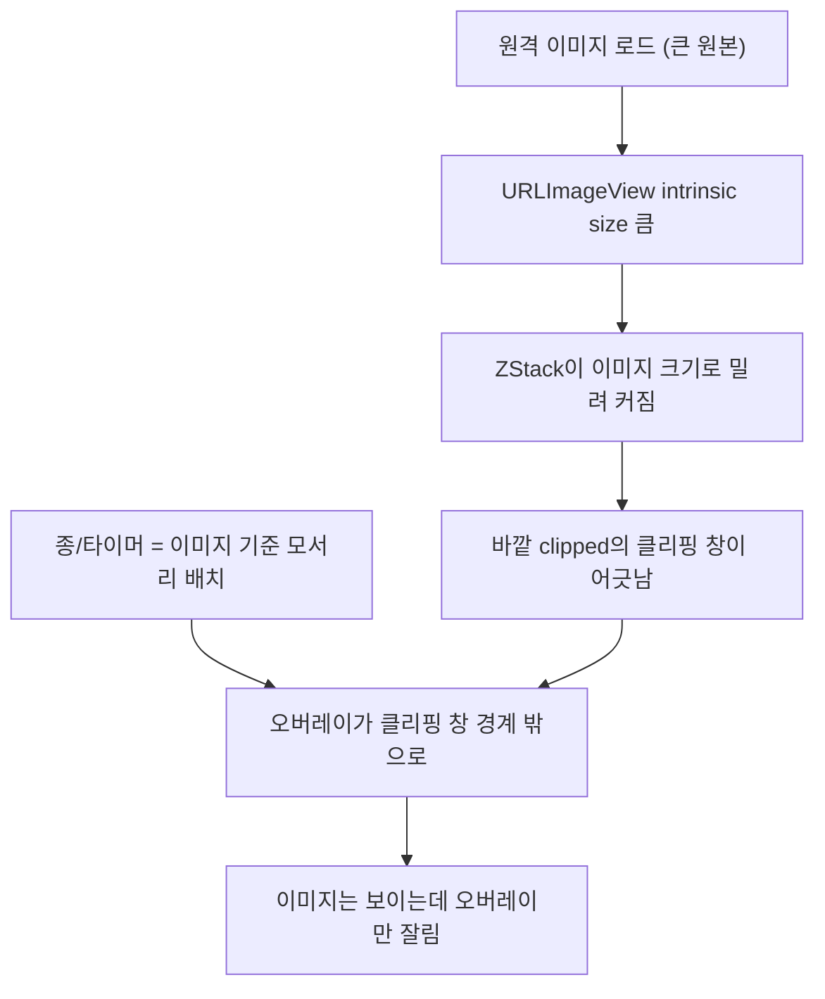

## 들어가며

이 저널은 SwiftUI와 UIKit이 섞인 화면에서 오버레이(작은 배지)가 렌더링되지 않던 시각 버그를 익명화한 기록이다. 예시 앱은 moneyflow, 문제의 컴포넌트는 원격 이미지를 그리는 `URLImageView`(UIKit 뷰를 `UIViewRepresentable`로 감싼 것)와, 그 위에 얹은 종 모양 배지·타이머 텍스트로 일반화한다.

증상은 단순했다 — 카드 썸네일 이미지 위에 있어야 할 종/타이머 오버레이가 안 보였다. zIndex도 맞고, 색상도 불투명하고, 코드상 분명히 ZStack 안에 얹혀 있는데 화면엔 없었다. 이 버그는 이 위키의 다른 저널과 결이 같다 — **선언적 코드만 읽어서는 안 잡히고, 실제 렌더 프레임을 봐야 드러나는** 종류다. 그리고 같은 뿌리(바깥 clip + UIKit intrinsic size)로 두 번 재발했다.

## 1. 문제의 레이아웃 — ZStack에 얹은 오버레이, 바깥에 건 clip

문제의 구조를 단순화하면 이렇다.

```
ZStack {
  URLImageView(url)        // UIViewRepresentable — 원격 이미지
  BellBadge()              // 오른쪽 위 종
  TimerLabel()             // 아래 타이머
}
.frame(width: W, height: H)
.clipped()
```

의도는 명확하다 — 이미지를 카드 크기(W×H)로 맞추고, 넘치는 부분은 `clipped()`로 자르고, 그 위에 종과 타이머를 얹는다. SwiftUI만 놓고 보면 완벽히 맞는 코드다. `.frame`과 `.clipped()`를 ZStack 바깥에 걸어 "카드 전체를 이 크기로 자른다"는 선언.

그런데 오버레이가 잘렸다. 이유를 이해하려면 두 가지가 만나는 지점을 봐야 한다 — **UIViewRepresentable의 intrinsic size**와 **clip이 기준 삼는 프레임**.

## 2. 근본 원인 — intrinsic size가 클리핑 창을 어긋나게 한다

두 사실이 충돌했다.

**(1) UIKit 이미지 뷰는 강한 intrinsic content size를 가진다.** `URLImageView`가 감싼 UIKit 뷰는 로드된 이미지의 원본 크기(또는 자체 레이아웃 규칙)에 따라 "나는 이만큼 크고 싶다"는 intrinsic size를 SwiftUI 레이아웃에 강하게 주장한다. 원격 이미지가 카드보다 크면, 이 주장이 크다.

**(2) clip은 '자기 프레임' 기준으로 자른다.** `.clipped()`는 자신이 놓인 프레임의 경계로 자식을 자른다. 그런데 그 프레임은 ZStack의 레이아웃 결과로 정해진다. ZStack의 크기는 자식들 중 가장 큰 것에 맞춰지는 경향이 있는데, intrinsic size가 큰 이미지 뷰가 ZStack을 자기 크기로 밀어 키운다.

두 사실이 만나면 이런 일이 벌어진다. `.frame(W, H)`를 걸어도, 그 안에서 ZStack이 이미지의 intrinsic size 때문에 예상과 다르게 배치되고, 종/타이머 오버레이는 이미지 기준으로 "오른쪽 위/아래"에 놓였는데 그 위치가 최종 클리핑 창(W×H)의 경계 밖으로 밀려난다. 결과적으로 이미지 본체는 clip 안에 들어와 보이지만, 그 위에 얹은 작은 오버레이는 창 밖이라 잘려 사라진다.

핵심 한 줄 — **clip을 바깥 컨테이너에 걸면, 클리핑 창의 크기와 위치가 그 안의 intrinsic-size 뷰에 휘둘린다.** 오버레이는 그 휘둘린 창의 희생자다.



## 3. 처방 — 제약과 clip은 UIKit 뷰 '자체'에 건다

수정의 원리는 "문제의 근원(intrinsic size)을 근원에서 제압한다"다. 바깥 컨테이너에 clip을 거는 대신, **UIKit 이미지 뷰 자체에 사이즈 제약(frame)과 clip을 건다.**

```
ZStack {
  URLImageView(url)
    .frame(width: W, height: H)   // 이미지의 크기를 여기서 확정
    .clipped()                    // 이미지 자체를 여기서 자름
  BellBadge()
  TimerLabel()
}
```

이렇게 하면 이미지 뷰의 크기가 W×H로 확정되어 더 이상 intrinsic size로 ZStack을 밀지 못한다. ZStack은 확정된 이미지 크기 위에 오버레이를 얹고, 오버레이는 창 안에 안전하게 남는다. clip이 "바깥에서 전체를 자르는 것"에서 "안쪽 이미지만 자르는 것"으로 바뀌면서, 오버레이는 애초에 클리핑 대상이 아니게 된다.

일반화하면 — **UIViewRepresentable처럼 강한 intrinsic size를 가진 뷰를 SwiftUI 레이아웃에 넣을 때, 크기 제약은 그 뷰에 직접 걸어 intrinsic size가 상위 레이아웃을 지배하지 못하게 한다.** 상위 컨테이너에 제약을 걸면 intrinsic size와의 줄다리기에서 예측 불가능한 결과가 나온다.

## 4. 왜 코드 리뷰로 안 잡히고 두 번 재발했나

이 버그가 특히 고약한 건 **선언적 코드만 읽어서는 잘못을 못 찾는다**는 점이다. `.frame().clipped()`를 ZStack 바깥에 건 코드와 이미지 뷰 안쪽에 건 코드는, 둘 다 "그럴듯하게" 보인다. SwiftUI에 익숙한 사람도 "카드 전체를 자르니 바깥에 거는 게 맞지"라고 읽기 쉽다. UIKit intrinsic size가 클리핑 창을 어떻게 흔드는지는 코드 텍스트에 안 나타난다 — 오직 실제 렌더 결과(스냅샷, 프레임 dump)를 봐야 잘림이 드러난다.

실제로 이 함정은 두 번 재발했다. 한 번 고친 뒤 다른 카드 컴포넌트에서 같은 패턴("바깥 clip + intrinsic 이미지 뷰")이 또 나왔다. 이는 이 위키가 반복해서 강조하는 원칙으로 이어진다 — **시각 회귀는 눈으로 코드만 봐서 막을 수 없고, 렌더 결과를 자산화하는 가드가 필요하다.** [ax-tree-fingerprint-regression-guard](ios-ai/ax-tree-fingerprint-regression-guard)의 접근성 트리 fingerprint나 스냅샷 테스트가 그 자산이다. 오버레이가 화면에 존재하는지를 스냅샷 테스트로 박아두면, 같은 패턴이 다른 컴포넌트에서 재발해도 렌더 단계에서 잡힌다.

또 하나 — 이 버그는 원격 이미지의 *크기*에 의존한다. 작은 이미지가 로드되면 intrinsic size가 작아 ZStack을 안 밀고, 그러면 잘림이 안 나타날 수도 있다. 즉 fixture 이미지가 실제 데이터와 다른 비율/크기면 검증에서 통과하고 실서버에서만 터진다. [ios-ai-journal-026](ios-ai/ios-ai-journal-026-no-build-fullcycle-verify-inplace-bundle-fixture)에서 다룬 fixture 검증의 사각과 같은 결 — **테스트 리소스는 실데이터와 동일한 비율/형태를 가져야 한다.**

## 5. 일반 원칙 — interop 경계에서 "어디에 modifier를 거는가"가 결과를 가른다

SwiftUI–UIKit interop의 일반 교훈으로 정리한다. SwiftUI modifier는 "바깥 컨테이너에 거는가, 안쪽 뷰에 거는가"가 순수 SwiftUI에서는 대개 미묘한 차이지만, **intrinsic size가 강한 UIKit 뷰가 끼면 그 차이가 레이아웃 결과를 크게 가른다.** 크기·클리핑·정렬처럼 "프레임 기준"으로 동작하는 modifier는 특히 그렇다.

그래서 interop 뷰를 다룰 때 규율은 이렇다. (1) UIViewRepresentable에는 크기 제약을 *직접* 걸어 intrinsic size를 확정한다. (2) 클리핑·정렬은 그 확정된 프레임 기준으로 동작하게 한다. (3) 오버레이는 intrinsic 뷰가 아니라 확정된 프레임 위에 얹는다. (4) 결과는 반드시 렌더 스냅샷으로 확인하고, 실데이터 비율의 fixture로 검증한다. 코드가 그럴듯한 것과 렌더가 맞는 것은 다르다.

## 자기 점검

1. UIViewRepresentable(또는 intrinsic size가 강한 뷰) 위에 오버레이를 얹을 때, 크기 제약과 clip을 바깥 컨테이너에 걸고 있진 않은가? 그 제약을 뷰 자체에 걸어 intrinsic size를 확정했는가?
2. 시각 버그를 "코드를 눈으로 읽어" 잡으려 하고 있진 않은가? 실제 렌더 스냅샷/프레임을 봤는가? 같은 패턴의 재발을 막을 스냅샷 가드가 있는가?
3. 검증에 쓰는 이미지 fixture가 실데이터와 같은 비율·크기인가? 작은 fixture가 intrinsic-size 함정을 우연히 가려 false-PASS를 내진 않는가?
4. interop 경계에서 modifier를 "바깥에 거는지 안쪽에 거는지"를 의식적으로 결정하는가? 프레임 기준 modifier(frame/clip/align)일수록 이 결정이 결과를 가른다는 걸 인지하는가?
