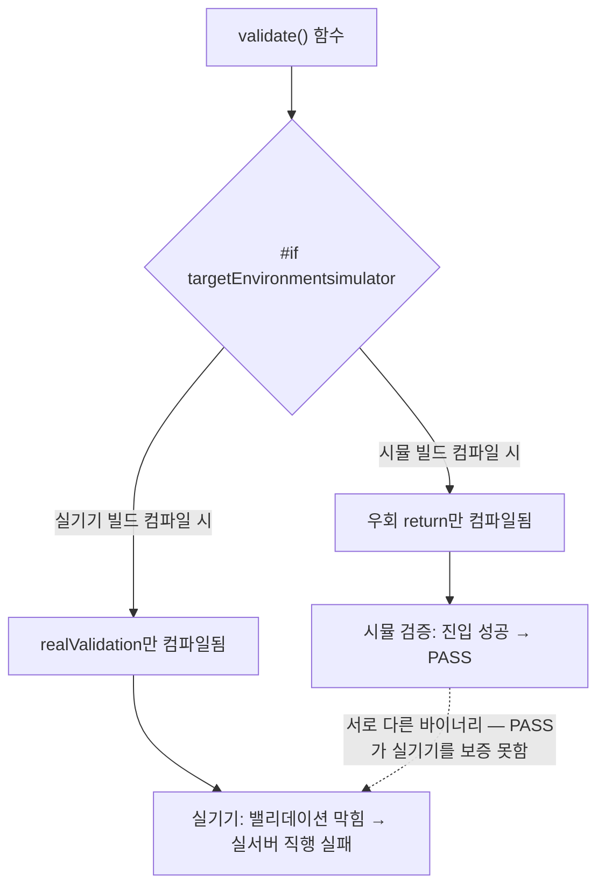

## 들어가며

이 저널은 검증 편의를 위해 넣은 우회가 실기기에서 정반대로 동작한 사고를 익명화한 기록이다. 예시 앱은 moneyflow, 문제의 기능은 어떤 입력 밸리데이션(검증 로직) 우회로 일반화한다. moneyflow는 시뮬레이터에서 mock 데이터로 화면을 검증하는 흐름이 표준인데, 어떤 밸리데이션이 검증 진입을 막고 있어서 "시뮬에서는 이 밸리데이션을 건너뛰자"는 우회를 넣었다.

증상은 QA에서 터졌다 — 시뮬에서는 멀쩡히 되던 기능이 실기기 Debug 빌드에서는 밸리데이션에 막혀 실서버로 직행하며 실패했다. "시뮬은 되는데 실기기는 안 됨"의 교과서적 사례다. 전이 가능한 교훈은 하나로 요약된다 — **검증 우회를 컴파일 타임 조건으로 만들면, 검증한 바이너리와 배포되는 바이너리가 서로 다른 코드가 된다.**

## 1. 무엇을 잘못했나 — targetEnvironment(simulator)로 감싼 우회

문제의 코드를 단순화하면 이렇다.

```
func validate(_ input: Request) throws {
  #if targetEnvironment(simulator)
    return   // 시뮬에서는 밸리데이션 건너뛰기 (검증 편의)
  #else
    try realValidation(input)   // 실기기: 진짜 밸리데이션
  #endif
}
```

의도는 이해된다 — 시뮬레이터에서 mock으로 검증할 때 진짜 밸리데이션(예: 특정 인증서 체크, 디바이스 바인딩 검사)이 진입을 막으니, 시뮬에서만 건너뛰자는 것이다. 문제는 `#if targetEnvironment(simulator)`가 **컴파일 타임 스위치**라는 점이다.

`#if`는 런타임 분기(if 문)가 아니다. 전처리기가 컴파일 *전에* 조건을 평가해, 조건에 안 맞는 쪽 코드를 **아예 컴파일에서 제외**한다. 그래서 시뮬레이터 빌드에는 `return`(우회)만 들어가고, 실기기 빌드에는 `try realValidation(input)`만 들어간다. 두 바이너리는 이 함수에서 **서로 다른 코드**다.

## 2. 왜 '시뮬 PASS'가 '실기기 동작'을 보증하지 못하나

이게 왜 위험한지가 이 저널의 핵심이다. 검증(verification)의 근본 전제는 **"내가 검증한 것과 배포되는 것이 같다"**이다. 이 전제가 깨지면 검증은 증거력을 잃는다.

컴파일 가드는 정확히 이 전제를 깬다. 시뮬에서 검증한 코드 경로(밸리데이션 우회 → 진입 성공)는 실기기 바이너리에 **존재하지 않는다.** 실기기는 컴파일된 다른 경로(진짜 밸리데이션 → 조건 불충족 → 실패)를 탄다. 그래서 "시뮬에서 PASS"는 "실기기에서 동작"에 대해 아무것도 말해주지 못한다. 검증했다고 믿었지만, 실기기가 실행할 경로는 검증한 적이 없다.

더 나쁜 건 이 사각이 **조용하다**는 점이다. 컴파일 에러도, 경고도, 런타임 크래시도 없다. 시뮬 검증은 초록불이고, 코드 리뷰에서도 `#if targetEnvironment(simulator)`는 "시뮬 편의 코드구나" 하고 넘어가기 쉽다. 실기기에서 QA가 직접 돌려보기 전까지 아무도 모른다. 이는 이 위키의 다른 함정들([ios-ai-journal-026](ios-ai/ios-ai-journal-026-no-build-fullcycle-verify-inplace-bundle-fixture)의 데이터/로직 검증 혼동, [ios-ai-journal-027](ios-ai/ios-ai-journal-027-swiftui-outer-clip-uikit-intrinsic-kills-overlays)의 코드 리뷰로 안 잡히는 시각 버그)과 같은 부류 — **표면 신호(초록불)와 실제 진실(실기기 동작)이 어긋나는** 사각이다.



## 3. 처방 — 우회는 런타임 게이트로 만든다

수정의 원리는 "우회의 존재를 컴파일이 아니라 런타임이 결정하게 한다"다. 즉 두 환경에 **같은 코드가 컴파일되고**, 동작만 런타임 플래그로 갈리게 한다.

```
func validate(_ input: Request) throws {
  if MockConfig.isMockEnabled {
    return   // 우회 — 런타임 플래그가 켜졌을 때만
  }
  try realValidation(input)
}
```

`isMockEnabled`는 런타임에 읽는 플래그다(예: 검증용 launch argument, Debug 설정 토글). 이제 시뮬이든 실기기든 **같은 함수가 컴파일**된다. 시뮬에서 mock을 켜면 우회를 타고, 실기기에서도 mock을 켜면 같은 우회를 탄다. 즉 실기기에서도 "우회 경로"를 검증할 수 있고, mock을 끄면 두 환경 모두 진짜 밸리데이션을 탄다.

핵심 차이 — **우회의 목적은 "검증 환경에서 특정 동작을 켠다"이지 "시뮬에서만 존재한다"가 아니다.** 목적을 정확히 표현하면 조건은 "환경이 시뮬인가"(컴파일)가 아니라 "mock이 켜졌는가"(런타임)여야 한다. 환경과 mock 상태는 직교하는 축인데, 컴파일 가드는 이 둘을 잘못 묶어버렸다.

## 4. 컴파일 가드가 정당한 경우와 아닌 경우

`#if`가 항상 나쁜 건 아니다. 언제 정당하고 언제 함정인지를 가르는 기준이 필요하다.

**정당한 경우** — 대상 환경에 코드가 *물리적으로 존재할 수 없을* 때. 예를 들어 시뮬레이터에 없는 하드웨어 API(특정 센서)를 부르는 코드는 실기기에만 컴파일돼야 하고, 그 반대도 마찬가지다. 이건 "환경 자체가 코드의 컴파일 가능 여부를 결정"하는 경우라 컴파일 가드가 맞다.

**함정인 경우** — 두 환경 모두에서 코드가 *실행 가능하지만* 편의상 동작을 다르게 하고 싶을 때. 검증 우회, mock 주입, 로깅 토글이 여기 속한다. 이건 "동작의 선택"이지 "컴파일 가능성"이 아니므로 런타임 게이트로 만들어야 한다. 우리 사고는 정확히 이 함정이었다 — 밸리데이션 우회는 실기기에서도 실행 가능한 코드인데, 컴파일 가드로 실기기에서 지워버렸다.

`#if DEBUG`도 비슷한 주의가 필요하다. Debug와 Release로 동작을 가르는 건 정당할 때가 많지만(디버그 로깅 등), 검증 경로를 `#if DEBUG`로만 가르면 "Release에서는 그 경로가 없다"는 같은 사각을 만든다. 실제로 mock fixture나 검증 지원 코드가 `#if DEBUG`로만 존재하면, Release/QA 스키마에서는 그 코드가 통째로 빠져 검증이 무의미해진다(이건 다른 저널의 주제이기도 하다).

## 5. 일반 원칙 — "환경으로 가르기"와 "상태로 가르기"를 구분하라

이 사고의 재사용 가능한 교훈은 조건 분기의 두 종류를 구분하는 것이다.

- **환경으로 가르기(컴파일 타임)**: 대상 플랫폼/빌드에 코드가 존재할 수 있느냐. `#if`가 맞다. 결과 — 바이너리마다 코드가 다르다.
- **상태로 가르기(런타임)**: 같은 코드가 상황에 따라 다르게 동작하느냐. `if`(플래그)가 맞다. 결과 — 모든 바이너리에 같은 코드, 동작만 다름.

검증 우회·mock·기능 토글은 거의 항상 후자다. 이것을 전자로 만들면, 검증한 바이너리와 배포되는 바이너리가 달라져 검증의 전제("검증한 것 = 배포되는 것")가 깨진다. 규율은 단순하다 — **우회/mock을 넣을 때 "실기기 Release에도 이 코드가 컴파일되는가"를 자문한다.** 답이 "아니오"면(컴파일 가드로 감쌌다면), "그럼 실기기의 그 경로는 누가 검증했나?"라는 질문이 따라온다. 대개 아무도 검증하지 않았다.

그리고 이 사각은 조용하므로, 코드 리뷰 체크리스트나 lint에 "검증 우회를 `#if targetEnvironment(simulator)` / `#if DEBUG`로만 감싸지 않았는가"를 넣어 기계적으로 잡는 게 안전하다. 사람 눈은 `#if`를 "환경 편의"로 관대하게 넘긴다.

## 자기 점검

1. 검증 우회·mock·기능 토글을 `#if targetEnvironment(simulator)`나 `#if DEBUG` 같은 컴파일 가드로 감싸고 있진 않은가? 그렇다면 실기기/Release 바이너리엔 그 경로가 아예 없다는 걸 인지하는가?
2. "시뮬에서 PASS"를 "실기기에서 동작"의 증거로 쓰고 있진 않은가? 검증한 코드 경로와 실기기가 실행할 코드 경로가 정말 같은가?
3. 우회를 넣을 때 "환경으로 가를 일(컴파일)"인지 "상태로 가를 일(런타임)"인지 구분하는가? 동작 선택은 런타임 게이트(isMockEnabled)로 만들었는가?
4. "실기기 Release에도 이 우회 코드가 컴파일되는가"를 자문하는가? 컴파일 가드 우회를 잡을 lint/리뷰 체크가 있는가?
