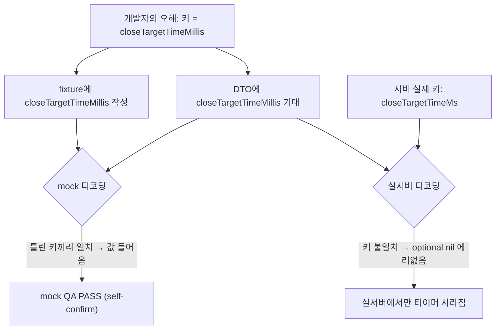

## 들어가며

이 저널은 서버 응답의 한 필드가 앱에서 조용히 사라진 버그를 익명화한 기록이다. 예시 앱은 moneyflow, 문제의 필드는 어떤 마감 시각을 담은 서버 응답 키로 일반화한다. moneyflow는 크로스플랫폼(iOS/Android 동시 개발)이고, 서버 응답을 Codable DTO로 디코딩한다.

증상은 이랬다 — 특정 화면에서 타이머가 안 뜨거나 잘못된 기본값을 보였다. 크래시도 에러 로그도 없었다. mock으로 검증할 땐 멀쩡했는데 실서버에서만 값이 비었다. 근본 원인은 두 겹이었다. (1) DTO가 CodingKeys 없이 plain decode를 해서 키 오타가 **조용히 nil**로 흘렀고, (2) fixture와 DTO를 같은 개발자가 같은 오해로 써서 서로를 **self-confirm**해 mock QA를 통과했다. 전이 가능한 교훈은 [api-contract-as-3-client-source-of-truth](context-engineering/api-contract-as-3-client-source-of-truth)와 정확히 같다 — **같은 사람이 쓴 두 자료는 서로를 확증할 뿐 진실을 말하지 못한다.**

## 1. 첫 번째 겹 — CodingKeys 부재 DTO의 silent nil fallback

Swift Codable에서 optional 프로퍼티를 가진 DTO를 CodingKeys 없이 디코딩하면 이런 구조다.

```
struct DealDTO: Decodable {
  let closeTargetTimeMillis: Int?   // 서버 실제 키는 closeTargetTimeMs (가정)
}
```

프로퍼티가 optional이면, JSONDecoder는 "기대한 키가 응답에 없으면 nil"을 **정상 동작**으로 처리한다. 즉 서버가 `closeTargetTimeMs`를 보내는데 코드가 `closeTargetTimeMillis`를 기대하면, 디코더는 "그 키가 없네 → optional이니 nil" 하고 **에러 없이** 넘어간다. 앱은 nil을 받아 타이머를 안 그리거나 기본값을 쓴다.

이게 가장 잡기 어려운 종류의 버그인 이유 — **에러가 없다.** 디코딩 실패 로그도, 크래시도, 경고도 없다. "값이 원래 nil인 정상 상황"과 "키 오타로 nil이 된 버그"를 plain decode는 구분하지 못한다. 두 경우 모두 조용히 nil이다. 로그를 뒤져도 안 나온다.

## 2. 두 번째 겹 — fixture와 DTO의 self-confirm

여기까지면 mock 검증에서 잡혔어야 한다. 왜 못 잡았나? 이게 이 저널의 핵심 통찰이다.

fixture(mock JSON)를 만든 사람과 DTO를 만든 사람이 같았고, 둘 다 서버 키를 `closeTargetTimeMillis`로 **똑같이 오해**했다. 그래서 fixture에도 `closeTargetTimeMillis`를 넣었고, DTO도 `closeTargetTimeMillis`를 기대했다. mock 디코딩에서는 이 둘이 **일치**한다 — 틀린 키끼리 맞으니 값이 잘 들어오고, 타이머가 정상으로 뜬다. mock QA는 초록불이다.

이것이 **self-confirm**이다. 두 자료(DTO와 fixture)가 서로를 확증한다. 하지만 둘 다 같은 사람의 같은 오해에서 나왔으므로, 그 확증은 "우리 둘이 일치한다"는 정보일 뿐 "우리가 맞다"는 정보가 아니다. 진실(서버의 실제 키 `closeTargetTimeMs`)과 만나는 건 실서버 응답에서뿐이고, 거기서만 어긋나 nil이 된다.



두 겹이 합쳐지면 완벽한 사각이 된다. (1) silent nil이라 에러가 안 나고, (2) self-confirm이라 mock QA가 초록불이다. 컴파일도 통과, diff 리뷰도 통과(키 이름이 그럴듯하니), mock 검증도 통과. 유일하게 실서버만 진실을 안다. 이는 [ios-ai-journal-028](ios-ai/ios-ai-journal-028-simulator-only-bypass-blind-spot)의 "검증한 것과 배포되는 것이 다르다"와 사촌지간 — 여기선 "검증에 쓴 데이터(fixture)와 실제 데이터(서버 응답)가 다른데, 그 다름이 검증을 통과하도록 짜여 있다."

## 3. 처방 (1) — 제3의 오라클과 대조한다

self-confirm을 깨는 유일한 방법은 **DTO와 fixture 밖의 독립 오라클**과 키를 대조하는 것이다. 같은 사람이 쓴 두 자료끼리는 아무리 대조해도 self-confirm만 강화된다. 진실은 세 곳에 있다.

- **API 규격서 / swagger**: 서버가 공식적으로 선언한 키. 가장 직접적인 오라클.
- **실서버 응답**: 개발 서버를 실제로 호출해 받은 raw JSON. 규격서와 구현이 어긋날 수 있으니 실응답이 더 강한 증거다.
- **다른 플랫폼 구현**: 크로스플랫폼이면 Android가 이미 그 키로 파싱하고 있다. 먼저 shipped된 쪽의 키가 사실상의 서버 계약(parity SoT)이다.

규율은 이렇다 — **fixture 키를 창작하지 말고 이 세 오라클 중 하나에서 copy한다.** "그럴듯한 키 이름을 지어낸다"가 함정의 시작이다. 특히 크로스플랫폼에서는 이미 동작하는 다른 플랫폼의 payload와 1:1 대조하는 게 값싸고 강력하다. mock은 어떤 값이든 통과시키므로, parity 불일치를 mock으로는 절대 못 잡는다.

## 4. 처방 (2) — CodingKeys를 명시해 silent nil을 막는다

제3 오라클로 키를 확정했으면, 그 키를 **CodingKeys로 명시**한다.

```
struct DealDTO: Decodable {
  let closeTargetTimeMs: Int?
  enum CodingKeys: String, CodingKey {
    case closeTargetTimeMs   // 서버 키와 정확히 일치 — 명시적
  }
}
```

CodingKeys를 명시하는 것 자체가 "이 키가 서버 계약이다"를 코드에 박제하는 행위다. 리뷰어가 CodingKeys를 보고 규격서와 대조할 수 있고, 키를 바꾸려면 CodingKeys를 명시적으로 고쳐야 하니 무심코 오타나기 어렵다. plain decode(프로퍼티 이름 = 키)는 프로퍼티 이름을 리팩터링하다 키가 조용히 바뀌는 위험도 있다.

한 발 더 나가면, 계약이 중요한 필드는 **decode-roundtrip 테스트**로 못박는다 — 실응답(또는 규격서 예시) JSON을 DTO로 디코딩해 기대 값이 나오는지 검증하는 단위 테스트. 이건 fixture와 독립이다(오라클에서 온 JSON을 쓰므로). self-confirm을 구조적으로 깨는 테스트다. 실측 기준으로, 이 앱의 네트워크 Decodable 상당수가 CodingKeys 없이 plain decode였는데, 계약이 중요한 필드부터 CodingKeys + roundtrip으로 전환하는 게 우선순위였다.

## 5. 일반 원칙 — self-confirm은 오라클의 독립성으로만 깨진다

이 사고의 재사용 가능한 교훈은 iOS Codable을 넘어선다. 두 자료가 서로 일치한다는 것은 **두 자료가 독립적으로 만들어졌을 때만** 진실의 증거가 된다. 같은 출처(같은 사람, 같은 오해, 같은 코드 생성기)에서 나온 두 자료의 일치는 self-confirm이며 정보가 없다.

검증을 설계할 때 이 질문을 던져야 한다 — **"이 검증이 통과하면, 무엇에 대해 무엇을 아는가? 검증 대상과 검증 기준이 독립적인가?"** fixture로 DTO를 검증하는데 둘을 같은 사람이 썼다면, 통과는 "둘이 일치함"만 알려주지 "DTO가 서버와 맞음"은 알려주지 않는다. 독립 오라클(규격서/실응답/타 플랫폼)을 검증 기준으로 끌어와야 비로소 "서버와 맞음"을 검증한다.

그리고 silent fallback(에러 없이 조용히 기본값으로)이 있는 곳은 어디든 이 함정의 온상이다. optional decode, `??` 기본값, try? 무시. 조용함은 편리하지만 "무언가 잘못됐다"는 신호를 삼킨다. 계약이 중요한 지점에서는 silent fallback을 명시적 검증(CodingKeys, roundtrip, 규격 대조)으로 바꿔 신호를 살려야 한다.

## 자기 점검

1. optional 프로퍼티 DTO를 CodingKeys 없이 plain decode하고 있진 않은가? 서버 키 오타가 에러 없이 조용히 nil로 흐를 수 있다는 걸 인지하는가?
2. fixture와 DTO를 같은 사람이 독립 오라클 없이 쓰고 있진 않은가? mock QA 통과가 "둘이 일치함"인지 "서버와 맞음"인지 구분하는가?
3. fixture 키를 창작하는가, 아니면 제3 오라클(swagger/실응답/타 플랫폼)에서 copy하는가? 크로스플랫폼이면 먼저 shipped된 쪽 payload와 1:1 대조하는가?
4. 계약이 중요한 필드에 CodingKeys 명시 + decode-roundtrip 테스트로 self-confirm을 구조적으로 깼는가? silent fallback이 잘못 신호를 삼키는 곳을 명시적 검증으로 바꿨는가?
