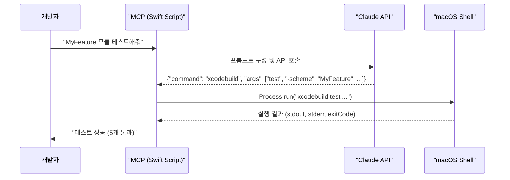

iOS 개발 워크플로우에는 반복적인 커맨드라인 작업이 많습니다. 특정 타겟의 유닛 테스트 실행, 새 브랜치의 빌드 가능성 확인, Ad Hoc 배포를 위한 아카이브 생성 등은 모두 `xcodebuild`를 통해 이루어지지만, 매번 정확한 파라미터(scheme, destination, configuration 등)를 기억하고 입력하는 것은 번거로운 일입니다.

이 문제를 해결하기 위해 LLM, 특히 코드 생성에 강점을 보이는 Claude와 같은 모델을 활용하여 자연어 명령을 `xcodebuild` 커맨드로 변환하고 실행하는 자동화 시스템을 구축할 수 있습니다. 우리는 이 시스템을 '마스터 컨트롤 프로그램(Master Control Program, MCP)'이라 부르겠습니다. MCP는 개발자의 의도를 파악하여 정확한 `xcodebuild` 명령을 생성하고, 실행 결과를 분석하여 요약 보고까지 제공하는 AI 기반의 개발 어시스턴트 역할을 합니다.

## MCP 아키텍처 개요

MCP의 핵심은 LLM을 '번역가'이자 '실행 계획 수립자'로 사용하는 것입니다. 개발자의 자연어 요청을 받아 LLM이 `xcodebuild`라는 '도구(Tool)'를 사용하는 방법을 결정하고, MCP는 그 결정을 받아 실제로 셸에서 실행합니다.

이 워크플로우는 다음과 같이 구성됩니다.

1.  **사용자 입력**: "App 스킴으로 iPhone 17 Pro 시뮬레이터에서 유닛 테스트 돌려줘."
2.  **MCP (Swift Script)**: 사용자 입력을 받아 Claude API에 전달할 프롬프트를 구성합니다.
3.  **Claude (LLM)**: 사전 정의된 `xcodebuild` 도구 사용법과 사용자 요청을 바탕으로 실행할 정확한 `xcodebuild` 커맨드를 JSON 형식으로 생성합니다.
4.  **MCP (Swift Script)**: Claude가 생성한 JSON을 파싱하여 실제 셸 커맨드를 만들고 `Process` API를 통해 실행합니다.
5.  **결과 파싱 및 요약**: `xcodebuild`의 실행 결과(stdout, stderr)를 받아 성공/실패 여부를 판단하고, 실패 시 에러 로그를 다시 Claude에게 보내 원인 분석을 요청할 수도 있습니다.

이 과정을 다이어그램으로 표현하면 다음과 같습니다.



## Swift로 MCP 구현하기

macOS에서 실행되는 Command Line Tool 프로젝트를 생성하여 MCP를 구현할 수 있습니다.

### 1. `xcodebuild` 래퍼 (Tool)

먼저 `xcodebuild` 커맨드를 실행하고 결과를 반환하는 간단한 래퍼를 만듭니다. Swift의 `Process`를 사용하면 비동기적으로 외부 프로세스를 실행하고 결과를 가져올 수 있습니다.

```swift
// XcodeBuildRunner.swift
import Foundation

struct XcodeBuildResult {
    let standardOutput: String
    let standardError: String
    let terminationStatus: Int32
}

struct XcodeBuildRunner {
    static func run(arguments: [String]) async throws -> XcodeBuildResult {
        let process = Process()
        process.executableURL = URL(fileURLWithPath: "/usr/bin/xcodebuild")
        process.arguments = arguments

        let outputPipe = Pipe()
        let errorPipe = Pipe()
        process.standardOutput = outputPipe
        process.standardError = errorPipe

        try process.run()
        process.waitUntilExit()

        let outputData = outputPipe.fileHandleForReading.readDataToEndOfFile()
        let errorData = errorPipe.fileHandleForReading.readDataToEndOfFile()

        let output = String(data: outputData, encoding: .utf8) ?? ""
        let error = String(data: errorData, encoding: .utf8) ?? ""
        
        return XcodeBuildResult(
            standardOutput: output,
            standardError: error,
            terminationStatus: process.terminationStatus
        )
    }
}
```

### 2. LLM에 `xcodebuild` 도구 정의 알려주기

Claude가 `xcodebuild`를 올바르게 사용하도록 하려면, 어떤 파라미터가 있는지 명확하게 알려줘야 합니다. 이를 시스템 프롬프트나 Tool Use 기능의 일부로 제공합니다.

```swift
// PromptBuilder.swift

func buildPrompt(for userRequest: String) -> String {
    return """
    You are an expert iOS developer assistant. Your task is to convert the user's request into a valid `xcodebuild` command.
    Use the following tool definition to construct the command in JSON format.

    Tool: `xcodebuild`
    Description: Builds, tests, and archives Xcode projects.

    Parameters:
    | Parameter     | Type   | Description                                           | Example                     |
    |---------------|--------|-------------------------------------------------------|-----------------------------|
    | `-project`    | String | Path to the .xcodeproj file.                          | "MyApp.xcodeproj"           |
    | `-workspace`  | String | Path to the .xcworkspace file.                        | "MyApp.xcworkspace"         |
    | `-scheme`     | String | The scheme to build, test, or archive. (Required)     | "MyApp"                     |
    | `action`      | String | The action to perform. (build, test, archive, clean)  | "test"                      |
    | `-destination`| String | The device, simulator, or mac to use.                 | "platform=iOS Simulator,name=iPhone 17 Pro" |
    | `-sdk`        | String | The SDK to use for the build.                         | "iphonesimulator"           |
    | `-configuration`| String | The build configuration to use (Debug, Release).      | "Debug"                     |
    | `-archivePath`| String | The path to save the generated .xcarchive file.       | "./build/MyApp.xcarchive"   |

    User Request: "\(userRequest)"

    Respond ONLY with the JSON object representing the command.
    For example:
    {
      "tool": "xcodebuild",
      "action": "test",
      "args": {
        "-workspace": "MyProject.xcworkspace",
        "-scheme": "MyFeature",
        "-destination": "platform=iOS Simulator,name=iPhone 15 Pro"
      }
    }
    """
}
```
**팁:** 프로젝트의 정확한 워크스페이스/프로젝트 이름, 사용 가능한 스킴 목록을 동적으로 파악하여 프롬프트에 포함하면(`xcodebuild -list -json` 활용) LLM이 훨씬 더 정확한 명령을 생성할 수 있습니다.

### 3. 메인 실행 로직 (MCP)

이제 사용자의 입력을 받아 Claude API를 호출하고, 반환된 JSON을 파싱하여 `XcodeBuildRunner`를 실행하는 메인 로직을 작성합니다.

```swift
// main.swift
import Foundation

// API 클라이언트 및 응답 모델 (실제 구현 필요)
struct ClaudeAPIClient {
    func generateCommand(prompt: String) async -> String {
        // 실제 API 호출 로직. 여기서는 하드코딩된 예시 반환
        return """
        {
          "tool": "xcodebuild",
          "action": "test",
          "args": {
            "-workspace": "MyApp.xcworkspace",
            "-scheme": "MyAppTests",
            "-destination": "platform=iOS Simulator,name=iPhone 17 Pro,OS=18.0"
          }
        }
        """
    }
}

struct XcodeCommand: Codable {
    let tool: String
    let action: String
    let args: [String: String]
}

@main
struct MCP {
    static func main() async {
        guard CommandLine.arguments.count > 1 else {
            print("오류: 자연어 요청을 입력하세요.")
            return
        }
        let userRequest = CommandLine.arguments.dropFirst().joined(separator: " ")
        print("🤖 요청 분석 중: '\(userRequest)'")

        // 1. 프롬프트 생성
        let prompt = buildPrompt(for: userRequest)

        // 2. LLM 호출하여 커맨드 생성
        let apiClient = ClaudeAPIClient()
        let commandJsonString = await apiClient.generateCommand(prompt: prompt)

        // 3. JSON 파싱
        guard let jsonData = commandJsonString.data(using: .utf8),
              let command = try? JSONDecoder().decode(XcodeCommand.self, from: jsonData) else {
            print("오류: LLM 응답을 파싱할 수 없습니다.")
            return
        }

        // 4. `xcodebuild` 인자 배열로 변환
        var arguments = [command.action]
        for (key, value) in command.args {
            arguments.append(key)
            arguments.append(value)
        }

        print("🚀 실행할 커맨드: xcodebuild \(arguments.joined(separator: " "))")

        // 5. 커맨드 실행 및 결과 처리
        do {
            let result = try await XcodeBuildRunner.run(arguments: arguments)
            if result.terminationStatus == 0 {
                print("✅ 성공!")
                print("--- 결과 ---")
                print(result.standardOutput)
            } else {
                print("❌ 실패! (종료 코드: \(result.terminationStatus))")
                print("--- 에러 로그 ---")
                print(result.standardError)
                // TODO: 에러 로그를 다시 Claude에게 보내 원인 분석 요청
            }
        } catch {
            print("오류: xcodebuild 실행 중 예외 발생 - \(error)")
        }
    }
}
```
이제 터미널에서 다음과 같이 실행할 수 있습니다.
`$ swift run MCP "MyAppTests 스킴을 최신 아이폰 시뮬레이터에서 테스트해줘"`

## 실무 적용 패턴 및 확장

*   **빌드 실패 시 자동 디버깅**: `xcodebuild` 실행이 실패하면, MCP는 `standardError`에 담긴 에러 로그를 다시 Claude에게 전달하며 "이 빌드 에러의 원인은 무엇이고, 어떤 파일을 수정해야 할까?"라고 질문할 수 있습니다. Claude는 에러 로그를 분석하여 잠재적인 원인과 해결책을 제시해줄 수 있습니다.
*   **프로젝트 컨텍스트 주입**: MCP 실행 시 `xcodebuild -list -json`을 먼저 실행하여 현재 프로젝트의 스킴, 타겟, 설정 정보를 파악합니다. 이 정보를 LLM 프롬프트에 컨텍스트로 함께 제공하면, 존재하지 않는 스킴을 호출하는 등의 환각(Hallucination)을 크게 줄일 수 있습니다.
*   **슬래시 커맨드 연동**: 사내 메신저(Slack, Discord 등)와 연동하여 `/build`, `/test` 같은 슬래시 커맨드로 MCP를 원격 실행할 수 있습니다. 이를 통해 비개발 직군도 특정 브랜치의 최신 빌드를 요청하거나 테스트를 실행하는 등 개발 워크플로우에 참여할 수 있습니다.

이렇게 `xcodebuild`와 LLM을 결합하면 단순한 명령어 별칭(alias)을 넘어, 개발자의 의도를 이해하고 복잡한 작업을 자율적으로 수행하는 강력한 개발 자동화 시스템을 구축할 수 있습니다. 이는 로컬 개발 환경의 생산성을 극대화하고, CI/CD 파이프라인의 유연성을 한 차원 높이는 계기가 될 것입니다.

---

## 자기 점검

1.  MCP 아키텍처에서 LLM(Claude)의 핵심 역할 두 가지는 무엇인가요?
2.  `xcodebuild` 명령을 실행하기 위해 Swift 코드에서 사용한 핵심 클래스는 무엇이며, 왜 필요한가요?
3.  `xcodebuild -list -json` 명령의 결과를 프롬프트에 포함하는 것이 왜 LLM의 정확도를 높이는 데 중요한가요?
4.  빌드 실패 시, MCP가 단순히 에러를 출력하는 것에서 더 나아가 수행할 수 있는 다음 단계는 무엇인가요?

*   **동료에게 설명하기**: "동료에게 AI 에이전트가 `xcodebuild`를 사용하는 워크플로우를 설명한다고 상상해보세요. 어떤 핵심 컴포넌트(사용자 입력, MCP, LLM, 셸)와 그 사이의 데이터 흐름(자연어 -> JSON -> 셸 커맨드 -> 결과 텍스트)을 강조하시겠습니까?"

*   **실습 과제**:
    1.  자신의 iOS 프로젝트 디렉토리에서 실행할 수 있는 간단한 Swift Command Line Tool을 만드세요.
    2.  이 툴에 위 예제의 `XcodeBuildRunner`를 구현하세요.
    3.  "test"라는 인자를 받으면, 하드코딩된 특정 스킴(`-scheme "MyProjectTests"`)과 시뮬레이터(`-destination "platform=iOS Simulator,name=iPhone 15"`)로 `xcodebuild test`를 실행하고 그 결과를 콘솔에 출력하도록 만들어보세요. (LLM 연동은 제외하고 순수하게 `xcodebuild`를 감싸는 것부터 시작합니다.)