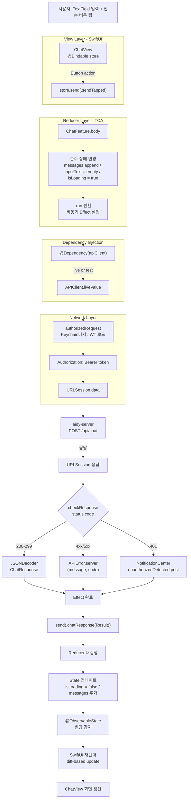

## 한 줄 요약

Flow Map 시리즈의 **역방향 학습 편**. iOS 프로덕션 앱(RIBs + ReactorKit 기반 `gma-ios`)에 익숙한 개발자가 `aidy-ios`(TCA + SwiftUI + Tuist)로 **같은 플랫폼을 다른 아키텍처로 다시** 관통한다. "메시지 한 번의 여정"을 View → Action → Reducer → Effect → State → 재렌더로 따라가면, TCA가 왜 Redux/Elm 계보인지와 Android Compose/Spring Boot 계층이 결국 같은 **단방향 상태 머신** 패턴의 변형임이 선명해진다.

---

## 갭 / 맥락

iOS 개발자가 TCA 코드를 처음 열었을 때 흔한 당혹감:

| 증상 | 원인 |
|------|------|
| `ViewController` / `Reactor`를 찾다가 `@Reducer` struct만 발견 | TCA는 화면 ≠ 컨트롤러. Feature 하나가 State + Action + Reducer로 구성된 **상태 머신** |
| "뷰에서 바로 함수 호출하면 되는데 왜 Action을 dispatch하지?" | 상태 변경 경로를 **단일 채널**로 강제하기 위함. 로그/테스트/Time-travel이 가능해지는 대가 |
| `.run { send in ... }`이 뭔지 모름 | 비동기 작업은 Reducer 바깥(Effect 타입)으로 격리. Reducer는 순수 함수 유지 |
| `@Dependency(\.apiClient)`가 의존성인데 생성자 주입이 없음 | TCA의 DI는 `TaskLocal` 기반 암묵적 주입. 생성자 파라미터로 전달 안 함 |
| `TestStore`의 `await store.send(...) { state in ... }` 문법 | State의 기대 변화를 테스트 시점에 명시적으로 선언. 누락하면 테스트 실패 |
| `tuist generate`가 뭔지 모름 | Xcode 프로젝트 파일을 `Project.swift`로 **선언**하고 Tuist가 생성. xcodeproj는 gitignore 대상 |

**핵심 진단**: iOS **플랫폼 지식**은 이미 있다. 부족한 건 **TCA의 단방향 상태 머신 멘탈 모델**과 **Tuist 프로젝트 구조 관리**. 이 둘만 매핑되면 나머지는 이미 아는 것.

---

## aidy-ios가 학습 재료로 좋은 이유

`~/Develop/aidy-ios` — Tuist + SPM + SwiftUI + TCA + URLSession + Keychain. 회사 프로덕션에서 쓰는 RIBs/ReactorKit 조합과 **다른 아키텍처지만 플랫폼은 같다**.

```
[프로젝트 관리]    Tuist + SPM (Project.swift / Package.swift)
[UI]              SwiftUI (iOS 17+)
[아키텍처]         TCA — Feature = @Reducer struct (State + Action + body)
[DI]              @Dependency + DependencyClient (TaskLocal)
[네트워크]         URLSession async/await + APIClient
[에러]            APIError enum + isRetryable + 401 Notification
[보안]            Keychain (JWT 토큰), UserDefaults(serverURL만)
[테스트]           TestStore + mock dependencies
```

**역방향 학습의 레버리지**: 플랫폼 변수(Swift / SwiftUI / URLSession / Keychain)가 고정되어 있어, **아키텍처의 차이**(RIBs vs TCA vs ReactorKit)만 대비해 읽을 수 있다. 순수한 패턴 학습이 가능해지는 조건.

---

## 1단계: "채팅 메시지 한 번의 여정" 따라가기

### 사용자가 TextField에 입력 → 전송 탭 → 응답 반영까지



### 각 단계가 하는 일 (한 줄씩)

| 단계 | 역할 | RIBs/ReactorKit 대응 |
|------|------|---------------------|
| **ChatView (`@Bindable store`)** | State 바인딩 + Action dispatch 창구 | ReactorKit View / RIBs Presenter |
| **`store.send(.sendTapped)`** | 모든 UI 이벤트가 Action으로 직렬화 | Reactor `action.onNext()` / RIBs interactor 메서드 호출 |
| **Reducer 순수 변경** | Action + 기존 State → 새 State (순수 함수) | Reactor `mutate` + `reduce`의 통합판 |
| **Effect (`.run { ... }`)** | 비동기 작업을 Reducer 바깥으로 격리 | Reactor `Observable` mutation / RIBs async |
| **`@Dependency(\.apiClient)`** | TaskLocal 기반 암묵적 DI | Swinject `resolver.resolve()` / 생성자 주입 |
| **`APIClient.liveValue`** | 실제 구현. 테스트는 다른 값 주입 | `APIRepositoryImpl` / Mock |
| **`authorizedRequest`** | Keychain 토큰을 Bearer 헤더로 자동 첨부 | Alamofire `RequestInterceptor` |
| **`checkResponse` 401 처리** | NotificationCenter로 전역 로그아웃 트리거 | URL protocol / 공용 에러 핸들러 |
| **`JSONDecoder.decode`** | Codable 자동 매핑 | 동일 |
| **`chatResponse(Result)` 재dispatch** | Effect 결과를 다시 Action으로 | Reactor `concat` mutation |
| **`@ObservableState`** | State 변화를 SwiftUI가 자동 구독 | ReactorKit `state.bind` |
| **SwiftUI diff 재렌더** | 변경분만 다시 그림 | 동일 (선언형 UI 공통) |

> 💡 **TCA의 본질이 선명해지는 순간**: "UI 이벤트 → Action → State → UI"가 닫힌 단방향 루프이고, **비동기 작업만 Effect로 분리**되어 루프를 일시 벗어났다가 다시 Action으로 돌아온다. Redux + Elm의 적자.

---

## 2단계: 관심사별 훑기

각 주제 "왜 필요한가?"를 한 문장으로 답할 수 있으면 통과.

### SwiftUI + @ObservableState
- **`@ObservableState`**: TCA의 State를 SwiftUI가 관찰 가능하게 만드는 매크로. `@Observable`의 TCA 버전.
- **`@Bindable var store: StoreOf<ChatFeature>`**: View에서 store를 바인딩. `store.inputText`로 직접 읽고 `$store.inputText`로 양방향 바인딩.
- **iOS 17+ 전용**: Observation 프레임워크 기반. 이전에는 `ViewStore` + `WithViewStore`가 필요했다.

### TCA Reducer
- **`@Reducer struct Feature`**: 화면 하나의 **상태 머신 정의**. State + Action + body.
- **`State`**: 화면이 기억해야 할 모든 것. 외부에서 주입되거나 init으로 시작.
- **`Action: BindableAction`**: UI 이벤트 / 비동기 결과 / 내부 시그널을 enum case로 열거.
- **`body: some ReducerOf<Self>`**: `Reduce { state, action in ... }` 블록이 핵심. State를 inout으로 수정하고 Effect 반환.
- **`BindingReducer()`**: `$store.inputText` 같은 양방향 바인딩을 자동 처리.

### Effect (.run)
- **사이드 이펙트 격리**: Reducer는 순수해야 하므로 async 호출은 `.run { send in ... }` 블록으로 반환.
- **`await send(.chatResponse(Result { ... }))`**: 비동기 결과를 다시 Action으로 되돌려 Reducer가 State 갱신.
- **`.cancel(id: ...)` / `.merge(...)`**: 여러 Effect를 합성/취소하는 runtime 원시. 복잡한 네트워크 시나리오의 핵심.

### Dependency Injection (@Dependency + DependencyClient)
- **`@DependencyClient` 매크로**: struct의 각 async throws 프로퍼티에 `unimplemented` 기본값을 자동 생성. 테스트에서 호출 안 한 의존성이 실수로 호출되면 즉시 실패.
- **`@Dependency(\.apiClient)`**: TaskLocal 기반 resolution. 생성자 주입 없이 Reducer 안에서 바로 접근.
- **`liveValue` / `testValue` / `previewValue`**: 환경별 기본 구현. TestStore는 자동으로 testValue 사용.

### APIClient (URLSession async/await)
- **구조체 + 클로저 필드**: 각 엔드포인트가 `@Sendable () async throws -> T` 클로저. 테스트에서 필드만 override.
- **`authorizedRequest`**: Keychain에서 토큰 읽어 Bearer 헤더 자동 첨부. 회사 프로젝트의 Alamofire Interceptor 대응.
- **`checkResponse`**: 401 감지 → `NotificationCenter.default.post(name: .unauthorizedDetected)` → AppFeature가 받아 로그아웃 처리.

### 에러 모델
- **`APIError`**: `.server(message, code)` / `.network(String)` / `.unauthorized` 3종.
- **`isRetryable`**: `RATE_LIMITED / AI_TIMEOUT / AI_UNAVAILABLE` 코드만 true. api-contract.md의 Error Codes 표와 1:1.
- **재시도 UI 연동**: Reducer가 `apiError.isRetryable`이면 `state.showRetry = true`로 세팅 → View가 재시도 버튼 노출.

### Keychain
- **JWT 토큰만 Keychain**: `com.mino.aidy` / `jwt_token` 서비스·계정.
- **서버 URL은 UserDefaults**: 민감하지 않은 설정은 분리.
- **ATS 준수**: HTTPS 전용 원칙. `localhost` 개발만 예외.

### Tuist + SPM
- **`Project.swift`**: Xcode 프로젝트를 **코드로 정의**. 팀원 간 xcodeproj 충돌 제거.
- **`Tuist/Package.swift`**: SPM 의존성을 선언하는 별도 파일. `tuist install`이 해소.
- **`tuist generate`**: `Aidy.xcworkspace` 생성. xcodeproj/xcworkspace는 gitignore.

### TestStore
- **`TestStore(initialState: ...) { Feature() } withDependencies: { $0.apiClient = ... }`**: 의존성을 테스트마다 override.
- **`await store.send(.action) { state in ... }`**: 기대 State 변화를 명시. 실제와 다르면 실패.
- **`await store.receive(\.responseAction) { state in ... }`**: Effect가 dispatch한 후속 Action을 명시적으로 받기.
- **`store.finish()`**: 모든 Effect가 종료되었는지 검증.

---

## 3단계: 비교 매핑표 — 3축 대비

### 축 1: iOS 아키텍처 (RIBs/ReactorKit ↔ TCA)

| RIBs / ReactorKit | TCA | 한 줄 메모 |
|-------------------|-----|-----------|
| RIBs Interactor + Router + Builder | `@Reducer` struct 하나 | 구성 요소가 적음. 단일 파일 |
| ReactorKit `Reactor` (State + Action + Mutation) | `Reducer` (State + Action + body) | Mutation 단계 없음. Action → State 직결 |
| Reactor `mutate(action) -> Observable<Mutation>` | `Reduce { state, action in ... .run { ... } }` | RxSwift 대신 Effect 타입 |
| Reactor `reduce(state, mutation) -> State` | 같은 블록 안에서 `state.foo = bar` (inout) | 2단계 → 1단계 |
| ReactorKit `@Pulse`/`ObservableObject` | `@ObservableState` | SwiftUI-네이티브 관찰 |
| RIBs `dependency` (프로토콜 조립) | `@Dependency` TaskLocal | 생성자 주입 → 암묵적 |
| RIBs `Stream`의 Observable 체인 | TCA `AsyncStream` / `Effect.merge` | async/await 기반 |
| RIBs Router의 attach/detach | TCA `@Presents` / NavigationStack | 선언형 네비게이션 |
| Swinject | TCA `DependencyValues` | 환경 기반 DI |

### 축 2: 플랫폼 간 (Compose ↔ TCA)

| Android (Compose + ViewModel) | iOS (TCA) | 한 줄 메모 |
|-------------------------------|-----------|-----------|
| `ViewModel` class (상태 직접 변경) | `@Reducer` struct (Action 경유) | mutation 경로 차이 |
| `mutableStateOf(...)` | `@ObservableState var` | 관찰 가능 프리미티브 |
| `viewModelScope.launch { ... }` | `.run { send in ... }` | 비동기 실행 범위 |
| `suspend fun` | `async throws` | 동일 개념 |
| `ChatRepository` class 주입 | `APIClient` struct + `@Dependency` | DI 메커니즘 차이 |
| OkHttp Interceptor (토큰 자동 주입) | `authorizedRequest` 헬퍼 | 직접 구현 |
| `ApiException(message, isRetryable)` | `APIError.server(message, code)` + `isRetryable` | 동일 철학 |
| try/catch + `ChatErrorState` | Result + `.chatResponse(Result)` | 에러 전달 방식 차이 |
| Compose Recomposition | SwiftUI diff 재렌더 | 선언형 UI 공통 |

### 축 3: 서버-클라이언트 대응 (Spring Boot ↔ TCA)

| aidy-server (Spring Boot) | aidy-ios (TCA) | 한 줄 메모 |
|---------------------------|----------------|-----------|
| Controller가 Request → Response 매핑 | View가 UI 이벤트 → Action 매핑 | 경계 역할 |
| Service의 비즈니스 로직 | Reducer의 State 변경 로직 | 순수 처리 |
| Repository → DB | `@Dependency(\.apiClient)` → 서버 | I/O 추상 |
| GlobalExceptionHandler | `chatResponse(.failure)` case | 에러 표준화 |
| ErrorCode 표 (api-contract.md) | `APIError.server(code)` | **양쪽 동일 테이블 참조** |
| Request-Id (MDC) | (향후 추가 가능) | 장애 추적 |

> 🎯 **세 축이 같은 상태 머신의 표현**: Action이 오면 → 상태를 바꾸고 → I/O를 수행하고 → 결과로 다시 상태를 바꾼다. 플랫폼과 언어만 다를 뿐 구조는 동형.

---

## 4단계: 실전 학습 로드맵

### Week 1 — Tuist + SwiftUI 기본 감 잡기
1. `tuist install` → `tuist generate` → `open Aidy.xcworkspace`
2. 스킴 `Aidy` 선택 후 iOS 17+ 시뮬레이터 실행
3. aidy-server 띄운 상태(`http://localhost:8080`)에서 로그인 → 채팅 1회
4. 열 파일 순서:
   ```
   AidyApp.swift → AppFeature.swift → ChatView.swift
   → ChatFeature.swift → APIClient.swift
   ```

### Week 2 — TCA 핵심 3요소 체득
- **State / Action / Reducer** 셋이 한 Feature 안에서 어떻게 연결되는지 `ChatFeature.swift` 정독
- `.run { send in ... }`이 어떻게 async 작업을 격리하는지 체감
- `BindingReducer()`가 `$store.inputText` 양방향 바인딩을 어떻게 처리하는지
- **작은 실습**: `ChatFeature`에 "입력 필드 초기화" Action 하나 추가 + State 변화 확인

### Week 3 — Dependency + TestStore
- `@DependencyClient` 매크로가 만드는 unimplemented 기본값 관찰
- `APIClient.liveValue` vs 테스트에서 override하는 mock 비교
- `tuist test` 실행 → `ChatFeatureTests` 읽으며 `TestStore` 문법 익히기
- **작은 실습**: Memory Feature에 테스트 케이스 1개 추가 (happy path)

### Week 4 — 네트워크 + 401 처리 흐름
- `APIClient`의 helper 메서드들(`request`, `authorizedRequest`, `checkResponse`) 흐름 추적
- Keychain → Bearer 헤더 → URLSession → 401 감지 → Notification 발송까지
- **AppFeature** 어디서 `unauthorizedDetected` 옵저버를 구독하고 로그아웃을 트리거하는지 확인
- **작은 실습**: 서버 JWT 시크릿을 바꾸고 앱에서 API 호출 → 401 → 로그인 화면 복귀 관찰

### Week 5 — 역방향 비교 학습
- 회사 프로젝트(gma-ios)에서 유사 기능 하나 고르기 (예: 로그인)
- RIBs + ReactorKit 흐름 vs aidy-ios TCA 흐름을 표로 대비
- "무엇이 남고 무엇이 사라지는가?"를 본인 언어로 정리
- (옵션) aidy-server + aidy-android 3자 대응으로 확장 — 같은 `POST /api/chat`이 세 코드베이스에서 어떻게 구현되는지

---

## 자주 막히는 지점 (미리 공유)

| 증상 | 원인 / 해법 |
|------|------------|
| `tuist generate` 실패 | `mise install` 또는 Tuist 버전 확인. `.tuist-version` 파일 존재 시 해당 버전 pin |
| SPM 리소스 번들 이슈 | `Tuist/Package.swift`의 `productTypes`에 문제 프레임워크 `.framework` 명시 |
| `@ObservableState` 인식 안 됨 | iOS 17+ 필요. 14/15/16 지원 프로젝트에서는 `@Observable` 경로 대신 ViewStore 사용 |
| TestStore 실패 "unexpected state mutation" | Reducer의 실제 변경과 테스트에서 명시한 State 변화가 다름. 테스트 trailing closure 업데이트 |
| `@Dependency` 접근 시 unimplemented 에러 | 테스트에서 override 안 한 의존성을 Effect 안에서 호출. mock 추가 |
| 401 발생 후 로그인 화면으로 안 넘어감 | AppFeature의 `unauthorizedDetected` 옵저버 등록 누락 or Notification 이름 오타 |
| localhost 서버에 연결 안 됨 | 시뮬레이터는 Mac의 localhost 그대로 접근 가능. 실기기는 Mac IP + 같은 Wi-Fi + ATS 예외 필요 |
| `@Reducer`가 자동완성 안 됨 | TCA 매크로 expansion 이슈. Xcode 재시작 + `tuist generate` 다시 |

---

## AI Agent Directive

### Trigger
- RIBs/ReactorKit 기반 iOS 개발자가 TCA를 처음 학습할 때
- "같은 플랫폼 다른 아키텍처"를 대비하며 읽고 싶을 때
- Android Compose / Spring Boot 경험자가 iOS TCA로 확장할 때

### Prerequisites
- Swift / SwiftUI 기본기
- 단방향 상태 관리 개념 (Redux / Elm / ReactorKit 중 하나)
- [backend-ai/backend-flow-map-via-aidy-server](/wiki/backend-ai/backend-flow-map-via-aidy-server) — 같은 API 계약의 서버 측 흐름
- [android-ai/android-flow-map-via-aidy-android](/wiki/android-ai/android-flow-map-via-aidy-android) — 동일 API를 Compose로 구현한 모습

### Actionable Steps
1. **"메시지 한 번의 여정"을 먼저 본인 언어로 그려보기** — View → Action → Reducer → Effect → State → 재렌더
2. **ReactorKit/RIBs 대응 매핑표를 직접 작성** — 아는 것에 새 용어를 붙이는 게 학습의 70%
3. **TestStore로 한 Feature 직접 테스트 추가** — TCA를 "읽는 것"과 "쓰는 것"은 다른 레이어
4. **3자 평행 학습**: 같은 `POST /api/chat`이 서버/Android/iOS 세 코드베이스에서 어떻게 구현되는지 한 표로 정리
5. **역방향 메모 박제**: "TCA에서는 되고 RIBs에서는 안 되는/어려운 것"과 그 반대를 본인 프로덕션 맥락으로 기록

### Anti-patterns
- **TCA를 ReactorKit의 문법 차이로만 이해** — 철학(순수 Reducer + Effect 격리)을 놓치면 복잡한 시나리오에서 무너짐
- **Effect 안에서 state 직접 변경 시도** — Reducer 외부에서 State 접근 금지. 반드시 `send(.action)`으로
- **`@Dependency` 대신 싱글톤 직접 호출** — 테스트 불가 + DI 이점 상실
- **xcodeproj 직접 편집** — Tuist 프로젝트에서는 `Project.swift`만 수정. 생성물은 버려짐
- **UserDefaults에 토큰 저장** — Keychain 강제 규칙. CLAUDE.md의 Architect 가드에 차단됨

---

## s27 업데이트 — v2.3~v2.6 iOS 구현 (2026-04-19)

s27 autoceo 스프린트에서 4개 피처가 iOS에 추가되었다. TCA + SwiftUI 패턴이 반복 적용된 실전 사례.

### 추가된 피처

| 버전 | 피처 | 핵심 iOS 패턴 |
|------|------|--------------|
| v2.3 | Anniversary Reminders | Reducer + Effect로 알림 스케줄링, `@Dependency(\.userNotifications)` |
| v2.4 | Notification Preferences | SettingsFeature에 토글 바인딩, `@BindingReducer` 활용 |
| v2.5 | Relationship Nudges | 서버 푸시 → 로컬 알림 변환, ConversationStarter 테스트 수정 |
| v2.6 | Gift Suggestions | AI 추천 결과 → List + NavigationLink 연결 |

### 학습 포인트

- **같은 TCA 패턴의 반복 적용**: 4개 피처 모두 `XxxFeature.swift` + `XxxView.swift` 쌍으로 구성. Reducer → Effect → State 변경 흐름이 동일해서, 한 피처를 이해하면 나머지 3개는 빠르게 읽힘
- **에지 케이스 테스트 보강 (R6)**: v2.3/v2.4/v2.5의 에지 케이스를 별도 라운드에서 일괄 추가. "기능 완성 후 별도 테스트 패스" 리듬
- **최종 테스트**: 554 tests 전체 PASS

---

## 다음 학습 연결

- [aidy-server로 그리는 백엔드 흐름 맵](/wiki/backend-ai/backend-flow-map-via-aidy-server) — 서버가 받는 요청의 여정
- [aidy-android로 그리는 안드로이드 흐름 맵](/wiki/android-ai/android-flow-map-via-aidy-android) — 같은 API를 Compose로 호출
- [iOS Harness Journal 000 — 베이스라인](/wiki/ios-ai/ios-ai-journal-000-baseline) — 회사 프로덕션 iOS 앱에 AI 하네스 설치
- [aidy-architect로 보는 멀티 세션 오케스트레이션](/wiki/harness-engineering/architect-flow-map-via-aidy-architect) — 세 클라이언트를 하나의 스펙으로 묶는 구조

---

## 출처 / 검증 메모

- 코드: `~/Develop/aidy-ios` (README.md, CLAUDE.md)
- 구조: `Projects/App/Sources/{App, Feature, Core}`
- 핵심 파일:
  - `Feature/Chat/ChatFeature.swift` — Reducer + Effect 패턴
  - `Feature/Chat/ChatView.swift` — @Bindable store + SwiftUI 바인딩
  - `Core/Network/APIClient.swift` — DependencyClient + URLSession
  - `Core/Network/KeychainClient.swift` — JWT 토큰 저장
  - `App/AppFeature.swift` — unauthorizedDetected 옵저버 + 탭 라우팅
- API 계약: `~/Develop/aidy-architect/specs/api-contract.md`
- 자매 프로젝트: `aidy-server`, `aidy-android`
- 시리즈 기획: `~/Develop/ai-study/docs/series-flow-map-for-ios-devs.md`
