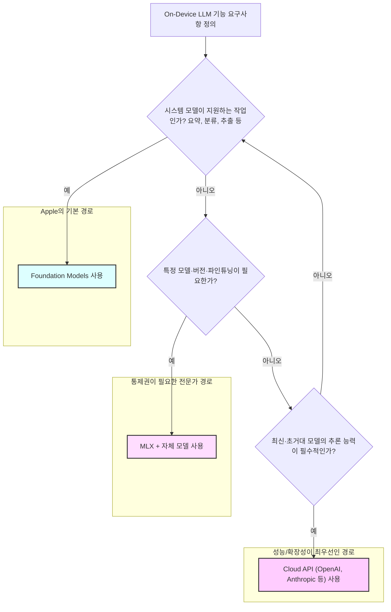

> 이 엔트리는 Blake Crosley의 [MLX on Apple Silicon: When You Need Your Own Model, Not Apple's Foundation Models](https://blakecrosley.com/blog/mlx-on-device-ml-apple-silicon)을 정독하고 핵심을 추출한 것이다.

이 엔트리는 Blake Crosley의 [MLX on Apple Silicon: When You Need Your Own Model, Not Apple's](https://blake.crosley.com/blog/mlx-apple-silicon-on-device-llm/)를 정독하고 핵심을 추출한 것이다. Crosley의 분석은 Apple의 공식 MLX 및 MLX Swift 문서와 Apple Silicon의 통합 메모리 아키텍처에 대한 기술적 이해에 깊이 기반한다.

### 왜 중요한가: On-Device LLM의 갈림길, 애플 생태계의 두 가지 선택지

Apple의 `Foundation Models` 프레임워크는 대부분의 온디바이스 AI 작업에 최적화된 '정답'이다. 시스템에 내장되어 무료로 제공되며, Apple이 직접 관리하므로 개발자는 모델 가중치, 메모리 관리, 업데이트에 대한 고민 없이 요약, 분류 등 핵심 기능에만 집중할 수 있다.

하지만 특정 오픈소스 LLM을 사용해야 하거나, 특정 버전의 모델을 고정해야 하거나, 자체 데이터로 파인튜닝한 모델이 필요할 때 `Foundation Models`는 한계에 부딪힌다. 이처럼 '시스템 모델'의 한계를 넘어 '나만의 모델'이 필요할 때 사용하는 것이 바로 **MLX**다.

MLX는 시스템 프레임워크가 아닌, 앱에 직접 포함해 배포하는 라이브러리다. 모델 가중치와 함께. 이 차이가 모든 것을 결정한다. MLX를 선택하는 것은 **통제권**을 얻는 대신 **앱 용량, 메모리 압박, 업데이트 책임**이라는 비용을 지불하는 명백한 트레이드오프다.

이 선택의 기술적 배경에는 Apple Silicon의 **통합 메모리(Unified Memory)**가 있다. CPU와 GPU가 메모리를 공유하기 때문에, 기존의 GPU처럼 데이터를 버스로 복사하는 비용(tax)이 없다. 수십억 파라미터 모델이 폰에서 동작할 수 있는 근본적인 이유이며, MLX는 이 아키텍처 위에서 설계되었다.

### 의사결정 워크플로우: Foundation vs. MLX vs. Cloud



### 핵심 패턴: MLX를 활용한 온디바이스 모델 구현

#### 1. Quantized 모델 로딩 및 추론

거대한 모델을 디바이스에 올리기 위한 핵심은 **양자화(Quantization)**다. 4-bit로 양자화된 모델을 사용해야 메모리에 상주시키고 실용적인 속도로 추론할 수 있다.

`LLMModelFactory`를 사용해 Hugging Face Hub에서 양자화된 모델을 로드하고, `ChatSession`으로 추론을 실행한다. 모델 가중치는 앱 번들에 포함하거나, 첫 실행 시 다운로드하는 방식 중 선택해야 한다.

```swift
import MLXLLM

// 1. Hugging Face Hub에서 4-bit 양자화 모델 로드
let container = try await LLMModelFactory.shared.loadContainer(
    from: HubClient.default,
    using: TokenizersLoader(),
    configuration: .init(id: "mlx-community/Llama-3.2-3B-Instruct-4bit")
)

// 2. ChatSession을 생성하여 추론 실행
let session = ChatSession(container)
let response = try await session.respond(to: "Summarize this in one line: \(text)")

// 3. (UI용) 토큰 스트리밍
let stream = try await container.generate(input: input, parameters: GenerateParameters())
for await event in stream {
    if case let .chunk(text) = event {
        // UI에 텍스트를 점진적으로 추가
    }
}
```

#### 2. LoRA를 이용한 경량 파인튜닝

수십억 파라미터 모델 전체를 파인튜닝하는 것은 비현실적이다. 대신, 원본 모델은 그대로 두고 변화분(delta)만 담은 작은 **LoRA(Low-Rank Adaptation) 어댑터**를 학습시킨다. 어댑터는 수 MB에 불과해 앱에 포함하기 부담이 적다.

학습된 `adapters.safetensors` 파일을 `LoRAContainer`로 로드한 뒤, 기존 모델 컨테이너에 적용한다. 이 과정에서 모델의 `Linear` 레이어가 어댑터의 가중치를 반영하는 `LoRALinear` 레이어로 동적으로 교체된다.

```swift
import MLXLLM

// 1. 학습된 LoRA 어댑터 파일 로드
// (디렉토리 내에 adapter_config.json, adapters.safetensors 포함)
let adapter = try LoRAContainer.from(directory: adapterURL)

// 2. 기존에 로드된 모델 컨테이너에 어댑터 적용
await container.update { context in
    // 모델의 Linear 레이어를 LoRALinear로 교체
    try? adapter.load(into: context.model)
}

// 이제부터 container를 통한 추론은 파인튜닝된 동작을 반영
```
하나의 기본 모델에 여러 LoRA 어댑터를 준비해두고, 필요에 따라 동적으로 교체(`unload` -> `load`)하는 것도 가능하다.

### 실전 적용: `tarosaju` 앱의 개인화된 타로 해석기

**시나리오**: 타로카드 앱 `tarosaju`에서 사용자의 과거 질문 이력과 현재 뽑은 카드를 바탕으로 개인화된 해석을 제공하고자 한다.

1.  **문제 정의**: Apple의 `Foundation Models`는 타로카드의 상징체계나 사용자의 개인적인 맥락을 이해하지 못한다. 일반적인 요약 이상의 깊이 있는 해석을 제공할 수 없다.
2.  **MLX 솔루션**:
    *   **기본 모델**: `mlx-community/Llama-3.2-3B-Instruct-4bit`처럼 작고 효율적인 모델을 기본으로 선택한다.
    *   **데이터셋 구축**: `(카드 조합 + 사용자 질문) -> (전문가 해석)` 형태의 데이터셋을 수백 건 구축한다.
    *   **LoRA 어댑터 학습**: 이 데이터셋으로 LoRA 어댑터를 학습시킨다. 결과물인 `adapters.safetensors` 파일은 수 MB 크기다.
    *   **앱 구현**:
        *   `tarosaju` 앱은 기본 모델 가중치(수 GB)를 첫 실행 시 다운로드하도록 안내한다.
        *   타로 해석 전용 LoRA 어댑터(수 MB)는 앱 번들에 포함시킨다.
        *   사용자가 해석을 요청하면, `container.update`를 통해 로드된 기본 모델에 LoRA 어댑터를 적용한다.
3.  **기대 효과**: `tarosaju`는 서버 통신 없이, 사용자의 디바이스 안에서 개인의 맥락을 이해하는 깊이 있는 타로 해석을 생성할 수 있다. 이는 프라이버시를 보장하며 오프라인에서도 동작하는 강력한 차별점이 된다.

### 결론: 언제 MLX를 선택해야 하는가?

MLX는 `Foundation Models`의 대체재가 아니라, 명확한 목적을 가지고 한 단계 아래로 내려가는 **의도적인 선택**이다. 아래 질문에 '예'라고 답할 수 있을 때만 MLX를 고려해야 한다.

1.  **시스템 모델이 제공하지 않는 특정 모델이 반드시 필요한가?** (예: 특정 오픈소스 LLM, 특정 버전)
2.  **우리만의 데이터로 파인튜닝된 도메인 특화 모델이 필요한가?** (예: `tarosaju`의 타로 해석)
3.  **모델 가중치로 인한 앱 용량 증가(수 GB)와 메모리 사용량 증가를 감당할 수 있는가?**

이 질문에 대한 명확한 답이 없다면, `Foundation Models`에 머무르는 것이 현명하다. 불필요한 복잡성과 비용을 떠안을 필요는 없다.